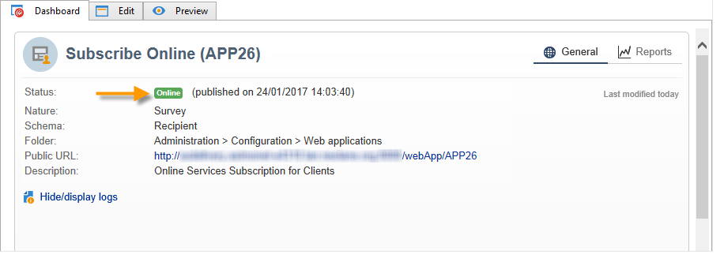

# Passaggi chiave per creare un sondaggio{#getting-started-with-surveys}

Ecco una breve panoramica dei passaggi principali per creare un semplice sondaggio utilizzando il seguente modello integrato:

I passaggi seguenti sono:

1. [Passaggio 1: creare un sondaggio](#step-1---creating-a-survey),
1. [Passaggio 2: selezionare il modello](#step-2---selecting-the-template),
1. [Passaggio 3: creare il sondaggio](#step-3---building-the-survey),
1. [Passaggio 4: creare il contenuto della pagina](#step-4---creating-the-page-content),
1. [Passaggio 5: memorizzare i dati del sondaggio](#step-5---storing-the-survey-data-),
1. [Passaggio 6: pubblicare le pagine](#step-6---publishing-the-pages),
1. [Passaggio 7: condividere un sondaggio online](#step-7---sharing-your-online-survey).

## Passaggio 1: creare un sondaggio {#step-1---creating-a-survey}

Per creare un nuovo sondaggio, vai al **[!UICONTROL Campaigns]** o **[!UICONTROL Profiles and targets]** e fai clic sul pulsante **[!UICONTROL Web Applications]** menu. Fai clic su **[!UICONTROL Create]** sopra l’elenco dei moduli.

## Passaggio 2: selezionare il modello {#step-2---selecting-the-template}

Seleziona un modello di sondaggio, quindi assegna un nome al sondaggio. Questo nome non verrà visualizzato dagli utenti finali, ma consente di identificare il sondaggio in Adobe Campaign. Clic **[!UICONTROL Save]** per aggiungere il sondaggio all&#39;elenco delle applicazioni Web.

## Passaggio 3: creare il sondaggio {#step-3---building-the-survey}

I sondaggi sono incorporati in un diagramma in cui sono posizionati i seguenti elementi: le pagine in cui verrà creato il contenuto, i passaggi di precaricamento e salvataggio dei dati e le fasi di test. È inoltre possibile inserire script e query.

Per creare il grafico, fai clic su **[!UICONTROL Edit]** forma del sondaggio.

Un sondaggio deve contenere **almeno** i tre componenti seguenti: una pagina, una casella di memorizzazione e una pagina finale.

* Per creare una pagina, seleziona la **[!UICONTROL Page]** nella sezione sinistra dell&#39;editor e depositarlo nella sezione centrale, come illustrato di seguito:

  

* Quindi, seleziona la **[!UICONTROL Storage]** e posizionarlo nella transizione di output della pagina.
* Infine, seleziona la **[!UICONTROL End]** e posizionarlo alla fine della transizione di output della casella di memorizzazione per ottenere il diagramma seguente:

  

## Passaggio 4: creare il contenuto della pagina {#step-4---creating-the-page-content}

Nell’esempio seguente viene utilizzato un **[!UICONTROL Page (v5 compatibility)]** digita pagina. Questo tipo di pagina è accessibile tramite il menu avanzato della **[!UICONTROL Edit]** scheda.

* **Aggiungi campi di input**

  Per creare il contenuto della pagina, devi modificarlo: a questo scopo, fai doppio clic sul pulsante **[!UICONTROL Page]** oggetto. Fai clic sulla prima icona nella barra degli strumenti per aprire la procedura guidata di creazione dei campi. Per creare un campo di immissione per il nome utente da memorizzare nel campo corrispondente del profilo del destinatario, seleziona **[!UICONTROL Edit a recipient]**.

  

  Fai clic su **[!UICONTROL Next]** per selezionare il campo per l&#39;archiviazione dei dati nel database. In questo caso, il campo &quot;Cognome&quot;.

  

  Clic **[!UICONTROL Finish]** per confermare la creazione del campo.

  Per impostazione predefinita, quando le informazioni vengono memorizzate in un campo già esistente nel database, il campo assume il nome del campo selezionato, ovvero &#39;Cognome&#39; in questo esempio. Puoi modificare questa etichetta come mostrato di seguito:

  

  Ora crea un campo di immissione per il numero di account utente. Ripetere l&#39;operazione e selezionare &#39;nr. account&#39;. campo.

  Applica la stessa procedura per aggiungere un campo in modo che l’utente inserisca un indirizzo e-mail.

* **Crea una domanda**

  Per creare una domanda, fare clic con il pulsante destro del mouse sull&#39;ultimo elemento della struttura e selezionare **[!UICONTROL Containers > Question]** , oppure fai clic su **[!UICONTROL Containers]** e seleziona **[!UICONTROL Question]**.

  

  Immettere l&#39;etichetta della domanda e inserire il campo o i campi di risposta come sottosezione della domanda. A questo scopo, quando crei il campo di risposta devi selezionare il nodo collegato alla domanda. Aggiungi un **[!UICONTROL drop-down listx]** utilizzando **[!UICONTROL Selection controls]** o facendo clic con il pulsante destro del mouse, come illustrato di seguito:

  

  Seleziona uno spazio di archiviazione: seleziona un campo di enumerazione per recuperare automaticamente i valori (in questo caso, il formato e-mail).

  

  In **[!UICONTROL General]** , fare clic sulla scheda **[!UICONTROL Initialize the list of values from the database]** link (collegamento): l’indice dei valori viene immesso automaticamente.

  

  Clic **[!UICONTROL OK]** per chiudere l’editor e **[!UICONTROL Save]** per salvare le modifiche.

  >[!NOTE]
  >
  >Per ogni campo o domanda, è possibile adattare il layout di pagina in base alle proprie esigenze, grazie alle opzioni disponibili nel **[!UICONTROL Advanced]** scheda. Il layout delle schermate del sondaggio è descritto nel [questa sezione](../../web/using/about-web-forms.md).

  Nella schermata di dettaglio, fai clic su **[!UICONTROL Preview]** per visualizzare il rendering del sondaggio appena creato.

  

## Passaggio 5: memorizzare i dati del sondaggio {#step-5---storing-the-survey-data-}

La casella di memorizzazione consente di salvare le risposte dell&#39;utente nel database. Devi selezionare una chiave di riconciliazione per identificare i profili già presenti nel database.

A questo scopo, modifica la casella e seleziona il campo che verrà utilizzato come chiave di riconciliazione quando i dati vengono memorizzati.

Nell’esempio seguente, quando si esegue il salvataggio (conferma), se un profilo viene salvato nel database con lo stesso numero di conto di quello immesso nel modulo, il profilo viene aggiornato. Se il profilo non esiste, verrà creato.

Clic **[!UICONTROL OK]** per confermare, quindi fai clic su **[!UICONTROL Save]** per salvare il sondaggio

## Passaggio 6: pubblicare le pagine {#step-6---publishing-the-pages}

Affinché gli utenti possano accedere alle pagine HTML, l’applicazione deve essere resa disponibile. Non deve essere più in fase di editing, ma in produzione. Per avviare la produzione di un sondaggio, è necessario pubblicarlo. Per eseguire questa operazione:

* Fai clic su **[!UICONTROL Publish]** si trova sopra il dashboard del sondaggio.
* Clic **[!UICONTROL Start]** per avviare la pubblicazione e chiudere la procedura guidata.

  

  Lo stato del sondaggio cambia in: **Online**.

  

## Passaggio 7: condividere un sondaggio online {#step-7---sharing-your-online-survey}

Una volta che è in produzione, il sondaggio è accessibile sul server e puoi distribuirlo. L’URL per accedere al sondaggio viene visualizzato nel dashboard.

Per inviare il sondaggio, puoi inviare un messaggio contenente un collegamento di accesso alla popolazione target oppure, ad esempio, inserire l’URL di accesso al sondaggio in una pagina web.

Puoi quindi monitorare le risposte degli utenti tramite rapporti e registri. Consulta [Tracciamento delle risposte](../../surveys/using/publish-track-and-use-collected-data.md#response-tracking).

>[!CAUTION]
>
>L’URL pubblico include il nome interno del sondaggio. Quando il nome interno viene modificato, l’URL viene aggiornato automaticamente: devono essere aggiornati anche tutti i collegamenti al sondaggio.
>
>Se le consegne contenenti il collegamento al modulo sono già state inviate, questo collegamento non funzionerà più.
