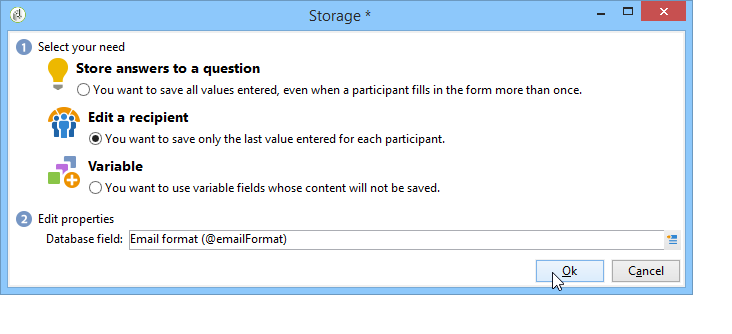
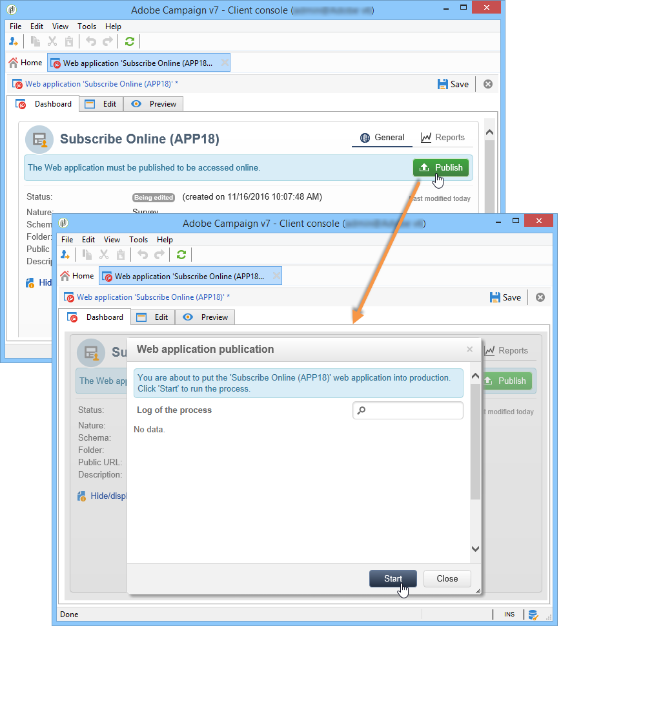

# Passaggi chiave per creare un sondaggio{#getting-started-with-surveys}

Ecco una rapida panoramica dei passaggi principali per creare un sondaggio semplice, utilizzando il seguente modello incorporato:

Questi passaggi sono i seguenti:

1. [Passaggio 1: creare un sondaggio](#step-1---creating-a-survey),
1. [Passaggio 2: selezionare il modello](#step-2---selecting-the-template),
1. [Passaggio 3: creare il sondaggio](#step-3---building-the-survey),
1. [Passaggio 4: creare il contenuto della pagina](#step-4---creating-the-page-content),
1. [Passaggio 5: archiviare i dati del sondaggio](#step-5---storing-the-survey-data-),
1. [Passaggio 6: pubblicare le pagine](#step-6---publishing-the-pages),
1. [Passaggio 7: condividere il sondaggio online](#step-7---sharing-your-online-survey).

## Passaggio 1: creare un sondaggio {#step-1---creating-a-survey}

Per creare un nuovo sondaggio, vai alla pagina **[!UICONTROL Campaigns]** o **[!UICONTROL Profiles and targets]** e fai clic su **[!UICONTROL Web Applications]** menu. Fai clic sul pulsante **[!UICONTROL Create]** sopra l’elenco dei moduli.

## Passaggio 2: selezionare il modello {#step-2---selecting-the-template}

Seleziona un modello di sondaggio, quindi assegna un nome al sondaggio. Questo nome non verrà visualizzato dagli utenti finali, ma consente di identificare il sondaggio in Adobe Campaign. Fai clic su **[!UICONTROL Save]** per aggiungere il sondaggio all&#39;elenco delle applicazioni Web.

## Passaggio 3: creare il sondaggio {#step-3---building-the-survey}

I sondaggi sono integrati in un diagramma in cui sono posizionati i seguenti elementi: le pagine in cui verrà creato il contenuto, i passaggi di precaricamento e salvataggio dei dati e le fasi di test. È inoltre possibile inserire script e query.

Per creare il grafico, fai clic sul pulsante **[!UICONTROL Edit]** forma del sondaggio.

Un sondaggio deve contenere **almeno** i tre componenti seguenti: una pagina, una casella di archiviazione e una pagina finale.

* Per creare una pagina, seleziona la **[!UICONTROL Page]** nella sezione sinistra dell&#39;editor e depositalo nella sezione centrale, come illustrato di seguito:

   

* Quindi, seleziona la **[!UICONTROL Storage]** e posizionarlo nella transizione di output della pagina.
* Infine, seleziona la **[!UICONTROL End]** e posizionarlo alla fine della transizione di output della casella di archiviazione per ottenere il diagramma seguente:

   

## Passaggio 4: creare il contenuto della pagina {#step-4---creating-the-page-content}

Nell’esempio seguente, stiamo utilizzando un **[!UICONTROL Page (v5 compatibility)]** digita la pagina. Questo tipo di pagina è accessibile tramite il menu avanzato della **[!UICONTROL Edit]** scheda .

* **Aggiungi campi di input**

   Per creare il contenuto della pagina, è necessario modificarlo: a questo scopo, fai doppio clic sul pulsante **[!UICONTROL Page]** oggetto. Fai clic sulla prima icona nella barra degli strumenti per aprire la procedura guidata di creazione del campo. Per creare un campo di immissione per il nome utente da memorizzare nel campo corrispondente del profilo del destinatario, seleziona **[!UICONTROL Edit a recipient]**.

   

   Fai clic sul pulsante **[!UICONTROL Next]** per selezionare il campo per l&#39;archiviazione dei dati nel database. In questo caso, il campo &quot;Cognome&quot;.

   

   Fai clic su **[!UICONTROL Finish]** per confermare la creazione del campo.

   Per impostazione predefinita, quando le informazioni sono memorizzate in un campo già esistente nel database, il campo assume il nome del campo selezionato, ovvero &quot;Cognome&quot; in questo esempio. Puoi modificare questa etichetta come mostrato di seguito:

   

   Ora crea un campo di immissione per il numero di account utente. Ripeti l’operazione e seleziona il &quot;numero account&quot;. campo .

   Applica la stessa procedura per aggiungere un campo in cui l’utente può immettere un indirizzo e-mail.

* **Creare una domanda**

   Per creare una domanda, fai clic con il pulsante destro del mouse sull’ultimo elemento della struttura e seleziona **[!UICONTROL Containers > Question]** oppure fai clic su **[!UICONTROL Containers]** e seleziona **[!UICONTROL Question]**.

   

   Inserisci l’etichetta della domanda e inserisci il campo o i campi di risposta come ramo secondario della domanda. A questo scopo, il nodo collegato alla domanda deve essere selezionato quando si crea il campo di risposta. Aggiungi un **[!UICONTROL drop-down listx]** utilizzando **[!UICONTROL Selection controls]** icona o facendo clic con il pulsante destro del mouse, come illustrato di seguito:

   

   Selezionare uno spazio di archiviazione: seleziona un campo di enumerazione per recuperare automaticamente i valori (in questo caso il formato e-mail).

   

   In **[!UICONTROL General]** fai clic sulla scheda **[!UICONTROL Initialize the list of values from the database]** link: la tabella dei valori viene inserita automaticamente.

   

   Fai clic su **[!UICONTROL OK]** per chiudere l’editor e **[!UICONTROL Save]** per salvare le modifiche.

   >[!NOTE]
   >
   >Per ogni campo o domanda, è possibile adattare il layout di pagina in base alle proprie esigenze, grazie alle opzioni nel **[!UICONTROL Advanced]** scheda . Il layout delle schermate del sondaggio è descritto in [questa sezione](../../web/using/about-web-forms.md).

   Nella schermata di dettaglio, fai clic sul pulsante **[!UICONTROL Preview]** per visualizzare il rendering del sondaggio appena creato.

   

## Passaggio 5: archiviare i dati del sondaggio {#step-5---storing-the-survey-data-}

La casella di archiviazione consente di salvare le risposte utente nel database. Devi selezionare una chiave di riconciliazione per identificare i profili già presenti nel database.

A questo scopo, modifica la casella e seleziona il campo che verrà utilizzato come chiave di riconciliazione al momento della memorizzazione dei dati.

Nell’esempio seguente, quando si salva (conferma), se un profilo viene salvato nel database con lo stesso numero di account di quello immesso nel modulo, il profilo viene aggiornato. Se il profilo non esiste, verrà creato.

Fai clic su **[!UICONTROL OK]** per confermare, fai clic su **[!UICONTROL Save]** per salvare il sondaggio

## Passaggio 6: pubblicare le pagine {#step-6---publishing-the-pages}

Affinché gli utenti possano accedere alle pagine di HTML, l’applicazione deve essere resa disponibile. Non deve più essere in fase di editing, ma di produzione. Per inserire un sondaggio in produzione, devi pubblicarlo. Per eseguire questa operazione:

* Fai clic sul pulsante **[!UICONTROL Publish]** pulsante situato sopra il dashboard del sondaggio.
* Fai clic su **[!UICONTROL Start]** per avviare la pubblicazione e chiudere la procedura guidata.

   

   Lo stato del sondaggio cambia in: **Online**.

   

## Passaggio 7: condividere il sondaggio online {#step-7---sharing-your-online-survey}

Una volta in produzione, il sondaggio è accessibile sul server e puoi distribuirlo. L’URL per accedere al sondaggio viene visualizzato sul dashboard.

Per inviare il sondaggio, puoi inviare un messaggio contenente un collegamento di accesso alla popolazione target, oppure inserire l’URL di accesso al sondaggio in una pagina web, ad esempio.

Puoi quindi monitorare le risposte degli utenti tramite report e registri. Vedi [Tracciamento della risposta](../../surveys/using/publish--track-and-use-collected-data.md#response-tracking).

>[!CAUTION]
>
>L’URL pubblico include il nome interno del sondaggio. Quando il nome interno viene modificato, l’URL viene aggiornato automaticamente: devono essere aggiornati anche tutti i collegamenti al sondaggio.
>
>Se le consegne contenenti il collegamento al modulo sono già state inviate, il collegamento non funzionerà più.
