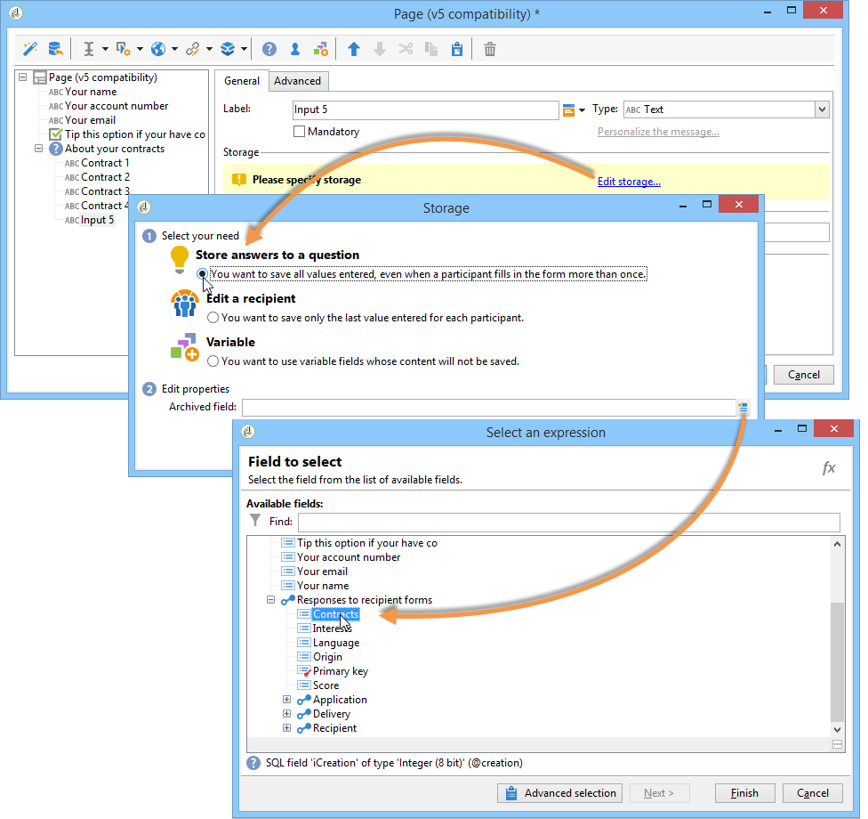
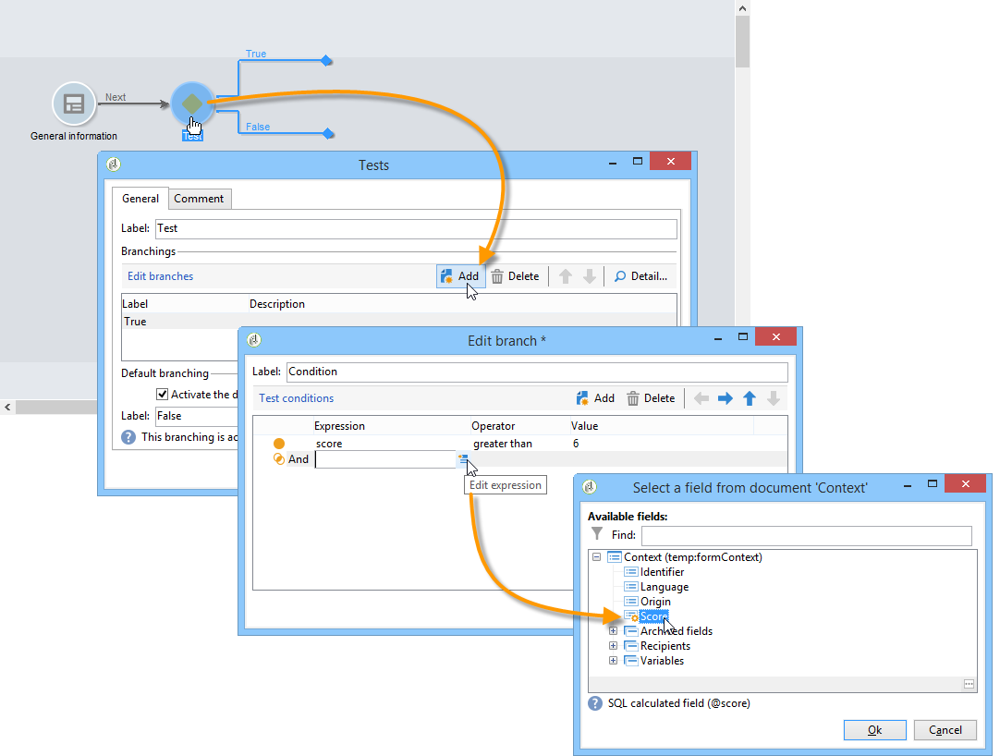
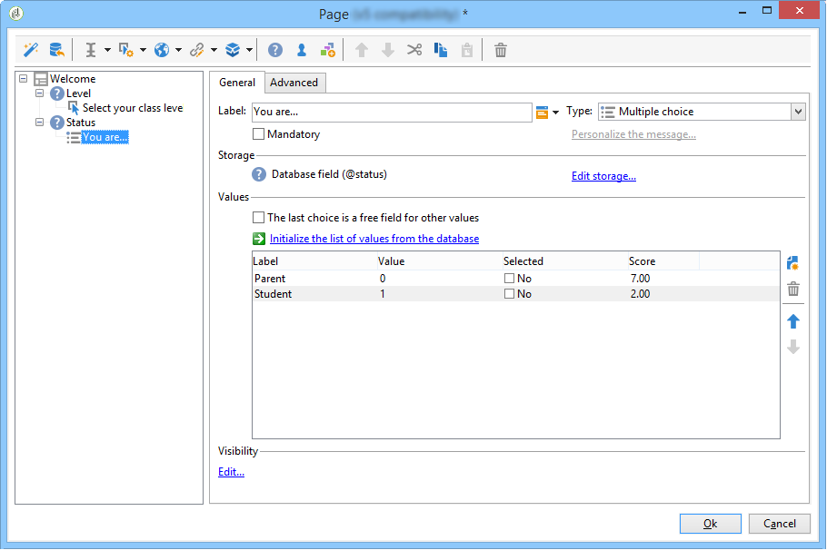

# Gestire le risposte{#managing-answers}


## Archiviazione delle risposte raccolte {#storing-collected-answers}

Oltre alle modalità di archiviazione standard comuni a tutti i moduli Web in Adobe Campaign (campo database e variabile locale), i sondaggi consentono l’estensione dinamica del modello dati utilizzando campi archiviati.

>[!CAUTION]
>
>Questa opzione è disponibile solo per le applicazioni Web di tipo **Survey**. Non è disponibile per altri tipi di moduli web.

### Archiviazione in un campo archiviato {#storing-in-an-archived-field}

È facile estendere il modello dati aggiungendo nuovi spazi di archiviazione per salvare le risposte fornite nei sondaggi. A questo scopo, seleziona l’opzione **[!UICONTROL Store answers to a question]** durante la creazione del campo di input. Fai clic sul collegamento **[!UICONTROL New field...]** e assegna le relative proprietà:


Immetti l’etichetta e il nome del campo e seleziona il tipo di campo: Testo, booleano, numero intero o decimale, data, ecc.

Il tipo di campo selezionato comporta un controllo dei dati quando le risposte vengono inserite dagli utenti. Per i campi **text**, puoi aggiungere un vincolo (case, format) o un collegamento a un&#39;enumerazione esistente per forzare la selezione.

Per aggiungere un vincolo, selezionalo dall’elenco a discesa. Esistono due tipi di vincoli:

1. Case carattere

   Le informazioni immesse possono essere memorizzate nel campo nei seguenti formati: tutte le lettere maiuscole, tutte minuscole o con maiuscolo iniziale. Questo vincolo non richiede all’utente di immettere i dati nel formato selezionato, ma il contenuto immesso nel campo verrà convertito al momento del salvataggio.

1. Formato dati

Se questo campo viene utilizzato in un elenco, i valori dell’enumerazione possono essere recuperati automaticamente nella tabella dei valori utilizzando il collegamento **[!UICONTROL Initialize the list of values from the database]** sopra l’elenco dei valori.

Ad esempio, puoi creare un elenco a discesa per consentire all’utente di selezionare la propria lingua nativa. Il campo archiviato corrispondente può essere associato all&#39;enumerazione **language** che contiene un elenco di lingue:


L’icona **[!UICONTROL Edit link]** situata a destra del campo consente di modificare il contenuto di questa enumerazione:


Nella scheda **[!UICONTROL General]** del campo , il collegamento **[!UICONTROL Initialize the list of values from the database]** ti consente di inserire automaticamente l’elenco delle etichette offerte.


**Esempio**: immagazzinare i contratti di un destinatario in un campo

Per memorizzare diversi tipi di contratti in un campo, crea un campo di input **[!UICONTROL Text]** e seleziona l’opzione **[!UICONTROL Store answers to a question]**.

Fai clic sul collegamento **[!UICONTROL New field...]** e immetti le proprietà del campo . Selezionare l&#39;opzione **[!UICONTROL Multiple values]** per abilitare la memorizzazione di più valori.


Creare campi di ingresso per gli altri contratti e archiviare i dati nello stesso campo archiviato.



Quando gli utenti approvano il sondaggio, le loro risposte saranno memorizzate nel campo **[!UICONTROL Contracts]** .

Nel nostro esempio, per le seguenti risposte:


Il profilo del convenuto conterrà i quattro contratti stipulati.

È possibile visualizzarli nella scheda **[!UICONTROL Answers]** del sondaggio visualizzando le colonne pertinenti.


Puoi anche filtrare i destinatari in base alle risposte per visualizzare solo gli utenti che ti interessano. A questo scopo, crea un flusso di lavoro di targeting e utilizza la casella **[!UICONTROL Survey responses]** .


Crea la query in base ai profili che desideri recuperare. Nell’esempio seguente, la query ti consente di selezionare profili con almeno due contratti, incluso un contratto di tipo A.


Per ciascun modulo, le risposte fornite possono essere utilizzate in campi o etichette. Utilizza la sintassi seguente per il contenuto memorizzato in un campo archiviato:

```
<%= ctx.webAppLogRcpData.name of the archived field %
```

>[!NOTE]
>
>Per altri tipi di campi, la sintassi è dettagliata in [questa sezione](../../platform/using/about-queries-in-campaign.md).

### Impostazioni di archiviazione {#storage-settings}

È possibile archiviare le risposte ai sondaggi in formato XML. Ciò ti consente di salvare una copia non elaborata delle risposte raccolte, che può essere utile in caso di eccessiva standardizzazione dei dati in un elenco dettagliato. [Ulteriori informazioni](../../surveys/using/publish--track-and-use-collected-data.md#standardizing-data)

>[!CAUTION]
>
>L&#39;archiviazione delle risposte non elaborate influisce sullo spazio di archiviazione richiesto. Utilizza questa opzione con cautela.

Per eseguire questa operazione:

* Modifica le proprietà del sondaggio tramite il pulsante **[!UICONTROL Properties]** della scheda **[!UICONTROL Edit]** .
* Fai clic sul collegamento **[!UICONTROL Advanced parameters]** e seleziona l’opzione **[!UICONTROL Save a copy of raw answers]** .


Per impostazione predefinita, è possibile abilitarla per tutti i sondaggi (questa opzione viene applicata quando il sondaggio viene pubblicato). A questo scopo, crea l’opzione **[!UICONTROL NmsWebApp_XmlBackup]** e assegnagli il valore **[!UICONTROL 1]** , come illustrato di seguito:


## Gestione dei punteggi {#score-management}

È possibile assegnare un punteggio alle opzioni offerte nelle pagine del modulo. I punteggi possono essere collegati solo a domande chiuse: casella di controllo, valore da un elenco a discesa, abbonamento, ecc.


I punteggi vengono accumulati e salvati sul lato server quando la pagina viene confermata, ad esempio quando l’utente fa clic sul pulsante **[!UICONTROL Next]** o **[!UICONTROL Finish]** .

>[!NOTE]
>
>È possibile utilizzare valori positivi o negativi, interi o non interi.

I punteggi possono essere utilizzati in test o script.

>[!CAUTION]
>
>I punteggi non possono essere utilizzati nelle condizioni di visibilità per i campi che si trovano sulla stessa pagina. Tuttavia, possono essere utilizzati nelle pagine successive.

* Per utilizzare i punteggi nei test, utilizza il campo **[!UICONTROL Score]** nella formula di calcolo del test, come illustrato di seguito:

   

* È possibile utilizzare il punteggio in uno script.

**Esempio**: calcola un punteggio e lo utilizza come condizione per la visualizzazione della pagina successiva:

* In un sondaggio, la pagina successiva ti consente di assegnare punteggi diversi agli utenti in base al valore selezionato nell’elenco a discesa:

   

* Puoi combinare questo punteggio con un secondo valore, a seconda dell’opzione selezionata:

   

* Quando l&#39;utente fa clic sul pulsante **[!UICONTROL Next]**, i due valori vengono sommati.

   

* Le condizioni possono essere applicate alla pagina da visualizzare in base al punteggio. Questa configurazione è la seguente:

   

   
