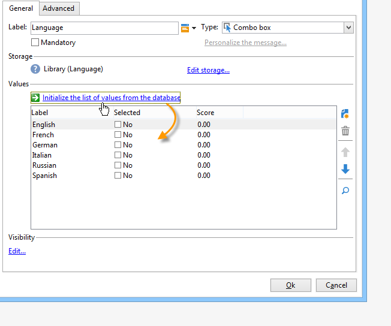
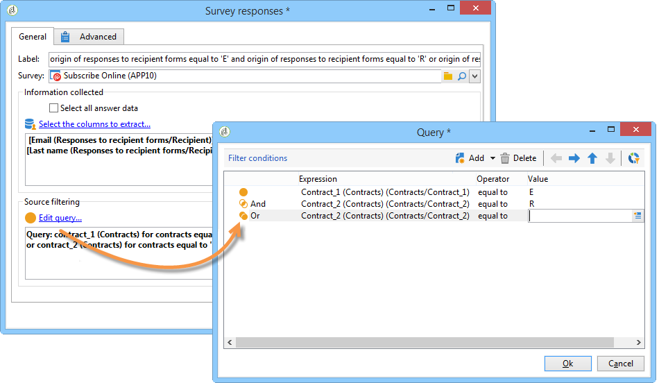

# Gestire le risposte{#managing-answers}


## Memorizza le risposte raccolte {#storing-collected-answers}

Oltre alle modalità di archiviazione standard comuni a tutti i moduli web in Adobe Campaign (campo del database e variabile locale), i sondaggi consentono l’estensione dinamica del modello dati utilizzando i campi archiviati.

>[!CAUTION]
>
>Questa opzione è disponibile solo per le applicazioni Web di tipo **Sondaggio**. Non è disponibile per altri tipi di moduli Web.

### Memorizza in un campo archiviato {#storing-in-an-archived-field}

È facile estendere il modello dati aggiungendo nuovi spazi di archiviazione per salvare le risposte fornite nei sondaggi. A tale scopo, selezionare l&#39;opzione **[!UICONTROL Store answers to a question]** durante la creazione del campo di input. Fai clic sul collegamento **[!UICONTROL New field...]** e assegna le relative proprietà:


Immettere l&#39;etichetta e il nome del campo e selezionare il tipo di campo: Testo, Booleano, Numero intero o decimale, Data e così via.

Il tipo di campo selezionato include un controllo dei dati quando le risposte vengono immesse dagli utenti. Per i campi **testo**, puoi aggiungere un vincolo (maiuscole/minuscole, formato) o un collegamento a un&#39;enumerazione esistente per forzare la selezione.

Per aggiungere un vincolo, selezionatelo dall&#39;elenco a discesa. Esistono due tipi di vincoli:

1. Maiuscole/minuscole caratteri

   Le informazioni immesse possono essere memorizzate nel campo nei seguenti formati: tutto maiuscolo, tutto minuscolo o iniziale maiuscolo. Questo vincolo non richiede all’utente di immettere i dati nel formato selezionato, ma il contenuto immesso nel campo verrà convertito al momento del salvataggio.

1. Formato dei dati

Se questo campo viene utilizzato in un elenco, i valori dell&#39;enumerazione possono essere recuperati automaticamente nella tabella dei valori utilizzando il collegamento **[!UICONTROL Initialize the list of values from the database]** sopra l&#39;elenco dei valori.

Ad esempio, puoi creare un elenco a discesa per consentire all’utente di selezionare la propria lingua nativa. Il campo archiviato corrispondente può essere associato all&#39;enumerazione **lingua** che contiene un elenco di lingue:


L&#39;icona **[!UICONTROL Edit link]** situata a destra del campo consente di modificare il contenuto di questa enumerazione:


Nella scheda **[!UICONTROL General]** del campo, il collegamento **[!UICONTROL Initialize the list of values from the database]** consente di immettere automaticamente l&#39;elenco di etichette offerte.



**Esempio**: memorizzazione dei contratti di un destinatario in un campo

Per memorizzare diversi tipi di contratti in un campo, creare un campo di input **[!UICONTROL Text]** e selezionare l&#39;opzione **[!UICONTROL Store answers to a question]**.

Fai clic sul collegamento **[!UICONTROL New field...]** e immetti le proprietà del campo. Selezionare l&#39;opzione **[!UICONTROL Multiple values]** per consentire la memorizzazione di più valori.


Creare campi di immissione per gli altri contratti e archiviare i dati nello stesso campo archiviato.


Quando gli utenti approvano il sondaggio, le loro risposte verranno memorizzate nel campo **[!UICONTROL Contracts]**.

Nel nostro esempio, per le seguenti risposte:


Il profilo del rispondente conterrà i quattro contratti sottoscritti.

È possibile visualizzarli nella scheda **[!UICONTROL Answers]** del sondaggio visualizzando le colonne pertinenti.


Puoi anche filtrare i destinatari in base alle risposte, per visualizzare solo gli utenti che ti interessano. A questo scopo, crea un flusso di lavoro di targeting e utilizza la casella **[!UICONTROL Survey responses]**.


Crea la query in base ai profili che desideri recuperare. Nell’esempio seguente, la query ti consente di selezionare profili con almeno due contratti, incluso un contratto di tipo A.



Per ogni modulo è possibile utilizzare le risposte fornite nei campi o nelle etichette. Utilizza la seguente sintassi per il contenuto archiviato in un campo archiviato:

```
<%= ctx.webAppLogRcpData.name of the archived field %
```

>[!NOTE]
>
>Per altri tipi di campi, la sintassi è descritta in [questa sezione](../../platform/using/adobe-campaign-workspace.md#about-queries-in-campaign).

### Impostazioni di archiviazione {#storage-settings}

È possibile archiviare le risposte ai sondaggi in formato XML. Questo consente di salvare una copia non elaborata delle risposte raccolte, che può essere utile in caso di standardizzazione eccessiva dei dati in un elenco dettagliato. [Ulteriori informazioni](../../surveys/using/publish-track-and-use-collected-data.md#standardizing-data)

>[!CAUTION]
>
>L&#39;archiviazione delle risposte non elaborate influisce sullo spazio di archiviazione richiesto. Utilizza questa opzione con cautela.

Per eseguire questa operazione:

* Modificare le proprietà del sondaggio tramite il pulsante **[!UICONTROL Properties]** della scheda **[!UICONTROL Edit]**.
* Fare clic sul collegamento **[!UICONTROL Advanced parameters]** e selezionare l&#39;opzione **[!UICONTROL Save a copy of raw answers]**.


Puoi abilitarla per impostazione predefinita per tutti i sondaggi (questa opzione viene applicata quando il sondaggio viene pubblicato). A tale scopo, creare l&#39;opzione **[!UICONTROL NmsWebApp_XmlBackup]** e assegnarvi il valore **[!UICONTROL 1]**, come illustrato di seguito:


## Gestione dei punteggi {#score-management}

Puoi assegnare un punteggio alle opzioni offerte nelle pagine del modulo. I punteggi possono essere collegati solo a domande chiuse: casella di controllo, valore da un elenco a discesa, abbonamento, ecc.


I punteggi vengono accumulati e salvati sul lato server quando la pagina viene confermata, ovvero quando l&#39;utente fa clic sul pulsante **[!UICONTROL Next]** o **[!UICONTROL Finish]**.

>[!NOTE]
>
>È possibile utilizzare valori positivi o negativi, interi o non interi.

I punteggi possono essere utilizzati nei test o negli script.

>[!CAUTION]
>
>I punteggi non possono essere utilizzati nelle condizioni di visibilità per i campi che si trovano sulla stessa pagina. Tuttavia, possono essere utilizzati nelle pagine successive.

* Per utilizzare i punteggi nei test, utilizzare il campo **[!UICONTROL Score]** nella formula di calcolo del test, come illustrato di seguito:

  

* Puoi utilizzare il punteggio in uno script.

**Esempio**: calcola un punteggio e utilizzalo come condizione per la visualizzazione della pagina successiva:

* In un sondaggio, la pagina successiva ti consente di assegnare punteggi diversi agli utenti a seconda del valore selezionato nell’elenco a discesa:

  

* Puoi combinare questo punteggio con un secondo valore, a seconda dell’opzione selezionata:

  

* Quando l&#39;utente fa clic sul pulsante **[!UICONTROL Next]**, i due valori vengono sommati.

  

* È possibile applicare le condizioni per la visualizzazione della pagina in base al punteggio. Questa configurazione è configurata come segue:

  

  
