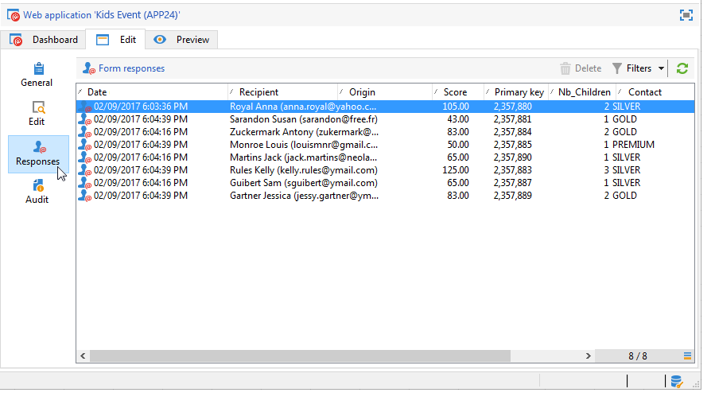
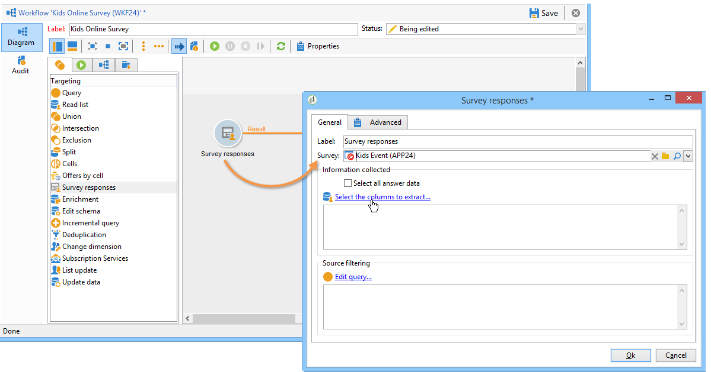
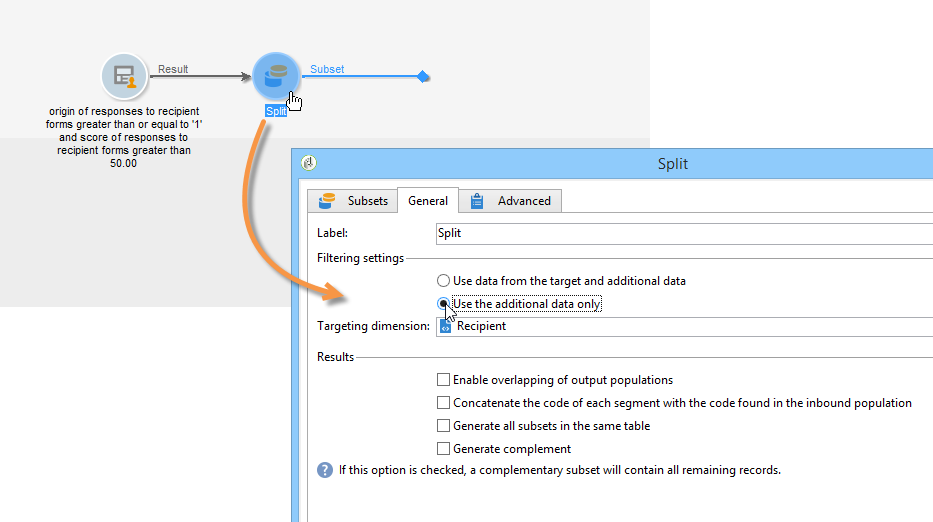

# Pubblicare, tracciare e utilizzare i dati raccolti{#publish-track-and-use-collected-data}


Una volta creato, configurato e pubblicato il modulo, è possibile condividere il collegamento con il pubblico e tenere traccia delle risposte.

>[!NOTE]
>
>Il ciclo di vita di un sondaggio in Adobe Campaign e le relative modalità di pubblicazione e consegna sono simili a quelli dei moduli web: sono descritti in dettaglio in [questa sezione](../../web/using/about-web-forms.md).

## Dashboard dei sondaggi {#survey-dashboard}

Ogni sondaggio dispone di un proprio dashboard che consente di visualizzarne lo stato, la descrizione, l’URL pubblico e la pianificazione della disponibilità. Permette inoltre di visualizzare i rapporti disponibili. [Ulteriori informazioni](#reports-on-surveys).

L’URL pubblico del sondaggio viene visualizzato nel dashboard:


## Tracciamento della risposta {#response-tracking}

Puoi tenere traccia delle risposte al sondaggio nei registri e nei rapporti.

### Registri di sondaggio {#survey-logs}

Per ogni sondaggio consegnato, puoi tenere traccia delle risposte nel **[!UICONTROL Logs]** scheda . In questa scheda viene visualizzato l’elenco degli utenti che hanno completato il sondaggio e la loro origine:


Fare doppio clic su una riga per visualizzare il modulo del sondaggio come compilato dal rispondente. Puoi consultare il sondaggio completamente e accedere alle risposte complete. Questi possono essere esportati in un file esterno. Per ulteriori informazioni, consulta [Esportazione delle risposte](#exporting-answers).

L’origine è indicata nell’URL del sondaggio aggiungendo i seguenti caratteri:

```
?origin=xxx
```

durante la modifica del sondaggio, il relativo URL contiene il parametro **[!UICONTROL __uuid]**, che indica che si trova in una fase di test e non è ancora online. Quando accedi al sondaggio tramite questo URL, i record creati non vengono presi in considerazione nel tracciamento (rapporti). L&#39;origine viene forzata al valore **[!UICONTROL Adobe Campaign]**.

Per ulteriori informazioni sui parametri URL, consulta [questa pagina](../../web/using/defining-web-forms-properties.md#form-url-parameters).

### Relazioni sulle indagini {#reports-on-surveys}

La scheda dashboard ti consente di accedere ai rapporti dei sondaggi. Fai clic sul nome di un report per visualizzarlo.


La struttura del sondaggio è visibile nella **[!UICONTROL Documentation]** rapporto.

Altri due rapporti sui sondaggi Web sono disponibili nella **[!UICONTROL Reports]** scheda dei sondaggi: **[!UICONTROL General]** e **[!UICONTROL Breakdown of responses]**.

* Generale

   Il rapporto contiene informazioni generali sul sondaggio: come cambia il numero di risposte nel tempo e la distribuzione per origine e lingua.

   Esempio di relazione generale:

   

* Scomposizione delle risposte

   Questo rapporto mostra la suddivisione delle risposte per ogni domanda. Questa suddivisione è disponibile solo per le risposte date ai campi memorizzati in **[!UICONTROL Question]** digitare contenitori. È valido solo per i controlli di selezione (ad esempio, nessun raggruppamento nei campi di testo).

   

## Esportazione delle risposte {#exporting-answers}

Le risposte a un sondaggio possono essere esportate in un file esterno da elaborare in un secondo momento. Ci sono due modi per farlo:

1. Esportazione dei dati dei rapporti

   Per esportare i dati del rapporto, fai clic sul pulsante **[!UICONTROL Export]** e scegliere il formato di esportazione.

   Per ulteriori informazioni sull’esportazione dei dati del rapporto, consulta [questa sezione](../../reporting/using/about-reports-creation-in-campaign.md).

1. Esportazione delle risposte

   Per esportare le risposte, fai clic sul pulsante **[!UICONTROL Responses]** scheda del sondaggio e fai clic con il pulsante destro del mouse. Seleziona **[!UICONTROL Export...]**.

   

   Quindi immettere le informazioni da esportare e il file di archiviazione.

   Puoi configurare il contenuto e il formato del file di output nella procedura guidata di esportazione.

   Ciò consente di:

   * aggiungere colonne al file di output e recuperare le informazioni sul destinatario (memorizzate nel database),
   * formattare i dati esportati,
   * selezionare il formato di codifica per le informazioni nel file.

   Se il sondaggio che desideri esportare contiene diversi **[!UICONTROL Multi-line text]** o **[!UICONTROL HTML text]** campi, deve essere esportato in **[!UICONTROL XML]** formato. A questo scopo, seleziona questo formato nell’elenco a discesa della **[!UICONTROL Output format]** , come illustrato di seguito:

   

   Fai clic su **[!UICONTROL Start]** per eseguire l&#39;esportazione.

   >[!NOTE]
   >
   >Le esportazioni di dati e le fasi della loro configurazione sono descritte in [questa sezione](../../platform/using/about-generic-imports-exports.md).

## Utilizzo dei dati raccolti {#using-the-collected-data}

Le informazioni raccolte tramite indagini online possono essere recuperate nel quadro di un flusso di lavoro di targeting. Per eseguire questa operazione, utilizza la variabile **[!UICONTROL Survey responses]** scatola.

Nell’esempio seguente, vogliamo fare un’offerta Web appositamente per i cinque destinatari con almeno due figli e con i punteggi più alti in un sondaggio online. Le risposte a questo sondaggio sono:



Nel flusso di lavoro di targeting, la **[!UICONTROL Survey responses]** saranno configurati come segue:



Inizia selezionando il sondaggio interessato, quindi i dati da estrarre nella sezione centrale della finestra. In questo caso dobbiamo estrarre almeno la colonna punteggio, poiché verrà utilizzata nella casella di divisione per recuperare i cinque punteggi più alti.

Indica le condizioni di filtro per le risposte facendo clic sul pulsante **[!UICONTROL Edit query...]** link.


Avvia il flusso di lavoro di targeting. La query recupera 8 destinatari.


Fai clic con il pulsante destro del mouse sulla transizione di output della casella di raccolta per visualizzarli.


Quindi inserisci una casella di divisione nel flusso di lavoro per recuperare i 5 destinatari con il punteggio più alto.

Modifica la casella di suddivisione per configurarla:

* Inizia selezionando lo schema appropriato nel **[!UICONTROL General]** , quindi configura il sottoinsieme:

   

* Vai a **[!UICONTROL Sub-sets]** e seleziona la **[!UICONTROL Limit the selected records]** , quindi fai clic su **[!UICONTROL Edit...]** link.

   

* Seleziona la **[!UICONTROL Keep only the first records after sorting]** e seleziona la colonna di ordinamento. Seleziona l’opzione **[!UICONTROL Descending sort]**.

   

* Fai clic sul pulsante **[!UICONTROL Next]** e limita il numero di record a 5.

   

* Fai clic su **[!UICONTROL Finish]** quindi riavvia il flusso di lavoro per approvare il targeting.

## Standardizzazione dei dati {#standardizing-data}

È possibile impostare processi di standardizzazione in Adobe Campaign per i dati raccolti utilizzando gli alias. Ciò consente di standardizzare i dati memorizzati nel database: a tal fine, definisci gli alias negli elenchi dettagliati che contengono le informazioni pertinenti. [Ulteriori informazioni](../../platform/using/managing-enumerations.md#about-enumerations)
