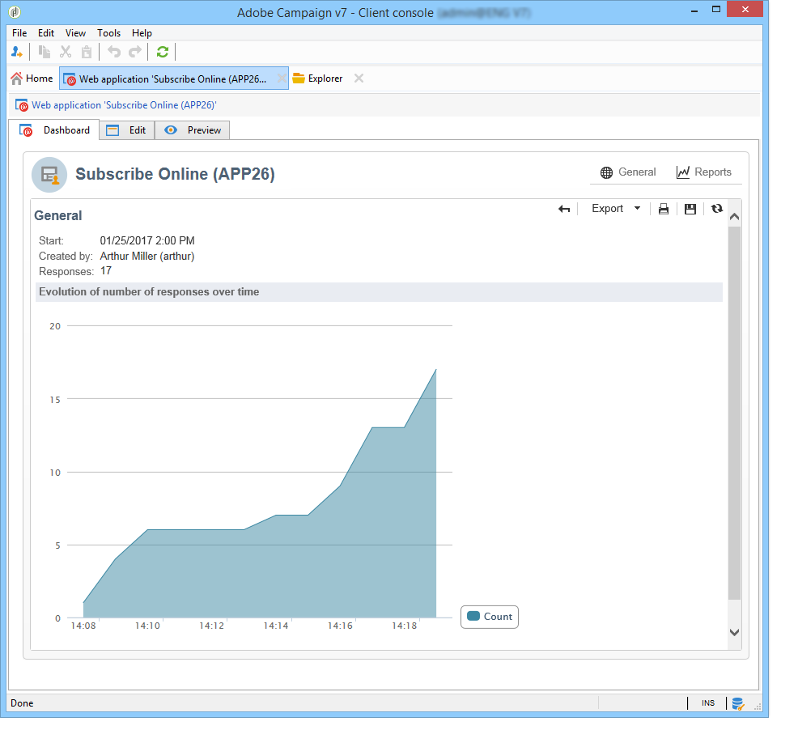
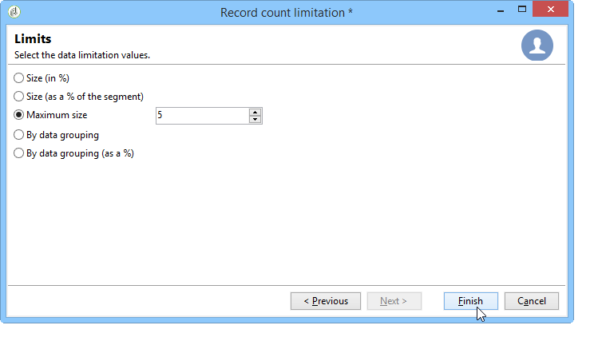

# Pubblicare, tracciare e utilizzare i dati raccolti{#publish-track-and-use-collected-data}


Una volta creato, configurato e pubblicato il modulo, puoi condividere il collegamento con il pubblico e tenere traccia delle risposte.

>[!NOTE]
>
>Il ciclo di vita e le modalità di pubblicazione e consegna di un sondaggio in Adobe Campaign sono simili a quelli dei moduli Web: sono descritti in [questa sezione](../../web/using/about-web-forms.md).

## Dashboard sondaggio {#survey-dashboard}

Ogni sondaggio ha una propria dashboard che consente di visualizzarne lo stato, la descrizione, l’URL pubblico e la pianificazione della disponibilità. Consente inoltre di visualizzare i rapporti disponibili. [Ulteriori informazioni](#reports-on-surveys).

L’URL pubblico del sondaggio viene visualizzato sulla dashboard:


## Tracciamento delle risposte {#response-tracking}

Puoi tenere traccia delle risposte al sondaggio nei registri e nei rapporti.

### Registri del sondaggio {#survey-logs}

Per ogni sondaggio consegnato, è possibile tenere traccia delle risposte nella scheda **[!UICONTROL Logs]**. In questa scheda viene visualizzato l’elenco degli utenti che hanno completato il sondaggio e la loro origine:


Fare doppio clic su una riga per visualizzare il modulo del sondaggio compilato dal partecipante. È possibile sfogliare l&#39;intero sondaggio e accedere alle risposte complete. Possono essere esportati in un file esterno. Per ulteriori informazioni, consulta [Esportazione delle risposte](#exporting-answers).

L’origine è indicata nell’URL del sondaggio aggiungendo i seguenti caratteri:

```
?origin=xxx
```

durante la modifica del sondaggio, l&#39;URL contiene il parametro **[!UICONTROL __uuid]**, che indica che si trova in una fase di test e non è ancora online. Quando accedi al sondaggio tramite questo URL, i record creati non vengono presi in considerazione nel tracciamento (rapporti). Origine forzata al valore **[!UICONTROL Adobe Campaign]**.

Per ulteriori informazioni sui parametri URL, consulta [questa pagina](../../web/using/defining-web-forms-properties.md#form-url-parameters).

### Relazioni sulle indagini {#reports-on-surveys}

La scheda della dashboard ti consente di accedere ai rapporti dei sondaggi. Fai clic sul nome di un rapporto per visualizzarlo.


La struttura del sondaggio è visibile nel report **[!UICONTROL Documentation]**.

Nella scheda **[!UICONTROL Reports]** dei sondaggi sono disponibili altri due rapporti sui sondaggi Web: **[!UICONTROL General]** e **[!UICONTROL Breakdown of responses]**.

* Generale

  Questo rapporto contiene informazioni generali sul sondaggio: come cambia il numero di risposte nel tempo e la distribuzione per origine e lingua.

  Esempio di rapporto generale:

  

* Raggruppamento delle risposte

  Questo rapporto mostra il raggruppamento delle risposte per ogni domanda. Questo raggruppamento è disponibile solo per le risposte date ai campi memorizzati nei contenitori di tipo **[!UICONTROL Question]**. È valida solo per i controlli di selezione (ad esempio, nessuna suddivisione nei campi di testo).

  

## Esportazione delle risposte {#exporting-answers}

Le risposte a un sondaggio possono essere esportate in un file esterno per essere elaborate in un secondo momento. Esistono due modi per farlo:

1. Esportazione dei dati del rapporto

   Per esportare i dati del report, fare clic sul pulsante **[!UICONTROL Export]** e scegliere il formato di esportazione.

   Per ulteriori informazioni sull&#39;esportazione dei dati del report, consultare [questa sezione](../../reporting/using/about-reports-creation-in-campaign.md).

1. Esportazione delle risposte

   Per esportare le risposte, fare clic sulla scheda **[!UICONTROL Responses]** del sondaggio e fare clic con il pulsante destro del mouse. Seleziona **[!UICONTROL Export...]**.

   

   Immettere quindi le informazioni che si desidera esportare e il file di archiviazione.

   È possibile configurare il contenuto e il formato del file di output nell&#39;Assistente all&#39;esportazione.

   Questo consente di:

   * aggiungere colonne al file di output e recuperare le informazioni sul destinatario (memorizzate nel database),
   * formattare i dati esportati,
   * selezionare il formato di codifica per le informazioni contenute nel file.

   Se il sondaggio che si desidera esportare contiene diversi campi **[!UICONTROL Multi-line text]** o **[!UICONTROL HTML text]**, deve essere esportato in formato **[!UICONTROL XML]**. A tale scopo, selezionare questo formato nell&#39;elenco a discesa del campo **[!UICONTROL Output format]**, come illustrato di seguito:

   

   Fare clic su **[!UICONTROL Start]** per eseguire l&#39;esportazione.

   >[!NOTE]
   >
   >Le esportazioni di dati e le fasi della loro configurazione sono descritte in [questa sezione](../../platform/using/about-generic-imports-exports.md).

## Utilizzo dei dati raccolti {#using-the-collected-data}

Le informazioni raccolte tramite sondaggi online possono essere recuperate nel quadro di un flusso di lavoro di targeting. A tale scopo, utilizzare la casella **[!UICONTROL Survey responses]**.

Nell’esempio seguente, vogliamo fare un’offerta Web appositamente per i cinque destinatari con almeno due figli e con i punteggi più elevati in un sondaggio online. Le risposte a questo sondaggio sono le seguenti:


Nel flusso di lavoro di targeting, **[!UICONTROL Survey responses]** verrà configurato come segue:


Inizia selezionando il sondaggio interessato, quindi i dati da estrarre nella sezione centrale della finestra. In questo caso, è necessario estrarre almeno la colonna di punteggio, in quanto verrà utilizzata nella casella di divisione per recuperare i cinque punteggi più elevati.

Indicare le condizioni di filtro per le risposte facendo clic sul collegamento **[!UICONTROL Edit query...]**.


Avvia il flusso di lavoro di targeting. La query recupera 8 destinatari.


Fare clic con il pulsante destro del mouse sulla transizione di output della casella di raccolta per visualizzarle.


Quindi inserisci una casella di divisione nel flusso di lavoro per recuperare i 5 destinatari con il punteggio più alto.

Modifica la casella di divisione per configurarla:

* Iniziare selezionando lo schema adeguato nella scheda **[!UICONTROL General]**, quindi configurare il sottoinsieme:

  

* Vai alla scheda **[!UICONTROL Sub-sets]** e seleziona l&#39;opzione **[!UICONTROL Limit the selected records]**, quindi fai clic sul collegamento **[!UICONTROL Edit...]**.

  

* Selezionare l&#39;opzione **[!UICONTROL Keep only the first records after sorting]** e la colonna di ordinamento. Seleziona l’opzione **[!UICONTROL Descending sort]**.

  

* Fare clic sul pulsante **[!UICONTROL Next]** e limitare il numero di record a 5.

  

* Fai clic su **[!UICONTROL Finish]**, quindi riavvia il flusso di lavoro per approvare il targeting.

## Standardizzazione dei dati {#standardizing-data}

È possibile impostare processi di standardizzazione in Adobe Campaign per i dati raccolti utilizzando gli alias. Ciò ti consente di standardizzare i dati memorizzati nel database: a questo scopo, definisci gli alias negli elenchi dettagliati che contengono le informazioni pertinenti. Scopri come **utilizzare le enumerazioni** nella [documentazione di Adobe Campaign v8 (console)](https://experienceleague.adobe.com/en/docs/campaign/campaign-v8/config/settings/enumerations){target=_blank}.