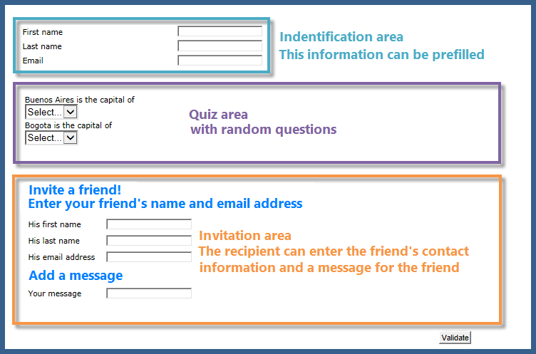
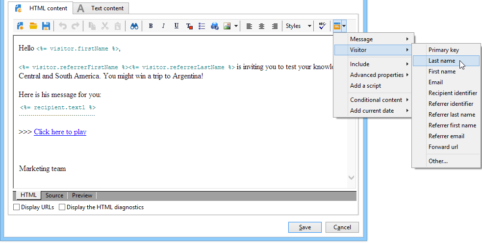

# Caso d’uso: creare un modulo di riferimento{#use-case-creating-a-refer-a-friend-form}


In questo esempio, vogliamo offrire un concorso ai destinatari del database. Il modulo Web avrà una sezione per inserire le risposte e un&#39;altra per fare riferimento a un amico inserendo il suo indirizzo e-mail.



I blocchi di identificazione e concorrenza vengono creati utilizzando i processi descritti in precedenza.

Per configurare e creare il blocco di riferimento, procedi come segue:

1. Crea un modulo web per la concorrenza con domande e un campo per inserire le informazioni di contatto di un amico come mostrato di seguito:

   

   La **Messaggio** consente di inserire un messaggio per l’arbitro. Il referente deve inoltre inserire il proprio **Cognome**, **Nome** e **E-mail**.

   Le informazioni inserite nei campi vengono memorizzate in una tabella specifica nota come tabella dei visitatori.

   >[!NOTE]
   >
   >Se il destinatario non ha dato il proprio consenso, non puoi memorizzarli con i destinatari nel database. Vengono temporaneamente memorizzati nel **visitatore** tabella (**nms:visitatore**) progettata per campagne di marketing virali. Questa tabella viene eliminata regolarmente grazie a **pulizia** operazioni.
   >
   >In questo esempio, vogliamo indirizzare i destinatari affinché ti suggeriscano di partecipare al concorso consigliato dal loro referrer. Tuttavia, in questo messaggio vogliamo anche offrire loro un abbonamento a uno dei nostri servizi di informazione. Se si abbonano, possono essere memorizzati nel database.

   

   Il contenuto dei campi che riguardano l’arbitro verrà utilizzato nello script di creazione del profilo e nel messaggio inviato loro.

1. Inizia creando uno script per collegare il referente all&#39;arbitro.

   Contiene le seguenti istruzioni:

   

   ```
   ctx.recipient.visitor.@id = xtk.session.GetNewIds(1)
   ctx.recipient.visitor.@forwardUrl = "APP5"
   ctx.recipient.visitor.@referrerEmail = ctx.recipient.@email
   ctx.recipient.visitor.@referrerFirstName = ctx.recipient.@firstName
   ctx.recipient.visitor.@referrerLastName = ctx.recipient.@lastName
   ```

   Il cognome, il nome e l’indirizzo e-mail inseriti nel blocco di identificazione della pagina sono identificati come cognome, nome e indirizzo e-mail del referente. Questi campi verranno reinseriti nel corpo del messaggio inviato al referee.

   Il valore APP5 corrisponde al nome interno del modulo Web: queste informazioni ti consentono di conoscere l’origine del referente, ovvero di collegare il visitatore al modulo web in base al quale è stato creato.

1. La casella di archiviazione consente di raccogliere informazioni e archiviarle nel database.

   

1. Quindi crea il modello di consegna collegato al servizio informazioni creato durante il passaggio 1. Sarà selezionato nella **[!UICONTROL Choose scenario]** campo del servizio informazioni.

   Il modello di consegna utilizzato per creare il messaggio di offerta di riferimento contiene le seguenti informazioni:

   

   Questo modello presenta le seguenti caratteristiche:

   * Seleziona la tabella dei visitatori come mappatura di destinazione.

      

   * Le informazioni di contatto dell’arbitro e quelle sul referente vengono ricavate dalla tabella dei visitatori. Viene inserito utilizzando il pulsante di personalizzazione .

      

   * Questo modello contiene un collegamento al modulo di concorso e il collegamento di abbonamento per l’utente a cui effettuare l’abbonamento alla newsletter.

      Il collegamento di abbonamento viene inserito tramite un blocco di personalizzazione. Per impostazione predefinita, ti consente di abbonare i profili al **newsletter** servizio. Questo blocco di personalizzazione può essere modificato in base alle tue esigenze, ad esempio per abbonare il destinatario a un servizio diverso.

   * Il nome interno (&quot;referrer&quot; qui) verrà utilizzato nello script di consegna del messaggio come mostrato di seguito.
   >[!NOTE]
   >
   >Fai riferimento a [questa pagina](../../delivery/using/about-templates.md) per ulteriori informazioni sui modelli di consegna.

1. Crea il secondo script per la consegna dei messaggi di abbonamento.

   

   ```
   // Updtate visitor to have a link to the referrer recipient
   ctx.recipient.visitor.@referrerId = ctx.recipient.@id
   ctx.recipient.visitor.@xtkschema = "nms:visitor"
   ctx.recipient.visitor.@_operation = "update" 
   ctx.recipient.visitor.@_key = "@id" 
   xtk.session.Write(ctx.recipient.visitor)
   
   // Send email to friend
   nms.delivery.QueueNotification("referrer",
   <delivery>
   <targets>
     <deliveryTarget>
       <targetPart type='query' exclusion='false' ignoreDeleteStatus='false'>
         <where>
           <condition expr={'@id IN ('+ ctx.recipient.visitor.@id +')' }/>
         </where>
       </targetPart>
      </deliveryTarget>
     </targets>
    </delivery>)
   ```

1. Pubblica il modulo del concorso e invia un invito ai destinatari del target iniziale. Quando uno di loro invita un amico, una consegna basata sul **Offerta di riferimento** viene creato.

   

   L’arbitro viene aggiunto alla cartella del visitatore nel **[!UICONTROL Administration > Visitors node]**:

   

   Il profilo contiene le informazioni inserite dal relativo referente. Viene memorizzato in base alle configurazioni immesse nello script del modulo. Se decidono di iscriversi alla newsletter, vengono salvati nella tabella dei destinatari.
