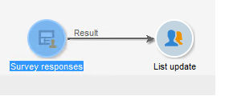
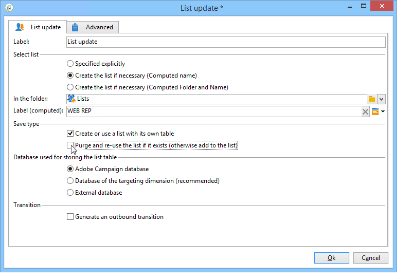

# Caso di utilizzo: visualizzare un report sulle risposte a un sondaggio online{#use-case-displaying-report-on-answers-to-an-online-survey}

Le risposte ai sondaggi Adobe Campaign possono essere raccolte e analizzate utilizzando report dedicati.

Nell’esempio seguente, vogliamo raccogliere le risposte a un sondaggio online e visualizzarle in una tabella pivot

Applica i seguenti passaggi:

1. Creazione di un flusso di lavoro per recuperare le risposte al sondaggio e archiviarle in un elenco.
1. Creazione di un cubo utilizzando i dati presenti nell&#39;elenco.
1. Creazione di un rapporto con la tabella pivot e visualizzazione della suddivisione delle risposte.

Prima di iniziare questo caso d’uso, è necessario avere accesso a un sondaggio e a una serie di risposte da analizzare.

>[!NOTE]
>
>Questo caso d&#39;uso può essere implementato solo se hai acquisito il **Gestore dei sondaggi** opzione . Controlla il contratto di licenza.

## Passaggio 1: creazione del flusso di lavoro di raccolta e archiviazione dei dati {#step-1---creating-the-data-collection-and-storage-workflow}

Per raccogliere le risposte al sondaggio, effettua le seguenti operazioni:

1. Crea un flusso di lavoro e inserisci un **[!UICONTROL Answers to a survey]** attività. Per ulteriori informazioni sull’utilizzo di questa attività, consulta [questa sezione](../../surveys/using/publish--track-and-use-collected-data.md#using-the-collected-data).
1. Modifica l’attività e seleziona il sondaggio di cui desideri analizzare le risposte.
1. Abilita la **[!UICONTROL Select all the answer data]** per raccogliere tutte le informazioni.

   

1. Seleziona le colonne da estrarre (in questo caso: seleziona: tutti i campi archiviati. Questi sono i campi che contengono le risposte.

   

1. Una volta configurata la casella di raccolta delle risposte, posiziona un **[!UICONTROL List update]** digita l’attività per salvare i dati.

   

   In questa attività, specifica l’elenco da aggiornare e deseleziona la **[!UICONTROL Purge and re-use the list if it exists (otherwise add to the list)]** opzione: le risposte vengono aggiunte alla tabella esistente. Questa opzione consente di fare riferimento all&#39;elenco in un cubo. Lo schema collegato all&#39;elenco non verrà rigenerato per ogni aggiornamento, il che garantisce l&#39;integrità del cubo che utilizza questo elenco.

   

1. Avvia il flusso di lavoro per confermare la configurazione.

   

   L’elenco specificato viene creato e include lo schema delle risposte al sondaggio.

1. Aggiungi un programmatore per automatizzare la raccolta giornaliera di risposte e l’aggiornamento dell’elenco.

   La **[!UICONTROL List update]** e **[!UICONTROL Scheduler]** Le attività sono descritte in .

## Passaggio 2 - Creazione del cubo, delle sue misure e dei suoi indicatori {#step-2---creating-the-cube--its-measures-and-its-indicators}

È quindi possibile creare il cubo e configurarne le misure: verranno utilizzati per creare gli indicatori che saranno visualizzati nel rapporto. Per ulteriori informazioni sulla creazione e la configurazione dei cubi, consulta [Informazioni sui cubi](../../reporting/using/ac-cubes.md).

In questo esempio, il cubo è basato sui dati presenti nell’elenco inviato dal flusso di lavoro creato in precedenza.

Definisci le dimensioni e le misure da visualizzare nel rapporto. In questo caso, vogliamo visualizzare la data del contratto e il paese del convenuto.

La **[!UICONTROL Preview]** consente di controllare il rendering del rapporto.

## Passaggio 3: creazione del rapporto e configurazione del layout dei dati all’interno della tabella {#step-3---creating-the-report-and-configuring-the-data-layout-within-the-table}

È quindi possibile creare un report basato su questo cubo ed elaborare i dati e le informazioni.

Adatta le informazioni da visualizzare in base alle tue esigenze.

