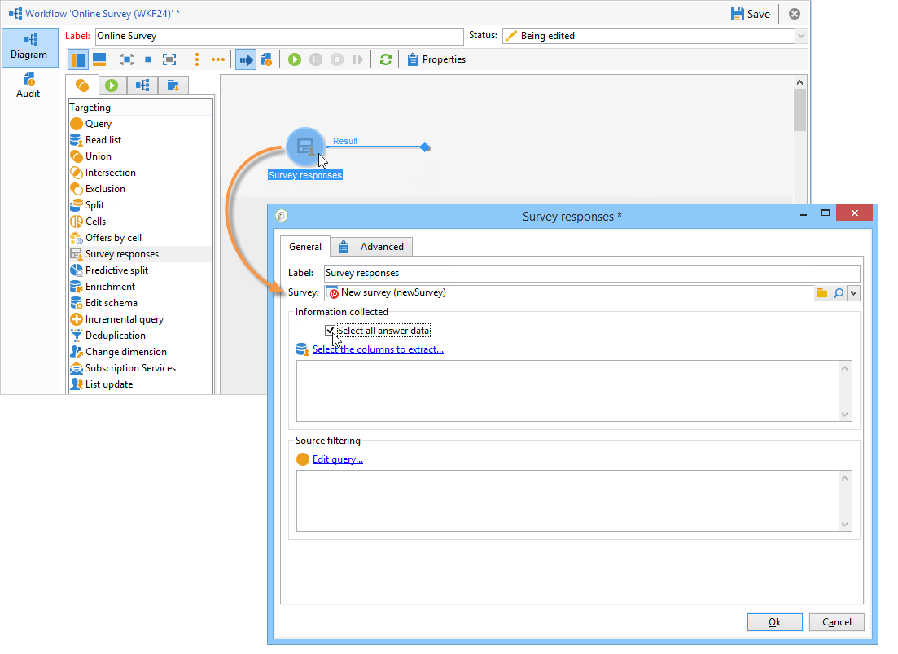
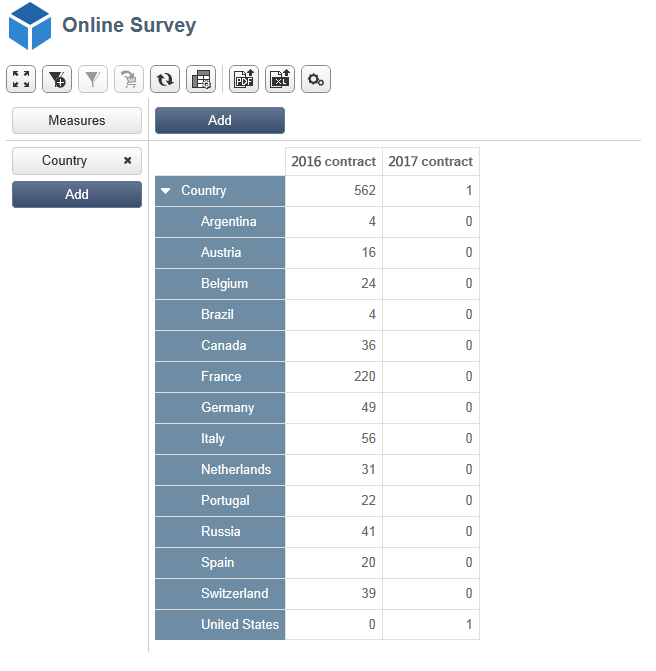

# Caso d’uso: visualizzare un rapporto sulle risposte a un sondaggio online{#use-case-displaying-report-on-answers-to-an-online-survey}

Le risposte ai sondaggi di Adobe Campaign possono essere raccolte e analizzate utilizzando rapporti dedicati.

Nell’esempio seguente, vogliamo raccogliere le risposte a un sondaggio online e visualizzarle in una tabella pivot

Applica i seguenti passaggi:

1. Creazione di un flusso di lavoro per recuperare le risposte al sondaggio e memorizzarle in un elenco.
1. Creazione di un cubo utilizzando i dati dell&#39;elenco.
1. Creazione di un rapporto con la tabella pivot e visualizzazione della suddivisione delle risposte.

Prima di iniziare questo caso d’uso, devi avere accesso a un sondaggio e a una serie di risposte da analizzare.

>[!NOTE]
>
>Questo caso d&#39;uso può essere implementato solo se hai acquisito l&#39;opzione **Gestione sondaggi**. Controlla il contratto di licenza.

## Passaggio 1: creazione del flusso di lavoro di raccolta e archiviazione dei dati {#step-1---creating-the-data-collection-and-storage-workflow}

Per raccogliere le risposte al sondaggio, attieniti alla seguente procedura:

1. Crea un flusso di lavoro e inserisci un&#39;attività **[!UICONTROL Answers to a survey]**. Per ulteriori informazioni sull&#39;utilizzo di questa attività, consulta [questa sezione](../../surveys/using/publish-track-and-use-collected-data.md#using-the-collected-data).
1. Modifica l’attività e seleziona il sondaggio di cui desideri analizzare le risposte.
1. Abilita l&#39;opzione **[!UICONTROL Select all the answer data]** per raccogliere tutte le informazioni.

   

1. Seleziona le colonne da estrarre (in questo caso: seleziona: tutti i campi archiviati. Questi sono i campi che contengono le risposte.

   

1. Una volta configurata la casella raccolta risposte, posizionare un&#39;attività di tipo **[!UICONTROL List update]** per salvare i dati.

   

   In questa attività, specificare l&#39;elenco da aggiornare e deselezionare l&#39;opzione **[!UICONTROL Purge and re-use the list if it exists (otherwise add to the list)]**: le risposte vengono aggiunte alla tabella esistente. Questa opzione consente di fare riferimento all&#39;elenco in un cubo. Lo schema collegato all’elenco non verrà rigenerato per ogni aggiornamento, il che garantisce l’integrità del cubo che utilizza questo elenco.

   

1. Avvia il flusso di lavoro per confermarne la configurazione.

   

   L&#39;elenco specificato viene creato e include lo schema delle risposte al sondaggio.

1. Aggiungi una pianificazione per automatizzare la raccolta giornaliera di risposte e l’aggiornamento dell’elenco.

   Le attività **[!UICONTROL List update]** e **[!UICONTROL Scheduler]** sono descritte in dettaglio in .

## Passaggio 2 - Creazione del cubo, delle relative misure e dei relativi indicatori {#step-2---creating-the-cube--its-measures-and-its-indicators}

Puoi quindi creare il cubo e configurarne le misure, che verranno utilizzate per creare gli indicatori che verranno visualizzati nel rapporto. Per ulteriori informazioni sulla creazione e la configurazione dei cubi, consulta [Informazioni sui cubi](../../reporting/using/ac-cubes.md).

In questo esempio, il cubo si basa sui dati dell&#39;elenco alimentato dal flusso di lavoro creato in precedenza.

Definire le dimensioni e le misure da visualizzare nel rapporto. In questo caso, si desidera visualizzare la data del contratto e il paese del rispondente.

La scheda **[!UICONTROL Preview]** consente di controllare il rendering del report.

## Passaggio 3: creazione del rapporto e configurazione del layout dei dati all’interno della tabella {#step-3---creating-the-report-and-configuring-the-data-layout-within-the-table}

Puoi quindi creare un rapporto basato su questo cubo ed elaborare i dati e le informazioni.

Adatta le informazioni da visualizzare in base alle tue esigenze.

