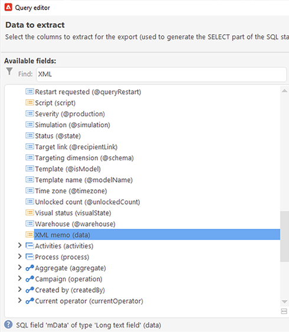

# Protezione della privacy della posta nell’app Mail di Apple


## Cosa è cambiato?

Nel 2021, Apple ha introdotto nuove funzionalità di protezione della privacy per la loro app nativa Mail. Questa app ora include la funzione di protezione della privacy della posta di Apple. In sostanza, i mittenti non possono più utilizzare i pixel di tracciamento per raccogliere informazioni sui destinatari che hanno scelto di attivare la funzione di protezione della privacy della posta di Apple. [Ulteriori informazioni](https://experienceleague.adobe.com/docs/deliverability-learn/deliverability-best-practice-guide/additional-resources/technotes/apple-mail-privacy-faq.html) su {target=&quot;_blank&quot;}.

## In che modo vengono influenzate le mie campagne?

Adobe Campaign fornisce la capacità di utilizzare i pixel di tracciamento per tenere traccia delle aperture delle e-mail. Puoi utilizzare questa funzionalità non solo per il targeting e le campagne, ma anche per le metriche. Ad esempio, puoi utilizzare i tassi di apertura delle e-mail per misurare l’efficacia delle campagne e il coinvolgimento degli utenti. In breve, segmentazione, targeting e metriche potrebbero essere interessati nelle campagne. [Ulteriori informazioni](https://experienceleague.adobe.com/docs/deliverability-learn/deliverability-best-practice-guide/additional-resources/technotes/apple-mail-privacy-faq.html#in-addition-to-measuring-opens%2C-what-else-is-impacted%3F) su {target=&quot;_blank&quot;}.

## Quali azioni devo intraprendere?

La nuova funzionalità di Apple è la forma delle cose che verranno nel settore in termini di protezione della privacy delle e-mail. Ti consigliamo vivamente di seguire le raccomandazioni di Adobe.

### Valutare l&#39;impatto sugli attivatori della campagna

Valuta in che modo queste modifiche influiscono sugli attivatori della campagna corrente. Identifica i flussi di lavoro in cui l’apertura delle e-mail viene utilizzata come criterio per la segmentazione, il targeting o il retargeting. Leggi i [suggerimenti e trucchi](#find-email-open-tracking).

### Conserva i dati

Conserva i tuoi dati e consolida le tue conoscenze attuali sui dispositivi. Puoi basare gli indicatori prestazioni chiave (KPI, Key Performance Indicators) sull’agente utente. Ad esempio, puoi creare KPI intorno ai profili delle persone che utilizzano l’app e-mail di iOS e Apple. Leggi i [suggerimenti e trucchi](#preserve-tracking-data).

### Archiviare i registri di tracciamento oltre il periodo di conservazione

Archivia i registri di tracciamento oltre il periodo di conservazione di Adobe Campaign:

1. Controlla la durata del periodo di conservazione nell’istanza della campagna.
1. Controlla le mappature di destinazione attive. Determina se utilizzare tabelle di profili personalizzati in aggiunta alla tabella di profili predefiniti (`nmsRecipient`).
1. Esporta i registri di tracciamento da Adobe Campaign. Includi i registri che contengono i dati sull’agente utente e sul sistema operativo.

### Valutare l&#39;attuale tendenza dei tassi aperti

Determinare quale percentuale del pubblico utilizza l’app e-mail di Apple su un dispositivo iOS.
Utilizzando questa valutazione, puoi identificare potenziali lacune anomale e la loro causa. Puoi determinare se un gap è dovuto a problemi di prestazioni della campagna o alla funzionalità di protezione della privacy di Apple. Leggi i [suggerimenti e trucchi](#measure-ios-footprint).

### Rivedere la strategia e le metriche delle prestazioni della campagna

Soprattutto, consigliamo vivamente di rivalutare in modo proattivo la strategia per la campagna e le metriche di prestazioni della campagna. Puoi concentrarsi nuovamente su metriche più affidabili, ad esempio click-through, visualizzazioni di prodotto e acquisti.

È consigliabile esplorare i dati attualmente disponibili e valutare la correlazione tra tassi aperti e altre metriche. Se queste metriche sono correlate in modo coerente, puoi migliorare i trigger con un buon livello di affidabilità.

## Suggerimenti

### Misurare l’impronta globale di iOS {#measure-ios-footprint}

Per raccogliere informazioni dai dati di Adobe Campaign, puoi utilizzare i rapporti predefiniti:

* **[!UICONTROL Operating Systems]** rapporto

   Per identificare la proporzione di visitatori per sistema operativo e per versione, utilizza questo rapporto. [Leggi tutto](../../reporting/using/global-reports.md#operating-systems).

   Puoi visualizzare la suddivisione dei visitatori per sistema operativo in relazione al numero totale di visitatori.

   

   Per ogni sistema operativo, puoi visualizzare il raggruppamento dei visitatori per versione del sistema operativo.

   

* **[!UICONTROL Breakdown of opens]** rapporto

   Per identificare la proporzione di aperture di e-mail per sistema operativo, utilizza questo rapporto. [Leggi tutto](../../reporting/using/global-reports.md#breakdown-of-opens).

   

### Determinare in che modo viene utilizzato il tracciamento dell’apertura delle e-mail {#find-email-open-tracking}

Puoi identificare i flussi di lavoro in cui l’apertura delle e-mail viene utilizzata come criterio per la segmentazione, il targeting e il retargeting.

A questo scopo, puoi utilizzare l&#39;attributo **[!UICONTROL type]** dell&#39;URL del collegamento tracciato (**[!UICONTROL url/@type]**). Per le aperture dei messaggi e-mail, questo attributo è impostato su **[!UICONTROL Open]**. Questo attributo è disponibile dall’editor delle query, dall’attività **[!UICONTROL Query]** in un flusso di lavoro e dai filtri predefiniti. Puoi utilizzare questo attributo come criterio di targeting per le campagne di marketing.


In questo esempio, un addetto al marketing desidera inviare un’offerta di ricompensa ai destinatari che hanno aperto un’e-mail di consegna specifica negli ultimi sette giorni e hanno effettuato un acquisto nell’ultimo mese. Nelle query del flusso di lavoro puoi utilizzare le aperture delle e-mail in vari modi:

* Puoi utilizzare le aperture e-mail come criterio di targeting in una query.

   Puoi specificare, come condizione di filtro, che il tipo di URL dei registri di tracciamento di una consegna specifica debba essere impostato su **[!UICONTROL Open]**.

   

* Puoi utilizzare un filtro predefinito. [Ulteriori informazioni](../../workflow/using/creating-a-filter.md).

   

   Puoi utilizzare questo filtro predefinito nelle attività di query nei flussi di lavoro.

   

   >[!NOTE]
   >
   >Da un flusso di lavoro non è possibile visualizzare i criteri di targeting di un filtro predefinito.

Per recuperare l’elenco dei flussi di lavoro in cui le aperture e-mail vengono utilizzate come criterio di targeting, è necessario eseguire una query sullo schema `xtk:workflow`. Il contenuto del flusso di lavoro viene memorizzato nel campo **[!UICONTROL XML memo (data)]** in formato XML.



Puoi specificare che i flussi di lavoro devono includere questo contenuto:

`expr="[url/@type] = 2"`

Questo criterio di targeting significa che il tipo dell’URL tracciato deve essere impostato su **[!UICONTROL Open]**.


#### Esempio di implementazione e pacchetto di esempio

Puoi utilizzare questo esempio di implementazione per identificare i flussi di lavoro in cui l’apertura delle e-mail viene utilizzata come criterio di targeting e per inviare una notifica all’operatore della campagna desiderato. Puoi utilizzare questa implementazione per i seguenti scopi:

* Puoi misurare l’impatto potenziale del passaggio dall’apertura delle e-mail a un altro KPI nei flussi di lavoro di targeting. Se non utilizzi le aperture e-mail, non è necessaria alcuna ulteriore azione.
* Quando rivaluti l’implementazione, puoi utilizzare questo esempio per evitare di saltare i flussi di lavoro.

Questo esempio mostra un’implementazione personalizzata in un unico flusso di lavoro tecnico.


>[!IMPORTANT]
>
>Il pacchetto viene fornito solo come esempio e non è supportato da Adobe come funzionalità di prodotto.
>
>Potrebbe essere necessario adattare il codice di esempio all’implementazione della campagna.
>
>L&#39;utente finale è l&#39;unico responsabile dell&#39;installazione e dell&#39;utilizzo di questo pacchetto di esempio.
>
>Ti consigliamo vivamente di testare e convalidare questo pacchetto in un ambiente non di produzione.

Scarica il [pacchetto di esempio](assets/PKG_Search_workflows_using_Opens_in_queries_V1.xml) e installalo. [Ulteriori informazioni](../../platform/using/working-with-data-packages.md#importing-packages).

Dopo aver installato il pacchetto, puoi accedere al flusso di lavoro dalla cartella che contiene i flussi di lavoro tecnici predefiniti nella tua istanza:

`/Administration/Production/Technical workflows/nmsTechnicalWorkflow`

Dall’interfaccia utente, scegli **[!UICONTROL Administration]** > **[!UICONTROL Production]** > **[!UICONTROL Technical workflows]**.


Il flusso di lavoro comprende i seguenti passaggi principali:

1. Elenca i flussi di lavoro in cui le e-mail vengono aperte come criterio di targeting.
1. Elenca i filtri predefiniti in cui le e-mail vengono aperte come criterio di targeting.
1. Elenca i flussi di lavoro in cui vengono utilizzati questi filtri predefiniti.
1. Unisci i due elenchi di flussi di lavoro in un unico elenco.
1. Invia una notifica e-mail all’operatore specificato.

Il flusso di lavoro comprende i seguenti passaggi dettagliati:

1. L’attività iniziale è un’attività di query nello schema `xtk:workflow` . Questa attività viene utilizzata per trovare, nell’istanza corrispondente, le query esplicite del flusso di lavoro che includono le e-mail si aprono come criterio di targeting.

   

   

   

   Come risultato, viene restituito un elenco di flussi di lavoro.

   

   Poiché queste informazioni vengono riutilizzate, il nome della tabella di lavoro viene memorizzato in una variabile di istanza del flusso di lavoro globale.

   

1. Una seconda query viene utilizzata per trovare i filtri predefiniti che includono le aperture delle e-mail.

   

   

   

   Come risultato viene restituito un elenco di filtri predefiniti.

   

1. Questo elenco di filtri predefiniti viene utilizzato per trovare i flussi di lavoro in cui vengono utilizzati tali filtri.
1. Entrambi gli elenchi di flussi di lavoro sono uniti in un unico elenco.

   A questo scopo, viene utilizzato il codice JavaScript.

   

   ```javascript
   const queryPredFilter = xtk.queryDef.create(
     <queryDef schema={vars.targetSchema} operation="select">
        <select>
          <node alias="@id" expr="@id" />
          <node alias="@name" expr="@name"  />
        </select>
        <where/>
     </queryDef>
       ).ExecuteQuery()
   
   var qDef =
     <queryDef schema="xtk:workflow" operation="select">
       <select>
         <node expr="@id"/>
         <node expr="@internalName"/>
         <node expr="@label"/>
       </select>
       <where>
         <condition boolOperator="OR" expr={"data like '%expr=[url/@type] = 2%'" }/>
       </where>
     </queryDef>
   
   for each (var filter in queryPredFilter) {       
   
      //logInfo (filter.@name);
      var condition;
      condition =<condition boolOperator="OR" expr={"data like '%" + filter.@name + "%'" }/>
      qDef.where.appendChild(condition);   
   
   }
   
   var queryWorkflowList = xtk.queryDef.create(qDef);
   var workflowList = queryWorkflowList.ExecuteQuery();
   
   var sWorkflowList = "";
   var iCount = 0
   for each (var workflow in workflowList) {       
   
      //logInfo ("Workflow ID: " + workflow.@id + " in " + instance.vars.mainTargetSchema);
   
      iWorkflowId = workflow.@id;
      iWorkflowName = workflow.@internaName;
      iWorkflowLabel = workflow.@label;
   
       xtk.session.Write(
             <{instance.vars.mainTargetSchema.split(':')[1]}
               _operation="insertOrUpdate"       
               _key="@id"
               xtkschema={instance.vars.mainTargetSchema}
               id={iWorkflowId}
               internaName={iWorkflowName}
               label={iWorkflowLabel}
             />
       )
   }
   ```

1. I flussi di lavoro duplicati vengono rimossi dall’elenco unito.

   

1. Viene eseguito un test per verificare che l’elenco non sia vuoto.

   

   Se l’elenco non è vuoto, viene inserito in una tabella HTML per le notifiche e-mail.

   

   ```js
   const queryWorkflow = xtk.queryDef.create(
       <queryDef schema={vars.targetSchema} operation="select">
           <select>
               <node alias="@id" expr="@id" />
               <node alias="@internalName" expr="@internalName"  />
               <node alias="@label" expr="@label"  />
           </select>
           <where/>
       </queryDef>
   ).ExecuteQuery()
   
   var sWorkflowList = '<table border="0" >';
   
   sWorkflowList = sWorkflowList + "<tr><th>Worklow Id</th><th>Name</th><th>Label</th></tr>";
   
   for each (var workflow in queryWorkflow) {       
   
      sWorkflowList = sWorkflowList + "<tr>" +
                       "<td>" + workflow.@id + "</td>" +
                       "<td>" + workflow.@internalName + "</td>" +
                       "<td>" + workflow.@label + "</td>" +
                       "</tr>";
   
   }
   
   sWorkflowList = sWorkflowList + "</table>";
   
   instance.vars.workflowList = sWorkflowList;
   ```

1. La tabella HTML viene aggiunta al modello di notifica.

   ```js
   <%= instance.vars.workflowLIst%>
   ```

   

   Le notifiche e-mail contengono l’elenco dei flussi di lavoro che includono l’apertura delle e-mail come criterio di targeting nelle query.

   

### Conserva i dati di tracciamento correnti {#preserve-tracking-data}

#### Quali dati sono interessati?

I dati del profilo sono arricchiti con i dati di tracciamento provenienti da azioni quali apertura di e-mail e click-through. Il tracciamento fornisce inoltre, tramite l’agente utente quando tali informazioni sono disponibili, informazioni chiave sui dispositivi dell’utente.

In breve, i dati di tracciamento di Adobe Campaign forniscono le seguenti informazioni:

* Profilo associato alla persona che ha aperto o ha fatto clic su un messaggio e-mail specifico
* Data di apertura
* Il dispositivo utilizzato, ad esempio, iPhone o Mac
* Sistema operativo e versione, ad esempio iOS 15, macOS 12 o Windows 10
* L&#39;applicazione, ad esempio un&#39;applicazione di posta o un browser Web, e la versione, ad esempio, Outlook 2019

#### Perché dovrei conservare i dati di tracciamento?

Si consiglia vivamente di conservare questi dati per diversi motivi:

* Questi dati vengono conservati da Adobe Campaign per un periodo limitato. Il periodo di conservazione varia a seconda della configurazione dell’istanza.

   Controlla la configurazione dell&#39;istanza. [Leggi tutto](../../platform/using/privacy-management.md#data-retention).

* Oltre alle recenti modifiche di Apple, puoi utilizzare i dati di tracciamento per aggiungere un valore immenso per stimolare il coinvolgimento del pubblico.
* Apple potrebbe apportare ulteriori modifiche alla propria app Mail nativa e alla relativa funzione di protezione della privacy della posta.

Per tutti questi motivi, ti consigliamo vivamente di esportare questi dati il prima possibile. In caso contrario, i dati di tracciamento per una parte del pubblico potrebbero risentirne negativamente.

#### Come posso conservare i dati di tracciamento?

Per conservare i dati di tracciamento, devi esportarli da Adobe Campaign al tuo sistema informativo. [Leggi tutto](../../platform/using/get-started-data-import-export.md).

>[!IMPORTANT]
>
>L’esempio seguente si concentra sullo schema predefinito `nms:Recipient`, che è lo schema di profilo predefinito. Se utilizzi mappature di destinazione personalizzate aggiuntive associate ai profili personalizzati, ti consigliamo di estendere questa strategia di esportazione a tutte le tabelle di log personalizzate. [Leggi tutto](../../configuration/using/target-mapping.md).

##### Principio

Per impostazione predefinita, lo schema `nms:Recipient` è collegato a tre schemi da esportare:

| Schema | Contenuto |
| --- | --- |
| nms:trackingLogRcp | Tracciamento dei dati, dell’utente, dell’ora e del messaggio interessato |
| nms:trackingUrl | Dettagli sul collegamento, inclusa la natura, ad esempio un’e-mail aperta o un click-through |
| nms:userAgent | Informazioni sul dispositivo |

Le tabelle sono collegate nel modello dati.


Utilizza queste relazioni per creare una singola query di esportazione.


Puoi arricchire questi dati con utili informazioni dagli schemi collegati:

| Schema | Contenuto |
| --- | --- |
| nms:Recipient | Dettagli relativi ai profili |
| nms:Consegna | Informazioni sul messaggio a cui l’utente ha reagito |

Puoi esportare il risultato in una soluzione di archiviazione esterna supportata da Adobe Campaign:

* SFTP
* S3
* BLOB di Azure

##### Implementazione

Questo esempio mostra come esportare dati di tracciamento da Adobe Campaign.

1. Crea un flusso di lavoro che inizia con una query.

   La query iniziale viene utilizzata per recuperare i registri di tracciamento degli ultimi tre mesi.
È possibile utilizzare una query incrementale per estrarre solo i record non ancora esportati.

   Aggiungi tutte le informazioni richieste dal nodo **[!UICONTROL Additional data]** .

   

1. Aggiungi un’attività **[!UICONTROL Data extraction (file)]** . Mappa tutti i dati dalla query a un formato di file di estrazione.

   

   Scegli il formato del file, ad esempio TXT o CSV.

   

1. Aggiungi la terza e l’ultima attività per il caricamento del file in una soluzione di archiviazione supportata.


##### Implementazione avanzata: suddivisione per dispositivo iOS

Puoi utilizzare i flussi di lavoro per determinare se un destinatario utilizza l’app Mail di Apple. Puoi suddividere i registri di tracciamento per dispositivo. Ad esempio, puoi utilizzare i filtri di query per suddividere i record per dispositivo iOS:

| Applicazione | Sistema operativo o dispositivo  | Filtro query |
| --- | --- | --- |
| Apple Mail | iOS 15 | `operating System (Browser) contains 'iOS 15' and browser (Browser) contains 'ApplewebKit'` |
| Apple Mail | iOS 14 o iOS 13 | `browser contains 'AppleWebKit' and operating System of browser contains 'iOS 14' or operating System of browser contains 'iOS 13'` |
| Apple Mail | Dispositivi mobili iOS: iPad, iPod e iPhone | `device (Browser) contains iPhone or device (Browser) equal to iPod or device (Browser) equal to iPad and browser (Browser) equal to 'AppleWebKit'` |
| Apple Mail | iPhone , iPad o iPod | `browser (Browser) equal to 'AppleWebKit' and device (Browser) equal to iPhone or device (Browser) equal to iPod or device (Browser) equal to iPad` |
| Apple Mail | Mac | `browser (Browser) equal to 'AppleWebKit' and operating System (Browser) contains 'Mac'` |
| Safari | macOS | `browser (Browser) equal to 'Safari' and device (Browser) equal to PC and operating System (Browser) contains 'Mac'` |
| Safari | Dispositivi mobili | `browser (Browser) equal to 'Safari' and device (Browser) equal to iPad or device (Browser) equal to iPod or device (Browser) equal to iPhone` |


Puoi utilizzare queste regole per vari scopi:

* Esportazione e archiviazione dei dati in una soluzione di storage esterna
* Calcolare i KPI da allegare ai profili
* Creare elenchi di soppressione
* Generazione rapporti

Questi esempi mostrano come utilizzare i flussi di lavoro per suddividere i record per dispositivo iOS:

* Il primo flusso di lavoro di esempio include queste attività:

   1. L’attività iniziale **[!UICONTROL Query]** viene utilizzata per selezionare tutte le aperture dei messaggi e-mail per gli ultimi tre mesi.
   1. Un’attività **[!UICONTROL Split]** viene utilizzata per dividere la selezione per applicazione e-mail, browser, sistema operativo e dispositivo.

   1. Un&#39;attività **[!UICONTROL Deduplication]** segue ogni attività **[!UICONTROL Split]**. L’attività **[!UICONTROL Deduplication]** viene utilizzata per rimuovere gli indirizzi e-mail duplicati.

      L&#39;attività **[!UICONTROL Deduplication]** viene posizionata dopo l&#39;attività **[!UICONTROL Split]** per evitare di perdere informazioni sui destinatari che utilizzano vari dispositivi.

   1. Un&#39;attività **[!UICONTROL End]** segue ogni attività **[!UICONTROL Deduplication]**.

   Questo tipo di flusso di lavoro è utile se archivi i destinatari solo nella tabella dei destinatari predefiniti per il targeting.

   

* Il secondo flusso di lavoro di esempio include queste attività:

   1. L’attività iniziale **[!UICONTROL Query]** viene utilizzata per selezionare tutte le aperture dei messaggi e-mail per gli ultimi tre mesi.
   1. Un’attività **[!UICONTROL Deduplication]** viene utilizzata per rimuovere gli indirizzi e-mail duplicati.
   1. Viene utilizzata un&#39;attività **[!UICONTROL Fork]**:

      * In una transizione, l’attività **[!UICONTROL Change dimension]** viene utilizzata per trovare i destinatari a cui si riferisce il registro di tracciamento.
      * Nell’altra transizione, l’attività **[!UICONTROL Split]** viene utilizzata per dividere la selezione per applicazione e-mail, browser, sistema operativo e dispositivo.
   1. Un&#39;attività **[!UICONTROL End]** segue ogni transizione dopo l&#39;attività **[!UICONTROL Split]**.

   Questo tipo di flusso di lavoro è utile se archivi i destinatari in una tabella diversa da quella predefinita.

   

## Collegamenti utili

[Domande frequenti sulla protezione della privacy di Apple Mail](https://experienceleague.adobe.com/docs/deliverability-learn/deliverability-best-practice-guide/additional-resources/technotes/apple-mail-privacy-faq.html){target=&quot;_blank&quot;}
