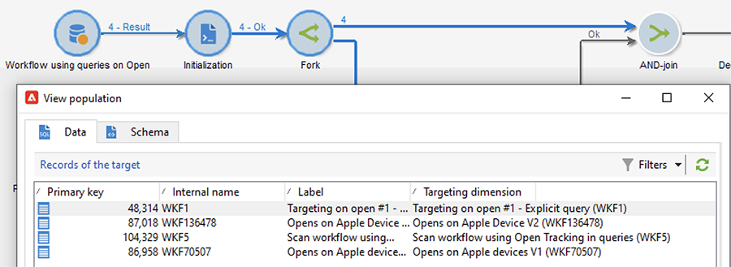
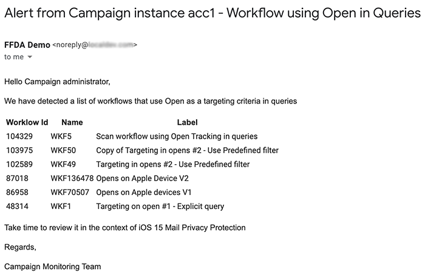

# Protezione della privacy della posta nell’app Mail di Apple


## Cosa è cambiato?

Nel 2021, Apple ha introdotto nuove funzionalità di protezione della privacy per la propria app nativa Mail. Questa app ora include la funzione di protezione della privacy della posta di Apple. In pratica, i mittenti non possono più utilizzare i pixel di tracciamento per raccogliere informazioni sui destinatari che hanno scelto di attivare la funzione di protezione della privacy della posta di Apple.

## Che impatto hanno le mie campagne?

Adobe Campaign fornisce la possibilità di utilizzare i pixel di tracciamento per tenere traccia delle aperture delle e-mail. Puoi utilizzare questa funzionalità non solo per il targeting e le campagne, ma anche per le metriche. Ad esempio, puoi utilizzare i tassi di apertura delle e-mail per misurare l’efficacia della campagna e il coinvolgimento degli utenti. In breve, la segmentazione, il targeting e le metriche potrebbero essere influenzati nelle campagne.

## Quali azioni devo intraprendere?

La nuova funzione di Apple è la forma delle novità del settore in termini di protezione della privacy delle e-mail. Si consiglia vivamente di seguire le raccomandazioni di Adobe.

### Valuta l’impatto sui trigger della campagna

Valuta in che modo queste modifiche influiscono sui trigger della campagna corrente. Identifica i flussi di lavoro in cui le e-mail aperte vengono utilizzate come criterio per la segmentazione, il targeting o il retargeting. Leggi i [suggerimenti e trucchi](#find-email-open-tracking).

### Conservare i dati

Conserva i tuoi dati e consolida le tue conoscenze attuali sui dispositivi. Puoi basare gli indicatori di prestazioni chiave (KPI, Key Performance Indicators) sull’agente utente. Ad esempio, puoi creare KPI (Key Performance Indicator) sulla base dei profili delle persone che utilizzano l’app Mail di iOS e Apple. Leggi i [suggerimenti e trucchi](#preserve-tracking-data).

### Archiviare i registri di tracciamento oltre il periodo di conservazione

Archivia i registri di tracciamento oltre il periodo di conservazione di Adobe Campaign:

1. Controlla la durata del periodo di conservazione nell’istanza della campagna.
1. Controlla nuovamente le mappature di destinazione attive. Determinare se utilizzare tabelle di profili personalizzate in aggiunta alla tabella dei profili predefinita (`nmsRecipient`).
1. Esporta i registri di tracciamento da Adobe Campaign. Includi i registri che contengono dati sull’agente utente e sul sistema operativo.

### Valuta la tendenza corrente dei tassi aperti

Determina quale proporzione del pubblico utilizza l’app di posta di Apple su un dispositivo iOS.
Utilizzando questa valutazione, è possibile identificare potenziali lacune anomale e la loro causa. Puoi determinare se un gap è dovuto a problemi di prestazioni della campagna o alla funzionalità di protezione della privacy di Apple. Leggi i [suggerimenti e trucchi](#measure-ios-footprint).

### Valuta nuovamente la strategia della campagna e le metriche delle prestazioni

Soprattutto, ti consigliamo vivamente di rivalutare in modo proattivo la strategia della campagna e le metriche delle prestazioni della campagna. Puoi concentrarti su metriche più affidabili, ad esempio click-through, visualizzazioni di prodotti e acquisti.

È consigliabile esplorare i dati attualmente disponibili e valutare la correlazione tra i tassi di apertura e altre metriche. Se queste metriche sono correlate in modo coerente, puoi migliorare i trigger con un buon livello di affidabilità.

## Suggerimenti

### Misurazione dell’ingombro complessivo di iOS {#measure-ios-footprint}

Per raccogliere informazioni dai dati di Adobe Campaign, puoi utilizzare rapporti predefiniti:

* Report **[!UICONTROL Operating Systems]**

  Per identificare la proporzione di visitatori per sistema operativo e per versione, utilizza questo rapporto. [Ulteriori informazioni](../../reporting/using/global-reports.md#operating-systems).

  Puoi visualizzare il raggruppamento dei visitatori per sistema operativo in relazione al numero totale di visitatori.

  

  Per ogni sistema operativo, puoi visualizzare il raggruppamento dei visitatori per versione del sistema operativo.

  

* Report **[!UICONTROL Breakdown of opens]**

  Per identificare la proporzione di aperture di e-mail per sistema operativo, utilizza questo rapporto. [Ulteriori informazioni](../../reporting/using/global-reports.md#breakdown-of-opens).

  

### Determinare il modo in cui viene utilizzato il tracciamento dell’apertura delle e-mail {#find-email-open-tracking}

Puoi identificare i flussi di lavoro in cui le e-mail aperte vengono utilizzate come criterio per la segmentazione, il targeting e il retargeting.

A tale scopo, è possibile utilizzare l&#39;attributo **[!UICONTROL type]** dell&#39;URL del collegamento tracciato (**[!UICONTROL url/@type]**). Per le aperture e-mail, questo attributo è impostato su **[!UICONTROL Open]**. Questo attributo è disponibile dall&#39;editor delle query, dall&#39;attività **[!UICONTROL Query]** in un flusso di lavoro e dai filtri predefiniti. Puoi utilizzare questo attributo come criterio di targeting per le campagne di marketing.


In questo esempio, un addetto al marketing desidera inviare un’offerta di ricompensa ai destinatari che hanno aperto un’e-mail di consegna specifica negli ultimi sette giorni e hanno effettuato un acquisto nell’ultimo mese. Nelle query del flusso di lavoro, puoi utilizzare le aperture delle e-mail in vari modi:

* Puoi utilizzare le aperture e-mail come criterio di targeting in una query.

  È possibile specificare, come condizione di filtro, che il tipo di URL dei registri di tracciamento di una consegna specifica deve essere impostato su **[!UICONTROL Open]**.

  

* Puoi utilizzare un filtro predefinito. [Ulteriori informazioni](../../workflow/using/creating-a-filter.md).

  

  Puoi utilizzare questo filtro predefinito nelle attività di query nei flussi di lavoro.

  

  >[!NOTE]
  >
  >Da un flusso di lavoro non è possibile visualizzare i criteri di targeting di un filtro predefinito.

Per recuperare l&#39;elenco dei flussi di lavoro in cui le e-mail aperte vengono utilizzate come criterio di targeting, è necessario eseguire una query sullo schema `xtk:workflow`. Il contenuto del flusso di lavoro è memorizzato nel campo **[!UICONTROL XML memo (data)]** in formato XML.


Puoi specificare che i flussi di lavoro devono includere questo contenuto:

`expr="[url/@type] = 2"`

Questo criterio di targeting indica che il tipo di URL tracciato deve essere impostato su **[!UICONTROL Open]**.


#### Esempio di implementazione e pacchetto di esempio

Puoi utilizzare questo esempio di implementazione per identificare i flussi di lavoro in cui le e-mail aperte vengono utilizzate come criterio di targeting e per inviare una notifica all’operatore della campagna di tua scelta. Puoi utilizzare questa implementazione per i seguenti scopi:

* Puoi misurare il potenziale impatto del passaggio dalle aperture delle e-mail a un altro KPI nei flussi di lavoro di targeting. Se non utilizzi le aperture e-mail, non è necessario eseguire ulteriori azioni.
* Quando rivaluta l’implementazione, puoi utilizzare questo esempio per evitare di saltare i flussi di lavoro.

Questo esempio mostra un’implementazione personalizzata in un singolo flusso di lavoro tecnico.


>[!IMPORTANT]
>
>Il pacchetto viene fornito solo a titolo di esempio e non è supportato da Adobe come funzionalità del prodotto.
>
>Potrebbe essere necessario adattare il codice di esempio all’implementazione della campagna.
>
>L’utente finale è l’unico responsabile dell’installazione e dell’utilizzo di questo pacchetto di esempio.
>
>Si consiglia vivamente di testare e convalidare questo pacchetto in un ambiente non di produzione.

Scarica il [pacchetto di esempio](assets/PKG_Search_workflows_using_Opens_in_queries_V1.xml) e installalo. [Ulteriori informazioni](../../platform/using/working-with-data-packages.md#importing-packages).

Dopo aver installato il pacchetto, puoi accedere al flusso di lavoro dalla cartella che contiene i flussi di lavoro tecnici predefiniti nella tua istanza:

`/Administration/Production/Technical workflows/nmsTechnicalWorkflow`

Dall&#39;interfaccia utente, scegliere **[!UICONTROL Administration]** > **[!UICONTROL Production]** > **[!UICONTROL Technical workflows]**.


Il flusso di lavoro comprende i seguenti passaggi principali:

1. Elencare i flussi di lavoro in cui le e-mail aperte vengono utilizzate come criterio di targeting.
1. Elencare i filtri predefiniti in cui le e-mail aperte vengono utilizzate come criterio di targeting.
1. Elencare i flussi di lavoro in cui vengono utilizzati questi filtri predefiniti.
1. Unisci i due elenchi di flussi di lavoro in un unico elenco.
1. Invia una notifica e-mail all’operatore specificato.

Il flusso di lavoro comprende i seguenti passaggi dettagliati:

1. L&#39;attività iniziale è un&#39;attività query nello schema `xtk:workflow`. Questa attività viene utilizzata per trovare, nell’istanza corrispondente, le query di flusso di lavoro esplicite che includono le e-mail aperte come criterio di targeting.

   

   

   

   Di conseguenza viene restituito un elenco di flussi di lavoro.

   

   Poiché queste informazioni vengono riutilizzate, il nome della tabella di lavoro viene memorizzato in una variabile di istanza del flusso di lavoro globale.

   

1. Una seconda query viene utilizzata per trovare i filtri predefiniti che includono le aperture delle e-mail.

   

   

   

   Di conseguenza, viene restituito un elenco di filtri predefiniti.

   

1. Questo elenco di filtri predefiniti viene utilizzato per trovare i flussi di lavoro in cui vengono utilizzati questi filtri.
1. Entrambi gli elenchi di flussi di lavoro vengono uniti in un unico elenco.

   A questo scopo, viene utilizzato il codice JavaScript.

   

   ```javascript
   const queryPredFilter = xtk.queryDef.create(
     <queryDef schema={vars.targetSchema} operation="select">
        <select>
          <node alias="@id" expr="@id" />
          <node alias="@name" expr="@name"  />
        </select>
        <where/>
     </queryDef>
       ).ExecuteQuery()
   
   var qDef =
     <queryDef schema="xtk:workflow" operation="select">
       <select>
         <node expr="@id"/>
         <node expr="@internalName"/>
         <node expr="@label"/>
       </select>
       <where>
         <condition boolOperator="OR" expr={"data like '%expr=[url/@type] = 2%'" }/>
       </where>
     </queryDef>
   
   for each (var filter in queryPredFilter) {       
   
      //logInfo (filter.@name);
      var condition;
      condition =<condition boolOperator="OR" expr={"data like '%" + filter.@name + "%'" }/>
      qDef.where.appendChild(condition);   
   
   }
   
   var queryWorkflowList = xtk.queryDef.create(qDef);
   var workflowList = queryWorkflowList.ExecuteQuery();
   
   var sWorkflowList = "";
   var iCount = 0
   for each (var workflow in workflowList) {       
   
      //logInfo ("Workflow ID: " + workflow.@id + " in " + instance.vars.mainTargetSchema);
   
      iWorkflowId = workflow.@id;
      iWorkflowName = workflow.@internaName;
      iWorkflowLabel = workflow.@label;
   
       xtk.session.Write(
             <{instance.vars.mainTargetSchema.split(':')[1]}
               _operation="insertOrUpdate"       
               _key="@id"
               xtkschema={instance.vars.mainTargetSchema}
               id={iWorkflowId}
               internaName={iWorkflowName}
               label={iWorkflowLabel}
             />
       )
   }
   ```

1. I flussi di lavoro duplicati vengono rimossi dall’elenco unito.

   

1. Viene eseguito un test per verificare che l’elenco non sia vuoto.

   

   Se l’elenco non è vuoto, viene inserito in una tabella HTML per le notifiche e-mail.

   

   ```js
   const queryWorkflow = xtk.queryDef.create(
       <queryDef schema={vars.targetSchema} operation="select">
           <select>
               <node alias="@id" expr="@id" />
               <node alias="@internalName" expr="@internalName"  />
               <node alias="@label" expr="@label"  />
           </select>
           <where/>
       </queryDef>
   ).ExecuteQuery()
   
   var sWorkflowList = '<table border="0" >';
   
   sWorkflowList = sWorkflowList + "<tr><th>Worklow Id</th><th>Name</th><th>Label</th></tr>";
   
   for each (var workflow in queryWorkflow) {       
   
      sWorkflowList = sWorkflowList + "<tr>" +
                       "<td>" + workflow.@id + "</td>" +
                       "<td>" + workflow.@internalName + "</td>" +
                       "<td>" + workflow.@label + "</td>" +
                       "</tr>";
   
   }
   
   sWorkflowList = sWorkflowList + "</table>";
   
   instance.vars.workflowList = sWorkflowList;
   ```

1. La tabella HTML viene aggiunta al modello di notifica.

   ```js
   <%= instance.vars.workflowLIst%>
   ```

   

   Le notifiche e-mail contengono l’elenco dei flussi di lavoro che includono le aperture e-mail come criterio di targeting nelle query.

   

### Mantenere i dati di tracciamento correnti {#preserve-tracking-data}

#### Quali dati sono interessati?

I dati del profilo sono arricchiti dai dati di tracciamento provenienti da azioni quali le aperture delle e-mail e i click-through. Il tracciamento fornisce anche, tramite l’agente utente quando queste informazioni sono disponibili, informazioni chiave sui dispositivi dell’utente.

In breve, i dati di tracciamento di Adobe Campaign forniscono le seguenti informazioni:

* Profilo associato alla persona che ha aperto o fatto clic tramite un messaggio e-mail specifico
* La data di apertura
* Il dispositivo utilizzato, ad esempio iPhone o Mac
* Sistema operativo e versione, ad esempio iOS 15, macOS 12 o Windows 10
* L’applicazione, ad esempio un’applicazione di posta elettronica o un browser web, e la versione, ad esempio Outlook 2019

#### Perché dovrei conservare i dati di tracciamento?

Si consiglia vivamente di conservare questi dati, per diversi motivi:

* Questi dati vengono conservati da Adobe Campaign per un periodo limitato. Il periodo di conservazione varia a seconda della configurazione dell’istanza.

  Controlla la configurazione dell’istanza. [Ulteriori informazioni](../../platform/using/privacy-management.md#data-retention).

* A parte le modifiche recenti di Apple, puoi utilizzare i dati di tracciamento per aggiungere un valore immenso per stimolare il coinvolgimento del pubblico.
* Apple potrebbe apportare ulteriori modifiche alla sua app Mail nativa e alla sua funzione di protezione della privacy della posta.

Per tutti questi motivi, si consiglia vivamente di esportare questi dati il prima possibile. In caso contrario, i dati di tracciamento per parte del pubblico potrebbero essere influenzati negativamente.

#### Come posso conservare i dati di tracciamento?

Per conservare i dati di tracciamento, devi esportarli da Adobe Campaign al tuo sistema informativo. [Ulteriori informazioni](../../platform/using/get-started-data-import-export.md).

>[!IMPORTANT]
>
>L&#39;esempio seguente si concentra sullo schema predefinito `nms:Recipient`, che è lo schema di profilo predefinito. Se utilizzi mappature di destinazione personalizzate aggiuntive associate a profili personalizzati, ti consigliamo di estendere questa strategia di esportazione a tutte le tabelle di registri personalizzate. [Ulteriori informazioni](../../configuration/using/target-mapping.md).

##### Principio

Per impostazione predefinita, lo schema `nms:Recipient` è collegato a tre schemi da esportare:

| Schema | Contenuto |
| --- | --- |
| nms:trackingLogRcp | Dati di tracciamento, per capire, l’utente, l’ora e il messaggio interessato |
| nms:trackingUrl | Dettagli sul collegamento, inclusa la natura, ad esempio un’e-mail aperta o un click-through |
| nms:userAgent | Informazioni sul dispositivo |

Le tabelle sono collegate nel modello dati.


Utilizzare queste relazioni per creare una singola query di esportazione.


Puoi arricchire questi dati con informazioni utili provenienti da schemi collegati:

| Schema | Contenuto |
| --- | --- |
| nms:Destinatario | Dettagli relativi ai profili |
| nms:Consegna | Informazioni sul messaggio al quale l’utente ha reagito |

Puoi esportare i risultati in una soluzione di archiviazione esterna supportata da Adobe Campaign:

* SFTP
* S3
* BLOB di Azure

##### Implementazione

Questo esempio mostra come esportare i dati di tracciamento da Adobe Campaign.

1. Crea un flusso di lavoro che inizia con una query.

   La query iniziale viene utilizzata per recuperare i registri di tracciamento degli ultimi tre mesi.
È possibile utilizzare una query incrementale per estrarre solo i record non ancora esportati.

   Aggiungi tutte le informazioni richieste dal nodo **[!UICONTROL Additional data]**.

   

1. Aggiungi un&#39;attività **[!UICONTROL Data extraction (file)]**. Mappa tutti i dati della query in un formato di file di estrazione.

   

   Scegli il formato del file, ad esempio TXT o CSV.

   

1. Aggiungi la terza e ultima attività per il caricamento del file in una soluzione di archiviazione supportata.


##### Implementazione avanzata: suddivisione per dispositivo iOS

Puoi utilizzare i flussi di lavoro per determinare se un destinatario utilizza l’app e-mail di Apple. Puoi suddividere i registri di tracciamento per dispositivo. Ad esempio, puoi utilizzare i filtri di query per suddividere i record in base al dispositivo iOS:

| Applicazione | Sistema operativo o dispositivo  | Filtro query |
| --- | --- | --- |
| Apple Mail | iOS 15 | `operating System (Browser) contains 'iOS 15' and browser (Browser) contains 'ApplewebKit'` |
| Apple Mail | iOS 14 o iOS 13 | `browser contains 'AppleWebKit' and operating System of browser contains 'iOS 14' or operating System of browser contains 'iOS 13'` |
| Apple Mail | Dispositivi mobili iOS: iPad, iPod e iPhone | `device (Browser) contains iPhone or device (Browser) equal to iPod or device (Browser) equal to iPad and browser (Browser) equal to 'AppleWebKit'` |
| Apple Mail | iPhone, iPad o iPod | `browser (Browser) equal to 'AppleWebKit' and device (Browser) equal to iPhone or device (Browser) equal to iPod or device (Browser) equal to iPad` |
| Apple Mail | Mac | `browser (Browser) equal to 'AppleWebKit' and operating System (Browser) contains 'Mac'` |
| Safari | macOS | `browser (Browser) equal to 'Safari' and device (Browser) equal to PC and operating System (Browser) contains 'Mac'` |
| Safari | Dispositivi mobili | `browser (Browser) equal to 'Safari' and device (Browser) equal to iPad or device (Browser) equal to iPod or device (Browser) equal to iPhone` |


Puoi utilizzare queste regole per vari scopi:

* Esportazione e archiviazione dei dati in una soluzione di storage esterna
* Calcolare i KPI da associare ai profili
* Creare elenchi di soppressione
* Reportistica

Questi esempi mostrano come utilizzare i flussi di lavoro per suddividere i record per dispositivo iOS:

* Il primo esempio di flusso di lavoro include le seguenti attività:

   1. L&#39;attività **[!UICONTROL Query]** iniziale viene utilizzata per selezionare tutte le aperture dei messaggi e-mail negli ultimi tre mesi.
   1. Un&#39;attività **[!UICONTROL Split]** viene utilizzata per suddividere la selezione per applicazione di posta elettronica, browser, sistema operativo e dispositivo.

   1. Un&#39;attività **[!UICONTROL Deduplication]** segue ogni attività **[!UICONTROL Split]**. L&#39;attività **[!UICONTROL Deduplication]** viene utilizzata per rimuovere gli indirizzi e-mail duplicati.

      L&#39;attività **[!UICONTROL Deduplication]** è posizionata dopo l&#39;attività **[!UICONTROL Split]** per evitare di perdere informazioni sui destinatari che utilizzano vari dispositivi.

   1. Un&#39;attività **[!UICONTROL End]** segue ogni attività **[!UICONTROL Deduplication]**.

  Questo tipo di flusso di lavoro è utile se memorizzi i destinatari solo nella tabella dei destinatari predefinita per il targeting.

  

* Il secondo esempio di flusso di lavoro comprende le seguenti attività:

   1. L&#39;attività **[!UICONTROL Query]** iniziale viene utilizzata per selezionare tutte le aperture dei messaggi e-mail negli ultimi tre mesi.
   1. Un&#39;attività **[!UICONTROL Deduplication]** viene utilizzata per rimuovere gli indirizzi e-mail duplicati.
   1. Viene utilizzata un&#39;attività **[!UICONTROL Fork]**:

      * In una transizione, l&#39;attività **[!UICONTROL Change dimension]** viene utilizzata per trovare i destinatari a cui si riferisce il registro di tracciamento.
      * Nell&#39;altra transizione, l&#39;attività **[!UICONTROL Split]** viene utilizzata per suddividere la selezione per applicazione e-mail, browser, sistema operativo e dispositivo.

   1. Un&#39;attività **[!UICONTROL End]** segue ogni transizione dopo l&#39;attività **[!UICONTROL Split]**.

  Questo tipo di flusso di lavoro è utile se i destinatari vengono memorizzati in una tabella diversa da quella predefinita.

  
