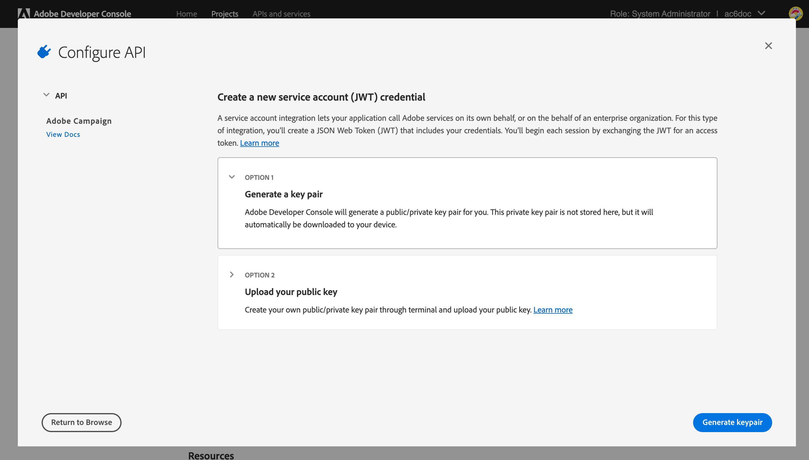

# Aggiornamento al nuovo server di recapito messaggi {#acc-deliverability}

Avvio [Versione v7.2.2](../../rn/using/latest-release.md#release-7-2-2), Adobe Campaign si basa su un nuovo server di recapito messaggi che fornisce elevata disponibilità e affronta i problemi di conformità relativi alla sicurezza. Campaign Classic ora sincronizza le regole di recapito messaggi, i registri di trasmissione e l’indirizzo di eliminazione da e verso il nuovo server di recapito messaggi. Il vecchio server di recapito messaggi verrà disattivato il 31 agosto 2022.

In qualità di cliente Campaign Classic, devi implementare il nuovo server di recapito messaggi **prima del 31 agosto 2022**.

>[!NOTE]
>
>Per ulteriori domande su queste modifiche, consulta [Domande frequenti](#faq), o contatto [Assistenza clienti Adobe](https://helpx.adobe.com/it/enterprise/admin-guide.html/enterprise/using/support-for-experience-cloud.ug.html){_blank}.
>

## Cosa è cambiato?{#acc-deliverability-changes}

Ad Adobe, è in corso la disattivazione dei datacenter meno recenti per motivi di conformità in materia di sicurezza. I client Adobe Campaign Classic devono migrare al nuovo servizio di recapito messaggi, in hosting su Amazon Web Service (AWS).

Questo nuovo server garantisce un’elevata disponibilità (99.9)&#x200B; e fornisce endpoint sicuri e autenticati per consentire ai server di Campaign di recuperare i dati richiesti: anziché connettersi al database per ogni richiesta, il nuovo server di recapito messaggi memorizza in cache i dati per soddisfare le richieste, ove possibile. Questo meccanismo migliora il tempo di risposta&#x200B;

## Sei interessato?{#acc-deliverability-impacts}

Tutti i clienti sono interessati e devono effettuare l’aggiornamento a [Campaign v7.2.2](../../rn/using/latest-release.md#release-7-2-2) (o più) e implementare il proprio ambiente per trarre vantaggio dal nuovo server di recapito messaggi.

## Come si esegue l’aggiornamento?{#acc-deliverability-update}

As a **cliente in hosting**, Adobe collaborerà con te per aggiornare le istanze alla versione più recente e creare il progetto nella console di Adobe Developer.

Come un **cliente on-premise/ibrido**, è necessario eseguire l’aggiornamento a [Campaign v7.2.2](../../rn/using/latest-release.md#release-7-2-2) (o più) per beneficiare del nuovo server di recapito messaggi. Una volta aggiornate tutte le istanze, è necessario [implementare la nuova integrazione](#implementation-steps) per Adobe il server di recapito messaggi e garantire una transizione fluida.

## Passaggi di implementazione {#implementation-steps}

>[!WARNING]
>
>Questi passaggi devono essere eseguiti solo per le implementazioni ibride e on-premise.

Come parte della nuova integrazione del server di recapito messaggi, Campaign deve comunicare con Adobe Shared Services tramite un’autenticazione basata su Identity Management Service (IMS). Il modo migliore è quello di utilizzare il token gateway basato su Adobe Developer (detto anche token account tecnico o Adobe di IO JWT).

>[!AVAILABILITY]
>
> Le credenziali dell’account di servizio (JWT) sono state dichiarate obsolete da Adobe. Le integrazioni di Campaign con le soluzioni e le app Adobe ora devono basarsi sulle credenziali server-to-server OAuth. </br>
>
> * Se hai implementato le integrazioni in entrata con Campaign, devi migrare l’account tecnico come descritto in questa documentazione. Le credenziali dell’account di servizio (JWT) esistenti continueranno a funzionare fino al 27 gennaio 2025. Inoltre, a partire dal 3 giugno 2024 non sarà più possibile creare nuove credenziali dell’account di servizio (JWT) in Console sviluppatori. Non è possibile creare o aggiungere a un progetto una nuova credenziale dell’account di servizio (JWT) dopo questa data. </br>
>
> * Se hai implementato integrazioni in uscita, ad esempio l’integrazione Campaign-Analytics o l’integrazione Experience Cloud Triggers, queste continueranno a funzionare fino al 27 gennaio 2025. Tuttavia, prima di tale data, devi aggiornare l’ambiente Campaign alla versione v7.4.1 e migrare l’account tecnico a oAuth. Poiché la creazione di nuove credenziali dell’account di servizio (JWT) in Console sviluppatori non è più possibile a partire dal 3 giugno 2024, non è possibile creare una nuova integrazione in uscita basata su JWT dopo questa data

### Prerequisiti{#prerequisites}

Prima di avviare l’implementazione, controlla la configurazione dell’istanza.

1. Apri la console del client Campaign e accedi ad Adobe Campaign come amministratore.
1. Sfoglia per **Amministrazione > Piattaforma > Opzioni**.
1. Verifica che la `DmRendering_cuid` il valore dell&#39;opzione è compilato.

   * Se l’opzione è compilata, puoi avviare l’implementazione.
   * Se non viene specificato alcun valore, contattare [Assistenza clienti Adobe](https://helpx.adobe.com/it/enterprise/admin-guide.html/enterprise/using/support-for-experience-cloud.ug.html){_blank} per ottenere il tuo CUID.

   Questa opzione deve essere compilata su tutte le istanze Campaign (MKT, MID, RT, EXEC) con il valore corretto. In qualità di cliente ibrido, rivolgiti a Adobe per avere l’opzione impostata sulle istanze MID, RT ed EXEC.

In qualità di cliente on-premise, devi anche verificare che una campagna **[!UICONTROL Product profile]** è disponibile per la tua organizzazione. A tale scopo, segui i passaggi indicati di seguito:

1. Come amministratore, connettiti a [Adobe Admin Console](https://adminconsole.adobe.com/){_blank}.
1. Accedere a **Prodotti e servizi** sezione e controllo **Adobe Campaign** è elencato.
Se non riesci a vedere **Adobe Campaign** contatto [Assistenza clienti Adobe](https://helpx.adobe.com/it/enterprise/admin-guide.html/enterprise/using/support-for-experience-cloud.ug.html){_blank} per aggiungerlo.
1. Clic **Adobe Campaign** e seleziona la tua organizzazione.
   **Attenzione**: se disponi di più organizzazioni, assicurati di selezionare quella corretta. Ulteriori informazioni sulle organizzazioni [in questa pagina](https://experienceleague.adobe.com/docs/control-panel/using/faq.html#ims-org-id){_blank}.

1. Verifica che un **[!UICONTROL Product profile]** esiste. In caso contrario, creala. Non è richiesta alcuna autorizzazione per questo **[!UICONTROL Product profile]**.


>[!CAUTION]
>
>In qualità di cliente on-premise, se un firewall è implementato sul tuo lato, devi aggiungere questo URL `https://deliverability-service.adobe.io` al tuo inserisco nell&#39;elenco Consentiti di. [Ulteriori informazioni](../../installation/using/url-permissions.md).


### Passaggio 1: creare/aggiornare il progetto Adobe Developer {#adobe-io-project}

1. Accesso [Console Adobe Developer](https://developer.adobe.com/console/home) e accedi con l’accesso per sviluppatori della tua organizzazione. Assicurarsi di aver effettuato l&#39;accesso al portale dell&#39;organizzazione corretto.
   **Attenzione**: se disponi di più organizzazioni, assicurati di selezionare quella corretta. Ulteriori informazioni sulle organizzazioni [in questa pagina](https://experienceleague.adobe.com/docs/control-panel/using/faq.html#ims-org-id){_blank}.
1. Seleziona **[!UICONTROL Create new project]**.
   

   >[!CAUTION]
   >
   >Se utilizzi già la funzionalità di autenticazione JWT di I/O Adobe per un’altra integrazione, ad esempio il connettore Analytics o i trigger di Adobe, devi aggiornare il progetto aggiungendo **API di Campaign** a tale progetto.

1. Scegli **[!UICONTROL Add API]**.
   
1. In **[!UICONTROL Add an API]** finestra, seleziona **[!UICONTROL Adobe Campaign]**.
   
1. Se l&#39;ID client è vuoto, seleziona **[!UICONTROL Generate a key pair]** per creare una coppia di chiavi pubblica e privata.
   

   Le chiavi verranno quindi scaricate automaticamente con una data di scadenza predefinita di 365 giorni. Una volta scaduta, dovrai creare una nuova coppia di chiavi e aggiornare l’integrazione nel file di configurazione. Utilizzando l&#39;opzione 2, puoi scegliere di creare e caricare manualmente **[!UICONTROL Public key]** con una data di scadenza più lunga.
   

   >[!CAUTION]
   >
   >Dovresti salvare il file `config.zip` quando viene visualizzata la richiesta di download, poiché non sarà più possibile scaricarlo.

1. Fai clic su **[!UICONTROL Next]**.
1. Scegli un elemento esistente **[!UICONTROL Product profile]** o creane uno nuovo, se necessario. Non è richiesta alcuna autorizzazione per questo **[!UICONTROL Product profile]**. Per ulteriori informazioni su **[!UICONTROL Product Profiles]**, fare riferimento a [questa pagina](https://helpx.adobe.com/enterprise/using/manage-developers.html){_blank}.
   

   Quindi, fai clic su **[!UICONTROL Save configured API]**.

1. Dal progetto, seleziona **[!UICONTROL Adobe Campaign]** e copia le seguenti informazioni in **[!UICONTROL Service Account (JWT)]**

   

   * **[!UICONTROL Client ID]**
   * **[!UICONTROL Client Secret]**
   * **[!UICONTROL Technical account ID]**
   * **[!UICONTROL Organization ID]**

>[!CAUTION]
>
>Il certificato Adobe Developer scadrà dopo 12 mesi. Devi generare una nuova coppia di chiavi ogni anno.

### Passaggio 2: aggiungere le credenziali del progetto in Adobe Campaign {#add-credentials-campaign}

La chiave privata deve essere codificata nel formato base64 UTF-8.

Per eseguire questa operazione:

1. Utilizza la chiave privata generata nei passaggi precedenti.
1. Codifica la chiave privata utilizzando il comando seguente: `base64 ./private.key > private.key.base64`. Il contenuto base64 verrà salvato in un nuovo file `private.key.base64`.

   >[!NOTE]
   >
   >Talvolta è possibile aggiungere automaticamente righe supplementari quando si copia/incolla la chiave privata. Ricordati di rimuoverlo prima di codificare la chiave privata.

1. Copia il contenuto dal file `private.key.base64`.
1. Accedi tramite SSH a ogni contenitore in cui è installata l’istanza di Adobe Campaign e aggiungi le credenziali del progetto in Adobe Campaign eseguendo il seguente comando come `neolane` utente. Verrà inserito il **[!UICONTROL Technical Account]** credenziali nel file di configurazione dell’istanza.

   ```sql
   nlserver config -instance:<instance name> -setimsjwtauth:Organization_Id/Client_Id/Technical_Account_ID/<Client_Secret>/<Base64_encoded_Private_Key>
   ```

1. È necessario arrestare e quindi riavviare il server affinché la modifica possa essere presa in considerazione. È inoltre possibile eseguire una `config -reload` comando.

### Passaggio 3: Convalidare la configurazione

Per verificare il successo dell’integrazione, segui i passaggi seguenti:

1. Apri la console client e accedi ad Adobe Campaign.
1. Sfoglia per **Amministrazione > Produzione > Flussi di lavoro tecnici**.
1. Riavvia il **Aggiorna per il recapito messaggi** (deliverabilityUpdate). Questa operazione deve essere eseguita su tutte le istanze di Campaign (MKT, MID, RT, EXEC). In qualità di cliente ibrido, rivolgiti a Adobe per riavviare il flusso di lavoro sulle istanze MID, RT ed EXEC.
1. Check logs: il flusso di lavoro deve essere eseguito senza errori.

>[!CAUTION]
>
>Dopo l’aggiornamento, **Aggiorna rete di seed per il rendering della casella in entrata (updateRenderingSeeds)** il flusso di lavoro deve essere interrotto, in quanto non verrà più applicato e avrà esito negativo.

## Domande frequenti {#faq}

### Qual è la timeline per l’aggiornamento?

La transizione al nuovo server di recapito messaggi, che consente di aggiungere queste funzionalità migliorate e di rafforzare la sicurezza, inizierà il 22 luglio per i clienti in hosting (Campaign Managed Services). Tutti i clienti in hosting verranno aggiornati entro la fine di agosto.

I clienti on-premise e ibridi devono effettuare la transizione durante lo stesso arco temporale.

### Cosa succede se non aggiorna l’ambiente?

Qualsiasi istanza di Campaign non aggiornata entro il 31 agosto non sarà più in grado di connettersi al server di recapito messaggi di Campaign. Di conseguenza, il **Aggiorna per il recapito messaggi** (deliverabilityUpdate) avrà esito negativo e questo influirà sul recapito messaggi.

Se non aggiorni l’ambiente, la sincronizzazione delle impostazioni e-mail verrà interrotta (regole di gestione MX, regole e-mail in entrata, regole di gestione del dominio e regole di qualificazione dei messaggi non recapitati). Questo potrebbe influire sul tempo di consegna dei messaggi. Se si apportano modifiche significative a tali norme, queste dovranno essere applicate manualmente a partire da questo momento.

Solo per le istanze MKT [Elenco di soppressione globale](../../campaign-opt/using/filtering-rules.md#default-deliverability-exclusion-rules) è interessato.
