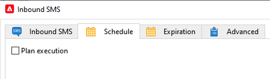

# Attività del flusso di lavoro SMS in entrata per l’infrastruttura mid-sourcing {#inbound-sms-wf}

## Limitazioni {#limitations}

* Questo caso d’uso si applica solo all’istanza Marketing in cui si raccolgono i dati inSMS dalle istanze Mid-sourcing.
* Non implementare questo caso d’uso nell’istanza di mid-sourcing.
* Solo un flusso di lavoro personalizzato per account di mid-sourcing esterno.

## Implementazione {#implementation}

1. Aggiungi un&#39;estensione allo schema `nms:inSMS` nell&#39;istanza Marketing. L&#39;estensione aggiungerà un nuovo attributo allo schema `nms:inSMS` e terrà traccia della chiave primaria del record inSMS proveniente dall&#39;istanza di mid-sourcing.

   ```xml
   <element img="nms:miniatures/mini-sms.png" label="Incoming SMS"
          labelSingular="Incoming SMS" name="inSMS">
   <dbindex name="midInSMSId" unique="false">
     <keyfield xpath="@extAccount-id"/>
     <keyfield xpath="@midInSMSId"/>
   </dbindex>
   
   <attribute label="External Mid SMS ID" name="midInSMSId" type="long"/>
   </element>
   ```

1. Per applicare le modifiche apportate agli schemi, avviare l&#39;Assistente all&#39;aggiornamento del database. L&#39;Assistente è accessibile tramite **Strumenti** > **Avanzate** > **Aggiorna struttura database**. Controlla se la struttura fisica del database corrisponde alla relativa descrizione logica ed esegue gli script di aggiornamento SQL. [Ulteriori informazioni](../../configuration/using/updating-the-database-structure.md)

1. Arresta ed esegui il backup del flusso di lavoro contenente l&#39;**attività SMS in entrata**.

   Eseguire il backup del puntatore di opzione corrispondente con il seguente formato `SMS_MO_INDEX_{internal name of the workflow}_{name of the insms workflow activity}_{internal name of the external account to access the mid}`.

[Ulteriori informazioni sul backup](../../production/using/backup.md)

1. (**FACOLTATIVO**) se si sta già utilizzando un&#39;attività Scheduler, aprire il flusso di lavoro e riconfigurarlo nel modo seguente:

   1. Replica le impostazioni correnti dalla scheda **Pianifica** dell&#39;attività **SMS in entrata** nell&#39;attività **Pianificazione** esterna.

   1. Disattiva l&#39;impostazione corrente nella scheda **Pianificazione** dell&#39;attività **SMS in entrata**.

      

1. Aggiorna lo script personalizzato **Inbound SMS**.

   Sostituisci il blocco seguente. Tieni presente che questo script può variare se in precedenza hai personalizzato questo codice.

   ```Javascript
   var lastSynchKey = getOption('SMS_MO_INDEX_WKF1105_inSmsUS_smsmidus');
   
   var smsId = application.getNewIds(1);
   
   xtk.session.Write(<inSMS xtkschema="nms:inSMS" _operation="insert"
       id={smsId}
       origin={smsMessage.origin}
       message={smsMessage.message}
       providerId={smsMessage.messageId}/>);
   
   return 2;
   ```

   Con il seguente nuovo script personalizzato per aggiornare i dati inSMS in base a una chiave composita, che combina la chiave primaria del record di mid-sourcing e l’ID account esterno del routing Marketing SMS.

   Segui i prerequisiti seguenti:

   * Immettere il valore reale per `<EXTERNAL_ACCOUNT_ID>`, ad esempio `var iExtAccountId=72733155`.
   * Assicurati di mantenere i seguenti elementi nello script personalizzato:
      * `_operation="insertOrUpdate"`
      * `_key="@midInSMSId,@extAccount-id"`
      * `midInSMSId={smsMessage.id}`
      * `inSms.@["extAccount-id"] = iExtAccountId;{}`

   ```Javascript
   // please enter real external account ID to replace <EXTERNAL ACCOUNT ID>
   var iExtAccountId=<EXTERNAL_ACCOUNT_ID>;
   
   var inSms = <inSMS xtkschema="nms:inSMS" _operation="insertOrUpdate"
   
               _key="@midInSMSId,@extAccount-id"
               midInSMSId={smsMessage.id}
               message={smsMessage.message}
               origin={smsMessage.origin}
               providerId={smsMessage.providerId}
               alias={smsMessage.alias}
               messageDate = {smsMessage.messageDate}
               receivalDate = {smsMessage.receivalDate}
               deliveryDate = {smsMessage.deliveryDate}
               largeAccount = {smsMessage.largeAccount}
               countryCode = {smsMessage.countryCode}
               operatorCode = {smsMessage.operatorCode}
               linkedSmsId={smsMessage.linkedSmsId}
               separator = {smsMessage.separator}/>
   
   inSms.@["extAccount-id"] = iExtAccountId;
   
   xtk.session.Write(inSms);
   
   return 2;
   ```

1. Aggiorna lo script di inizializzazione avanzata SMS in entrata con lo script seguente.

   Lo script ripristina il puntatore della chiave primaria a 24 ore prima. Il flusso di lavoro tenterà di rielaborare tutti i dati inSMS dall’istanza Mid-sourcing nelle 24 ore precedenti e di aggiungere eventuali dati mancanti all’istanza Marketing.

   ```Javascript
   // please enter real external account ID to replace <EXTERNAL_ACCOUNT_ID>
   // please enter real pointer option name to replace '<POINTER_OPTION_NAME>'
   // OPTION NAME format: SMS_MO_INDEX_{internal name of the workflow}_inSms_{internal name of the external account to access the mid}
   
   var queryDef = xtk.queryDef.create(
       <queryDef operation="getIfExists" schema="nms:inSMS" lineCount="1">
       <select>
           <node expr="@midInSMSId" alias="@midInSMSId"/>
       </select>
       <where>
           <condition expr="@midInSMSId != 0"/>
           <condition expr={"@created > SubHours(GetDate(), 24)"}/>
           <condition expr={"[@extAccount-id]=<EXTERNAL_ACCOUNT_ID>"}/>
       </where>
       <orderBy>
           <node expr="@midInSMSId"/>
       </orderBy>
       </queryDef>);
   
   var res = parseInt(queryDef.ExecuteQuery().@midInSMSId.toString());
   
   if( !isNaN(res) )
   setOption('<POINTER_OPTION_NAME>', res);
   ```

   >[!WARNING]
   >
   > * Se diversi account di indirizzamento SMS sono collegati alla stessa istanza Mid-sourcing, è consentito un solo flusso di lavoro per ogni istanza Mid-sourcing.
   > * Puoi utilizzare qualsiasi ID account esterno. Il ruolo della chiave esterna è mantenere l’integrità della riconciliazione dei dati in scenari che coinvolgono diversi server di mid-sourcing in cui l’ID SMS di mid-sourcing potrebbe essere identico in altre istanze di mid-sourcing.
   > * Se esistono più flussi di lavoro inSMS per istanza di mid-sourcing, può verificarsi la duplicazione dei dati in quanto l’ID SMS di mid-sourcing rimane costante mentre gli ID dell’account esterno variano.

1. Salva e riavvia il flusso di lavoro.
