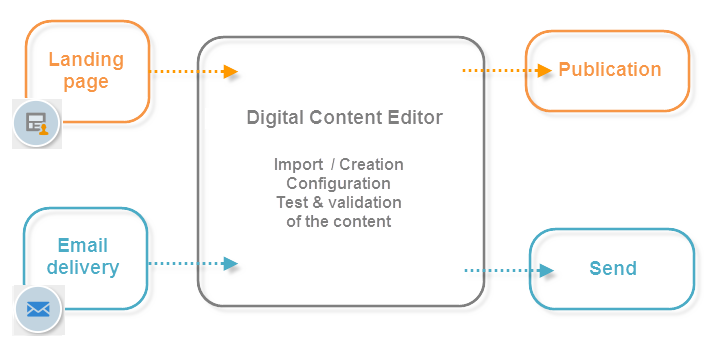

# Introduzione all’editor di Campaign HTML{#about-campaign-html-editor}

**Digital Content Editor (DCE)** è un editor di contenuti HTML che consente di creare facilmente contenuti e modelli in formato HTML in Adobe Campaign.

Con Digital Content Editor è possibile inserire e formattare elementi di pagina e mappare campi di database con elementi di una pagina HTML. Questo editor è disponibile quando crei una pagina per un’applicazione web o quando crei consegne basate su un modello DCE.

>[!NOTE]
>
>Se devi aggiungere codice JavaScript lato server, utilizza i blocchi di personalizzazione. Consulta la [documentazione di Campaign v8](https://experienceleague.adobe.com/docs/campaign/campaign-v8/send/personalize/personalization-blocks.html?lang=it){target="_blank"}.

>[!CAUTION]
>
>È necessario fare riferimento a tutte le risorse esterne con un URL HTTPS.

## Passaggi chiave per utilizzare Digital Content Editor {#content-editor-general-operation}

Questa sezione descrive i passaggi chiave per modificare e caricare contenuti modificati con il DCE, nel contesto di una progettazione di applicazioni web e consegne.

Il funzionamento generale è il seguente:

Per creare una **applicazione Web** semplice, è necessario:

1. Crea un&#39;applicazione Web - [Ulteriori informazioni](creating-a-landing-page.md)
1. Seleziona contenuto esistente o crea contenuto da un modello standard - [Ulteriori informazioni](template-management.md)
1. Modifica e configura il contenuto - [Ulteriori informazioni](editing-content.md)
1. Pubblica applicazione Web - [Ulteriori informazioni](creating-a-landing-page.md#step-3---publishing-content)

>[!NOTE]
>
>Un esempio completo di implementazione nel contesto di un&#39;applicazione Web è disponibile in [questa sezione](creating-a-landing-page.md).

Per creare una **consegna e-mail**, è necessario:

1. Creare una consegna da un modello DCE - [Ulteriori informazioni](use-case-creating-an-email-delivery.md)
1. Seleziona un contenuto esistente o crea contenuto da un [modello standard](template-management.md)
1. Modificare e configurare i contenuti online
1. Invia la consegna - Ulteriori informazioni sono disponibili nella [documentazione di Campaign v8](https://experienceleague.adobe.com/docs/campaign/campaign-v8/send/create-message.html?lang=it){target="_blank"}

>[!NOTE]
>
>Un esempio completo di implementazione nel contesto di una consegna e-mail è disponibile in [questo caso d&#39;uso](use-case-creating-an-email-delivery.md).
