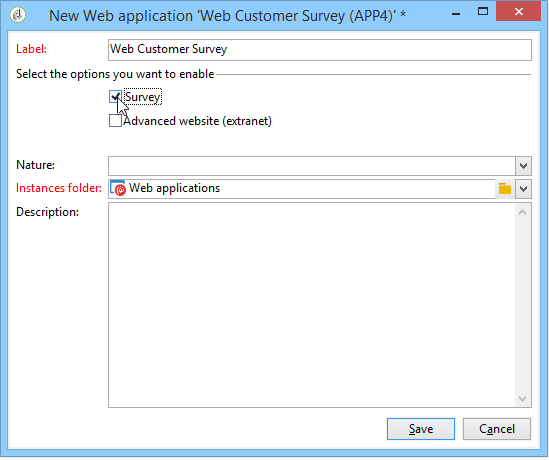

# Informazioni sulle applicazioni Web{#about-web-applications}

Adobe Campaign consente di creare e pubblicare applicazioni Web dinamiche e interattive con dati provenienti dal database e contenuti adattati ai diritti dell&#39;utente connesso.

È possibile creare pagine, ad esempio un modulo di modifica su una rete extranet, o moduli di notifica, inclusi i dati del database con tabelle, grafici, moduli di input e così via. Questa funzionalità consente di progettare e pubblicare pagine Web in cui gli utenti possono cercare o immettere informazioni.

Può trattarsi di un modulo di iscrizione contenente dati precaricati con informazioni contenute nel database Adobe Campaign, come illustrato di seguito:

Questo capitolo fornisce una panoramica della gestione delle applicazioni Web.

>[!NOTE]
>
>Per informazioni su come ottimizzare la sicurezza per le applicazioni Web, fare riferimento all&#39;elenco [di controllo](https://helpx.adobe.com/campaign/kb/acc-security.html) Sicurezza e privacy.

>[!CAUTION]
>
>Per motivi di privacy, si consiglia di utilizzare HTTPS per tutte le risorse esterne.

## Ambito applicazione Web {#web-application-scope}

Le applicazioni Web in Adobe Campaign consentono di accedere alle seguenti funzionalità:

* Creazione di moduli con più pagine. For more on this, refer to this [page](../../web/using/about-web-forms.md).
* Gestione multilingue dei sondaggi con uno strumento di traduzione integrato. For more on this, refer to this [page](../../web/using/translating-a-web-application.md).
* Interfaccia grafica per la gestione delle pagine, layout a più colonne. For more on this, refer to this [page](../../web/using/designing-a-web-application.md).
* Personalizzazione del rendering e posizione del campo. For more on this, refer to this [page](../../web/using/editing-content.md#adding-personalization-content).
* Visualizzazione condizionale dei campi del sondaggio in base alle risposte. For more on this, refer to this [page](../../web/using/form-rendering.md#defining-fields-conditional-display).
* Visualizzazione casuale delle domande. For more on this, refer to this [page](../../web/using/building-a-survey.md#adding-questions).
* Visualizzazione della pagina condizionale. For more on this, refer to this [page](../../web/using/defining-web-forms-page-sequencing.md#conditional-page-display).
* Controllo delle informazioni prima della convalida in base al tipo di dati previsto (numero, indirizzo e-mail, data, ecc.) e i campi obbligatori. For more on this, refer to this [page](../../web/using/form-rendering.md#defining-control-settings).
* Inviti e-mail o notifiche. For more on this, refer to this [page](../../web/using/publishing-a-web-form.md#delivering-a-form-via-email).
* Personalizzazione dei messaggi di errore e di fine. For more on this, refer to this [page](../../web/using/defining-web-forms-properties.md#setting-up-an-error-page).
* Utilizzo di immagini, video, collegamenti ipertestuali, captcha, ecc. For more on this, refer to this [page](../../web/using/editing-content.md).
* Monitoraggio delle risposte in tempo reale. For more on this, refer to this [page](../../web/using/publish--track-and-use-collected-data.md#response-tracking).

Il modulo di creazione **sondaggio** opzionale offre le seguenti funzionalità aggiuntive:

* Estensione dinamica del database: creazione di risposte non incluse nel modello dati iniziale. For more on this, refer to this [page](../../web/using/managing-answers.md#storing-collected-answers).
* Generazione di rapporti dedicati. For more on this, refer to this [page](../../web/using/publish--track-and-use-collected-data.md#reports-on-surveys).

Rispetto alle applicazioni Web, i sondaggi hanno un&#39;interfaccia grafica semplificata con un numero ridotto di controlli di modifica.

>[!NOTE]
>
>Le indagini sono dettagliate in [questa sezione](../../web/using/about-surveys.md).
>
>Le funzionalità generali dei moduli Web in Adobe Campaign sono descritte in [questa sezione](../../web/using/about-web-forms.md).

## Implementazione applicazione Web {#web-application-implementation}

Per creare e pubblicare un&#39;applicazione Web, è necessario:

1. Creare il contenuto (campi, elenchi, tabelle, grafici, ecc.).

   È inoltre possibile visualizzare la sezione con i dettagli dei campi disponibili per i moduli: tutti questi campi sono disponibili anche per le applicazioni Web. Queste informazioni sono disponibili in [questa pagina](../../web/using/adding-fields-to-a-web-form.md).

1. Se necessario, potete aggiungere passaggi di precaricamento, test e salvataggio e configurare il sistema di controllo dell&#39;accesso (principalmente all&#39;interno del framework di una pubblicazione extranet).
1. Pubblicazione dell&#39;applicazione Web per renderla disponibile su una rete extranet o in Adobe Campaign.

## Configurazione iniziale applicazione Web {#web-application-initial-configuration}

L&#39;applicazione Web viene creata tramite il **[!UICONTROL Web Applications]** collegamento nelle **[!UICONTROL Campaigns]** schede e **[!UICONTROL Profiles and targets]** .

Le applicazioni Web sono memorizzate nel **[!UICONTROL Resources > Online > Web Applications]** nodo della struttura di Adobe Campaign. Le configurazioni sono suddivise nelle cartelle seguenti:

* **[!UICONTROL Administration > Configuration > Form renderings]**: contiene i modelli di rendering per la presentazione del modulo Web (applicazioni e sondaggi). Il modello consente di generare il modulo. Utilizza anche un foglio di stile CSS. Questo foglio di stile può essere sovraccaricato a livello di modello. For more on this, refer to [this page](../../web/using/form-rendering.md#selecting-the-form-rendering-template).
* **[!UICONTROL Resources > Templates > Web application templates]**: contiene modelli di modulo. Per creare un modulo o un&#39;applicazione Web, è necessario iniziare da un modello.

## Modelli di applicazioni Web {#web-application-templates}

Per impostazione predefinita, Adobe Campaign fornisce un modello per l&#39;applicazione Web disponibile.

>[!NOTE]
>
>È possibile convertire un&#39;applicazione Web esistente in un modello. A tale scopo, selezionare il modulo e fare clic con il pulsante destro del mouse. Selezionare **[!UICONTROL Actions > Save as template...]**.

Puoi creare nuovi modelli tramite il **[!UICONTROL Resources > Templates > Web Application templates]** nodo della struttura di Adobe Campaign.

La procedura guidata di creazione consente di selezionare le opzioni che si desidera abilitare, come illustrato di seguito.

>[!CAUTION]
>
>Le applicazioni disponibili dipendono dalle opzioni e dai moduli. Controllare il contratto di licenza.

