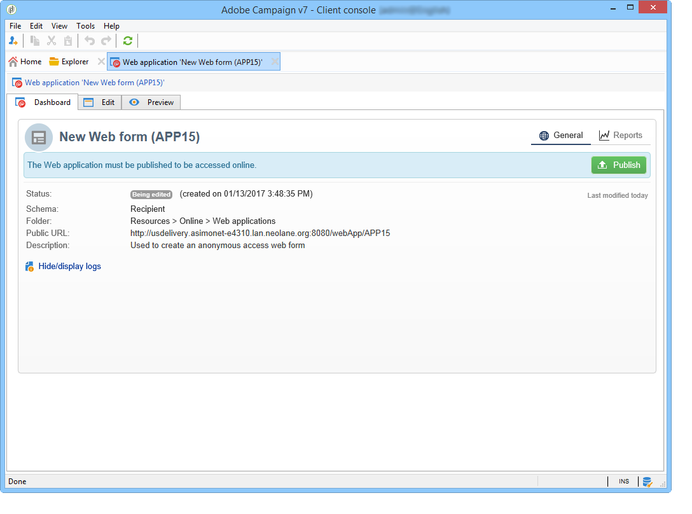
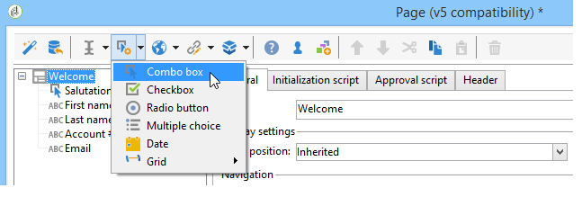

# Introduzione ai moduli web{#about-web-forms}

Adobe Campaign integra un modulo grafico per la definizione e la pubblicazione di moduli web, al fine di creare pagine contenenti campi di input e di selezione e che possono includere dati nel database. In questo modo è possibile progettare e pubblicare pagine Web a cui gli utenti possono accedere per visualizzare o immettere informazioni.

Questo capitolo descrive la creazione e la gestione di moduli web, le modalità di gestione di campi e pagine e le modalità di archiviazione e salvataggio.

>[!CAUTION]
>
>Per motivi di privacy, consigliamo di utilizzare HTTPS per tutte le risorse esterne.

## Passaggi per la creazione di un modulo web {#steps-for-creating-a-web-form}

Questo capitolo descrive i passaggi necessari per progettare un **webForm** digita il modulo in Adobe Campaign, nonché le opzioni e le configurazioni disponibili. Adobe Campaign consente di rendere questo modulo web disponibile agli utenti, nonché di raccogliere e archiviare le risposte nel database.

>[!CAUTION]
>
>Durante la configurazione di applicazioni web e moduli web, è necessario un minimo di risoluzione verticale di 900 pixel (ad esempio, 1600x900).

I moduli Web sono accessibili tramite il menu Applicazioni Web del **Campagne** scheda. Nella struttura Adobe Campaign, sono raggruppati sotto **[!UICONTROL Resources > Online > Web Applications]** nodo.

Per creare un modulo Web, fare clic su **[!UICONTROL Create]** sopra l&#39;elenco delle applicazioni Web.

Selezionare il modello di modulo Web ( **[!UICONTROL newWebForm]** per impostazione predefinita).

Verrà visualizzata la dashboard del modulo.

Il **[!UICONTROL Edit]** consente di creare il contenuto.

Per definire la configurazione e il contenuto del modulo Web, attenersi alla procedura descritta di seguito.

* Inizia creando le pagine e i controlli richiesti: campi di input, elenchi a discesa, contenuto HTML, ecc.

  Questo passaggio è descritto di seguito.

* Definire la sequenza di pagine e condizionare la visualizzazione.

  Questo passaggio è descritto in [Definizione della sequenza di pagine dei moduli web](defining-web-forms-page-sequencing.md).

* Traduci il contenuto, se necessario.

  Questo passaggio è descritto in [Traduzione di un modulo web](translating-a-web-form.md).

## Informazioni sulla progettazione di moduli web {#about-web-forms-designing}

Le pagine del modulo vengono create tramite un editor specifico che consente di definire e configurare aree di input (testo) e campi di selezione (elenchi, caselle di controllo e così via) ed elementi statici (immagini, contenuti HTLM, ecc.). Possono essere raggruppati in contenitori e il loro layout può essere modificato in base alle tue esigenze (per ulteriori informazioni, consulta [Creazione di contenitori](defining-web-forms-layout.md#creating-containers)).

Nelle sezioni seguenti viene descritto come definire il contenuto e il layout delle schermate dei moduli:

* [Aggiunta di campi a un modulo web](adding-fields-to-a-web-form.md),
* [Inserimento di contenuto HTML](static-elements-in-a-web-form.md#inserting-html-content),
* [Elementi statici in un modulo web](static-elements-in-a-web-form.md),
* [Definizione del layout dei moduli web](defining-web-forms-layout.md).

>[!NOTE]
>
>* Durante la progettazione della pagina, è possibile visualizzare il rendering finale nel **[!UICONTROL Preview]** scheda. Per visualizzare le modifiche, salvare prima il modulo. Eventuali errori vengono visualizzati in **[!UICONTROL Log]** scheda.
>* Per assicurarsi che la visualizzazione delle pagine e l&#39;archiviazione delle informazioni avvengano nella sequenza appropriata, attivare la modalità di debug nel modulo Web. Per eseguire questa operazione, passare al **[!UICONTROL Preview]** scheda secondaria e controlla **[!UICONTROL Enable debug mode]** box: tutte le informazioni raccolte e i possibili errori di esecuzione vengono visualizzati nella parte inferiore di ogni pagina.
>

### Utilizzo delle icone nella barra degli strumenti {#using-the-icons-in-the-toolbar}

È inoltre possibile utilizzare le icone nella barra degli strumenti o fare clic con il pulsante destro del mouse per inserire un&#39;area di input.

In questo caso, inizia selezionando il tipo di campo da aggiungere e la modalità di archiviazione delle risposte.

Clic **[!UICONTROL Ok]** per approvare la selezione.

