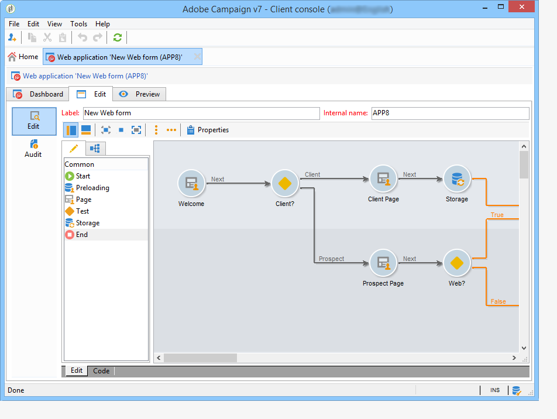

# Introduzione ai moduli web{#about-web-forms}

Adobe Campaign integra un modulo grafico per definire e pubblicare i moduli Web, al fine di creare pagine contenenti campi di input e di selezione e che possono includere dati nel database. Consente di progettare e pubblicare pagine Web a cui gli utenti possono accedere per visualizzare o immettere informazioni.

Questo capitolo descrive la creazione e la gestione dei moduli web, le modalità di gestione dei campi e delle pagine, nonché le modalità di archiviazione e salvataggio.

>[!CAUTION]
>
>Per motivi di privacy, si consiglia di utilizzare HTTPS per tutte le risorse esterne.

## Passaggi per la creazione di un modulo web {#steps-for-creating-a-web-form}

Questo capitolo descrive i passaggi necessari per la progettazione di un modulo di tipo **webForm** in Adobe Campaign, nonché le opzioni e le configurazioni disponibili. Adobe Campaign consente di rendere questo modulo Web disponibile agli utenti, nonché di raccogliere e archiviare le risposte nel database.

>[!CAUTION]
>
>Durante la configurazione di applicazioni web e moduli web, è necessaria una risoluzione verticale minima di 900 pixel (ad esempio: 1600x900).

I moduli web sono accessibili tramite il menu Applicazioni web della scheda **Campagne** . Nella struttura di Adobe Campaign, sono raggruppati sotto il nodo **[!UICONTROL Resources > Online > Web Applications]**.

Per creare un modulo Web, fare clic sul pulsante **[!UICONTROL Create]** sopra l’elenco delle applicazioni Web.

Selezionare il modello di modulo Web ( **[!UICONTROL newWebForm]** per impostazione predefinita).

Verrà visualizzato il dashboard del modulo.

La scheda **[!UICONTROL Edit]** ti consente di creare il contenuto.

Per definire la configurazione e il contenuto del modulo Web, attenersi alla seguente procedura:

* Inizia creando le pagine e i controlli richiesti: campi di input, elenchi a discesa, contenuto HTML, ecc.

   Questo passaggio è descritto di seguito.

* Definisci la sequenza delle pagine e condiziona la visualizzazione.

   Questo passaggio è descritto in [Definizione della sequenza di pagine dei moduli web](defining-web-forms-page-sequencing.md).

* Traduci il contenuto se necessario.

   Questo passaggio è descritto in [Traduzione di un modulo web](translating-a-web-form.md).

## Informazioni sulla progettazione dei moduli web {#about-web-forms-designing}

Le pagine del modulo vengono create tramite un editor specifico che consente di definire e configurare aree di input (testo), campi di selezione (elenchi, caselle di controllo, ecc.) ed elementi statici (immagini, contenuti HTML, ecc.). Possono essere raggruppati in contenitori e il loro layout viene modificato in base alle tue esigenze (per ulteriori informazioni, consulta [Creazione di contenitori](defining-web-forms-layout.md#creating-containers)).

Nelle sezioni seguenti viene illustrato come definire il contenuto e il layout delle schermate dei moduli:

* [Aggiunta di campi a un modulo web](adding-fields-to-a-web-form.md),
* [Inserimento di contenuto](static-elements-in-a-web-form.md#inserting-html-content) HTML,
* [Elementi statici in un modulo web](static-elements-in-a-web-form.md),
* [Definizione del layout dei moduli web](defining-web-forms-layout.md).

>[!NOTE]
>
>* Durante la progettazione della pagina, puoi visualizzare il rendering finale nella scheda **[!UICONTROL Preview]** . Per visualizzare le modifiche, salvare prima il modulo. Gli eventuali errori vengono visualizzati nella scheda **[!UICONTROL Log]** .
>* Per verificare che la visualizzazione della pagina e l&#39;archiviazione delle informazioni siano presenti nella sequenza appropriata, attivare la modalità di debug nel modulo Web. A questo scopo, passa alla sottoscheda **[!UICONTROL Preview]** e seleziona la casella **[!UICONTROL Enable debug mode]** : tutte le informazioni raccolte e gli eventuali errori di esecuzione verranno visualizzati nella parte inferiore di ogni pagina.

>

### Utilizzo delle icone nella barra degli strumenti {#using-the-icons-in-the-toolbar}

Per inserire una zona di input, puoi anche usare le icone nella barra degli strumenti o fare clic con il pulsante destro del mouse.

In questo caso, inizia selezionando il tipo di campo da aggiungere e la modalità di archiviazione delle risposte.

Fai clic su **[!UICONTROL Ok]** per approvare la selezione.

