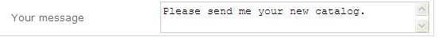
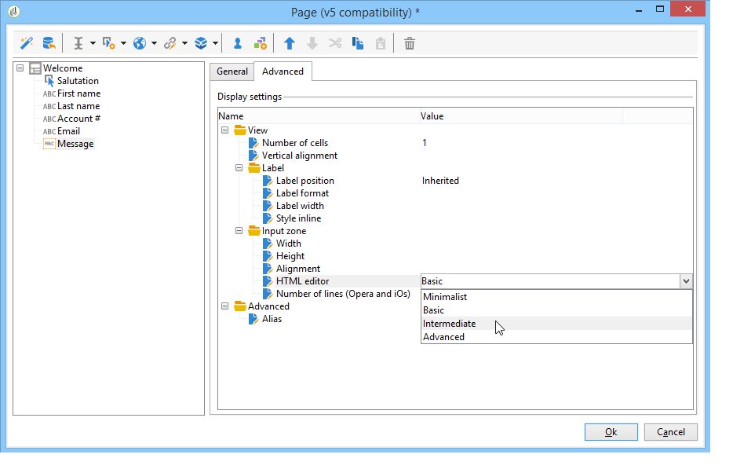
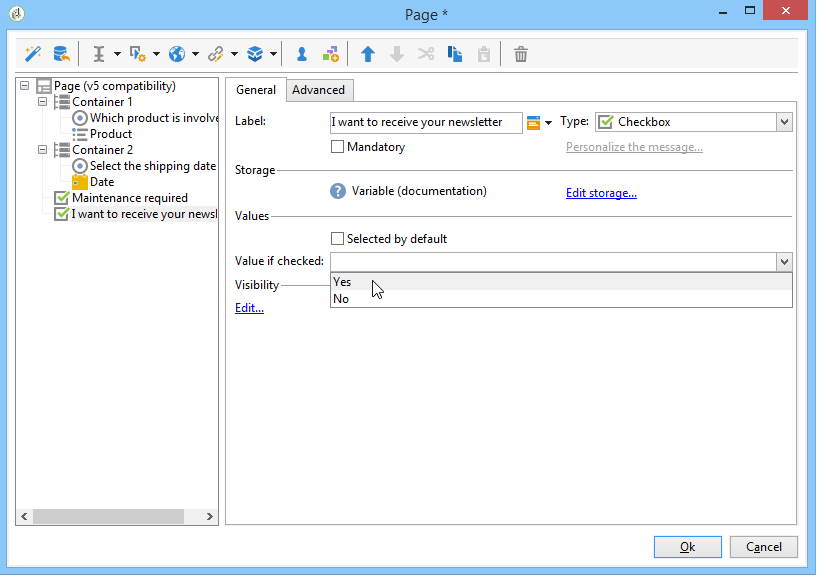
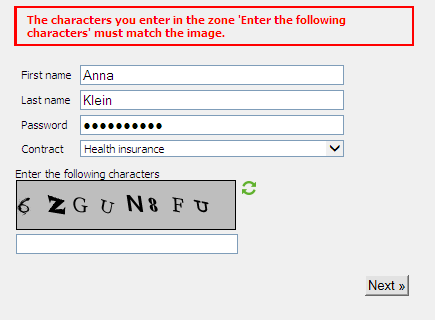

# Aggiungere campi a un modulo web{#adding-fields-to-a-web-form}

In un modulo Web, i campi consentono agli utenti di immettere informazioni e selezionare opzioni. I moduli web possono offrire campi di input, campi di selezione e contenuto statico e avanzato (captcha, abbonamenti, ecc.).

Quando si utilizza la procedura guidata per aggiungere campi, il tipo di campo viene rilevato automaticamente in base al campo o alla variabile di archiviazione selezionata. Puoi modificarlo utilizzando **[!UICONTROL Type]** nella casella a discesa **[!UICONTROL General]** scheda.

Quando utilizzi i pulsanti nella barra degli strumenti, seleziona il tipo di campo da aggiungere.

Sono disponibili i seguenti tipi di campo:

* Input testo/numero. Consulta [Aggiunta di campi di input](#adding-input-fields).
* Selezione di un elenco a discesa. Consulta [Aggiunta di elenchi a discesa](#adding-drop-down-lists).
* Scelte multiple tramite caselle di controllo. Consulta [Aggiunta di caselle di controllo](#adding-checkboxes).
* Selezione esclusiva tramite pulsanti di scelta. Consulta [Aggiunta di pulsanti di scelta](#adding-radio-buttons).
* Votare in una griglia di opzioni. Consulta [Aggiunta di griglie](#adding-grids).
* Numeri e date. Consulta [Aggiunta di date e numeri](#adding-dates-and-numbers).
* Iscrizione/annullamento dell’abbonamento a un servizio di informazioni. Consulta [Caselle di controllo delle sottoscrizioni](#subscription-checkboxes).
* Convalida Captcha. Consulta [Inserimento di un captcha](#inserting-a-captcha).
* Pulsante Scarica. [Caricamento di file](#uploading-a-file).
* Costante nascosta. Consulta [Inserire una costante nascosta](#inserting-a-hidden-constant).

Specifica la modalità di archiviazione della risposta: aggiorna un campo nel database (memorizza solo l’ultimo valore salvato) o archivia una variabile (la risposta non è memorizzata). Per ulteriori informazioni, consulta [Campi di archiviazione delle risposte](web-forms-answers.md#response-storage-fields).

>[!NOTE]
>
>Per impostazione predefinita, il campo viene inserito nella parte inferiore della struttura corrente. Utilizza le frecce nella barra degli strumenti per spostarla verso l’alto o verso il basso.

## Creazione guidata campi {#field-creation-wizard}

Per ogni pagina del modulo è possibile aggiungere un campo tramite il primo pulsante nella barra degli strumenti. Per eseguire questa operazione, passare al **[!UICONTROL Add using the wizard]** menu.

Selezionare il tipo di campo che si desidera creare: è possibile scegliere di aggiungere un campo nel database, una variabile o di importare un gruppo di campi creati in un altro modulo e raccolti in un contenitore.

Clic **[!UICONTROL Next]** e seleziona il campo o la variabile di archiviazione o il contenitore da importare.

Clic **[!UICONTROL Finish]** per inserire il campo selezionato nella pagina.

## Aggiunta di campi di input {#adding-input-fields}

Per aggiungere un campo di input, fare clic su **[!UICONTROL Input control]** e scegliere il tipo di campo da aggiungere.

### Tipi di campi di input {#types-of-input-fields}

In una pagina modulo è possibile inserire cinque diversi tipi di campi di testo:

* **Testo**: consente all’utente di immettere un testo su una riga.

  

* **Numero**: consente all’utente di immettere un numero su una riga. per ulteriori informazioni, consulta [Aggiunta di numeri](#adding-numbers).

  Quando la pagina viene approvata, il contenuto del campo viene controllato per verificare che il valore immesso sia compatibile con il campo. Per ulteriori informazioni, consulta [Definizione delle impostazioni di controllo](form-rendering.md#defining-control-settings).

* **Password**: consente all’utente di immettere testo su una singola riga. Durante l&#39;immissione del testo, i caratteri vengono sostituiti da punti:

  

  >[!CAUTION]
  >
  >Le password vengono archiviate non crittografate nel database.

* **Testo su più righe**: consente all’utente di immettere testo su più righe.

  

  >[!CAUTION]
  >
  >I campi di testo su più righe sono campi specifici che possono contenere ritorni a capo. Il relativo spazio di archiviazione deve essere associato a un campo mappato su un elemento XML, non a un attributo XML.
  >   

* **Testo su più righe arricchito**: consente all’utente di immettere il testo con un layout da memorizzare in formato HTML.

  

  Puoi selezionare il tipo di editor offerto agli utenti. A questo scopo, utilizza la casella a discesa del **[!UICONTROL HTML editor]** campo in **[!UICONTROL Advanced]** scheda.

  

  Il numero di icone visualizzate varia a seconda del tipo di editor. Per un **[!UICONTROL Advanced]** nell’editor, il rendering sarà il seguente:

  

### Configurare i campi di input {#configure-input-fields}

I campi di input sono tutti configurati in base alla stessa modalità, utilizzando le seguenti opzioni:

Il **[!UICONTROL General]** scheda consente di immettere il nome del campo e, se necessario, di attribuirvi un valore predefinito.

La modalità di archiviazione di risposta può essere modificata tramite **[!UICONTROL Edit storage...]** collegamento. I valori possono essere memorizzati in un campo esistente del database oppure è possibile scegliere di non salvare le informazioni nel database utilizzando una variabile locale.

>[!NOTE]
>
>Le modalità di archiviazione sono descritte in [Campi di archiviazione delle risposte](web-forms-answers.md#response-storage-fields)

Il **[!UICONTROL Advanced]** Questa scheda ti consente di definire i parametri di visualizzazione per il campo (posizione delle etichette, allineamento, ecc.). Consulta [Definizione del layout dei moduli web](defining-web-forms-layout.md).

## Aggiunta di elenchi a discesa {#adding-drop-down-lists}

È possibile inserire un elenco a discesa in una pagina del sondaggio. In questo modo l’utente può selezionare uno dei valori offerti in un menu a discesa.

Per aggiungere una casella di riepilogo a discesa a una pagina del modulo, fare clic sul pulsante **[!UICONTROL Selection controls > Drop-down list]** nella barra degli strumenti dell’editor pagina.

Selezionare la modalità di archiviazione delle risposte e confermare la scelta.

Definisci le etichette e i valori dell’elenco nella sezione inferiore della sezione **[!UICONTROL General]** scheda. Se le informazioni sono memorizzate in un campo esistente del database e si tratta di un campo di enumerazione, è possibile compilare automaticamente i valori facendo clic su **[!UICONTROL Initialize the list of values from the database]** , come illustrato di seguito:

>[!NOTE]
>
>Utilizzare le frecce a destra dell&#39;elenco di valori per modificare la sequenza.

Se i dati vengono memorizzati in una tabella collegata, è possibile selezionare il campo in cui vengono salvati i valori da suggerire nell&#39;elenco. Ad esempio, se si seleziona la tabella dei paesi, fare clic su **[!UICONTROL Initialize the list of values from the database...]** e selezionare il campo desiderato.

Quindi, fai clic su **[!UICONTROL Load]** collegamento per recuperare i valori:

>[!CAUTION]
>
>Ripeti questa operazione ogni volta che l’elenco viene aggiornato per aggiornare i valori dell’offerta.

## Aggiunta di caselle di controllo {#adding-checkboxes}

Per consentire all’utente di selezionare un’opzione, è necessario utilizzare una casella di controllo.

Per aggiungere una casella di controllo a un modulo, fare clic sul pulsante **[!UICONTROL Selection controls > Checkbox...]** nella barra degli strumenti dell’editor pagina.

Selezionare la modalità di archiviazione delle risposte e confermare la scelta.

Inserisci l’etichetta della casella nel **[!UICONTROL Label]** campo del **[!UICONTROL General]** scheda.

Una casella di controllo consente di assegnare un valore al campo di memorizzazione (o al valore) a seconda che la casella sia selezionata o meno. Il **[!UICONTROL Values]** sezione consente di immettere il valore da assegnare se la casella è selezionata (nel campo **[!UICONTROL Value]** e il valore da assegnare se non è selezionato (nel campo **[!UICONTROL Empty value]** ). Questi valori dipendono dal formato di archiviazione dei dati.

Se il campo di memorizzazione (o variabile) è booleano, il valore da assegnare se la casella non è selezionata verrà dedotto automaticamente. In questo caso, solo il **[!UICONTROL Value if checked]** è disponibile, come illustrato di seguito:

## Esempio: assegnare un valore a un campo se è selezionata una casella {#example--assign-a-value-to-a-field-if-a-box-is-checked}

Si desidera inserire una casella di controllo in un modulo per inviare una richiesta di manutenzione, come illustrato di seguito:

Le informazioni verranno caricate nel database e in un campo esistente (in questo caso, il **[!UICONTROL Comment]** field):

Se è selezionata la casella &quot;Manutenzione richiesta&quot;, la **[!UICONTROL Comment]** La colonna conterrà &quot;Manutenzione richiesta&quot;. Se la casella non è selezionata, nella colonna viene visualizzato &quot;Manutenzione non richiesta&quot;. Per ottenere questo risultato, applicare la seguente configurazione alla casella di controllo nella pagina del modulo:

## Aggiunta di pulsanti di scelta {#adding-radio-buttons}

I pulsanti di scelta consentono di offrire all&#39;utente una serie di opzioni esclusive tra cui scegliere. Valori diversi per lo stesso campo.

È possibile creare pulsanti di scelta singolarmente (pulsanti unitari) o tramite un elenco a scelta multipla, ma poiché il punto dei pulsanti di scelta è quello di selezionare un&#39;opzione o un&#39;altra, creeremo sempre almeno una coppia di pulsanti di scelta, mai un solo pulsante.

>[!CAUTION]
>
>Per rendere obbligatoria la selezione, è necessario creare un elenco a scelta multipla.

### Aggiungi pulsanti singoli {#add-single-buttons}

Per aggiungere un pulsante di scelta a una pagina del modulo, passare alla **[!UICONTROL Selection controls > Radio button]** nella barra degli strumenti dell’editor pagina e scegli una modalità di archiviazione.

I pulsanti di scelta sono configurati in modo simile alle caselle di controllo (vedere [Aggiunta di caselle di controllo](#adding-checkboxes)). Tuttavia, se l’opzione non è selezionata, non viene assegnato alcun valore. Affinché diversi pulsanti siano interdipendenti, ovvero se ne seleziona uno deseleziona automaticamente gli altri, è necessario memorizzarli nello stesso campo. Se non sono memorizzate nel database, è necessario utilizzare la stessa variabile locale per l&#39;archiviazione temporanea. Consulta [Campi di archiviazione delle risposte](web-forms-answers.md#response-storage-fields).

### Aggiungi un elenco di pulsanti {#add-a-list-of-buttons}

Per aggiungere pulsanti di scelta tramite un elenco, passare alla **[!UICONTROL Selection controls>Multiple choice]** nella barra degli strumenti dell’editor pagina.

Aggiungi tutti i pulsanti di scelta disponibili. Il vantaggio di questa funzione è che puoi importare valori da un campo esistente (in caso di campo dettagliato) e consentire all’utente di scegliere una delle opzioni. Tuttavia, la disposizione dei pulsanti è meno flessibile.

>[!NOTE]
>
>Non è possibile abilitare la selezione multipla in un&#39;applicazione Web.
>È possibile, tuttavia, inserire un **[!UICONTROL Multiple choice]** digitare il campo in un&#39;applicazione Web, ma questo non consente all&#39;utente di selezionare più valori.

## Aggiunta di griglie {#adding-grids}

Le griglie vengono utilizzate per progettare pagine di voto nelle applicazioni Web. In questo modo è possibile offrire elenchi di pulsanti di scelta per rispondere a sondaggi o moduli Web di tipo valutazione, come illustrato di seguito:

Per utilizzare questo tipo di elemento in un modulo, creare una griglia semplice e aggiungere una riga per ogni elemento da valutare.

Il numero di pulsanti di scelta in ogni riga della griglia corrisponde al numero di valori definiti nella griglia semplice.

È possibile selezionare una sola opzione per linea della griglia.

>[!NOTE]
>
>Nel nostro esempio, l’etichetta della griglia è nascosta. Per eseguire questa operazione, passare al **[!UICONTROL Advanced]** , la scheda **[!UICONTROL Label position]** visualizzazione definita come **[!UICONTROL Hidden]** . Consulta [Definizione della posizione delle etichette](defining-web-forms-layout.md#defining-the-position-of-labels).

## Aggiunta di date e numeri {#adding-dates-and-numbers}

Il contenuto dei campi modulo può essere formattato in modo da corrispondere ai dati memorizzati nel database o da soddisfare un requisito particolare. È possibile creare campi appropriati per l&#39;immissione di numeri e date.

### Aggiunta di date {#adding-dates}

Per consentire all&#39;utente di immettere una data in una pagina del modulo, aggiungere un campo di input e selezionare il tipo **[!UICONTROL Date...]**.

Immetti un’etichetta per il campo e configura la modalità di archiviazione dati.

Nella sezione inferiore della finestra è possibile selezionare i formati di data e ora per i valori memorizzati in questo campo.

Puoi anche scegliere di non visualizzare la data (o l’ora).

Le date possono essere selezionate tramite un calendario o caselle a discesa. Puoi anche immetterli direttamente nel campo, ma devono corrispondere al formato specificato nella schermata precedente.

>[!NOTE]
>
>Per impostazione predefinita, le date utilizzate nei moduli vengono immesse tramite un calendario. Per i moduli multilingue, verifica che i calendari siano disponibili in tutte le lingue utilizzate. Consulta [Traduzione di un modulo web](translating-a-web-form.md).

Tuttavia, in alcuni casi (ad esempio per l’immissione delle date di nascita) può essere più semplice utilizzare gli elenchi a discesa.

A questo scopo, fai clic su **[!UICONTROL Advanced]** e scegliere la modalità di input utilizzando **[!UICONTROL Drop-down lists]**.

Puoi quindi impostare i limiti per i valori offerti nell’elenco.

### Aggiunta di numeri {#adding-numbers}

È possibile creare campi appropriati per l&#39;immissione di numeri.

In un campo numerico, l’utente può immettere solo numeri. Il controllo della voce viene applicato automaticamente quando la pagina viene approvata.

A seconda del campo in cui i dati vengono memorizzati nel database, è possibile applicare una formattazione speciale o determinate restrizioni. È inoltre possibile specificare valori massimi e minimi. Questo tipo di campo è configurato come segue:

Il valore predefinito è il valore visualizzato nel campo al momento della pubblicazione del modulo. Può essere corretto dall’utente.

È possibile aggiungere un prefisso e/o un suffisso al campo numerico tramite **[!UICONTROL Advanced]** come mostrato di seguito:

Nel modulo, il rendering sarà il seguente:

## Caselle di controllo delle sottoscrizioni {#subscription-checkboxes}

È possibile aggiungere controlli per consentire agli utenti di abbonarsi o annullare l’abbonamento a uno o più servizi di informazione (newsletter, avvisi, notifiche in tempo reale, ecc.). Per abbonarti, l’utente controlla il servizio corrispondente.

Per creare una casella di controllo di sottoscrizione, fare clic su **[!UICONTROL Advanced controls>Subscription]**.

Indicare l&#39;etichetta della casella di controllo e selezionare il servizio informazioni interessato utilizzando **[!UICONTROL Service]** a discesa.

>[!NOTE]
>
>I servizi di informazione sono descritti in dettaglio [questa pagina](../../delivery/using/managing-subscriptions.md).

L’utente si iscrive al servizio selezionando l’opzione pertinente.

>[!CAUTION]
>
>Se l’utente è già abbonato a un servizio di informazioni e la casella collegata a questo servizio non è selezionata al momento dell’approvazione del modulo, l’abbonamento verrà annullato.

## Inserimento di un captcha {#inserting-a-captcha}

Scopo della **captcha** per evitare l&#39;utilizzo fraudolento dei moduli Web.

>[!CAUTION]
>
>Se il modulo contiene più pagine, il Captcha deve sempre essere posizionato sull’ultima pagina, immediatamente prima della casella di archiviazione, per evitare che le misure di sicurezza vengano eluse.

Per inserire un Captcha in un modulo, fai clic sul primo pulsante sulla barra degli strumenti e seleziona **[!UICONTROL Advanced controls>Captcha]**.

Immetti l’etichetta del campo. Questa etichetta verrà visualizzata davanti all’area di visualizzazione Captcha. È possibile modificare la posizione di questa etichetta nel **[!UICONTROL Advanced]** scheda.

>[!NOTE]
>
>Per **[!UICONTROL captcha]** controlli di tipo, non è necessario indicare un campo o una variabile di archiviazione.

Il Captcha viene inserito nella pagina con un campo di input posizionato sotto l’elemento visivo. Questi due elementi sono inseparabili e sono considerati come un singolo elemento ai fini del layout di pagina (occupano una singola cella).

Quando la pagina viene confermata, il campo di input viene visualizzato in rosso se il contenuto del Captcha non è stato immesso correttamente.

Puoi creare un messaggio di errore da visualizzare. Per farlo, utilizza **[!UICONTROL Personalize the message]** collegamento in **[!UICONTROL General]** scheda.

>[!NOTE]
>
>I captcha hanno sempre una lunghezza di 8 caratteri. Impossibile modificare questo valore.

## Caricamento di file {#uploading-a-file}

Puoi aggiungere un campo di caricamento a una pagina. Questa funzionalità può essere utile, ad esempio, per la condivisione di file intranet.

Per inserire un campo di caricamento in una pagina del modulo, selezionare **[!UICONTROL Advanced controls > File...]** nella barra degli strumenti dell’editor pagina.

Per impostazione predefinita, i file caricati vengono memorizzati in file di risorse accessibili tramite **[!UICONTROL Resources > Online > Public resources]** menu. Puoi utilizzare uno script per modificare questo comportamento. Questo script può utilizzare le funzioni definite in [Documentazione JSAPI per Campaign](https://experienceleague.adobe.com/developer/campaign-api/api/index.html?lang=it), inclusi quelli relativi alla manipolazione dei file.

È possibile memorizzare il collegamento a questi file in una variabile locale o in un campo di database. Ad esempio, puoi estendere lo schema del destinatario per aggiungere un collegamento alle risorse basate su file.

>[!CAUTION]
>
>* Questo tipo di file deve essere riservato ai moduli con accesso protetto (utilizzando le credenziali).
>* Adobe Campaign non controlla la dimensione o il tipo di risorsa caricata: pertanto si consiglia vivamente di utilizzare i campi di caricamento solo per siti Intranet di tipo sicuro.
>* Se all’istanza sono collegati più server (architettura di bilanciamento del carico), è necessario assicurarsi che le chiamate al modulo web arrivino sullo stesso server.
>* Queste implementazioni richiedono l’assistenza del team di consulenza Adobe Campaign.
>

## Inserire una costante nascosta {#inserting-a-hidden-constant}

Quando l’utente convalida una delle pagine del modulo, puoi impostare un valore specifico su un campo del suo profilo o su una variabile.

Questo campo non è visibile all’utente, ma può essere utilizzato per arricchire i dati nel profilo utente.

Per eseguire questa operazione, inserire un **costante** nella pagina e specifica il valore e il percorso di archiviazione.

Nell&#39;esempio seguente, il **origine** del profilo del destinatario viene compilato automaticamente ogni volta che un utente approva questa pagina. La costante non viene visualizzata nella pagina.

