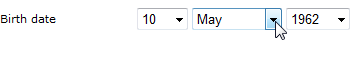

# Aggiunta di campi a un modulo web{#adding-fields-to-a-web-form}

In un modulo Web, i campi consentono agli utenti di immettere informazioni e selezionare opzioni. I moduli web possono offrire campi di input, campi di selezione, contenuto statico e avanzato (didascalie, abbonamenti, ecc.).

Quando si utilizza la procedura guidata per aggiungere campi, il tipo di campo viene rilevato automaticamente in base al campo o alla variabile di archiviazione selezionati. Puoi modificarlo utilizzando la **[!UICONTROL Type]** casella a discesa in **[!UICONTROL General]** scheda .

Quando si utilizzano i pulsanti nella barra degli strumenti, selezionare il tipo di campo da aggiungere.

Sono disponibili i seguenti tipi di campi:

* Inserimento testo/numero. Vedi [Aggiunta di campi di input](#adding-input-fields).
* Selezione elenco a discesa. Vedi [Aggiunta di elenchi a discesa](#adding-drop-down-lists).
* Scelta multipla tramite caselle di controllo. Vedi [Aggiunta di caselle di controllo](#adding-checkboxes).
* Selezione esclusiva tramite pulsanti di scelta. Vedi [Aggiunta di pulsanti di scelta](#adding-radio-buttons).
* Votate in una griglia di opzioni. Vedi [Aggiunta di griglie](#adding-grids).
* Numeri e date. Vedi [Aggiunta di date e numeri](#adding-dates-and-numbers).
* Iscrizione/annullamento dell’abbonamento a un servizio informazioni. Vedi [Caselle di controllo della sottoscrizione](#subscription-checkboxes).
* Convalida Captcha. Vedi [Inserimento di un captcha](#inserting-a-captcha).
* Pulsante Scarica . [Caricamento di un file](#uploading-a-file).
* Costante nascosta. Vedi [Inserimento di una costante nascosta](#inserting-a-hidden-constant).

Specificare la modalità di archiviazione della risposta: aggiorna un campo nel database (memorizza solo l&#39;ultimo valore salvato) o lo archivia in una variabile (la risposta non viene memorizzata). Per ulteriori informazioni, consulta [Campi di archiviazione della risposta](web-forms-answers.md#response-storage-fields).

>[!NOTE]
>
>Per impostazione predefinita, il campo viene inserito nella parte inferiore della struttura corrente. Utilizzare le frecce nella barra degli strumenti per spostarle verso l’alto o verso il basso.

## Creazione guidata campo {#field-creation-wizard}

Per ogni pagina del modulo, è possibile aggiungere un campo tramite il primo pulsante nella barra degli strumenti. Per eseguire questa operazione, vai alla pagina **[!UICONTROL Add using the wizard]** menu.

Selezionare il tipo di campo da creare: è possibile scegliere di aggiungere un campo nel database, una variabile o di importare un gruppo di campi creati in un altro modulo e raccolti in un contenitore.

Fai clic su **[!UICONTROL Next]** e selezionare il campo di archiviazione o la variabile o il contenitore da importare.

Fai clic su **[!UICONTROL Finish]** per inserire il campo selezionato nella pagina.

## Aggiunta di campi di input {#adding-input-fields}

Per aggiungere un campo di input, fai clic sul pulsante **[!UICONTROL Input control]** e scegliere il tipo di campo che si desidera aggiungere.

### Tipi di campi di input {#types-of-input-fields}

È possibile inserire in una pagina del modulo cinque diversi tipi di campi di testo:

* **Testo**: consente all’utente di inserire un testo su una riga.

   

* **Numero**: consente all’utente di immettere un numero su una riga. per ulteriori informazioni, consulta [Aggiunta di numeri](#adding-numbers).

   Quando la pagina viene approvata, il contenuto del campo viene controllato per verificare che il valore inserito sia compatibile con il campo. Per ulteriori informazioni, consulta [Definizione delle impostazioni di controllo](form-rendering.md#defining-control-settings).

* **Password**: consente all’utente di immettere il testo su una sola riga. Durante l’immissione del testo, i caratteri vengono sostituiti da punti:

   

   >[!CAUTION]
   >
   >Le password vengono memorizzate non crittografate nel database.

* **Testo su più righe**: consente all’utente di immettere il testo su più righe.

   

   >[!CAUTION]
   >
   >I campi di testo su più righe sono campi specifici che possono contenere ritorni a capo. Lo spazio di archiviazione deve essere associato a un campo mappato su un elemento XML, non a un attributo XML.

* **Testo con più righe**: consente all’utente di inserire un testo con un layout che verrà memorizzato in formato HTML.

   

   Puoi selezionare il tipo di editor offerto agli utenti. A questo scopo, utilizza la casella a discesa della **[!UICONTROL HTML editor]** nel campo **[!UICONTROL Advanced]** scheda .

   

   Il numero di icone visualizzate varia a seconda del tipo di editor. Per un **[!UICONTROL Advanced]** editor, il rendering sarà come segue:

   

### Configurare i campi di input {#configure-input-fields}

I campi di input sono tutti configurati in base alla stessa modalità, utilizzando le seguenti opzioni:

La **[!UICONTROL General]** consente di immettere il nome del campo e di attribuire un valore predefinito, se necessario.

La modalità di archiviazione delle risposte può essere modificata tramite **[!UICONTROL Edit storage...]** link. I valori possono essere memorizzati in un campo esistente del database; oppure è possibile scegliere di non salvare le informazioni nel database (utilizzare una variabile locale).

>[!NOTE]
>
>Le modalità di archiviazione sono descritte in [Campi di archiviazione della risposta](web-forms-answers.md#response-storage-fields)

La **[!UICONTROL Advanced]** La scheda ti consente di definire i parametri di visualizzazione del campo (posizione delle etichette, allineamento, ecc.). Vedi [Definizione del layout dei moduli web](defining-web-forms-layout.md).

## Aggiunta di elenchi a discesa {#adding-drop-down-lists}

È possibile inserire un elenco a discesa in una pagina del sondaggio. Questo consente all’utente di selezionare un valore tra quelli in offerta in un menu a discesa.

Per aggiungere una casella di riepilogo a discesa a una pagina del modulo, fare clic sul pulsante **[!UICONTROL Selection controls > Drop-down list]** nella barra degli strumenti dell’editor pagina.

Selezionare la modalità di archiviazione delle risposte e confermare la scelta.

Definire le etichette e i valori dell’elenco nella sezione inferiore della sezione **[!UICONTROL General]** scheda . Se le informazioni sono memorizzate in un campo esistente del database ed è un campo di enumerazione, è possibile compilare automaticamente i valori facendo clic su **[!UICONTROL Initialize the list of values from the database]** , come illustrato di seguito:

>[!NOTE]
>
>Utilizzare le frecce a destra dell’elenco di valori per modificarne la sequenza.

Se i dati sono memorizzati in una tabella collegata, è possibile selezionare il campo in cui vengono salvati i valori da suggerire nell’elenco. Ad esempio, se si seleziona la tabella dei paesi, fare clic su **[!UICONTROL Initialize the list of values from the database...]** e seleziona il campo desiderato.

Fai clic su **[!UICONTROL Load]** per recuperare i valori:

>[!CAUTION]
>
>Ripeti questa operazione ogni volta che l’elenco viene aggiornato per aggiornare i valori dell’offerta.

## Aggiunta di caselle di controllo {#adding-checkboxes}

Per consentire all’utente di selezionare un’opzione, è necessario utilizzare una casella di controllo.

Per aggiungere una casella di controllo a un modulo, fai clic sul pulsante **[!UICONTROL Selection controls > Checkbox...]** nella barra degli strumenti dell’editor pagina.

Selezionare la modalità di archiviazione delle risposte e confermare la scelta.

Inserisci l’etichetta della casella nel **[!UICONTROL Label]** campo **[!UICONTROL General]** scheda .

Una casella di controllo consente di assegnare un valore al campo di archiviazione (o valore) a seconda che la casella sia selezionata o meno. La **[!UICONTROL Values]** consente di immettere il valore da assegnare se la casella è selezionata (nella sezione **[!UICONTROL Value]** e il valore da assegnare se non è selezionato (nel **[!UICONTROL Empty value]** (campo). Questi valori dipendono dal formato di archiviazione dei dati.

Se il campo di archiviazione (o variabile) è booleano, il valore da assegnare se la casella non è selezionata verrà dedotto automaticamente. In questo caso, solo il **[!UICONTROL Value if checked]** è offerto, come mostrato di seguito:

## Esempio: Assegnare un valore a un campo se è selezionata una casella {#example--assign-a-value-to-a-field-if-a-box-is-checked}

Desideriamo inserire una casella di controllo in un modulo per inviare una richiesta di manutenzione, come illustrato di seguito:

Le informazioni verranno caricate nel database e in un campo esistente (in questo caso, il **[!UICONTROL Comment]** campo):

Se la casella &quot;Manutenzione richiesta&quot; è selezionata, la **[!UICONTROL Comment]** La colonna contiene &quot;Manutenzione richiesta&quot;. Se la casella non è selezionata, nella colonna verrà visualizzato &quot;Manutenzione non necessaria&quot;. Per ottenere questo risultato, applicare la seguente configurazione alla casella di controllo nella pagina del modulo:

## Aggiunta di pulsanti di scelta {#adding-radio-buttons}

I pulsanti di scelta consentono all’utente di scegliere tra una serie di opzioni esclusive. Si tratta di valori diversi per lo stesso campo.

È possibile creare pulsanti di scelta singolarmente (pulsanti unitari) o tramite un elenco a scelta multipla, ma poiché il punto dei pulsanti di scelta è quello di selezionare un’opzione o un’altra, si creerà sempre almeno una coppia di pulsanti di scelta, mai un solo pulsante.

>[!CAUTION]
>
>Per rendere obbligatoria la selezione, è necessario creare un elenco di scelte multiple.

### Aggiungi pulsanti singoli {#add-single-buttons}

Per aggiungere un pulsante di scelta a una pagina del modulo, passare alla pagina **[!UICONTROL Selection controls > Radio button]** nella barra degli strumenti dell’editor pagina e scegli una modalità di archiviazione.

I pulsanti di scelta sono configurati in modo simile alle caselle di controllo (consulta [Aggiunta di caselle di controllo](#adding-checkboxes)). Tuttavia, non viene assegnato alcun valore se l’opzione non è selezionata. Affinché diversi pulsanti siano interdipendenti, ovvero selezionandone uno automaticamente deseleziona gli altri, è necessario memorizzarli nello stesso campo. Se non sono memorizzati nel database, è necessario utilizzare la stessa variabile locale per l&#39;archiviazione temporanea. Vedi [Campi di archiviazione della risposta](web-forms-answers.md#response-storage-fields).

### Aggiungere un elenco di pulsanti {#add-a-list-of-buttons}

Per aggiungere pulsanti di scelta tramite un elenco, vai alla pagina **[!UICONTROL Selection controls>Multiple choice]** nella barra degli strumenti dell’editor pagina.

Aggiungi tutti i pulsanti di scelta quante etichette sono presenti. Il vantaggio di questa funzione è che è possibile importare valori da un campo esistente (in caso di un campo dettagliato) e fare in modo che l’utente scelga un’opzione. Tuttavia, il layout dei pulsanti è meno flessibile.

>[!NOTE]
>
>Non è possibile abilitare la selezione multipla in un&#39;applicazione Web.
>È tuttavia possibile inserire un **[!UICONTROL Multiple choice]** Digitare un campo in un&#39;applicazione Web, ma l&#39;utente non potrà selezionare più valori.

## Aggiunta di griglie {#adding-grids}

Le griglie vengono utilizzate per progettare le pagine di voto nelle applicazioni Web. Questo consente di offrire elenchi di pulsanti di scelta per rispondere ai moduli Web del sondaggio o del tipo di valutazione, come illustrato di seguito:

Per utilizzare questo tipo di elemento in un modulo, creare una griglia semplice e aggiungere una riga per ciascun elemento da valutare.

Il numero di pulsanti di scelta in ogni riga della griglia corrisponde al numero di valori definiti nella griglia semplice.

È possibile selezionare una sola opzione per ogni linea della griglia.

>[!NOTE]
>
>Nel nostro esempio, l&#39;etichetta della griglia è nascosta. Per eseguire questa operazione, vai alla pagina **[!UICONTROL Advanced]** scheda **[!UICONTROL Label position]** la visualizzazione è definita come **[!UICONTROL Hidden]** . Vedi [Definizione della posizione delle etichette](defining-web-forms-layout.md#defining-the-position-of-labels).

## Aggiunta di date e numeri {#adding-dates-and-numbers}

Il contenuto dei campi modulo può essere formattato in modo da corrispondere ai dati memorizzati nel database o per soddisfare un requisito particolare. È possibile creare campi appropriati per l&#39;immissione di numeri e date.

### Aggiunta di date {#adding-dates}

Per consentire all’utente di immettere una data in una pagina del modulo, aggiungere un campo di immissione e selezionare il tipo **[!UICONTROL Date...]**.

Immetti un’etichetta per il campo e configura la modalità di archiviazione dati.

La sezione inferiore della finestra consente di selezionare i formati di data e ora per i valori memorizzati in questo campo.

Puoi anche scegliere di non visualizzare la data (o l’ora).

Le date possono essere selezionate tramite un calendario o caselle a discesa. Puoi anche immetterle direttamente nel campo , ma devono corrispondere al formato specificato nella schermata precedente.

>[!NOTE]
>
>Per impostazione predefinita, le date utilizzate nei moduli vengono immesse tramite un calendario. Per i moduli multilingue, verificare che i calendari siano disponibili in tutte le lingue utilizzate. Vedi [Traduzione di un modulo web](translating-a-web-form.md).

Tuttavia, in alcuni casi (ad esempio per le date di nascita) può essere più facile utilizzare elenchi a discesa.

A questo scopo, fai clic sul pulsante **[!UICONTROL Advanced]** e scegli la modalità di input utilizzando **[!UICONTROL Drop-down lists]**.

È quindi possibile impostare limiti ai valori offerti nell’elenco.

### Aggiunta di numeri {#adding-numbers}

È possibile creare campi adatti per l’immissione di numeri.

In un campo numerico, l’utente può immettere solo numeri. Il controllo della voce viene applicato automaticamente quando la pagina viene approvata.

A seconda del campo in cui i dati vengono memorizzati nel database, è possibile applicare una formattazione speciale o alcune restrizioni. È inoltre possibile specificare valori massimi e minimi. Questo tipo di campo è configurato come segue:

Il valore predefinito è il valore visualizzato nel campo quando il modulo viene pubblicato. Può essere corretto dall’utente.

È possibile aggiungere un prefisso e/o un suffisso al campo numerico tramite la variabile **[!UICONTROL Advanced]** , come illustrato di seguito:

Nel modulo, il rendering sarà il seguente:

## Caselle di controllo della sottoscrizione {#subscription-checkboxes}

È possibile aggiungere controlli per consentire agli utenti di effettuare o annullare l’iscrizione a uno o più servizi di informazione (newsletter, avvisi, notifiche in tempo reale, ecc.). Per effettuare l’abbonamento, l’utente controlla il servizio corrispondente.

Per creare una casella di controllo dell’abbonamento, fai clic su **[!UICONTROL Advanced controls>Subscription]**.

Indicare l’etichetta della casella di controllo e selezionare il servizio di informazione interessato utilizzando il **[!UICONTROL Service]** casella a discesa.

>[!NOTE]
>
>I servizi di informazione sono descritti in dettaglio in [questa pagina](../../delivery/using/managing-subscriptions.md).

L’utente si abbona al servizio selezionando l’opzione pertinente.

>[!CAUTION]
>
>Se l’utente è già iscritto a un servizio informazioni e la casella collegata a questo servizio non è selezionata al momento dell’approvazione del modulo, verrà annullata l’iscrizione.

## Inserimento di un captcha {#inserting-a-captcha}

Lo scopo di **captcha** i test consentono di evitare l’uso fraudolento dei moduli web.

>[!CAUTION]
>
>Se il modulo contiene più pagine, è necessario posizionare sempre Captcha sull’ultima pagina, immediatamente prima della casella di archiviazione, per evitare che le misure di sicurezza vengano eluse.

Per inserire un Captcha in un modulo, fare clic sul primo pulsante sulla barra degli strumenti e selezionare **[!UICONTROL Advanced controls>Captcha]**.

Immetti l’etichetta del campo. Questa etichetta verrà visualizzata di fronte all&#39;area di visualizzazione Captcha. È possibile modificare la posizione di questa etichetta nel **[!UICONTROL Advanced]** scheda .

>[!NOTE]
>
>Per **[!UICONTROL captcha]** controlli del tipo, non è necessario indicare un campo di archiviazione o una variabile.

Il Captcha viene inserito nella pagina con un campo di input inserito sotto l’elemento visivo. Questi due elementi sono inseparabili e vengono considerati come un singolo elemento ai fini del layout di pagina (occupano una singola cella).

Quando la pagina viene confermata, il campo di input viene visualizzato in rosso se il contenuto del Captcha non è stato inserito correttamente.

È possibile creare un messaggio di errore da visualizzare. A tale scopo, utilizza il **[!UICONTROL Personalize the message]** nel collegamento **[!UICONTROL General]** scheda .

>[!NOTE]
>
>I caratteri maiuscoli sono sempre lunghi 8 caratteri. Non è possibile modificare questo valore.

## Caricamento di un file {#uploading-a-file}

Puoi aggiungere un campo di caricamento a una pagina. Questa funzionalità può essere utile, ad esempio, per la condivisione di file intranet.

Per inserire un campo di caricamento in una pagina del modulo, seleziona la **[!UICONTROL Advanced controls > File...]** nella barra degli strumenti dell’editor pagina.

Per impostazione predefinita, i file caricati sono memorizzati in file di risorse accessibili tramite il **[!UICONTROL Resources > Online > Public resources]** menu. È possibile utilizzare uno script per modificare questo comportamento. Questo script può utilizzare le funzioni definite in [Documentazione JSAPI per Campaign](https://experienceleague.adobe.com/developer/campaign-api/api/index.html), compresi quelli che riguardano la manipolazione dei file.

È possibile memorizzare il collegamento a questi file in una variabile locale o in un campo del database. Ad esempio, puoi estendere lo schema del destinatario per aggiungere un collegamento alle risorse basate su file.

>[!CAUTION]
>
>* Questo tipo di file deve essere riservato ai moduli con accesso protetto (utilizzando le credenziali).
>* Adobe Campaign non controlla la dimensione o il tipo di risorsa caricata: si consiglia pertanto vivamente di utilizzare i campi di caricamento solo per siti Intranet di tipo protetto.
>* Se più server sono collegati all’istanza (architettura di bilanciamento del carico), è necessario assicurarsi che le chiamate al modulo web arrivino sullo stesso server.
>* Queste implementazioni richiedono l’assistenza del team di consulenza Adobe Campaign.

>

## Inserimento di una costante nascosta {#inserting-a-hidden-constant}

Quando l’utente convalida una delle pagine del modulo, è possibile impostare un valore specifico su un campo del profilo o su una variabile.

Questo campo non è visibile all’utente, ma può essere utilizzato per arricchire i dati nel profilo utente.

Per eseguire questa operazione, posizionare un **costante** nella pagina e specifica il valore e il percorso di archiviazione.

Nell&#39;esempio seguente, la **origine** Il campo del profilo destinatario viene compilato automaticamente ogni volta che un utente approva la pagina. La costante non viene visualizzata nella pagina.

