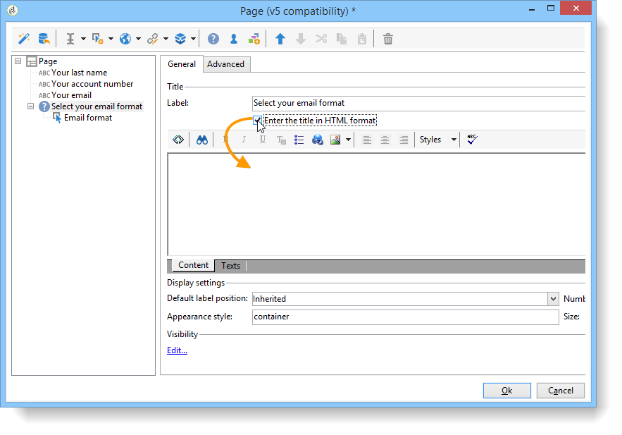

# Progettazione di un sondaggio{#building-a-survey}

## Creating a new survey {#creating-a-new-survey}

Questo capitolo descrive la progettazione di un modulo di tipo **Sondaggio** utilizzando  Adobe Campaign, nonché le opzioni e le configurazioni disponibili.  Adobe Campaign consente di rendere questo sondaggio disponibile agli utenti e di raccogliere e archiviare le risposte nel database.

I moduli Web sono accessibili tramite il **[!UICONTROL Resources > Online > Web applications]** nodo della struttura ad albero. Per creare un sondaggio, fate clic sul **[!UICONTROL New]** pulsante sopra l’elenco delle applicazioni oppure fate clic con il pulsante destro del mouse sull’elenco e scegliete **[!UICONTROL New]**.

Selezionate il modello di sondaggio (**[!UICONTROL newSurvey]** per impostazione predefinita).

Le pagine del modulo vengono create utilizzando un editor speciale che consente di definire e configurare (testo) campi di input, campi di selezione (elenchi, caselle di controllo, ecc.) ed elementi statici (immagini, contenuto HTML, ecc.). Possono essere raccolti in &quot;contenitori&quot; e disposti in base ai requisiti (vedere [Aggiunta di domande](#adding-questions)).

>[!NOTE]
>
>Per ulteriori informazioni su come definire il contenuto e creare layout di schermo per un modulo Web, consultare [questa sezione](../../web/using/about-web-forms.md).

## Aggiunta di campi {#adding-fields}

I campi di un modulo consentono agli utenti di immettere informazioni e selezionare opzioni. Per ciascuna pagina del modulo, vengono creati utilizzando il **[!UICONTROL Add using the wizard]** menu mediante il primo pulsante nella barra degli strumenti.

>[!NOTE]
>
>È inoltre possibile fare clic con il pulsante destro del mouse e inserire una zona di input. Per impostazione predefinita, la zona viene inserita alla fine della struttura ad albero selezionata. Utilizzare le frecce nella barra degli strumenti per spostarle.

### Tipi di campi {#types-of-fields}

Quando aggiungete un campo a un sondaggio, dovete selezionarne il tipo. Sono disponibili le seguenti opzioni:

1. **[!UICONTROL Answer a question]**: questa opzione consente di dichiarare un nuovo campo (denominato &quot;campo archiviato&quot;) in cui memorizzare le risposte. In questo caso, tutti i valori raccolti vengono salvati, anche quando un partecipante compila più volte il modulo. Questa modalità di archiviazione è disponibile solo in **Sondaggi**. Consultate [Memorizzazione delle risposte](../../web/using/managing-answers.md#storing-collected-answers)raccolte.
1. **[!UICONTROL Edit a recipient]**: questa opzione consente di selezionare un campo nel database. In questo caso, le risposte dell&#39;utente verranno memorizzate in questo campo. Per ciascun partecipante, viene mantenuto solo l&#39;ultimo valore salvato e aggiunto ai dati del profilo.
1. **[!UICONTROL Add a variable]**: questa opzione consente di creare una configurazione in modo che le informazioni non vengano memorizzate nel database. Le variabili locali possono essere dichiarate a monte. È inoltre possibile aggiungerli direttamente al momento della creazione del campo.
1. **[!UICONTROL Import an existing question]**: questa opzione consente di importare le domande esistenti create in altri sondaggi.

   >[!NOTE]
   >
   >Le modalità di archiviazione e le importazioni sul campo sono descritte in [Memorizzazione delle risposte](../../web/using/managing-answers.md#storing-collected-answers)raccolte.

Natura del campo da aggiungere (elenco a discesa, campo di testo, caselle di controllo, ecc.) si adatta alla modalità di memorizzazione selezionata. È possibile modificarlo utilizzando il **[!UICONTROL Type]** campo della **[!UICONTROL General]** scheda, ma assicurarsi di mantenere la coerenza con il tipo di dati.

I vari tipi di campi disponibili sono descritti in [questa sezione](../../web/using/about-web-forms.md).

## Elementi specifici del sondaggio {#survey-specific-elements}

I sondaggi online utilizzano le funzionalità delle applicazioni Web. Le funzioni specifiche collegate ai campi del sondaggio sono descritte di seguito.

### Scelta multipla {#multiple-choice}

Per i controlli **[!UICONTROL Multiple choice]** del tipo, è possibile definire un numero minimo e massimo di selezioni. Ad esempio, questa opzione consente di forzare la selezione ad almeno **2** valori e al massimo a **4** valori dalle opzioni disponibili:

Se il numero di selezioni è troppo grande o troppo piccolo, viene visualizzato il messaggio appropriato.

>[!NOTE]
>
>In questo caso, le opzioni vengono selezionate utilizzando le caselle di controllo. Quando è possibile utilizzare una sola opzione, vengono utilizzati i pulsanti di scelta.

La configurazione corrispondente è la seguente:

Inoltre, il percorso di memorizzazione per questo campo di input deve essere un campo **[!UICONTROL Multiple values]** di **tipo** archiviato:

>[!CAUTION]
>
>* Questa funzionalità è disponibile solo per i moduli di tipo **Sondaggio** .
>* Questa opzione non è compatibile con la visualizzazione casuale delle domande. For more on this, refer to [Adding questions](#adding-questions).

### Aggiunta di domande {#adding-questions}

Esistono due tipi di contenitori: standard e domanda. I contenitori standard vengono utilizzati per configurare il layout di pagina e la visualizzazione condizionale in una pagina. Sono descritti in [questa sezione](../../web/using/about-web-forms.md).

Usate un contenitore **Domanda** per aggiungere una domanda alla pagina e per inserire le possibili risposte nella gerarchia. Le risposte degli utenti alle domande inserite in questo tipo di contenitore possono essere analizzate nei rapporti.

>[!CAUTION]
>
>Non inserire mai un contenitore **Domanda** sotto un altro contenitore **Domanda** nella gerarchia.

L’etichetta della domanda viene inserita nel campo dell’etichetta. In questo caso, verrà applicato lo stile del foglio di stile del modulo. Selezionate l’ **[!UICONTROL Enter the title in HTML format]** opzione per personalizzarla. In questo modo potrete accedere all’editor HTML.

>[!NOTE]
>
>Per ulteriori informazioni sull’utilizzo dell’editor HTML, consultate [questa sezione](../../web/using/about-web-forms.md) .

Ad esempio:

Nell’esempio precedente, il rendering sarà il seguente:

>[!NOTE]
>
>Ogni domanda ha un contenitore di tipo **Domanda** .

Potete attivare il disegno casuale delle domande da parte di  Adobe Campaign. È quindi possibile specificare il numero di domande da visualizzare nella pagina, nel campo situato nella parte inferiore della finestra di configurazione.

Il rendering sarà simile al seguente:

Quando la pagina viene aggiornata, le domande visualizzate non sono le stesse.

>[!CAUTION]
>
>Quando visualizzate una domanda in modo casuale (**[!UICONTROL Display randomly]** opzione selezionata sulla pagina), prestate attenzione a non utilizzare domande a scelta multipla per le quali una o più selezioni sono obbligatorie.

