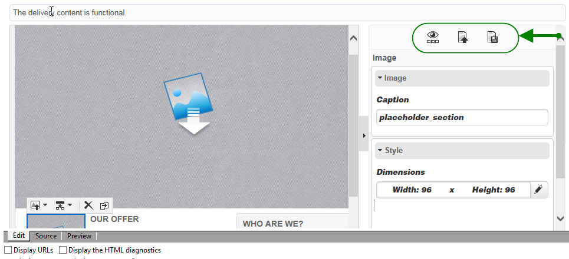

# Interfaccia dell’editor di contenuti{#content-editor-interface}

## Finestra di modifica {#editing-window}

La finestra di modifica DCE è suddivisa in tre diverse sezioni. Consentono di visualizzare, modificare e controllare lo stato del contenuto.

1. La **top** sezione è un’area di visualizzazione per i messaggi all’utente. Questi messaggi indicano lo stato dell’applicazione Web o la consegna in fase di creazione, nonché gli avvisi e i messaggi di errore relativi al contenuto. Per ulteriori informazioni, consulta [Stato del contenuto di HTML](content-editing-best-practices.md#html-content-statuses).
1. La sezione **sinistra** della finestra è l’area per la modifica del contenuto. Da quest’area, l’utente può interagire direttamente con il contenuto utilizzando la barra degli strumenti a comparsa: inserire un collegamento in un’immagine, modificare il font, eliminare un campo, ecc. Per ulteriori informazioni, consulta [Modifica dei moduli](editing-content.md#editing-forms).
1. La sezione **right** della finestra è l&#39;area del pannello di controllo. Quest’area raggruppa le diverse opzioni per l’editor, in particolare quelle relative alla configurazione dell’intestazione di pagina e delle opzioni generali per un blocco: aggiungere un bordo, collegare un campo di database con un&#39;area di input, accedere alle proprietà della pagina Web, ecc. Per ulteriori informazioni, consulta la sezione [Opzioni globali](#global-options) e [Modifica del contenuto](editing-content.md) sezioni.

## Opzioni globali {#global-options}

La sezione in alto a destra dell’editor consente di accedere alle opzioni globali che consentono di controllare il contenuto attualmente creato.

Sono disponibili quattro icone:

* La **Visualizza/Nascondi blocchi** consente di visualizzare fotogrammi blu intorno ai blocchi di contenuto (corrispondente al `
` tag HTML).

* La **Scegliere un altro contenuto** L’icona consente all’utente di caricare nuovi contenuti da un modello (modello esistente o modello preconfigurato).

   

   >[!CAUTION]
   >
   >Il contenuto selezionato sostituisce il contenuto corrente.

* La **Salva come modello** consente di salvare il contenuto corrente come modello. È necessario immettere l&#39;etichetta e il nome interno per il modello. I modelli sono memorizzati nella **[!UICONTROL Resources > Templates > Content templates]** nodo.

   

   Una volta salvato, il modello è disponibile e può essere selezionato durante la creazione di nuovo contenuto.

   

* La **Proprietà pagina** consente di selezionare le informazioni sul contenuto nella parte superiore della pagina HTML.

   

   >[!NOTE]
   >
   >Queste informazioni corrispondono al **`<title>`** e **`<meta>`** Tag HTML nella pagina.
   >
   >Le parole chiave devono essere separate da virgole.

## Opzioni di blocco {#block-options}

La sezione a destra dell’editor raggruppa le opzioni principali che ti consentono di agire in base al contenuto. Per visualizzare queste opzioni, è necessario selezionare un blocco: la natura di queste opzioni dipende dal blocco selezionato.

Puoi:

* Determinare la visualizzazione di uno o più blocchi, fare riferimento a [Definizione di una condizione di visibilità](editing-content.md#defining-a-visibility-condition),
* Definire i bordi e le cornici, fare riferimento a [Aggiunta di un bordo e uno sfondo](editing-content.md#adding-a-border-and-background),
* Definire gli attributi dell’immagine (dimensioni, didascalia), fare riferimento a [Modifica delle proprietà immagine](editing-content.md#editing-image-properties),
* Collega il database a un elemento del modulo (area di input, casella di controllo), fai riferimento a [Modifica delle proprietà dei dati di un modulo](editing-content.md#changing-the-data-properties-for-a-form),
* Rendere obbligatoria una parte di un modulo, fare riferimento a [Modifica delle proprietà dei dati di un modulo](editing-content.md#changing-the-data-properties-for-a-form),
* Definire un’azione per un pulsante, fare riferimento a [Aggiunta di un’azione a un pulsante](editing-content.md#adding-an-action-to-a-button).

## Barra dei contenuti {#content-toolbar}

La barra degli strumenti è **elemento a comparsa** dell’interfaccia DCE che presenta funzioni diverse in base al blocco selezionato.

>[!CAUTION]
>
>Alcune funzioni della barra degli strumenti ti consentono di formattare il contenuto HTML. Tuttavia, se la pagina contiene un foglio di stile CSS, la **istruzioni** dal foglio di stile può provare di assumere **priorità** sulle istruzioni specificate nella barra degli strumenti.
