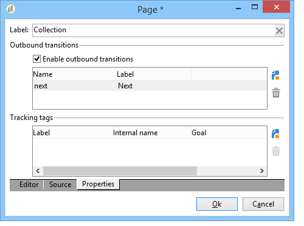

# Creare una pagina di destinazione{#creating-a-landing-page}

## Informazioni sulla creazione di pagine di destinazione {#about-landing-pages-creation}

Questo caso d’uso illustra l’utilizzo dell’editor digitale per creare una pagina di destinazione dalla console Adobe Campaign.

Prima di iniziare la configurazione della pagina di destinazione in Adobe Campaign, assicurati di aver **uno o più modelli** per rappresentare le pagine HTML.

Lo scopo principale di questo caso d’uso è fare in modo che i campi del modulo Pagina di destinazione corrispondano ai campi interni di Adobe Campaign utilizzando le funzioni di DCE.

## Creazione della pagina di destinazione {#creating-the-landing-page}

Per creare una nuova applicazione Web di tipo Pagina di destinazione, attenersi alla procedura descritta di seguito.

1. Vai a **[!UICONTROL Campaigns]** e fai clic sul pulsante **[!UICONTROL Web application]** , quindi fare clic sul pulsante **[!UICONTROL Create]** pulsante.
1. Seleziona la **[!UICONTROL New landing page]** e immettere un&#39;etichetta, quindi fare clic su **[!UICONTROL Save]**.

   

1. Fai clic su **[!UICONTROL Edit]** scheda.
1. Elimina **Fine** attività.
1. Aggiungi un **[!UICONTROL Page]** attività dopo il **[!UICONTROL Storage]** attività.
1. Modifica il **Pagina 2** attività, quindi deseleziona la **[!UICONTROL Activate outbound transitions]** opzione in **[!UICONTROL Properties]** scheda.

   

1. Salva le modifiche.

Viene quindi creata la seguente sequenza:

>[!NOTE]
>
>Per ulteriori informazioni sulla creazione di un&#39;applicazione Web, fare riferimento a [questa sezione](creating-a-new-web-application.md).

## Passaggio 1: selezione e caricamento dei modelli {#step-1---selecting-and-loading-templates}

In questa sezione verrà illustrato come **importa contenuto HTML** per ogni pagina dell&#39;applicazione Web.

Un modello deve contenere:

* un **HTML** file (obbligatorio)
* uno o più **CSS** file (facoltativo)
* uno o più **immagini** (facoltativo)

Per caricare il modello sulla prima pagina, effettua le seguenti operazioni:

1. Apri il primo **[!UICONTROL Page]** dell&#39;applicazione Web.
1. Seleziona **[!UICONTROL From a file]** per recuperare il modello di contenuto.

   

1. Selezionare il file HTML da utilizzare.
1. Clic **Apri** per avviare l&#39;importazione.

   Durante il caricamento, viene visualizzato l’elenco dei file condivisi. Il sistema di importazione controlla che siano presenti tutti i file collegati al HTML selezionato (CSS, immagini e così via).

   Fai clic su **[!UICONTROL Close]** al termine dell&#39;importazione.

   

   >[!CAUTION]
   >
   >Prima di chiudere è necessario attendere che venga visualizzato il seguente messaggio: **[!UICONTROL The external resources have been successfully published]** .

1. Fai clic su **[!UICONTROL Properties]** scheda.
1. Immetti un **etichetta** per ogni pagina (ad esempio: Pagina 1= Raccolta, Pagina 2=Grazie).

   

Applicare questi passaggi a ogni pagina inserita nell&#39;applicazione Web.

>[!CAUTION]
>
>**Il DCE esegue il codice JavaScript per la pagina HTML caricata.** Errori JavaScript nel modello HTML che possono comparire nell’interfaccia di Adobe Campaign. Questi errori non sono correlati all’editor. Per verificare che non vi siano errori nei file importati, si consiglia di testarli in un browser web prima di importare i file nel DCE.

## Passaggio 2: configurazione del contenuto {#step-2---configuring-the-content}

In questa sezione regoleremo il contenuto importato e collegheremo i campi del database al modulo della pagina web. L&#39;applicazione Web creata in precedenza è:

### Modifica del contenuto {#modifying-content}

Iniziamo cambiando i colori della pagina. Per eseguire questa operazione:

1. Apri **[!UICONTROL Collection]** pagina.
1. Fare clic sullo sfondo.
1. Clic **Colore di sfondo** sul lato destro.
1. Selezionare un nuovo colore di sfondo.
1. Clic **OK** per confermare la modifica.

   

1. Applica questi stessi processi per modificare il colore del pulsante

   

### Collegamento di campi modulo {#linking-form-fields}

Stiamo per collegare i campi nella pagina a quelli nel database, per salvare le informazioni fornite.

1. Seleziona un campo modulo.
1. Modifica il **[!UICONTROL Field]** sezione sul lato destro dell’editor.
1. Selezionare il campo del database da collegare al campo selezionato.

   

1. Ripeti questo processo per ogni campo della pagina.

Puoi rendere obbligatorio un campo: ad esempio, fai clic sul pulsante **[!UICONTROL Email]** quindi attivare **Obbligatorio** opzione.

### Creazione di un collegamento alla pagina successiva {#creating-a-link-to-the-next-page}

Questo passaggio è obbligatorio in quanto consente all&#39;applicazione Web di determinare la sequenza dei passaggi successivi: salvataggio dei dati raccolti nel database e visualizzazione della pagina successiva (**Grazie** page).

1. Seleziona la **[!UICONTROL Send it!]** pulsante della **[!UICONTROL Collection]** pagina.
1. Fai clic su **[!UICONTROL Action]** menu a discesa.
1. Seleziona la **[!UICONTROL Next page]** azione.

   

### Inserimento di un campo di personalizzazione {#inserting-a-personalization-field}

Questo passaggio ti consente di personalizzare la pagina di ringraziamento. Per eseguire questa operazione:

1. Apri **[!UICONTROL Thank you]** pagina.
1. Posizionare il cursore in un&#39;area di testo in cui inserire il nome del destinatario.
1. Seleziona **[!UICONTROL Personalization field]** nel **[!UICONTROL Insert]** della barra degli strumenti.
1. Selezionare il nome.

   

Il campo di personalizzazione ha uno sfondo giallo nell’editor.

## Passaggio 3: pubblicazione dei contenuti {#step-3---publishing-content}

Il contenuto viene pubblicato dal dashboard dell’applicazione web. Fai clic su **[!UICONTROL Publish]** per eseguirlo.

Durante la pubblicazione, viene visualizzato un registro. Il sistema di pubblicazione analizza tutti i contenuti presenti nell&#39;applicazione Web

>[!NOTE]
>
>Nel registro della pubblicazione, gli avvisi e gli errori sono ordinati per attività.

Il modulo è ora disponibile: il relativo URL è accessibile nel dashboard dell’applicazione e può essere inviato ai destinatari.
