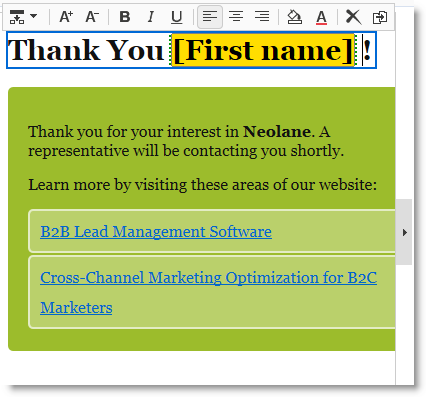

# Creazione di una pagina di destinazione{#creating-a-landing-page}

## Creazione di pagine di destinazione {#about-landing-pages-creation}

Questo caso d’uso mostra l’utilizzo dell’editor digitale per creare una pagina di destinazione dalla console Adobe Campaign .

Prima di iniziare a configurare la pagina di destinazione in  Adobe Campaign, assicurarsi di disporre di **uno o più modelli** per rappresentare le pagine HTML.

Lo scopo principale di questo caso di utilizzo è far corrispondere i campi del modulo Pagina di destinazione ai campi interni di  Adobe Campaign utilizzando le funzioni di DCE.

## Creazione della pagina di destinazione {#creating-the-landing-page}

Per creare una nuova applicazione Web di tipo Pagina di destinazione, procedere come segue:

1. Andate alla scheda **[!UICONTROL Campaigns]** e fate clic sul collegamento **[!UICONTROL Web application]**, quindi fate clic sul pulsante **[!UICONTROL Create]**.
1. Selezionate il modello **[!UICONTROL New landing page]** e immettete un&#39;etichetta, quindi fate clic su **[!UICONTROL Save]**.

   

1. Fare clic sulla scheda **[!UICONTROL Edit]**.
1. Eliminate l&#39;attività **End**.
1. Aggiungete un&#39;attività **[!UICONTROL Page]** dopo l&#39;attività **[!UICONTROL Storage]**.
1. Modificate l&#39;attività **Page 2**, quindi deselezionate l&#39;opzione **[!UICONTROL Activate outbound transitions]** nella scheda **[!UICONTROL Properties]**.

   

1. Salvare le modifiche.

Verrà quindi visualizzata la seguente sequenza:

>[!NOTE]
>
>Per ulteriori informazioni sulla creazione di un&#39;applicazione Web, vedere [questa sezione](../../web/using/creating-a-new-web-application.md).

## Passaggio 1 - Selezione e caricamento di modelli {#step-1---selecting-and-loading-templates}

In questa sezione verrà illustrato come **importare contenuto HTML** per ogni pagina dell&#39;applicazione Web.

Un modello deve contenere:

* un file **HTML** (obbligatorio)
* uno o più file **CSS** (facoltativo)
* una o più **immagini** (facoltativo)

Per caricare il modello sulla prima pagina, effettuate le seguenti operazioni:

1. Aprire la prima **[!UICONTROL Page]** attività dell&#39;applicazione Web.
1. Selezionate **[!UICONTROL From a file]** per recuperare il modello di contenuto.

   

1. Selezionate il file HTML da utilizzare.
1. Fare clic su **Apri** per avviare l&#39;importazione.

   Durante il caricamento, viene visualizzato l&#39;elenco dei file condivisi. Il sistema di importazione verifica che siano presenti tutti i file collegati al codice HTML selezionato (CSS, immagini ecc.).

   Al termine dell&#39;importazione, fate clic sul pulsante **[!UICONTROL Close]**.

   

   >[!CAUTION]
   >
   >Prima di chiudere è necessario attendere il messaggio seguente: **[!UICONTROL The external resources have been successfully published]** .

1. Fare clic sulla scheda **[!UICONTROL Properties]**.
1. Immettere un&#39;etichetta **etichetta** per ogni pagina (ad esempio: Pagina 1= Raccogli, Pagina 2=Grazie).

   

Applicare questi passaggi per ogni pagina inserita nell&#39;applicazione Web.

>[!CAUTION]
>
>**DCE esegue il codice JavaScript per la pagina HTML caricata.** Errori JavaScript nel modello HTML che possono essere visualizzati nell&#39;interfaccia Adobe Campaign . Questi errori non sono correlati all&#39;editor. Per verificare che non ci siano errori nei file importati, si consiglia di testarli in un browser (Internet Explorer / Firefox / Chrome) prima di importare i file in DCE.

## Passaggio 2 - Configurazione del contenuto {#step-2---configuring-the-content}

In questa sezione, regoleremo il contenuto importato e collegheremo i campi del database al modulo della pagina Web. L&#39;applicazione Web creata in precedenza è:

### Modifica del contenuto {#modifying-content}

Cominciamo modificando i colori della pagina. Per eseguire questa operazione:

1. Aprite la pagina **[!UICONTROL Collection]**.
1. Fate clic sullo sfondo.
1. Fare clic su **Colore di sfondo** sul lato destro.
1. Selezionare un nuovo colore di sfondo.
1. Fare clic su **OK** per confermare la modifica.

   

1. Applicare gli stessi processi per modificare il colore del pulsante

   

### Collegamento di campi modulo {#linking-form-fields}

Collegheremo i campi della pagina a quelli del database, per salvare le informazioni fornite.

1. Selezionare un campo modulo.
1. Modificate la sezione **[!UICONTROL Field]** a destra dell&#39;editor.
1. Selezionare il campo del database che si desidera collegare al campo selezionato.

   

1. Ripetete questa procedura per ciascun campo della pagina.

È possibile rendere obbligatorio un campo: ad esempio, fare clic sul campo **[!UICONTROL Email]**, quindi attivare l&#39;opzione **Obbligatorio**.

### Creazione di un collegamento alla pagina successiva {#creating-a-link-to-the-next-page}

Questo passaggio è obbligatorio perché consentirà all&#39;applicazione Web di determinare la sequenza dei passaggi successivi: Salvataggio dei dati raccolti nel database e visualizzazione della pagina successiva (**Grazie** pagina).

1. Selezionare il pulsante **[!UICONTROL Send it!]** della pagina **[!UICONTROL Collection]**.
1. Fare clic sul menu a discesa **[!UICONTROL Action]**.
1. Selezionare l&#39;azione **[!UICONTROL Next page]**.

   

### Inserimento di un campo di personalizzazione {#inserting-a-personalization-field}

Questo passaggio consente di personalizzare la pagina di ringraziamento. Per eseguire questa operazione:

1. Aprite la pagina **[!UICONTROL Thank you]**.
1. Posizionare il cursore in un&#39;area di testo in cui si desidera inserire il nome del destinatario.
1. Selezionare **[!UICONTROL Personalization field]** nel menu **[!UICONTROL Insert]** della barra degli strumenti.
1. Selezionate il nome.

   

Il campo di personalizzazione ha uno sfondo giallo nell’editor.

## Passaggio 3: pubblicazione di contenuto {#step-3---publishing-content}

Il contenuto viene pubblicato dal dashboard dell&#39;applicazione Web. Fare clic sul pulsante **[!UICONTROL Publish]** per eseguirlo.

Durante la pubblicazione viene visualizzato un registro. Il sistema di pubblicazione analizza tutto il contenuto trovato nell&#39;applicazione Web

>[!NOTE]
>
>Nel registro delle pubblicazioni, gli avvisi e gli errori sono ordinati per attività.

Il modulo è ora disponibile: il relativo URL è accessibile nel dashboard dell’applicazione e può essere inviato ai destinatari.
