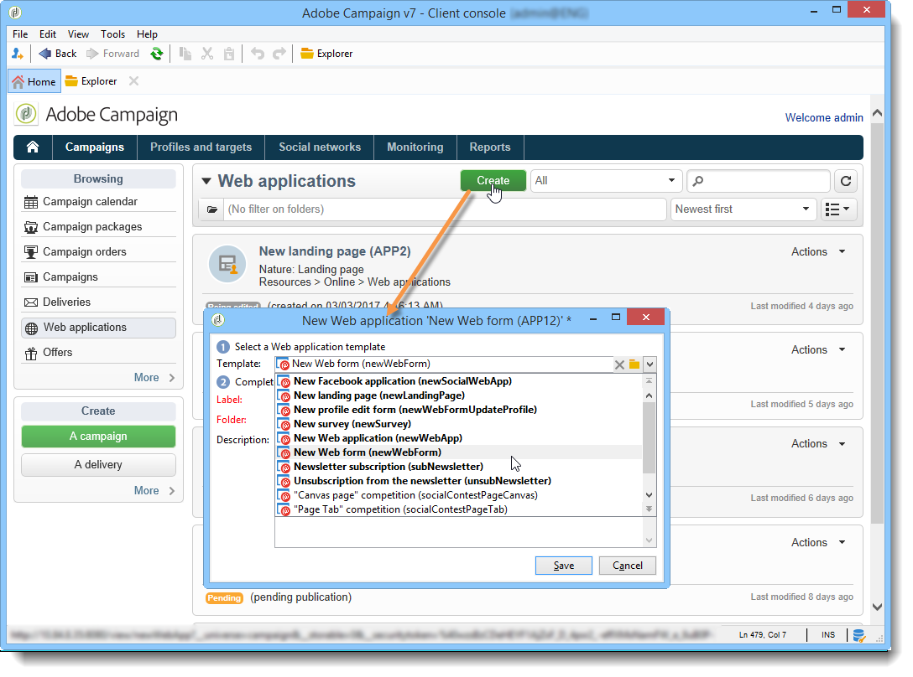

# Creare una nuova applicazione web{#creating-a-new-web-application}

I tipi di applicazione Web vengono selezionati durante la creazione.

Vai alla scheda **Campagne** e seleziona il menu **[!UICONTROL Web Applications]**. Fai clic sul pulsante **[!UICONTROL Create]**. Selezionare il modello di applicazione Web che si desidera utilizzare:

>[!NOTE]
>
>Proteggi sempre le pagine che potrebbero contenere informazioni personali. Consulta la [Lista di controllo protezione e privacy](https://helpx.adobe.com/campaign/kb/acc-security.html#privacy).

Questo modello determina il tipo di applicazione Web. Puoi creare:

1. Moduli web (+ modifica profilo)

   I moduli Web consentono di offrire pagine Web con campi di input o di selezione: le informazioni immesse dagli utenti possono essere memorizzate nel database di Adobe Campaign. Per ulteriori informazioni, consulta [Moduli web](about-web-forms.md).

1. Applicazioni web

   Adobe Campaign consente di creare applicazioni Web da esporre, ad esempio, su una piattaforma Web o su una extranet. Questo consente di modificare i dati e registrare le informazioni in Adobe Campaign. In questo caso, puoi limitarne l’accesso agli utenti autenticati (tramite il controllo degli accessi) e impostare il precaricamento dei dati in base a vari criteri. Per ulteriori informazioni al riguardo, consulta [questa sezione](about-web-applications.md).

1. Pagine di destinazione

   Una pagina di destinazione è una pagina di HTML il cui contenuto è disponibile su un sito web e che consente agli utenti di immettere informazioni da memorizzare nel profilo del database di Adobe Campaign. Il contenuto di questo tipo di pagina viene in genere creato da un’agenzia Web specializzata prima di essere importato in Adobe Campaign per la pubblicazione, la gestione e il follow-up. Per ulteriori informazioni, consulta [questa pagina](creating-a-landing-page.md).

1. Indagini

   Adobe Campaign ti consente, tramite l&#39;opzione **Gestione sondaggi**, di progettare e gestire sondaggi online ed elaborarne i risultati: creazione di campi dinamici, gestione dei punteggi, esportazione di risposte e rapporti dedicati. Per ulteriori informazioni al riguardo, consulta [questa sezione](../../surveys/using/about-surveys.md).

   >[!CAUTION]
   >
   >**Gestione sondaggi** è un modulo Adobe Campaign facoltativo. Controlla il contratto di licenza.

1. Applicazioni Facebook

   Grazie all&#39;opzione **Social Marketing**, Adobe Campaign consente di pubblicare contenuti personalizzati in un&#39;applicazione Facebook. Per ulteriori informazioni al riguardo, consulta [questa sezione](../../social/using/about-social-marketing.md).

   >[!CAUTION]
   >
   >**Social Marketing** è un modulo Adobe Campaign facoltativo. Controlla il contratto di licenza.

La modalità di configurazione della pagina e le configurazioni disponibili possono essere identiche per diversi tipi di applicazioni web. Per ulteriori informazioni al riguardo, consulta [questa sezione](about-web-forms.md).
