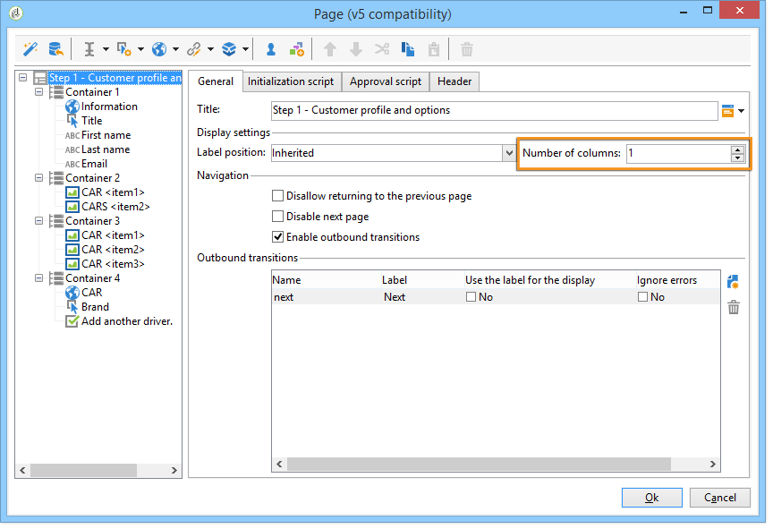
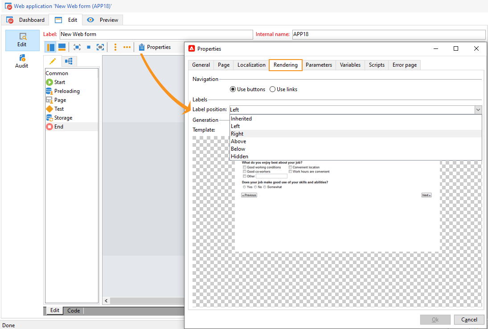

# Definire il layout dei moduli web{#defining-web-forms-layout}

## Creazione di contenitori {#creating-containers}

I contenitori consentono di combinare i campi di una pagina e configurarne il layout, per organizzare gli elementi nella pagina.

Per ogni pagina del modulo, i contenitori vengono creati tramite **[!UICONTROL Containers]** sulla barra degli strumenti.

Utilizza un contenitore per raggruppare gli elementi della pagina senza aggiungere un’etichetta al rendering finale. Gli elementi sono raggruppati nella sottostruttura contenitore. I contenitori standard consentono di gestire il layout.

Ad esempio:

La posizione delle etichette viene applicata agli elementi posizionati sotto il contenitore nella gerarchia. Se necessario, può essere sovraccaricato per ogni elemento. Aggiungere o rimuovere colonne per modificare il layout. Consulta [Posizionamento dei campi nella pagina](#positioning-the-fields-on-the-page).

Nell’esempio precedente, il rendering sarà il seguente:

## Posizionamento dei campi nella pagina {#positioning-the-fields-on-the-page}

Il layout del modulo web è definito pagina per pagina in ciascun contenitore e, se necessario, può essere sovraccaricato.

Le pagine sono suddivise in colonne: ogni pagina contiene un determinato numero di colonne. Ogni campo della pagina occupa **n** celle. I contenitori occupano anche un determinato numero di colonne e i campi che contengono occupano un determinato numero di celle.

Per impostazione predefinita, le pagine sono create su una singola colonna e ogni elemento occupa una cella. Ciò significa che i campi vengono visualizzati uno sotto l&#39;altro, ciascuno occupando un&#39;intera linea, come illustrato di seguito:

Nell’esempio seguente, è stata mantenuta la configurazione predefinita. La pagina occupa una singola colonna che include quattro contenitori.

Ogni contenitore occupa una colonna e ogni elemento occupa una cella:

Il rendering è il seguente:

È possibile adattare i parametri di visualizzazione per ottenere il seguente rendering:

Nell’esempio di rendering precedente, ogni campo di input, titolo e immagine occupa una cella nelle colonne dei contenitori.

Puoi modificare la formattazione in ogni contenitore. Nel nostro esempio, puoi distribuire il contenuto del contenitore 4 su due colonne e distribuire gli elementi.

Il titolo e l’elenco occupano una cella ciascuno (e quindi un’intera riga del contenitore) e la casella di controllo si estende su due celle. Il numero di celle attribuito al campo di input è definito nel **[!UICONTROL General]** scheda o **[!UICONTROL Advanced]** in base al tipo di campo:

## Definizione della posizione delle etichette {#defining-the-position-of-labels}

È possibile definire l&#39;allineamento di campi ed etichette nel modulo.

Per impostazione predefinita, i parametri di visualizzazione per i campi e altro contenuto della pagina vengono ereditati dalla configurazione generale del modulo, dalla configurazione della pagina o dalla configurazione del contenitore principale, se presente.

I parametri di visualizzazione globali per l&#39;intero modulo sono specificati nella casella delle proprietà del modulo. Il **[!UICONTROL Rendering]** consente di selezionare la posizione delle etichette.

Questa posizione può essere sovraccaricata per ogni pagina, contenitore e campo tramite **[!UICONTROL Advanced]** scheda.

Sono supportati i seguenti allineamenti:

* Ereditato: l’allineamento viene ereditato dall’elemento padre (valore predefinito), ovvero l’eventuale contenitore principale, oppure dalla pagina.
* Sinistra/Destra: l’etichetta è posizionata a destra o a sinistra del campo,
* Sopra/sotto: l’etichetta è posizionata sopra o sotto il campo,
* Nascosto: l’etichetta non viene visualizzata.
