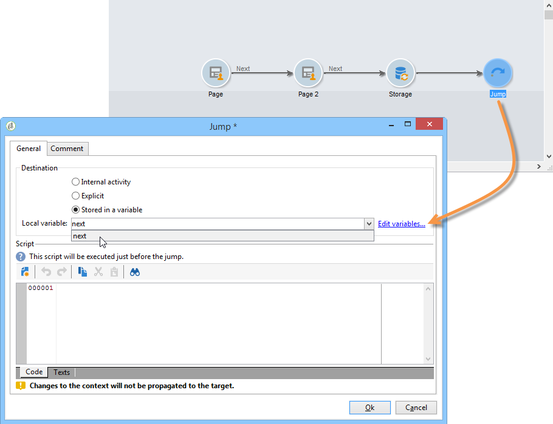

# Definire la sequenza di pagine dei moduli web{#defining-web-forms-page-sequencing}


Il modulo può contenere una o più pagine. Viene creato tramite un diagramma che consente di sequenziare le pagine, testare, eseguire script, passare da una pagina all’altra e registrare i passaggi. La modalità di progettazione dei diagrammi globali è la stessa di un flusso di lavoro di Campaign.

## Informazioni sulla pagina precedente e su quella successiva {#about-previous-page-and-next-page}

Per ogni pagina, puoi eliminare **[!UICONTROL Next]** o **[!UICONTROL Previous]** pulsanti. A questo scopo, seleziona la pagina interessata e l’opzione **[!UICONTROL Disable next page]** o **[!UICONTROL Disallow returning to the previous page]** .


È possibile sostituire questi pulsanti con collegamenti. Consulta [Inserimento di contenuto HTML](static-elements-in-a-web-form.md#inserting-html-content).

## Inserimento di un salto {#inserting-a-jump}

Il **[!UICONTROL Jump]** L&#39;oggetto consente di accedere a un&#39;altra pagina o a un altro modulo quando l&#39;utente fa clic su **[!UICONTROL Next]**.

La destinazione può essere:

* Un&#39;altra pagina del modulo. A questo scopo, seleziona **[!UICONTROL Internal activity]** quindi specifica la pagina desiderata, come indicato di seguito:

  

* Un altro modulo. A questo scopo, seleziona la **[!UICONTROL Explicit]** e specificare il modulo di destinazione.

  

* La destinazione può essere memorizzata in una variabile. In questo caso, selezionalo dall’elenco a discesa, come illustrato di seguito:

  

* Il **[!UICONTROL Comment]** scheda consente di immettere informazioni che saranno visibili dall&#39;operatore quando farà clic sull&#39;oggetto nel diagramma.

  

## Esempio: accesso a un altro modulo in base a un parametro dell’URL {#example--accessing-another-form-according-to-a-parameter-of-the-url}

Nell’esempio seguente, vogliamo configurare un modulo web che, se approvato, visualizzerà un altro modulo designato da un parametro dell’URL. A questo scopo, esegui i seguenti passaggi:

1. Inserisce un salto alla fine di un modulo: questo sostituisce il **[!UICONTROL End]** casella.

   

1. Nelle proprietà del modulo, aggiungi un parametro (**avanti**) memorizzato in una variabile locale (**avanti**). Le variabili locali sono descritte in dettaglio [Memorizzazione dei dati in una variabile locale](web-forms-answers.md#storing-data-in-a-local-variable).

   

1. Modifica il **[!UICONTROL Jump]** oggetto, selezionare il **[!UICONTROL Stored in a variable]** e selezionare il **avanti** dalla casella a discesa.

   

1. L’URL di consegna deve includere il nome interno del modulo di destinazione, ad esempio:

   ```
   https://[myserver]/webForm/APP62?&next=APP22
   ```

   Quando l’utente fa clic su **[!UICONTROL Approve]** pulsante, modulo **APP22** viene visualizzato.

## Inserimento di un collegamento a un&#39;altra pagina del modulo {#inserting-a-link-to-another-page-of-the-form}

È possibile inserire collegamenti ad altre pagine del modulo. Per eseguire questa operazione, aggiungi un **[!UICONTROL Link]** digita elemento statico nella pagina. Per ulteriori informazioni, consulta [Inserimento di un collegamento](static-elements-in-a-web-form.md#inserting-a-link).

## Visualizzazione pagina condizionale {#conditional-page-display}

### Visualizza in base alle risposte {#display-based-on-responses}

Il **[!UICONTROL Test]** consente di condizionare la sequenza delle pagine in un modulo. Consente di definire varie linee di diramazione in base ai risultati del test. Questo consente di visualizzare pagine diverse a seconda delle risposte fornite dagli utenti.

Ad esempio, puoi visualizzare una pagina diversa per i clienti che hanno già effettuato un ordine online e un’altra per quelli che hanno effettuato più di dieci ordini. A tale scopo, nella prima pagina del modulo inserire un **[!UICONTROL Number]** digita un campo di immissione per l’utente per indicare quanti ordini ha effettuato.


È possibile memorizzare queste informazioni in un campo del database oppure utilizzare una variabile locale.

>[!NOTE]
>
>Le modalità di archiviazione sono descritte in dettaglio in [Campi di archiviazione delle risposte](web-forms-answers.md#response-storage-fields).

Nel nostro esempio, vogliamo utilizzare una variabile:


Nel diagramma del modulo inserire una casella di prova per definire le condizioni. Per ogni condizione, verrà aggiunto un nuovo ramo all’output della casella di test.


Seleziona la **[!UICONTROL Activate the default branching]** per aggiungere una transizione nei casi in cui nessuna delle condizioni sia vera. Questa opzione non è necessaria se le condizioni definite riguardano tutti i casi possibili.

Quindi, definisci la sequenza di pagine quando una delle due condizioni è vera, ad esempio:


### Visualizza in base ai parametri {#display-based-on-parameters}

È inoltre possibile personalizzare la sequenza di pagine in base ai parametri di inizializzazione del modulo Web o ai valori memorizzati nel database. Consulta [Parametri URL modulo](defining-web-forms-properties.md#form-url-parameters).

## Aggiunta di script {#adding-scripts}

Il **[!UICONTROL Script]** object consente di immettere direttamente uno script JavaScript, ad esempio per modificare il valore di un campo, recuperare dati dal database o richiamare un’API Adobe Campaign.

## Personalizzazione della pagina finale {#personalizing-the-end-page}

Inserire una pagina finale alla fine del diagramma. La pagina finale viene visualizzata quando l’utente fa clic su **[!UICONTROL Approve]** nel modulo Web.

Per personalizzare questa pagina, fare doppio clic su **[!UICONTROL End]** e inserisci il contenuto della pagina nell’editor centrale.


* Puoi copiare e incollare il contenuto HTML esistente. A questo scopo, fai clic su **[!UICONTROL Display source code]** e inserire il codice HTML.
* Puoi utilizzare un URL esterno; a questo scopo, seleziona l’opzione corrispondente e immetti l’URL della pagina da visualizzare.
