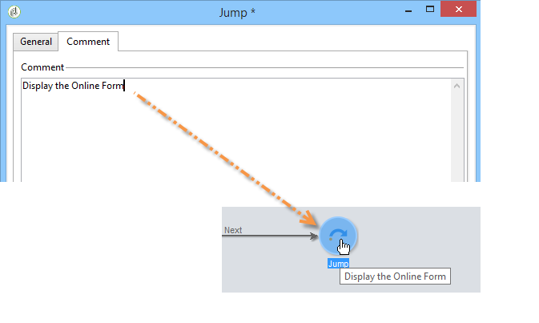

# Define web forms page sequencing{#defining-web-forms-page-sequencing}


Il modulo può contenere una o più pagine. È generato tramite un diagramma che consente di sequenziare pagine, test, esecuzione di script, salto di pagina e passaggi di registrazione. La modalità di progettazione del diagramma globale è la stessa del flusso di lavoro di Campaign.

## Informazioni sulla pagina precedente e sulla pagina successiva {#about-previous-page-and-next-page}

For each page, you can delete the **[!UICONTROL Next]** or **[!UICONTROL Previous]** buttons. To do this, select the page concerned and select the option **[!UICONTROL Disable next page]** or **[!UICONTROL Disallow returning to the previous page]** .


You can replace these buttons with links. Vedi [Inserimento di contenuto HTML](static-elements-in-a-web-form.md#inserting-html-content).

## Inserimento di un salto {#inserting-a-jump}

The **[!UICONTROL Jump]** object gives access to another page or another form when the user clicks **[!UICONTROL Next]**.

La destinazione può essere:

* Another page of the form. To do this, select **[!UICONTROL Internal activity]** and then specify the desired page, as below:

   

* Un altro modulo. A questo scopo, seleziona la **[!UICONTROL Explicit]** e specifica il modulo di destinazione.

   

* La destinazione può essere memorizzata in una variabile. In questo caso, selezionalo dall’elenco a discesa, come illustrato di seguito:

   

* The **[!UICONTROL Comment]** tab lets you enter information that will be visible by the operator when they click the object in the diagram.

   

## Esempio: accesso a un altro modulo in base a un parametro dell’URL {#example--accessing-another-form-according-to-a-parameter-of-the-url}

Nell’esempio seguente, si desidera configurare un modulo Web che, una volta approvato, visualizzerà un altro modulo designato da un parametro dell’URL. A questo scopo, esegui i seguenti passaggi:

1. Insert a jump at the end of a form: this replaces the **[!UICONTROL End]** box.

   

1. Nelle proprietà del modulo, aggiungi un parametro (**next**) memorizzata in una variabile locale (**next**). Local variables are detailed in [Storing data in a local variable](web-forms-answers.md#storing-data-in-a-local-variable).

   

1. Modifica le **[!UICONTROL Jump]** selezionare l&#39;oggetto **[!UICONTROL Stored in a variable]** e seleziona la **next** dalla casella a discesa.

   

1. The delivery URL must include the internal name of the destination form, for example:

   ```
   https://[myserver]/webForm/APP62?&next=APP22
   ```

   Quando l&#39;utente fa clic sul pulsante **[!UICONTROL Approve]** pulsante, modulo **APP22** viene visualizzato.

## Inserimento di un collegamento a un’altra pagina del modulo {#inserting-a-link-to-another-page-of-the-form}

You can insert links to other pages of the form. A questo scopo, aggiungi un **[!UICONTROL Link]** digita un elemento statico nella pagina. Per ulteriori informazioni, consulta [Inserimento di un collegamento](static-elements-in-a-web-form.md#inserting-a-link).

## Conditional page display {#conditional-page-display}

### Visualizzazione in base alle risposte {#display-based-on-responses}

La **[!UICONTROL Test]** consente di condizionare la sequenza delle pagine di un modulo. It lets you define various branch lines depending on test results. Questo consente di visualizzare pagine diverse a seconda delle risposte fornite dagli utenti.

Ad esempio, puoi visualizzare una pagina diversa per i clienti che hanno già ordinato online e un’altra per quelli che hanno effettuato più di dieci ordini. A questo scopo, nella prima pagina del modulo, inserire un **[!UICONTROL Number]** digitare un campo di input per indicare il numero di ordini inseriti.


È possibile memorizzare queste informazioni in un campo del database o utilizzare una variabile locale.

>[!NOTE]
>
>The storage modes are detailed in [Response storage fields](web-forms-answers.md#response-storage-fields).

In our example, we want to use a variable:


In the diagram of the form, insert a test box in order to define the conditions. Per ogni condizione, viene aggiunto un nuovo ramo all’output della casella di test.


Seleziona la **[!UICONTROL Activate the default branching]** per aggiungere una transizione per i casi in cui nessuna delle condizioni è vera. Questa opzione non è necessaria se ogni possibile caso è coperto dalle condizioni definite.

Next, define the page sequencing when one or other of the conditions is true, for example:


### Display based on parameters {#display-based-on-parameters}

È inoltre possibile personalizzare la sequenza delle pagine in base ai parametri di inizializzazione del modulo Web o ai valori memorizzati nel database. Vedi [Parametri URL del modulo](defining-web-forms-properties.md#form-url-parameters).

## Aggiunta di script {#adding-scripts}

La **[!UICONTROL Script]** oggetto ti consente di inserire direttamente uno script JavaScript, ad esempio per modificare il valore di un campo, recuperare dati dal database o chiamare un’API Adobe Campaign.

## Personalizzazione della pagina finale {#personalizing-the-end-page}

You must place an end page at the end of the diagram. La pagina finale viene visualizzata quando l’utente fa clic sul pulsante **[!UICONTROL Approve]** nel modulo Web.

To personalize this page, double-click **[!UICONTROL End]** and enter the content of the page in the central editor.


* Puoi copiare e incollare il contenuto esistente di HTML. A questo scopo, fai clic su **[!UICONTROL Display source code]** e inserire il codice HTML.
* Puoi utilizzare un URL esterno; a questo scopo, seleziona l’opzione corrispondente e immetti l’URL della pagina da visualizzare.
