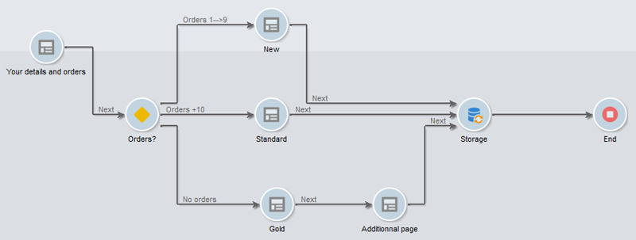

# Definizione della sequenza di pagine dei moduli web{#defining-web-forms-page-sequencing}

Il modulo può contenere una o più pagine. È generato tramite un diagramma che consente di sequenziare pagine, test, esecuzione di script, salto di pagina e passaggi di registrazione. La modalità di progettazione del diagramma globale è la stessa del flusso di lavoro di Campaign.

## Informazioni sulla pagina precedente e sulla pagina successiva {#about-previous-page-and-next-page}

Per ogni pagina è possibile eliminare i pulsanti **[!UICONTROL Next]** o **[!UICONTROL Previous]** . A questo scopo, seleziona la pagina in questione e seleziona l’opzione **[!UICONTROL Disable next page]** o **[!UICONTROL Disallow returning to the previous page]** .


È possibile sostituire questi pulsanti con i collegamenti. Consulta [Inserimento di contenuto HTML](../../web/using/static-elements-in-a-web-form.md#inserting-html-content).

## Inserimento di un salto {#inserting-a-jump}

L&#39;oggetto **[!UICONTROL Jump]** consente di accedere a un&#39;altra pagina o a un altro modulo quando l&#39;utente fa clic su **[!UICONTROL Next]**.

La destinazione può essere:

* Un’altra pagina del modulo. A questo scopo, seleziona **[!UICONTROL Internal activity]** e specifica la pagina desiderata, come segue:

   

* Un altro modulo. A questo scopo, seleziona l’opzione **[!UICONTROL Explicit]** e specifica il modulo di destinazione.

   

* La destinazione può essere memorizzata in una variabile. In questo caso, selezionalo dall’elenco a discesa, come illustrato di seguito:

   

* La scheda **[!UICONTROL Comment]** ti consente di inserire informazioni che saranno visibili dall’operatore quando fa clic sull’oggetto nel diagramma.

   

## Esempio: accesso a un altro modulo in base a un parametro dell&#39;URL {#example--accessing-another-form-according-to-a-parameter-of-the-url}

Nell’esempio seguente, si desidera configurare un modulo Web che, una volta approvato, visualizzerà un altro modulo designato da un parametro dell’URL. A questo scopo, esegui i seguenti passaggi:

1. Inserire un salto alla fine di un modulo: sostituisce la casella **[!UICONTROL End]** .

   

1. Nelle proprietà del modulo, aggiungere un parametro (**next**) memorizzato in una variabile locale (**next**). Le variabili locali sono descritte in [Memorizzazione dei dati in una variabile locale](../../web/using/web-forms-answers.md#storing-data-in-a-local-variable).

   

1. Modifica l&#39;oggetto **[!UICONTROL Jump]**, seleziona l&#39;opzione **[!UICONTROL Stored in a variable]** e seleziona la variabile **next** dalla casella a discesa.

   

1. L’URL di consegna deve includere il nome interno del modulo di destinazione, ad esempio:

   ```
   https://[myserver]/webForm/APP62?&next=APP22
   ```

   Quando l&#39;utente fa clic sul pulsante **[!UICONTROL Approve]**, viene visualizzato il modulo **APP22**.

## Inserimento di un collegamento a un’altra pagina del modulo {#inserting-a-link-to-another-page-of-the-form}

È possibile inserire collegamenti ad altre pagine del modulo. A questo scopo, aggiungi alla pagina un elemento statico di tipo **[!UICONTROL Link]** . Per ulteriori informazioni, consulta [Inserimento di un collegamento](../../web/using/static-elements-in-a-web-form.md#inserting-a-link).

## Visualizzazione della pagina condizionale {#conditional-page-display}

### Visualizzazione in base alle risposte {#display-based-on-responses}

La casella **[!UICONTROL Test]** consente di condizionare la sequenza delle pagine di un modulo. Ti consente di definire varie linee di diramazione a seconda dei risultati del test. Questo consente di visualizzare pagine diverse a seconda delle risposte fornite dagli utenti.

Ad esempio, puoi visualizzare una pagina diversa per i clienti che hanno già ordinato online e un’altra per quelli che hanno effettuato più di dieci ordini. A questo scopo, nella prima pagina del modulo, inserire un campo di input di tipo **[!UICONTROL Number]** per indicare il numero di ordini inseriti dall’utente.


È possibile memorizzare queste informazioni in un campo del database o utilizzare una variabile locale.

>[!NOTE]
>
>Le modalità di archiviazione sono descritte in [Campi di archiviazione di risposta](../../web/using/web-forms-answers.md#response-storage-fields).

Nel nostro esempio, vogliamo utilizzare una variabile:


Nel diagramma del modulo, inserire una casella di prova per definire le condizioni. Per ogni condizione, viene aggiunto un nuovo ramo all’output della casella di test.


Seleziona l’opzione **[!UICONTROL Activate the default branching]** per aggiungere una transizione per i casi in cui nessuna delle condizioni è vera. Questa opzione non è necessaria se ogni possibile caso è coperto dalle condizioni definite.

Quindi, definisci la sequenza di pagine quando una o più condizioni sono soddisfatte, ad esempio:



### Visualizzazione in base ai parametri {#display-based-on-parameters}

È inoltre possibile personalizzare la sequenza delle pagine in base ai parametri di inizializzazione del modulo Web o ai valori memorizzati nel database. Consulta [Parametri URL del modulo](../../web/using/defining-web-forms-properties.md#form-url-parameters).

## Aggiunta di script {#adding-scripts}

L&#39;oggetto **[!UICONTROL Script]** ti consente di inserire direttamente uno script JavaScript, ad esempio per modificare il valore di un campo, recuperare dati dal database o chiamare un&#39;API Adobe Campaign.

## Personalizzazione della pagina finale {#personalizing-the-end-page}

È necessario posizionare una pagina finale alla fine del diagramma. La pagina finale viene visualizzata quando l’utente fa clic sul pulsante **[!UICONTROL Approve]** nel modulo Web.

Per personalizzare questa pagina, fai doppio clic su **[!UICONTROL End]** e immetti il contenuto della pagina nell’editor centrale.


* Puoi copiare e incollare il contenuto HTML esistente. A questo scopo, fai clic su **[!UICONTROL Display source code]** e inserisci il codice HTML.
* Puoi utilizzare un URL esterno; a questo scopo, seleziona l’opzione corrispondente e immetti l’URL della pagina da visualizzare.
