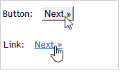

# Definizione delle proprietà dei moduli web{#defining-web-forms-properties}

Puoi configurare e personalizzare completamente i moduli web per soddisfare le tue esigenze. I parametri devono essere immessi nella finestra delle proprietà.

La finestra delle proprietà è accessibile tramite il pulsante **[!UICONTROL Properties]** nella barra degli strumenti del modulo Web. Questa finestra consente di accedere a una serie di impostazioni specifiche del modulo Web. Alcune impostazioni potrebbero derivare dalla configurazione del modello.

## Proprietà modulo generali {#overall-form-properties}

Nella scheda **[!UICONTROL General]** della finestra delle proprietà è possibile modificare l&#39;**Etichetta** del modulo. Si consiglia vivamente di non modificare il **nome interno**.

Il modello di modulo viene scelto durante la creazione del modulo. Non può essere modificato in un secondo momento. Per ulteriori informazioni sulla creazione e la gestione di modelli di modulo, vedere [Utilizzo di un modello di modulo Web](using-a-web-form-template.md).

## Archiviazione dati modulo {#form-data-storage}

Per impostazione predefinita, i campi dei moduli Web vengono memorizzati nella tabella dei destinatari. È possibile modificare la tabella utilizzata selezionando una nuova tabella dal campo **[!UICONTROL Document type]**. L&#39;icona **[!UICONTROL Zoom]** consente di visualizzare il contenuto della tabella selezionata.

Per impostazione predefinita, le risposte sono memorizzate nella tabella **Risposta a un modulo destinatario**.

## Impostazione di una pagina di errore {#setting-up-an-error-page}

Puoi configurare una pagina di errore: questa pagina verrà visualizzata in caso di errori durante l’esecuzione del modulo.

La pagina di errore viene definita nella scheda corrispondente della finestra delle proprietà del modulo.

Per impostazione predefinita, vengono visualizzate le seguenti informazioni:

Il contenuto delle stringhe visualizzate è definito nella scheda **[!UICONTROL Error page]** della finestra delle proprietà. Nella scheda **[!UICONTROL HTML]** viene visualizzato il rendering e la scheda **[!UICONTROL Texts]** consente di modificare le stringhe di testo e aggiungere testo, se necessario:

## Localizzazione dei moduli {#form-localization}

La scheda **[!UICONTROL Localization]** consente di selezionare le lingue di progettazione e visualizzazione per il modulo Web.

Consulta [Traduzione di un modulo web](translating-a-web-form.md).

## Esplorazione e rendering dei moduli {#form-browsing-and-rendering}

La scheda **[!UICONTROL Rendering]** consente di definire il tipo di esplorazione tra le pagine del modulo Web e il modello di rendering utilizzato.

Puoi scegliere di navigare tramite collegamenti o pulsanti.

Per impostazione predefinita, i pulsanti sono gli elementi di navigazione. Consentono di eseguire le azioni seguenti:

* Approvare la pagina corrente e visualizzare la pagina successiva facendo clic su **[!UICONTROL Next]**. Questo pulsante viene visualizzato su tutte le pagine, tranne l’ultima.
* Visualizzare la pagina precedente facendo clic su **[!UICONTROL Previous]**. Questo pulsante viene visualizzato in tutte le pagine, tranne la prima.
* Salvare le risposte del modulo facendo clic sul pulsante **[!UICONTROL Approve]**. Questo pulsante viene visualizzato solo nell&#39;ultima pagina.

Questi elementi vengono visualizzati nella parte inferiore di ogni pagina. Le loro posizioni possono essere cambiate. A tale scopo, è necessario modificare il foglio di stile.

>[!NOTE]
>
>È possibile nascondere il pulsante **[!UICONTROL Previous]** in alcune pagine. A tale scopo, passare alla pagina interessata e selezionare l&#39;opzione **[!UICONTROL Disallow returning to the previous page]**. Questa opzione è accessibile quando si seleziona la directory principale della struttura ad albero della pagina.

Il campo **[!UICONTROL Template]** della scheda **[!UICONTROL Rendering]** consente di selezionare un tema tra quelli disponibili.

I temi vengono salvati nel nodo **[!UICONTROL Administration>Configuration>Form rendering]** della struttura. Vedere [Selezione del modello di rendering del modulo](form-rendering.md#selecting-the-form-rendering-template)

Nella parte inferiore della finestra delle proprietà viene visualizzato un rendering di esempio. L&#39;icona **[!UICONTROL Edit link]** consente di visualizzare la configurazione per il tema selezionato.

## Logo nel modulo {#logo-in-the-form}

È possibile modificare il logo utilizzato nel modulo utilizzando il proprio logo.

Nella scheda **[!UICONTROL Rendering]** all&#39;interno di **[!UICONTROL Properties]** dell&#39;app Web, fare clic sull&#39;icona a forma di vetro del modello:

Nella nuova finestra, fare clic sul collegamento **[!UICONTROL Page layout]**:

Qui è possibile modificare il percorso dell&#39;immagine del logo:

Le immagini disponibili si trovano in **[!UICONTROL Administration]** > **[!UICONTROL Configuration]** > **[!UICONTROL Images]**. Puoi aggiungere il tuo logo qui.

Queste immagini si trovano nella directory back-end dell&#39;istanza *datakit\nms\fra\img\activities* o *datakit\nms\eng\img\activities* (eng o fra, a seconda della lingua dell&#39;istanza).

Per rendere disponibile una nuova immagine in questa directory (e nelle Immagini), contatta il supporto Adobe per apportare modifiche alle directory back-end.

Per le istanze locali, puoi aggiungere autonomamente immagini al datakit.

L’immagine caricata non deve essere visibile dal client Campaign. Il percorso corretto è sufficiente per utilizzare come nuovo logo.

## Testi nel modulo {#texts-in-the-form}

La scheda **[!UICONTROL Page]** consente di definire il contenuto dell&#39;intestazione e del piè di pagina del modulo. Vedere [Definizione di intestazioni e piè di pagina](form-rendering.md#defining-headers-and-footers).

Consente inoltre di gestire le traduzioni. Consulta [Traduzione di un modulo web](translating-a-web-form.md).

## Accessibilità del modulo {#accessibility-of-the-form}

Un modulo Web è accessibile agli utenti se è **[!UICONTROL Online]** e se la data corrente rientra nel relativo periodo di validità. Lo stato del modulo viene modificato durante la fase di pubblicazione (vedere [Pubblicazione di un modulo](publishing-a-web-form.md#publishing-a-form)). Lo stato viene visualizzato nella sezione **Progetto** della scheda **[!UICONTROL General]** della finestra delle proprietà.

Il periodo di validità va dalla data **[!UICONTROL Start]** alla data **[!UICONTROL End date]**. Se in questi campi non è specificata alcuna data, il modulo ha validità permanente.

>[!NOTE]
>
>Se il modulo è chiuso e quindi il periodo di validità non è stato raggiunto o è scaduto, oppure se è stato chiuso dall’operatore Adobe Campaign, quando l’utente tenta di accedervi viene visualizzato un messaggio. È possibile personalizzare il messaggio facendo clic su **[!UICONTROL Personalize the message displayed if the form is closed...]**.

## Controllo dell’accesso ai moduli {#form-access-control}

Per impostazione predefinita, l’accesso ai moduli web viene eseguito in modalità anonima: a tutti gli operatori che accedono al modulo vengono assegnati diritti di operatore WebApp.

È possibile abilitare il controllo degli accessi per la visualizzazione del modulo, ad esempio durante la consegna di un modulo in un sito Intranet, al fine di autenticare gli utenti. A tale scopo, visualizzare la finestra **[!UICONTROL Properties]** del modulo interessato e fare clic sull&#39;opzione **[!UICONTROL Enable access control]**, come illustrato di seguito:

Quando si accede alla pagina, viene visualizzato il seguente modulo di autenticazione:

L’accesso e la password sono quelli utilizzati dagli operatori Adobe Campaign. Per ulteriori informazioni al riguardo, consulta [questa sezione](../../platform/using/access-management.md).

L&#39;opzione **[!UICONTROL Use a specific account]** consente di limitare l&#39;autorizzazione di lettura o scrittura dell&#39;operatore che accede al modulo. Utilizza la casella a discesa per selezionare un operatore o un gruppo di operatori che saranno responsabili della concessione di queste autorizzazioni.

## Parametri URL modulo {#form-url-parameters}

Puoi aggiungere parametri aggiuntivi nell’URL di un modulo per personalizzarne il contenuto e inizializzare un contesto (lingua, ID destinatario crittografato, società, formula calcolata memorizzata in una variabile, ecc.). Ciò ti consente di accedere a un modulo tramite diversi URL diversi e di personalizzare il contenuto della pagina in base al valore dei parametri indicati nell’URL.

Per impostazione predefinita, Adobe Campaign offre parametri per la visualizzazione in anteprima del modulo e il controllo degli errori. È possibile creare nuove impostazioni collegate al modulo, che possono utilizzare i valori di un campo del database o di una variabile locale.

## Parametri standard {#standard-parameters}

Per impostazione predefinita sono disponibili i seguenti parametri:

* **id** per indicare l&#39;identificatore crittografato.
* **lang** per modificare la lingua di visualizzazione.
* **origine** per specificare l&#39;origine del rispondente.
* **_uuid** consente la visualizzazione dei moduli prima della pubblicazione e il rilevamento degli errori. Questo parametro è per uso interno (creazione ed debug): quando accedi al modulo Web tramite questo URL, i record creati non vengono presi in considerazione nel tracciamento (report). L&#39;origine è forzata al valore **[!UICONTROL Adobe Campaign]**.

  Viene utilizzato con i parametri **_preview** e/o **_debug**:

  **_preview** per visualizzare l&#39;ultima versione salvata. Questo parametro deve essere utilizzato solo nella fase di test.

  **_debug** per visualizzare la traccia dei dati immessi o calcolati nelle pagine del modulo. Viene utilizzato per ottenere ulteriori informazioni sugli errori, anche dopo la pubblicazione del modulo.

  >[!CAUTION]
  >
  >Quando il modulo viene visualizzato tramite un URL con il parametro **_uuid**, il valore del parametro **[!UICONTROL origin]** viene forzato a **Adobe Campaign**.

## Aggiunta di parametri {#adding-parameters}

I parametri possono essere aggiunti tramite la scheda **[!UICONTROL Parameters...]** nella finestra Proprietà del modulo. Possono essere rese obbligatorie, come illustrato di seguito:

Specificare un percorso di archiviazione da cui recuperare il valore del parametro. A tale scopo, selezionare una delle opzioni di archiviazione, quindi fare clic sulla scheda **[!UICONTROL Storage]** per selezionare il campo o la variabile interessata. Le opzioni di archiviazione sono descritte in dettaglio nei [campi di archiviazione delle risposte](web-forms-answers.md#response-storage-fields).

Lo stato del partecipante (0, 1 o qualsiasi altro valore) può quindi essere aggiunto all’URL per accedere al modulo. Queste informazioni possono essere riutilizzate nelle pagine del modulo o in una casella di prova. Le pagine visualizzate possono essere condizionate in base al valore del contesto, come illustrato di seguito:

1. Home page per i clienti (**stato=1**):

   

1. Home page per i potenziali clienti (**stato=0**):

   

1. Home page per altri profili (ad esempio, **status=12**):

   

Per configurare questo modulo, creare una casella di prova e posizionarla all&#39;inizio del diagramma, come illustrato di seguito:

La casella di test consente di configurare le condizioni di sequenza della pagina:

