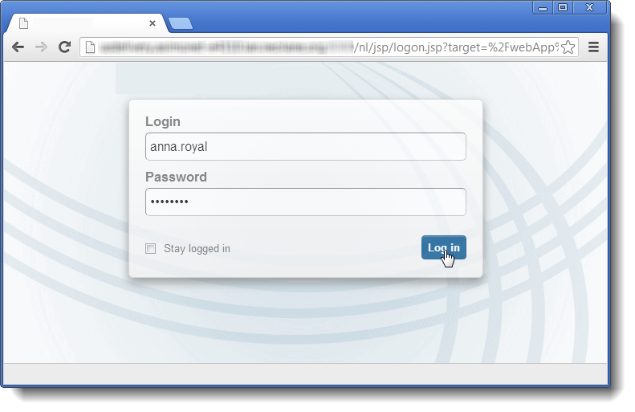

# Definizione delle proprietà dei moduli web{#defining-web-forms-properties}

È possibile configurare e personalizzare completamente i moduli web per soddisfare le proprie esigenze. I parametri devono essere immessi nella finestra delle proprietà.

La finestra delle proprietà è accessibile tramite il pulsante **[!UICONTROL Properties]** nella barra degli strumenti del modulo Web. Questa finestra consente di accedere a una serie di impostazioni specifiche del modulo Web. Alcune impostazioni possono derivare dalla configurazione del modello.

## Proprietà modulo globali {#overall-form-properties}

Nella scheda **[!UICONTROL General]** della finestra delle proprietà è possibile modificare il valore **Etichetta** del modulo. Si consiglia vivamente di non modificare il **nome interno**.

Il modello di modulo viene scelto durante la creazione del modulo. Non può essere modificato in un secondo momento. Per ulteriori informazioni sulla creazione e la gestione dei modelli di modulo, vedere [Uso di un modello di modulo web](using-a-web-form-template.md).

## Archiviazione dati modulo {#form-data-storage}

Per impostazione predefinita, i campi dei moduli web sono memorizzati nella tabella dei destinatari. È possibile modificare la tabella utilizzata selezionando una nuova tabella dal campo **[!UICONTROL Document type]** . L’icona **[!UICONTROL Zoom]** ti consente di visualizzare il contenuto della tabella selezionata.

Per impostazione predefinita, le risposte sono memorizzate nella tabella **Risposta a un modulo destinatario** .

## Configurazione di una pagina di errore {#setting-up-an-error-page}

Puoi configurare una pagina di errore: questa pagina verrà visualizzata in caso di errori durante l’esecuzione del modulo.

La pagina di errore è definita nella scheda corrispondente della finestra delle proprietà del modulo.

Per impostazione predefinita, vengono visualizzate le seguenti informazioni:

Il contenuto delle stringhe visualizzate è definito nella scheda **[!UICONTROL Error page]** della finestra delle proprietà. La scheda **[!UICONTROL HTML]** visualizza il rendering e la scheda **[!UICONTROL Texts]** consente di modificare le stringhe di testo e aggiungere eventuale testo:

## Localizzazione dei moduli {#form-localization}

La scheda **[!UICONTROL Localization]** consente di selezionare le lingue di progettazione e visualizzazione del modulo Web.

Vedere [Traduzione di un modulo web](translating-a-web-form.md).

## Navigazione e rendering dei moduli {#form-browsing-and-rendering}

La scheda **[!UICONTROL Rendering]** consente di definire il tipo di navigazione tra le pagine del modulo Web e il modello di rendering utilizzato.

Puoi scegliere di navigare tramite collegamenti o pulsanti.

Per impostazione predefinita, i pulsanti sono gli elementi di navigazione. Consentono di eseguire le azioni seguenti:

* Approva la pagina corrente e visualizza la pagina successiva facendo clic su **[!UICONTROL Next]**. Questo pulsante viene visualizzato su tutte le pagine tranne l’ultima.
* Visualizzare la pagina precedente facendo clic su **[!UICONTROL Previous]**. Questo pulsante viene visualizzato su tutte le pagine tranne la prima.
* Salva le risposte del modulo facendo clic sul pulsante **[!UICONTROL Approve]** . Questo pulsante viene visualizzato solo nell’ultima pagina.

Questi elementi vengono visualizzati nella parte inferiore di ogni pagina. Le loro posizioni possono essere modificate. A questo scopo, è necessario modificare il foglio di stile.

>[!NOTE]
>
>È possibile nascondere il pulsante **[!UICONTROL Previous]** su alcune pagine. A questo scopo, vai alla pagina interessata e seleziona l’opzione **[!UICONTROL Disallow returning to the previous page]** . Questa opzione è accessibile quando è selezionato il livello principale della struttura delle pagine.

Il campo **[!UICONTROL Template]** della scheda **[!UICONTROL Rendering]** ti consente di selezionare un tema tra quelli disponibili.

I temi vengono salvati nel nodo **[!UICONTROL Administration>Configuration>Form rendering]** della struttura. Vedere [Selezione del modello di rendering del modulo](form-rendering.md#selecting-the-form-rendering-template)

Un esempio di rendering viene visualizzato nella parte inferiore della finestra delle proprietà. L’icona **[!UICONTROL Edit link]** ti consente di visualizzare la configurazione del tema selezionato.

## Testi in forma {#texts-in-the-form}

La scheda **[!UICONTROL Page]** consente di definire il contenuto dell’intestazione e del piè di pagina del modulo. Vedere [Definizione di intestazioni e piè di pagina](form-rendering.md#defining-headers-and-footers).

Permette inoltre di gestire le traduzioni. Vedere [Traduzione di un modulo web](translating-a-web-form.md).

## Accessibilità del modulo {#accessibility-of-the-form}

Un modulo Web è accessibile agli utenti se è **[!UICONTROL Online]** e se la data corrente si trova entro il periodo di validità. Lo stato del modulo viene modificato durante la fase di pubblicazione (vedere [Pubblicazione di un modulo](publishing-a-web-form.md#publishing-a-form)). Lo stato viene visualizzato nella sezione **Progetto** della scheda **[!UICONTROL General]** della finestra delle proprietà.

Il periodo di validità va dalla data **[!UICONTROL Start]** alla data **[!UICONTROL End date]**. Se in questi campi non sono specificate date, il modulo ha validità permanente.

>[!NOTE]
>
>Se il modulo è chiuso e quindi il relativo periodo di validità non è stato raggiunto o è scaduto oppure se è stato chiuso dall’operatore Adobe Campaign, viene visualizzato un messaggio quando l’utente tenta di accedervi. Puoi personalizzare il messaggio facendo clic su **[!UICONTROL Personalize the message displayed if the form is closed...]**.

## Controllo dell’accesso al modulo {#form-access-control}

Per impostazione predefinita, l’accesso ai moduli web viene eseguito in modalità anonima: a tutti gli operatori che accedono al modulo vengono assegnati diritti di operatore WebApp.

Per autenticare gli utenti, è possibile abilitare il controllo degli accessi per la visualizzazione del modulo, ad esempio durante la distribuzione di un modulo su un sito Intranet. A questo scopo, visualizzare la finestra **[!UICONTROL Properties]** del modulo interessato e fare clic sull&#39;opzione **[!UICONTROL Enable access control]**, come illustrato di seguito:

Quando si accede alla pagina, viene visualizzato il seguente modulo di autenticazione:

Gli accessi e le password sono quelli utilizzati dagli operatori Adobe Campaign. Per ulteriori informazioni al riguardo, consulta [questa sezione](../../platform/using/access-management.md).

L’opzione **[!UICONTROL Use a specific account]** consente di limitare l’autorizzazione di lettura o scrittura dell’operatore che accede al modulo. Utilizzare la casella a discesa per selezionare un operatore o un gruppo di operatori incaricati di concedere queste autorizzazioni.

## Parametri URL del modulo {#form-url-parameters}

È possibile aggiungere parametri aggiuntivi nell’URL di un modulo per personalizzare il contenuto e inizializzare un contesto (lingua, ID destinatario crittografato, azienda, formula calcolata memorizzata in una variabile, ecc.). Questo consente di accedere a un modulo tramite diversi URL e di personalizzare il contenuto della pagina in base al valore dei parametri indicati nell’URL.

Per impostazione predefinita, Adobe Campaign offre parametri per la visualizzazione dell’anteprima del modulo e per il controllo degli errori. È possibile creare nuove impostazioni collegate al modulo, che possono utilizzare i valori di un campo nel database o di una variabile locale.

## Parametri standard {#standard-parameters}

Per impostazione predefinita sono disponibili i seguenti parametri:

* **** per indicare l’identificatore crittografato.
* **** per modificare la lingua di visualizzazione.
* **origine** specifica l’origine del convenuto.
* **_** uidabilita la visualizzazione del modulo prima della pubblicazione e il tracciamento degli errori. Questo parametro è per uso interno (creazione e debug): quando si accede al modulo web tramite questo URL, i record creati non vengono presi in considerazione nel monitoraggio (report). L&#39;origine viene forzata al valore **[!UICONTROL Adobe Campaign]**.

   Viene utilizzato con i parametri **_preview** e/o **_debug**:

   **_** visualizza in anteprima l&#39;ultima versione salvata. Questo parametro deve essere utilizzato solo nella fase di prova.

   **_** esegui il debug per visualizzare la traccia dei dati immessi o calcolati nelle pagine del modulo. Viene utilizzato per ottenere ulteriori informazioni sugli errori, anche dopo la pubblicazione del modulo.

   >[!CAUTION]
   >
   >Quando il modulo viene visualizzato tramite un URL con il parametro **_uuid**, il valore del parametro **[!UICONTROL origin]** viene forzato su **Adobe Campaign**.

## Aggiunta di parametri {#adding-parameters}

I parametri possono essere aggiunti tramite la scheda **[!UICONTROL Parameters...]** nella finestra Proprietà del modulo. Possono essere rese obbligatorie, come illustrato di seguito:

È necessario specificare un percorso di archiviazione dal quale verrà recuperato il valore del parametro. A questo scopo, selezionare una delle opzioni di archiviazione, quindi fare clic sulla scheda **[!UICONTROL Storage]** per selezionare il campo o la variabile interessata. Le opzioni di archiviazione sono descritte in [Campi di archiviazione di risposta](web-forms-answers.md#response-storage-fields).

Lo stato corrispondente (0, 1 o qualsiasi altro valore) può quindi essere aggiunto all’URL per accedere al modulo. Queste informazioni possono essere riutilizzate nelle pagine del modulo o in una casella di test. Le pagine visualizzate possono essere condizionate in base al valore del contesto, come illustrato di seguito:

1. Home page per i clienti (**status=1**):

   

1. Home page per i potenziali clienti (**status=0**):

   

1. Home page per altri profili (ad esempio, **status=12**):

   

Per configurare questo modulo, crea una casella di prova e posizionala all’inizio del diagramma, come illustrato di seguito:

La casella di test consente di configurare le condizioni di sequenza della pagina:

