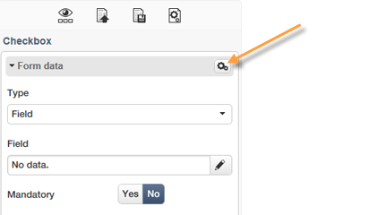

# Modificare i contenuti{#editing-content}

## Definizione di una condizione di visibilità {#defining-a-visibility-condition}

Puoi specificare una condizione di visibilità in un elemento della pagina web: questo elemento sarà visibile solo se la condizione viene rispettata.

Per aggiungere una condizione di visibilità, selezionare un blocco e immetterla nel campo **[!UICONTROL Visibility condition]** utilizzando l&#39;editor di espressioni.

>[!NOTE]
>
>La modifica avanzata delle espressioni viene presentata in [questa pagina](../../platform/using/adobe-campaign-workspace.md#about-queries-in-campaign).

Queste condizioni adottano la sintassi dell&#39;espressione XTK (ad esempio **ctx.recipient.@email!= &quot;** o **ctx.recipient.@status==&quot;0&quot;**). Per impostazione predefinita, tutti i campi sono visibili.

>[!NOTE]
>
>Non è possibile modificare i blocchi dinamici non visibili, ad esempio i menu a discesa.

## Aggiunta di un bordo e uno sfondo {#adding-a-border-and-background}

Puoi aggiungere un **bordo** a un blocco selezionato. I bordi vengono definiti utilizzando tre opzioni: stile, dimensione e colore.

È inoltre possibile definire un **colore di sfondo** selezionando un colore dal grafico a colori.

## Modifica dei moduli {#editing-forms}

### Modifica delle proprietà dei dati per un modulo {#changing-the-data-properties-for-a-form}

Puoi collegare i campi del database con zone di input, pulsanti di scelta o blocchi di tipo casella di controllo.

>[!NOTE]
>
>I campi predefiniti sono quelli dello schema di archiviazione dell&#39;applicazione Web.

L&#39;area di input **field** consente di selezionare un campo di database da collegare al campo modulo.

Per impostazione predefinita, i campi offerti sono quelli della tabella **nms:recipient**.

L&#39;opzione **Campo obbligatorio** consente di autorizzare l&#39;approvazione della pagina solo se l&#39;utente ha compilato il campo. Se non viene compilato un campo obbligatorio, viene visualizzato un messaggio di errore.

Per i pulsanti di scelta e le caselle di controllo, **è richiesta una configurazione aggiuntiva**.

In effetti, se il modello utilizzato non contiene un valore per impostazione predefinita, devi completarlo nell’editor.

Per eseguire questa operazione:

* Fare clic sull&#39;icona **[!UICONTROL Edit]**.

  

* Immettere il valore dell&#39;elenco dettagliato (definito dal campo selezionato) nel campo **[!UICONTROL Value]**.

  

### Modifica dei campi modulo {#modifying-form-fields}

Campi modulo come pulsanti di scelta, aree di input, elenchi a discesa e così via. possono essere modificati dalle rispettive barre degli strumenti.

Ciò significa che è possibile:

* Eliminare il blocco contenente i campi modulo utilizzando l&#39;icona **[!UICONTROL Delete]**.
* Duplica il campo selezionato creando un nuovo blocco utilizzando l&#39;icona **[!UICONTROL Duplicate]**.
* Modificare la finestra **[!UICONTROL Form data]** per collegare un campo del database alla zona del modulo utilizzando l&#39;icona **[!UICONTROL Edit]**.

  

## Aggiunta di un&#39;azione a un pulsante {#adding-an-action-to-a-button}

Quando l’utente fa clic su un pulsante, puoi definire un’azione associata. A questo scopo, seleziona l’azione da eseguire dall’elenco a discesa.

Le azioni disponibili sono le seguenti:

* **[!UICONTROL Refresh]** : aggiorna la pagina corrente.
* **[!UICONTROL Next page]** : crea un collegamento alla pagina successiva nell&#39;applicazione Web.
* **[!UICONTROL Previous page]** : crea un collegamento alla pagina precedente nell&#39;applicazione Web.

>[!NOTE]
>
>Il valore **[!UICONTROL None]** ti consente di non attivare il pulsante.

Puoi modificare l’etichetta collegata al pulsante nel campo corrispondente.

## Aggiunta di un collegamento {#adding-a-link}

Puoi inserire un collegamento in qualsiasi elemento della pagina: immagine, parola, gruppo di parole, blocco di testo, ecc.

A questo scopo, seleziona l’elemento e utilizza la prima icona dal menu a comparsa.

Questa icona ti consente di accedere a tutti i tipi di collegamenti disponibili.

I blocchi e i campi di personalizzazione possono essere inseriti solo in blocchi di tipo Testo.

>[!NOTE]
>
>Per ogni tipo di collegamento, puoi configurare la modalità di apertura: seleziona la finestra di destinazione nell&#39;elenco a discesa **Target**. Questo valore corrisponde al tag HTML **`<target>`**.
>
>L&#39;elenco delle **destinazioni** disponibili è il seguente:
>
>* Altro (IFrame)
>* Finestra superiore (_top)
>* Finestra padre (_parent)
>* Nuova finestra (_blank)
>* Finestra corrente (_self)
>* Comportamento predefinito del browser
>

### Collegamento a un URL {#link-to-a-url}

L&#39;opzione **Collega a un URL esterno** consente di aprire qualsiasi URL dal contenuto di origine.

Immetti l&#39;indirizzo del collegamento in questione nel campo **URL**. Il campo URL deve essere immesso come: **https://www.myURL.com**.

### Collegamento a un’applicazione web {#link-to-a-web-application}

L&#39;opzione **Collega a un&#39;applicazione Web** consente di accedere a un&#39;applicazione Web Adobe Campaign.

Selezionare l&#39;applicazione Web dal campo corrispondente.

L&#39;elenco delle applicazioni Web suggerite corrisponde alle applicazioni disponibili nel nodo **[!UICONTROL Resources > Online > Web Applications]**.

### Collegamento a un’azione {#link-to-an-action}

Il **collegamento che definisce un&#39;azione** consente di configurare un&#39;azione quando si fa clic su un elemento di origine.

>[!NOTE]
>
>Le azioni disponibili sono descritte in dettaglio nella sezione [Aggiunta di un&#39;azione a un pulsante](#adding-an-action-to-a-button).

### Eliminare un collegamento {#delete-a-link}

Dopo aver inserito un collegamento, la barra degli strumenti offre due nuove icone: **Modifica collegamento** e **Interrompi collegamento** che consentono di interagire con il collegamento creato.

* **[!UICONTROL Edit link]** consente di visualizzare una finestra con tutti i parametri del collegamento.
* **[!UICONTROL Break the link]** ti consente di eliminare, dopo la conferma, il collegamento e tutti i parametri correlati.

>[!NOTE]
>
>Se il collegamento viene eliminato, il contenuto viene comunque mantenuto.

## Modifica degli attributi dei caratteri {#changing-font-attributes}

Quando selezionate un elemento di testo, potete modificare gli attributi del carattere (stile, formato).

Le opzioni disponibili sono le seguenti:

* Icona **Ingrandisci carattere**: aumenta le dimensioni del testo selezionato (aggiungere ``)
* **Icona Riduci font**: riduce le dimensioni del testo selezionato (aggiungi ``)
* Icona **Bold**: applica il grassetto al testo selezionato (applica il tag `<strong> </strong>` al testo a capo)
* Icona **Corsivo**: rende il testo selezionato corsivo (testo a capo con il tag `<em> </em>`)
* Icona **Sottolineato**: rende il testo selezionato sottolineato (testo a capo con il tag ``)
* **Icona Allinea a sinistra**: allinea il testo a sinistra del blocco selezionato (aggiungere style=&quot;text-align: left;&quot;)
* Icona **Centra**: centra il testo per il blocco selezionato (aggiungi style=&quot;text-align: center;&quot;)
* **Icona Allinea a destra**: allinea il testo a destra del blocco selezionato (aggiungere style=&quot;text-align: right;&quot;)
* **Cambia il colore di sfondo** icona: consente di modificare il colore di sfondo per il blocco selezionato (aggiungere style=&quot;background-color: rgba(170, 86, 255, 0.87))
* Icona **Cambia colore del testo**: consente di modificare il colore del testo del blocco selezionato o solo del testo selezionato (``)

>[!NOTE]
>
>* Icona **Elimina**: elimina il blocco e tutto il relativo contenuto.
>
>* Icona **Duplica**: duplica il blocco e tutti gli stili ad esso correlati.

## Gestione di immagini e animazioni {#managing-images-and-animations}

Digital Content Editor consente di lavorare su **qualsiasi tipo di immagine** compatibile con i browser.

>[!CAUTION]
>
>Non devi richiamare file esterni in un tag **script** della pagina HTML. Questi file non verranno importati sul server Adobe Campaign.

### Aggiunta/eliminazione/duplicazione di un’immagine {#adding---deleting---duplicating-an-image}

Per inserire un&#39;immagine, seleziona un blocco di tipo Immagine e fai clic sull&#39;icona **Immagine**.

Selezionare un file di immagine salvato localmente.

L&#39;icona **Elimina** elimina il tag contenente l&#39;immagine.

L&#39;icona **Duplica** duplica il tag e il relativo contenuto.

>[!CAUTION]
>
>Quando si duplica un&#39;immagine, gli identificatori relativi alla nuova immagine vengono eliminati.

### Modifica delle proprietà dell’immagine {#editing-image-properties}

Quando selezioni un blocco contenente un’immagine, puoi accedere alle seguenti proprietà:

* **Didascalia** consente di definire la didascalia collegata all&#39;immagine (corrisponde all&#39;attributo HTML **alt**).
* **Dimensioni** consente di specificare la dimensione dell&#39;immagine, in pixel.

  

## Aggiunta di contenuti di personalizzazione {#adding-personalization-content}

### Inserimento di un campo di personalizzazione {#inserting-a-personalization-field}

L&#39;opzione **Campo Personalization** per l&#39;icona Inserisci consente di aggiungere un campo di database al contenuto, ad esempio il nome del destinatario. Questa opzione è disponibile solo per i blocchi di testo.

Per impostazione predefinita, i campi offerti provengono dalla tabella **[!UICONTROL Recipient]**. Se necessario, modificare le proprietà dell&#39;applicazione Web per selezionare un&#39;altra tabella.

Il nome del campo viene visualizzato nell’editor ed evidenziato in giallo. Verrà sostituito dal profilo del destinatario di destinazione al momento della generazione della personalizzazione (ad esempio, quando si visualizza l’anteprima di una pagina di destinazione).

Un esempio è presentato nella sezione [Inserimento di un campo di personalizzazione](creating-a-landing-page.md#inserting-a-personalization-field).

### Inserimento di un blocco di personalizzazione {#inserting-a-personalization-block}

L&#39;opzione **Blocco Personalization** consente di inserire blocchi dinamici e personalizzati nel contenuto. Ad esempio, puoi aggiungere un logo o un messaggio di saluto. Non è disponibile per i blocchi di tipo Testo.

Una volta inserito, il nome del blocco di personalizzazione viene visualizzato nell’editor ed evidenziato in giallo. Viene adattato automaticamente al profilo del destinatario quando viene generata la personalizzazione.

Per ulteriori informazioni sui blocchi di personalizzazione incorporati e su come definire blocchi di personalizzazione personalizzati, consulta la [documentazione di Campaign v8](https://experienceleague.adobe.com/docs/campaign/campaign-v8/send/personalize/personalization-blocks.html?lang=it){target="_blank"}.
