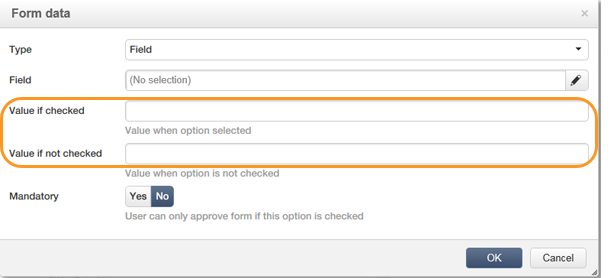
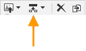

# Modifica del contenuto{#editing-content}

## Definizione di una condizione di visibilità {#defining-a-visibility-condition}

Potete specificare una condizione di visibilità su un elemento di pagina Web: questo elemento sarà visibile solo se la condizione è rispettata.

Per aggiungere una condizione di visibilità, selezionare un blocco e immettere la condizione nel campo **[!UICONTROL Visibility condition]** utilizzando l&#39;editor di espressioni.

>[!NOTE]
>
>La modifica avanzata delle espressioni viene presentata in [questa pagina](../../platform/using/defining-filter-conditions.md#list-of-functions).

Queste condizioni adottano la sintassi dell&#39;espressione XTK (ad esempio **ctx.Recipients.@email!= &quot;&quot;** o **ctx.Recipients.@status==&quot;0&quot;**). Per impostazione predefinita, tutti i campi sono visibili.

>[!NOTE]
>
>I blocchi dinamici non visibili, come i menu a discesa, non possono essere modificati.

## Aggiunta di un bordo e uno sfondo {#adding-a-border-and-background}

È possibile aggiungere un **bordo** a un blocco selezionato. I bordi sono definiti utilizzando tre opzioni: stile, dimensione e colore.

È inoltre possibile definire un **colore di sfondo** selezionando un colore dalla tavola colori.

## Modifica dei moduli {#editing-forms}

### Modifica delle proprietà dei dati per un modulo {#changing-the-data-properties-for-a-form}

È possibile collegare i campi del database con aree di input, pulsanti di scelta o blocchi di tipo casella di controllo.

>[!NOTE]
>
>I campi predefiniti sono quelli dello schema di memorizzazione dell&#39;applicazione Web.

La zona di input **field** consente di selezionare un campo di database da collegare al campo del modulo.

Per impostazione predefinita, i campi offerti sono quelli presenti nella tabella **nms:receive**.

L&#39;opzione **Campo obbligatorio** consente di autorizzare l&#39;approvazione della pagina solo se l&#39;utente ha compilato il campo. Se non viene compilato un campo obbligatorio, verrà visualizzato un messaggio di errore.

Per i pulsanti di scelta e le caselle di controllo, è necessaria **una configurazione aggiuntiva**.

Se il modello utilizzato non contiene un valore per impostazione predefinita, è necessario completarlo nell&#39;editor.

Per eseguire questa operazione:

* Fate clic sull&#39;icona **[!UICONTROL Edit]**.

   

* Immettere il valore dell&#39;elenco dettagliato (definito dal campo selezionato) nel campo **[!UICONTROL Value]**.

   

### Modifica dei campi modulo {#modifying-form-fields}

Campi modulo come pulsanti di scelta, aree di input, elenchi a discesa e così via. può essere modificato dalle relative barre degli strumenti.

Questo consente di:

* Eliminare il blocco contenente i campi del modulo utilizzando l&#39;icona **[!UICONTROL Delete]**.
* Duplica il campo selezionato creando un nuovo blocco utilizzando l&#39;icona **[!UICONTROL Duplicate]**.
* Modificare la finestra **[!UICONTROL Form data]** per collegare un campo di database all&#39;area del modulo, utilizzando l&#39;icona **[!UICONTROL Edit]**.

   

## Aggiunta di un&#39;azione a un pulsante {#adding-an-action-to-a-button}

Quando l&#39;utente fa clic su un pulsante, è possibile definire un&#39;azione associata. A tale scopo, selezionare l&#39;azione da eseguire dall&#39;elenco a discesa.

Le azioni disponibili sono le seguenti:

* **[!UICONTROL Refresh]** : aggiorna la pagina corrente.
* **[!UICONTROL Next page]** : crea un collegamento alla pagina successiva nell’applicazione Web.
* **[!UICONTROL Previous page]** : crea un collegamento alla pagina precedente nell’applicazione Web.

>[!NOTE]
>
>Il valore **[!UICONTROL None]** consente di non attivare il pulsante.

È possibile modificare l&#39;etichetta collegata al pulsante nel campo corrispondente.

## Aggiunta di un collegamento {#adding-a-link}

Puoi inserire un collegamento in qualsiasi elemento di pagina: immagine, parola, gruppo di parole, blocco di testo, ecc.

A questo scopo, selezionate l&#39;elemento e utilizzate la prima icona dal menu a comparsa.

Questa icona consente di accedere a tutti i tipi di collegamenti disponibili.

I blocchi e i campi di personalizzazione possono essere inseriti solo nei blocchi di tipo Testo.

>[!NOTE]
>
>Per ogni tipo di collegamento, puoi configurare la modalità di apertura: selezionate la finestra di destinazione nell&#39;elenco a discesa **Target**. Questo valore corrisponde al tag HTML **`<target>`**.
>
>L&#39;elenco di **target** disponibili è il seguente:
>
>* Altro (IFrame)
>* Finestra superiore (_top)
>* Finestra principale (_parent)
>* Nuova finestra (_blank)
>* Finestra corrente (_self)
>* Comportamento browser predefinito

>

### Collegamento a un URL {#link-to-a-url}

L&#39;opzione **Collega a un URL esterno** consente di aprire qualsiasi URL dal contenuto sorgente.

Immettete l&#39;indirizzo del collegamento in questione nel campo **URL**. Il campo URL deve essere immesso come segue: **https://www.myURL.com**.

### Collegamento a un&#39;applicazione Web {#link-to-a-web-application}

L&#39;opzione **Collega a un&#39;applicazione Web** consente di accedere a un&#39;applicazione Web  Adobe Campaign.

Selezionare l&#39;applicazione Web dal campo corrispondente.

L&#39;elenco delle applicazioni Web suggerite corrisponde alle applicazioni disponibili nel nodo **[!UICONTROL Resources > Online > Web Applications]**.

### Collegamento a un&#39;azione {#link-to-an-action}

L&#39;opzione **Collegamento che definisce un&#39;azione** consente di configurare un&#39;azione quando si fa clic su un elemento di origine.

>[!NOTE]
>
>Le azioni disponibili sono descritte in dettaglio nella sezione [Aggiunta di un&#39;azione a un pulsante](#adding-an-action-to-a-button).

### Eliminare un collegamento {#delete-a-link}

Quando è stato inserito un collegamento, la barra degli strumenti offre due nuove icone: **Modifica collegamento** e **Interrompi collegamento** che consente di interagire con il collegamento creato.

* **[!UICONTROL Edit link]** consente di visualizzare una finestra con tutti i parametri del collegamento.
* **[!UICONTROL Break the link]** consente di eliminare, dopo la conferma, il collegamento e tutti i parametri correlati.

>[!NOTE]
>
>Se il collegamento viene eliminato, il contenuto continua a essere mantenuto.

## Modifica degli attributi di font {#changing-font-attributes}

Quando selezionate un elemento di testo, potete modificare gli attributi del font (stile, formato).

Le opzioni disponibili sono le seguenti:

* **Ingrandisci** fonticon: aumenta le dimensioni del testo selezionato (aggiungi  ``)
* **Ridurre la** fonticon: riduce le dimensioni del testo selezionato (aggiungi  ``)
* **** Boldicon: rende il testo selezionato in grassetto (con il  `<strong> </strong>` tag)
* **Icona** corsivo: rende il testo selezionato in corsivo (il testo viene racchiuso con il   `<em> </em>` tag)
* **Icona** sottolineatura: rende sottolineato il testo selezionato (racchiude il testo con il  `` tag)
* **Allinea a** sinistra: allinea il testo a sinistra del blocco selezionato (aggiungi stile=&quot;text-align: left;&quot;)
* **Icona** centrale: centra il testo per il blocco selezionato (add style=&quot;text-align: center;&quot;)
* **Allinea** a destra: allinea il testo a destra del blocco selezionato (aggiungi stile=&quot;text-align: right;&quot;)
* **Cambia l’** icona del colore di sfondo: consente di modificare il colore di sfondo del blocco selezionato (aggiungere stile=&quot;background-color: rgba(170, 86, 255, 0.87)
* **Cambia l’** icona del colore del testo: consente di modificare il colore del testo del blocco selezionato o solo del testo selezionato (``)

>[!NOTE]
>
>* **Icona** Elimina: elimina il blocco e tutto il relativo contenuto.
   >
   >
* **Icona** Duplicato: duplica il blocco e tutti gli stili correlati al blocco.

## Gestione di immagini e animazioni {#managing-images-and-animations}

Digital Content Editor consente di lavorare su **qualsiasi tipo di immagine** compatibile con i browser.

>[!CAUTION]
>
>Non è necessario richiamare i file esterni in un tag **script** della pagina HTML. Questi file non verranno importati nel server Adobe Campaign .

### Aggiunta/eliminazione/duplicazione di un&#39;immagine {#adding---deleting---duplicating-an-image}

Per inserire un&#39;immagine, selezionare un blocco tipo di immagine e fare clic sull&#39;icona **Image**.

Selezionate un file di immagine salvato localmente.

L&#39;icona **Elimina** elimina il tag  che contiene l&#39;immagine.

L&#39;icona **Duplica** duplica il tag  e il relativo contenuto.

>[!CAUTION]
>
>Quando duplicate un’immagine, gli identificatori relativi alla nuova immagine vengono eliminati.

### Modifica delle proprietà immagine {#editing-image-properties}

Quando si seleziona un blocco contenente un&#39;immagine, è possibile accedere alle proprietà seguenti:

* **In** Captionconsente di definire la didascalia collegata all’immagine (corrispondente all’attributo  **** altHTML).
* **Le** didascalie delle dimensioni dell’immagine vengono specificate in pixel.

   

## Aggiunta di contenuti personalizzati {#adding-personalization-content}

### Inserimento di un campo di personalizzazione {#inserting-a-personalization-field}

L&#39;opzione **Campo di personalizzazione** per l&#39;icona di inserimento consente di aggiungere un campo di database al contenuto, ad esempio il nome del destinatario. Questa opzione è disponibile solo per i blocchi di testo.

Per impostazione predefinita, i campi offerti provengono dalla tabella **[!UICONTROL Recipient]**. Se necessario, modificare le proprietà dell&#39;applicazione Web per selezionare un&#39;altra tabella.

Il nome del campo viene visualizzato nell’editor, evidenziato in giallo. Sarà sostituito dal profilo del destinatario di destinazione quando viene generata la personalizzazione (ad esempio, quando si visualizza l&#39;anteprima di una pagina di destinazione).

Un esempio è presentato nella sezione [Inserimento di un campo di personalizzazione](../../web/using/creating-a-landing-page.md#inserting-a-personalization-field).

### Inserimento di un blocco di personalizzazione {#inserting-a-personalization-block}

L&#39;opzione **Blocco di personalizzazione** consente di inserire blocchi dinamici e personalizzati nel contenuto. Ad esempio, potete aggiungere un logo o un messaggio di saluto. Non è disponibile per i blocchi di tipo Testo.

Una volta inserito, il nome del blocco di personalizzazione viene visualizzato nell’editor, evidenziato in giallo. Viene adattata automaticamente al profilo del destinatario quando viene generata la personalizzazione.

Per ulteriori informazioni sui blocchi di personalizzazione incorporati e su come definire blocchi di personalizzazione personalizzati, consultare [questa pagina](../../delivery/using/personalization-blocks.md).
