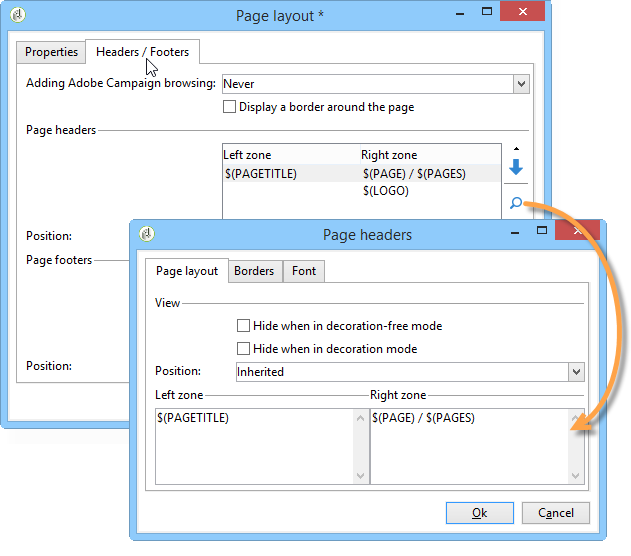
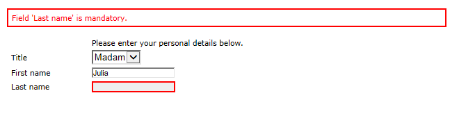
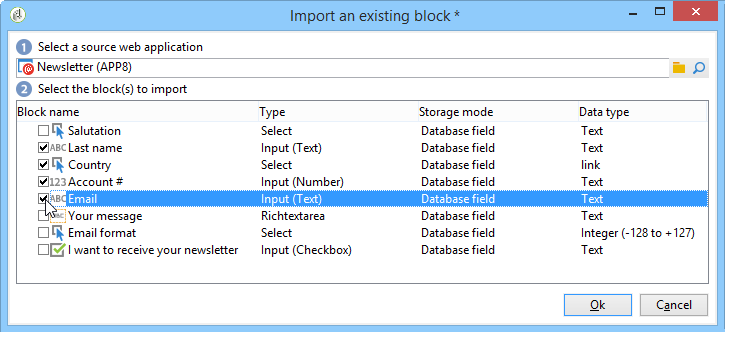

# Rendering di un modulo{#form-rendering}

## Selezione del modello di rendering del modulo {#selecting-the-form-rendering-template}

Le impostazioni del modulo consentono di selezionare il modello utilizzato per generare le pagine. Per accedervi, fai clic su **[!UICONTROL Properties]** nella barra degli strumenti dei dettagli del modulo e selezionare **[!UICONTROL Rendering]** scheda. Per impostazione predefinita sono disponibili diversi modelli (fogli di stile).

La sezione inferiore dell’editor consente di visualizzare un rendering del modello selezionato.

La funzione di zoom consente di modificare il modello selezionato.

Puoi modificare o ignorare questi modelli. A questo scopo, fai clic su **[!UICONTROL Page layout...]** collegare e personalizzare le informazioni.

Puoi eseguire le seguenti azioni:

* Modificare l&#39;immagine utilizzata come logo e adattarne le dimensioni,
* Specificate anche il percorso di accesso all&#39;immagine di anteprima quando gli utenti selezionano questo modello di rendering.

Il **[!UICONTROL Headers/Footers]** Questa scheda consente di modificare le informazioni visualizzate nelle intestazioni e nei piè di pagina di ogni pagina del modulo che utilizza questo modello.

Ogni riga della **[!UICONTROL Page headers]** e **[!UICONTROL Page footers]** corrisponde a una riga nella pagina HTML. Clic **[!UICONTROL Add]** per creare una nuova riga.

Seleziona una riga esistente e fai clic su **[!UICONTROL Detail]** per personalizzarlo.

È possibile modificare il contenuto della linea, aggiungere bordi e modificare gli attributi del carattere tramite le relative schede. Clic **[!UICONTROL OK]** per confermare queste modifiche.

Il **[!UICONTROL Position]** I campi ti consentono di definire la posizione degli elementi nell’intestazione e nel piè di pagina.

>[!NOTE]
>
>I modelli di rendering sono memorizzati in **[!UICONTROL Administration > Configuration > Form rendering]** nodo.\
>Per ulteriori informazioni, consulta [Personalizzazione del rendering dei moduli](#customizing-form-rendering)

## Personalizzazione del rendering dei moduli {#customizing-form-rendering}

### Modifica del layout degli elementi {#changing-the-layout-of-elements}

È possibile sovraccaricare il foglio di stile per ogni elemento del modulo (campi di input, immagini, pulsanti di scelta, ecc.).

A tale scopo, utilizza **[!UICONTROL Advanced]** scheda.

Consente di definire le seguenti proprietà:

* **[!UICONTROL Label position]**: vedi [Definizione della posizione delle etichette](defining-web-forms-layout.md#defining-the-position-of-labels),
* **[!UICONTROL Label format]**: ritorno a capo automatico o nessun ritorno a capo automatico,
* **[!UICONTROL Number of cells]** : vedi [Posizionamento dei campi nella pagina](defining-web-forms-layout.md#positioning-the-fields-on-the-page),
* **[!UICONTROL Horizontal alignment]** (Sinistra, Destra, Centrata) e **[!UICONTROL Vertical alignment]** (Alta, Bassa, Media),
* **[!UICONTROL Width]** della zona: può essere espressa come percentuale o in em, punti o pixel (valore predefinito),
* Massimo **[!UICONTROL Length]**: numero massimo di caratteri consentito (per i controlli Testo, Numero e Tipo password),
* **[!UICONTROL Lines]**: numero di righe per una **[!UICONTROL Multi-line text]** tipo di zona,
* **[!UICONTROL Style inline]**: consente di sovraccaricare il foglio di stile CSS con impostazioni aggiuntive. Questi vengono separati utilizzando **;** caratteri come mostrato nell’esempio seguente:

  

### Definizione di intestazioni e piè di pagina {#defining-headers-and-footers}

I campi sono sequenziati in una struttura ad albero la cui radice ha lo stesso nome della pagina. Selezionala per modificare il nome.

Il titolo della finestra deve essere inserito nel **[!UICONTROL Page]** della finestra delle proprietà della maschera. Puoi anche aggiungere un set di contenuti all’intestazione e al piè di pagina (queste informazioni vengono visualizzate su ogni pagina). Questo contenuto viene immesso nelle sezioni corrispondenti della **[!UICONTROL Texts]** come mostrato di seguito:

### Aggiunta di elementi all’intestazione HTML {#adding-elements-to-html-header}

È possibile immettere elementi aggiuntivi da inserire nell&#39;intestazione HTML di una pagina del modulo. A questo scopo, inserisci gli elementi nel **[!UICONTROL Header]** della pagina pertinente.

Ciò ti consente di fare riferimento a un’icona che verrà visualizzata, ad esempio, nella barra del titolo della pagina.

## Definizione delle impostazioni di controllo {#defining-control-settings}

Quando l’utente compila il modulo, viene automaticamente eseguito un controllo su alcuni campi, a seconda del formato o della configurazione. Questo ti consente di rendere obbligatori alcuni campi (fai riferimento a [Definizione dei campi obbligatori](#defining-mandatory-fields)) o controllare il formato dei dati immessi (fare riferimento a [Verifica del formato dei dati](#checking-data-format)). I controlli vengono eseguiti durante l’approvazione della pagina (facendo clic su un collegamento o un pulsante che abilita una transizione di output).

### Definizione dei campi obbligatori {#defining-mandatory-fields}

Per rendere obbligatori alcuni campi, seleziona questa opzione durante la creazione del campo.

Se l’utente approva questa pagina senza aver inserito il campo, viene visualizzato il seguente messaggio:

Puoi personalizzare questo messaggio facendo clic sul pulsante **[!UICONTROL Personalize this message]** collegamento.

Se l’utente approva questa pagina senza aver inserito il campo, viene visualizzato il seguente messaggio:

### Verifica del formato dei dati {#checking-data-format}

Per i controlli dei moduli i cui valori sono memorizzati in un campo esistente del database, vengono applicate le regole per il campo di archiviazione.

Per i controlli dei moduli i cui valori sono memorizzati in una variabile, le regole di approvazione dipendono dal formato della variabile.

Ad esempio, se crei un’ **[!UICONTROL Number]** selezionare per memorizzare il numero del client, come illustrato di seguito:

L’utente deve immettere un numero intero nel campo del modulo.

## Definizione dei campi da visualizzare in modo condizionale {#defining-fields-conditional-display}

Puoi configurare la visualizzazione dei campi sulla pagina da visualizzare in base ai valori scelti dall’utente. Questo può essere applicato a un campo o a un gruppo di campi (quando sono raggruppati in un contenitore).

Per ogni elemento della pagina, il **[!UICONTROL Visibility]** consente di definire le condizioni di visualizzazione.

Le condizioni possono riguardare il valore dei campi o delle variabili del database.

Nella finestra di selezione dei campi è possibile scegliere tra i seguenti dati:

* La struttura principale contiene i parametri del contesto del modulo. I parametri predefiniti sono Identificatore (che corrisponde all’identificatore crittografato del destinatario), Lingua e Origine.

  Per ulteriori informazioni, consulta questa [pagina](defining-web-forms-properties.md#form-url-parameters).

* Il **[!UICONTROL Recipients]** sottostruttura contiene i campi di input inseriti nel modulo e memorizzati nel database.

  Per ulteriori informazioni, consulta [Memorizzazione dei dati nel database](web-forms-answers.md#storing-data-in-the-database).

* Il **[!UICONTROL Variables]** sottoalbero contiene le variabili disponibili per questo modulo. Per ulteriori informazioni, consulta [Memorizzazione dei dati in una variabile locale](web-forms-answers.md#storing-data-in-a-local-variable).

Per ulteriori informazioni, consulta il caso d’uso disponibile qui: [Visualizzazione di opzioni diverse a seconda dei valori selezionati](use-cases-web-forms.md#displaying-different-options-depending-on-the-selected-values).

È inoltre possibile condizionare la visualizzazione delle pagine del modulo utilizzando **[!UICONTROL Test]** oggetto. Per ulteriori informazioni, consulta questa [pagina](defining-web-forms-page-sequencing.md#conditional-page-display).

## Importazione di elementi da un modulo esistente {#importing-elements-from-an-existing-form}

È possibile importare campi o contenitori da altri moduli Web. Questo consente di creare una libreria di blocchi riutilizzabili che verranno inseriti nei moduli, ad esempio il blocco di indirizzi, l’area di abbonamento alla newsletter e così via.

Per importare un elemento in un modulo, attieniti alla seguente procedura:

1. Modifica la pagina in cui desideri inserire uno o più elementi, quindi fai clic su **[!UICONTROL Import an existing block]** nella barra degli strumenti.

   

1. Selezionare il modulo Web contenente i campi da importare e scegliere i contenitori e i campi da importare.

   

   >[!NOTE]
   >
   >Il **[!UICONTROL Edit link]** a destra del nome del modulo di origine consente di visualizzare il modulo Web selezionato.

1. Clic **[!UICONTROL Ok]** per confermare l&#39;inserimento.

   
