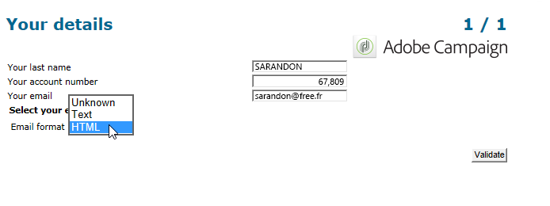
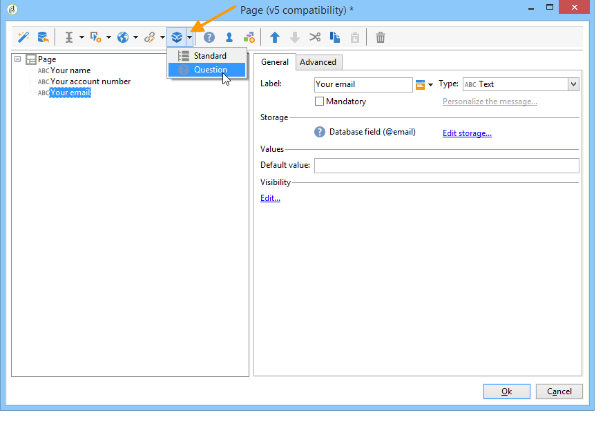

# Passaggi chiave per creare un sondaggio{#getting-started-with-surveys}

Di seguito viene fornita una rapida panoramica dei passaggi principali per creare un sondaggio semplice, utilizzando il seguente modello:

I passaggi seguenti sono:

1. [Passaggio 1 - Creazione di un sondaggio](#step-1---creating-a-survey),
1. [Passaggio 2 - Selezione del modello](#step-2---selecting-the-template),
1. [Passaggio 3 - Creazione del sondaggio](#step-3---building-the-survey),
1. [Passaggio 4 - Creazione del contenuto](#step-4---creating-the-page-content) della pagina,
1. [Passaggio 5 - Memorizzazione dei dati](#step-5---storing-the-survey-data-) del sondaggio,
1. [Passaggio 6 - Pubblicazione delle pagine](#step-6---publishing-the-pages),
1. [Passaggio 7 - Condivisione del sondaggio](#step-7---sharing-your-online-survey) online.

## Passaggio 1 - Creazione di un sondaggio {#step-1---creating-a-survey}

Per creare un nuovo sondaggio, andate alla scheda **[!UICONTROL Campaigns]** o **[!UICONTROL Profiles and targets]** e fate clic sul menu **[!UICONTROL Web Applications]**. Fare clic sul pulsante **[!UICONTROL Create]** sopra l&#39;elenco dei moduli.

## Passaggio 2 - Selezione del modello {#step-2---selecting-the-template}

Selezionate un modello di sondaggio, quindi assegnate al sondaggio un nome. Questo nome non verrà visualizzato dagli utenti finali, ma consente di identificare il sondaggio all&#39;interno  Adobe Campaign. Fare clic su **[!UICONTROL Save]** per aggiungere il sondaggio all&#39;elenco delle applicazioni Web.

## Passaggio 3 - Creazione del sondaggio {#step-3---building-the-survey}

I sondaggi sono integrati in un diagramma in cui sono posizionati i seguenti elementi: le pagine in cui verrà creato il contenuto, i passaggi di precaricamento e salvataggio dei dati e le fasi di test. È inoltre possibile inserire script e query.

Per creare il grafico, fate clic sul modulo **[!UICONTROL Edit]** del sondaggio.

Un sondaggio deve contenere **almeno** i tre componenti seguenti: una pagina, una casella di archiviazione e una pagina finale.

* Per creare una pagina, selezionate l&#39;oggetto **[!UICONTROL Page]** nella sezione sinistra dell&#39;editor e depositatelo nella sezione centrale, come illustrato di seguito:

   

* Quindi, selezionare l&#39;oggetto **[!UICONTROL Storage]** e posizionarlo nella transizione di output della pagina.
* Infine, selezionare l&#39;oggetto **[!UICONTROL End]** e posizionarlo alla fine della transizione di output della casella di archiviazione per ottenere il seguente diagramma:

   

## Passaggio 4 - Creazione del contenuto della pagina {#step-4---creating-the-page-content}

Nell&#39;esempio seguente, viene utilizzata una pagina di tipo **[!UICONTROL Page (v5 compatibility)]**. Questo tipo di pagina è accessibile tramite il menu avanzato della scheda **[!UICONTROL Edit]**.

* Aggiunta di campi di input

   Per creare il contenuto della pagina, è necessario modificarlo: a tal fine, fare doppio clic sull&#39;oggetto **[!UICONTROL Page]**. Fare clic sulla prima icona nella barra degli strumenti per aprire la procedura guidata di creazione dei campi. Per creare un campo di immissione in cui memorizzare il nome utente nel campo corrispondente del profilo del destinatario, selezionare **[!UICONTROL Edit a recipient]**.

   

   Fare clic sul pulsante **[!UICONTROL Next]** per selezionare il campo per l&#39;archiviazione dei dati nel database. In questo caso, il campo &#39;Cognome&#39;.

   

   Fare clic su **[!UICONTROL Finish]** per confermare la creazione del campo.

   Per impostazione predefinita, quando le informazioni sono memorizzate in un campo già esistente nel database, il campo assume il nome del campo selezionato, ovvero &#39;Cognome&#39; in questo esempio. Potete modificare questa etichetta come illustrato di seguito:

   

   Ora create un campo di immissione per il numero di account utente. Ripetere l&#39;operazione e selezionare il &#39;numero account&#39;. field.

   Applicate la stessa procedura per aggiungere un campo in cui l’utente può immettere un indirizzo e-mail.

* Per creare una domanda, fate clic con il pulsante destro del mouse sull&#39;ultimo elemento della struttura, quindi selezionate **[!UICONTROL Containers > Question]** oppure fate clic sull&#39;icona **[!UICONTROL Containers]** e selezionate **[!UICONTROL Question]**.

   

   Immettete l’etichetta della domanda e inserite i campi di risposta come ramo secondario della domanda. A tal fine, il nodo collegato alla domanda deve essere selezionato al momento della creazione del campo di risposta. Aggiungete un **[!UICONTROL drop-down listx]** utilizzando l&#39;icona **[!UICONTROL Selection controls]** oppure facendo clic con il pulsante destro del mouse, come illustrato di seguito:

   

   Selezionare uno spazio di archiviazione: selezionate un campo di enumerazione per recuperare automaticamente i valori (in questo caso, il formato e-mail).

   

   Nella scheda **[!UICONTROL General]**, fare clic sul collegamento **[!UICONTROL Initialize the list of values from the database]**: la tabella dei valori viene inserita automaticamente.

   

   Fare clic su **[!UICONTROL OK]** per chiudere l&#39;editor e su **[!UICONTROL Save]** per salvare le modifiche.

   >[!NOTE]
   >
   >Per ogni campo o domanda, è possibile adattare il layout della pagina in base alle proprie esigenze, grazie alle opzioni disponibili nella scheda **[!UICONTROL Advanced]**. Il layout delle schermate dei sondaggi è dettagliato in [questa sezione](../../web/using/about-web-forms.md).

   Nella schermata dei dettagli, fate clic sulla scheda **[!UICONTROL Preview]** per visualizzare il rendering del sondaggio appena creato.

   

## Passaggio 5 - Memorizzazione dei dati del sondaggio {#step-5---storing-the-survey-data-}

La casella di memorizzazione consente di salvare le risposte degli utenti nel database. È necessario selezionare una chiave di riconciliazione per identificare i profili già presenti nel database.

A tal fine, modificare la casella e selezionare il campo che verrà utilizzato come chiave di riconciliazione quando i dati vengono memorizzati.

Nell&#39;esempio seguente, quando si salva (conferma), se un profilo viene salvato nel database con lo stesso numero di account di quello immesso nel modulo, verrà aggiornato il profilo. Se il profilo non esiste, verrà creato.

Fare clic su **[!UICONTROL OK]** per confermare, quindi fare clic su **[!UICONTROL Save]** per salvare il sondaggio

## Passaggio 6 - Pubblicazione delle pagine {#step-6---publishing-the-pages}

Affinché gli utenti possano accedere alle pagine HTML, l&#39;applicazione deve essere resa disponibile. Non deve essere più nella fase di editing, ma nella produzione. Per effettuare un sondaggio in produzione, è necessario pubblicarlo. Per eseguire questa operazione:

* Fate clic sul pulsante **[!UICONTROL Publish]** situato sopra il dashboard del sondaggio.
* Fare clic su **[!UICONTROL Start]** per avviare la pubblicazione e chiudere la procedura guidata.

   

   Lo stato del sondaggio cambia in: **Online**.

   

## Passaggio 7 - Condivisione del sondaggio online {#step-7---sharing-your-online-survey}

Una volta in produzione, il sondaggio è accessibile sul server e puoi distribuirlo. L’URL per accedere al sondaggio viene visualizzato nel dashboard.

Per inviare il sondaggio, potete inviare un messaggio contenente un collegamento di accesso alla popolazione di destinazione, oppure inserire l’URL di accesso al sondaggio in una pagina Web, ad esempio.

Potete quindi monitorare le risposte degli utenti tramite rapporti e registri. Vedere [Tracciamento delle risposte](../../web/using/publish--track-and-use-collected-data.md#response-tracking).

>[!CAUTION]
>
>L’URL pubblico include il nome interno del sondaggio. Quando il nome interno viene modificato, l’URL viene aggiornato automaticamente: è necessario aggiornare anche tutti i collegamenti al sondaggio.
>
>Se le consegne contenenti il collegamento al modulo sono già state inviate, il collegamento non funzionerà più.

