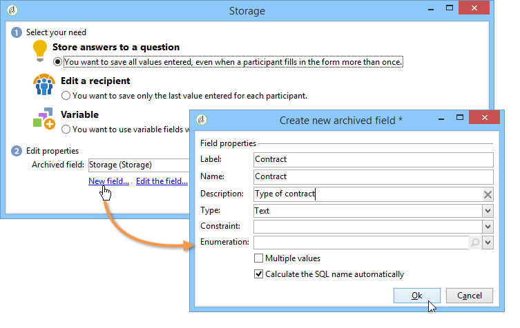
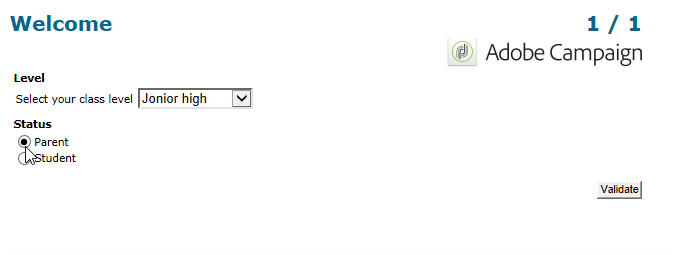
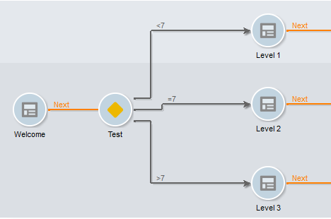

# Gestione delle risposte{#managing-answers}

## Memorizzazione delle risposte raccolte {#storing-collected-answers}

Oltre alle modalità di memorizzazione standard comuni a tutti i moduli Web in  Adobe Campaign (campo di database e variabile locale), i sondaggi consentono l&#39;estensione dinamica del modello dati utilizzando i campi archiviati.

>[!CAUTION]
>
>Questa opzione è disponibile solo per le applicazioni Web di tipo **Survey**. Non è disponibile per altri tipi di moduli Web.

### Memorizzazione in un campo archiviato {#storing-in-an-archived-field}

È facile estendere il modello di dati aggiungendo nuovi spazi di memorizzazione per salvare le risposte fornite nei sondaggi. A questo scopo, selezionare l&#39;opzione **[!UICONTROL Store answers to a question]** durante la creazione del campo di input. Fare clic sul collegamento **[!UICONTROL New field...]** e assegnare le relative proprietà:



Immettere l&#39;etichetta e il nome del campo e selezionare il tipo di campo: Testo, Booleano, Numero intero o decimale, Data, ecc.

Il tipo di campo selezionato include un controllo dei dati quando le risposte vengono immesse dagli utenti. Per i campi **text**, è possibile aggiungere un vincolo (maiuscole/minuscole, formato) o un collegamento a un&#39;enumerazione esistente per forzare la selezione.

Per aggiungere un vincolo, selezionatelo dall&#39;elenco a discesa. Esistono due tipi di vincoli:

1. Carattere maiuscolo

   Le informazioni immesse possono essere memorizzate nel campo nei seguenti formati: tutte le lettere maiuscole, tutte minuscole o con la maiuscola iniziale. Questo vincolo non richiede che l&#39;utente immetta i dati nel formato selezionato, ma il contenuto immesso nel campo verrà convertito al momento del salvataggio.

1. Formato dati

Se questo campo viene utilizzato in un elenco, i valori dell&#39;enumerazione possono essere recuperati automaticamente nella tabella di valori utilizzando il collegamento **[!UICONTROL Initialize the list of values from the database]** sopra l&#39;elenco di valori.

Ad esempio, potete creare un elenco a discesa per consentire all&#39;utente di selezionare la propria lingua nativa. Il campo archiviato corrispondente può essere associato all&#39;enumerazione **language** che contiene un elenco di lingue:


L&#39;icona **[!UICONTROL Edit link]** a destra del campo consente di modificare il contenuto di questa enumerazione:


Nella scheda **[!UICONTROL General]** del campo, il collegamento **[!UICONTROL Initialize the list of values from the database]** consente di inserire automaticamente l&#39;elenco delle etichette offerte.


**Esempio**: archiviazione dei contratti di un destinatario in un campo

Per memorizzare diversi tipi di contratti in un campo, creare un campo di input **[!UICONTROL Text]** e selezionare l&#39;opzione **[!UICONTROL Store answers to a question]**.

Fare clic sul collegamento **[!UICONTROL New field...]** e immettere le proprietà del campo. Selezionare l&#39;opzione **[!UICONTROL Multiple values]** per abilitare la memorizzazione di più valori.


Creare campi di immissione per gli altri contratti e archiviare i dati nello stesso campo archiviato.


Quando gli utenti approvano il sondaggio, le loro risposte saranno memorizzate nel campo **[!UICONTROL Contracts]**.

Nel nostro esempio, per le seguenti risposte:


Il profilo del convenuto conterrà i quattro contratti stipulati.

È possibile visualizzarli nella scheda **[!UICONTROL Answers]** del sondaggio visualizzando le colonne pertinenti.


Puoi anche filtrare i destinatari in base alle risposte per visualizzare solo gli utenti che ti interessano. A tal fine, create un flusso di lavoro di targeting e utilizzate la casella **[!UICONTROL Survey responses]**.


Create la query in base ai profili che desiderate recuperare. Nell&#39;esempio seguente, la query consente di selezionare profili con almeno due contratti, incluso un contratto di tipo A.


Per ciascun modulo, le risposte fornite possono essere utilizzate in campi o etichette. Utilizzate la sintassi seguente per il contenuto memorizzato in un campo archiviato:

```
<%= ctx.webAppLogRcpData.name of the archived field %
```

>[!NOTE]
>
>Per altri tipi di campi, la sintassi è dettagliata in [questa sezione](../../platform/using/about-queries-in-campaign.md).

### Impostazioni di archiviazione {#storage-settings}

È possibile archiviare le risposte ai sondaggi in formato XML. Questo consente di salvare una copia grezza delle risposte raccolte, che può essere utile in caso di standardizzazione eccessiva dei dati in un elenco dettagliato (per ulteriori informazioni, fare riferimento a [Standardizzazione dei dati](../../web/using/publish--track-and-use-collected-data.md#standardizing-data)).

>[!CAUTION]
>
>L&#39;archiviazione delle risposte non elaborate aumenta notevolmente lo spazio di archiviazione richiesto. Utilizzate questa opzione con attenzione.

Per eseguire questa operazione:

* Modificate le proprietà del sondaggio mediante il pulsante **[!UICONTROL Properties]** della scheda **[!UICONTROL Edit]**.
* Fare clic sul collegamento **[!UICONTROL Advanced parameters]** e selezionare l&#39;opzione **[!UICONTROL Save a copy of raw answers]**.


Potete attivarla per impostazione predefinita per tutti i sondaggi (questa opzione viene applicata quando il sondaggio viene pubblicato). A tal fine, create l&#39;opzione **[!UICONTROL NmsWebApp_XmlBackup]** e assegnategli il valore **[!UICONTROL 1]**, come illustrato di seguito:


## Gestione punteggio {#score-management}

È possibile assegnare una valutazione alle opzioni offerte nelle pagine del modulo. I punteggi possono essere collegati solo a domande chiuse: casella di controllo, valore da un elenco a discesa, iscrizione ecc.

>[!CAUTION]
>
>La gestione del punteggio è disponibile solo per **Survey**.


I punteggi vengono accumulati e salvati sul lato server quando la pagina viene confermata, ad esempio quando l&#39;utente fa clic sul pulsante **[!UICONTROL Next]** o **[!UICONTROL Finish]**.

>[!NOTE]
>
>È possibile utilizzare valori positivi o negativi, numeri interi o non interi.

I punteggi possono essere utilizzati in test o script.

>[!CAUTION]
>
>I punteggi non possono essere utilizzati nelle condizioni di visibilità per i campi che si trovano sulla stessa pagina. Tuttavia, possono essere utilizzati nelle pagine successive.

* Per utilizzare i punteggi nei test, utilizzare il campo **[!UICONTROL Score]** nella formula di calcolo del test, come illustrato di seguito:

   

* È possibile utilizzare la valutazione in uno script.

**Esempio**: calcolare una valutazione e utilizzarla come condizione per la visualizzazione della pagina successiva:

* In un sondaggio, la pagina successiva consente di assegnare agli utenti punteggi diversi a seconda del valore selezionato nell’elenco a discesa:

   

* Puoi combinare la valutazione con un secondo valore, a seconda dell’opzione selezionata:

   

* Quando l&#39;utente fa clic sul pulsante **[!UICONTROL Next]**, vengono aggiunti i due valori.

   

* Le condizioni possono essere applicate alla pagina da visualizzare in base alla valutazione. Questa configurazione è la seguente:

   

   

