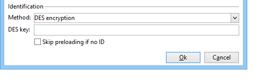
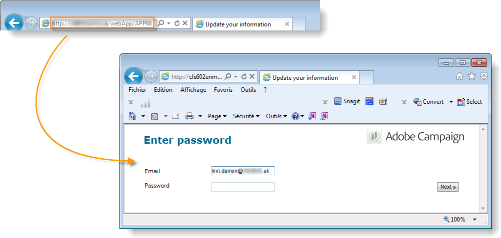
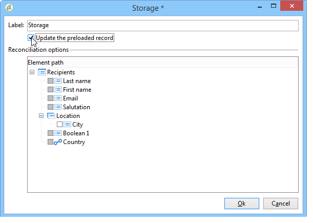

# Pubblicare un modulo web{#publishing-a-web-form}


## Precaricamento dei dati del modulo {#pre-loading-the-form-data}

Se si desidera aggiornare i profili memorizzati nel database tramite un modulo Web, è possibile utilizzare una casella di precaricamento. La casella di precaricamento consente di indicare come trovare il record da aggiornare nel database.

Sono possibili i seguenti metodi di identificazione:

* **[!UICONTROL Adobe Campaign Encryption]**

  Questo metodo di crittografia utilizza l’identificatore (ID) crittografato di Adobe Campaign. Questo metodo è applicabile solo a un oggetto Adobe Campaign e l’ID crittografato può essere generato solo dalla piattaforma Adobe Campaign.

  Quando si utilizza questo metodo, è necessario adattare l&#39;URL del modulo da consegnare all&#39;indirizzo e-mail aggiungendo il parametro **`<%=escapeUrl(recipient.cryptedId) %>`**. Per ulteriori informazioni, consulta [Consegna di un modulo tramite e-mail](#delivering-a-form-via-email).

* **[!UICONTROL DES encryption]**

  

  Questo metodo di crittografia utilizza un identificatore (ID) fornito esternamente, collegato a una chiave condivisa da Adobe Campaign e dal provider esterno. Il campo **[!UICONTROL Des key]** consente di immettere questa chiave di crittografia.

* **[!UICONTROL List of fields]**

  Questa opzione consente di scegliere tra i campi nel contesto corrente del modulo quelli che verranno utilizzati per trovare il profilo corrispondente nel database.

  

  I campi possono essere aggiunti alle proprietà del modulo tramite la scheda **[!UICONTROL Parameters]** (fare riferimento a [Aggiunta di parametri](defining-web-forms-properties.md#adding-parameters)). Vengono inseriti sotto forma di URL o aree di input.

  >[!CAUTION]
  >
  >I dati nei campi selezionati non sono crittografati. Non deve essere fornito in formato crittografato perché Adobe Campaign non sarà in grado di decrittografarlo se è selezionata l&#39;opzione **[!UICONTROL Field list]**.

  Nell’esempio seguente, il precaricamento del profilo si basa sull’indirizzo e-mail.

  L’URL può includere l’indirizzo e-mail non crittografato, nel qual caso gli utenti hanno accesso diretto alle pagine che li riguardano.

  

  In caso contrario, verrà richiesta loro la password.

  

  >[!CAUTION]
  >
  >Se nell&#39;elenco sono specificati più campi, i dati di **ALL FIELDS** devono corrispondere ai dati memorizzati nel database per consentire l&#39;aggiornamento del profilo. In caso contrario, viene creato un nuovo profilo.
  > 
  >Questa funzione è particolarmente utile per le applicazioni Web, ma non è consigliata per i moduli pubblici. L&#39;opzione di controllo di accesso selezionata deve essere &quot;Abilita controllo di accesso&quot;.

Se non desideri aggiornare i profili, devi selezionare l&#39;opzione **[!UICONTROL Skip preloading if no ID]**. In questo caso, ogni profilo inserito verrà aggiunto al database dopo l’approvazione del modulo. Questa opzione viene utilizzata, ad esempio, quando il modulo viene pubblicato su un sito Web.

L&#39;opzione **[!UICONTROL Auto-load data referenced in the form]** consente di precaricare automaticamente i dati che corrispondono ai campi di input e di unione nel modulo. Tuttavia, i dati a cui si fa riferimento nelle attività **[!UICONTROL Script]** e **[!UICONTROL Test]** non sono interessati. Se questa opzione non è selezionata, è necessario definire i campi utilizzando l&#39;opzione **[!UICONTROL Load additional data]**.

L&#39;opzione **[!UICONTROL Load additional data]** consente di aggiungere informazioni non utilizzate nelle pagine del modulo, ma che verranno comunque precaricate.

Ad esempio, puoi precaricare il genere del destinatario e indirizzarlo automaticamente alla pagina appropriata tramite una casella di test.


## Gestione della consegna e del tracciamento dei moduli web {#managing-web-forms-delivery-and-tracking}

Una volta creato, configurato e pubblicato il modulo, è possibile distribuirlo e tenere traccia delle risposte utente.

### Ciclo di vita di una forma {#life-cycle-of-a-form}

Il ciclo di vita di una forma prevede tre fasi:

1. **In fase di modifica**

   Questa è la fase di progettazione iniziale. Quando viene creato un nuovo modulo, questo si trova nella fase di modifica. L&#39;accesso al modulo, solo a scopo di test, richiede che il parametro **[!UICONTROL __uuid]** sia utilizzato nel relativo URL. Questo URL è accessibile nella scheda secondaria **[!UICONTROL Preview]**. Vedi [Parametri URL modulo](defining-web-forms-properties.md#form-url-parameters).

   >[!CAUTION]
   >
   >Durante la modifica del modulo, il relativo URL di accesso è un URL speciale.

1. **Pubblicazione in sospeso**

   In alcuni casi, ad esempio quando [si importa un modulo tramite un pacchetto](#import-web-packages), un modulo Web può avere lo stato **[!UICONTROL Pending publication]** fino a quando non è attivo.

   >[!NOTE]
   >
   >Per le applicazioni Web tecniche (disponibili tramite il menu **[!UICONTROL Administration]** > **[!UICONTROL Configuration]** > **[!UICONTROL Web applications]**), un modulo con lo stato **[!UICONTROL Pending publication]** viene automaticamente [pubblicato](#publishing-a-form) e ottiene lo stato **[!UICONTROL Online]**.

1. **In linea**

   Una volta completata la fase di progettazione, il modulo può essere consegnato.

   Quando un modulo ha lo stato **[!UICONTROL Being edited]** o **[!UICONTROL Pending publication]**, deve essere [pubblicato](#publishing-a-form) per essere online e accessibile tramite l&#39;URL del modulo Web in un browser.

   Dopo la pubblicazione, il modulo sarà attivo fino alla scadenza.

   Il modulo sarà **[!UICONTROL Live]** fino alla scadenza.

   >[!CAUTION]
   >
   >Per essere consegnato, l&#39;URL del modulo non deve contenere il parametro **[!UICONTROL __uuid]**.

1. **Chiuso**

   Una volta chiuso il modulo, la fase di consegna è terminata e il modulo diventa non disponibile: non è più accessibile agli utenti.

   La data di scadenza può essere definita nella finestra delle proprietà del modulo. Per ulteriori informazioni, vedere [Come rendere disponibile un modulo online](#making-a-form-available-online).

Lo stato di pubblicazione di un modulo viene visualizzato nell&#39;elenco dei moduli.


### Pubblicazione di un modulo {#publishing-a-form}

Per modificare lo stato di un modulo, è necessario pubblicarlo. A tale scopo, fare clic sul pulsante **[!UICONTROL Publication]** sopra l&#39;elenco dei moduli Web e selezionare lo stato nella casella a discesa.


### Come rendere un modulo disponibile online {#making-a-form-available-online}

Per essere accessibile agli utenti, il modulo deve essere in produzione e deve essere avviato, ovvero entro il periodo di validità. Le date di validità vengono immesse tramite il collegamento **[!UICONTROL Properties]** del modulo.

* Utilizzare i campi della sezione **[!UICONTROL Project]** per immettere le date di inizio e di fine del modulo.

  

* Fare clic sul collegamento **[!UICONTROL Personalize the message displayed if the form is closed...]** per definire il messaggio di errore da visualizzare se l&#39;utente tenta di accedere al modulo mentre non è valido.

  Vedere [Accessibilità del modulo](defining-web-forms-properties.md#accessibility-of-the-form).

### Consegna di un modulo tramite e-mail {#delivering-a-form-via-email}

Quando si invia un invito tramite e-mail, è possibile utilizzare l&#39;opzione **[!UICONTROL Adobe Campaign Encryption]** per la riconciliazione dei dati. A questo scopo, passa all’assistente alla consegna e adatta il collegamento al modulo aggiungendo il seguente parametro:

```
<a href="https://server/webApp/APP264?&id=<%=escapeUrl(recipient.cryptedId) %>">
```

In questo caso, la chiave di riconciliazione per l’archiviazione dei dati deve essere l’identificatore crittografato del destinatario. Per ulteriori informazioni, consulta [Precaricamento dei dati del modulo](#pre-loading-the-form-data).

In questo caso, è necessario selezionare l&#39;opzione **[!UICONTROL Update the preloaded record]** nella casella di record. Per ulteriori informazioni, vedere [Salvataggio delle risposte ai moduli Web](web-forms-answers.md#saving-web-forms-answers).



### Registro risposte {#log-responses}

Il tracciamento delle risposte può essere attivato in una scheda dedicata per monitorare l’impatto del modulo web. A tale scopo, fare clic sul collegamento **[!UICONTROL Advanced parameters...]** nella finestra delle proprietà del modulo e selezionare l&#39;opzione **[!UICONTROL Log responses]**.


Viene visualizzata la scheda **[!UICONTROL Responses]** che consente di visualizzare l&#39;identità dei partecipanti.


Selezionare un destinatario e fare clic sul pulsante **[!UICONTROL Detail...]** per visualizzare le risposte fornite.


Puoi elaborare i registri di risposta forniti nelle query, ad esempio per eseguire il targeting solo dei non-rispondenti durante l’invio di promemoria o per offrire comunicazioni specifiche solo ai rispondenti.

### Importazione di pacchetti di moduli web {#import-web-packages}

Durante l’esportazione e l’importazione di un pacchetto che include un modulo web da un’istanza a un’altra (ad esempio, dalla fase di produzione), lo stato del modulo web nella nuova istanza può variare in base a diverse condizioni. I diversi casi sono elencati di seguito.

Ulteriori informazioni sui diversi stati di un modulo Web sono disponibili in [questa sezione](#life-cycle-of-a-form).

>[!NOTE]
>
>Quando si esporta un modulo web tramite un pacchetto, lo stato del modulo è visibile nel contenuto del pacchetto risultante.

* Se lo stato del modulo Web era **[!UICONTROL Pending publication]** o **[!UICONTROL Online]** al momento dell&#39;esportazione dalla prima istanza:

   * Il modulo web ottiene lo stato **[!UICONTROL Pending publication]** quando viene importato nella nuova istanza.

   * Se il modulo Web esiste già nella nuova istanza, viene sostituito con la nuova versione del modulo e assume lo stato **[!UICONTROL Pending publication]**, anche se la versione precedente del modulo era **[!UICONTROL Online]**.

   * Indipendentemente dal fatto che il modulo esista o meno, il modulo deve essere [pubblicato](#publishing-a-form) per diventare **[!UICONTROL Online]** nella nuova istanza e accessibile tramite l&#39;URL del modulo Web in un browser.

* Se lo stato del modulo Web era **[!UICONTROL Being edited]** al momento dell&#39;esportazione:

   * Se il modulo Web è nuovo nell&#39;istanza in cui viene importato il pacchetto, il modulo Web ottiene lo stato **[!UICONTROL Being edited]**.

   * Se il modulo web esiste già nella nuova istanza, si tratta di una modifica apportata a un modulo esistente. Se la vecchia versione del modulo era **[!UICONTROL Online]**, la vecchia versione rimane online fino a quando la nuova versione del modulo non viene [pubblicata](#publishing-a-form) di nuovo nella nuova istanza.

  >[!NOTE]
  >
  >È possibile controllare la versione più recente del modulo Web utilizzando la scheda **[!UICONTROL Preview]**.

<!--For RN:
* Now, when a web form has the **Pending publication** status, it must be published before it becomes **Online** and accessible through the web form URL in a web browser. [Read more](../../web/using/publishing-a-web-form.md#life-cycle-of-a-form)
-->
