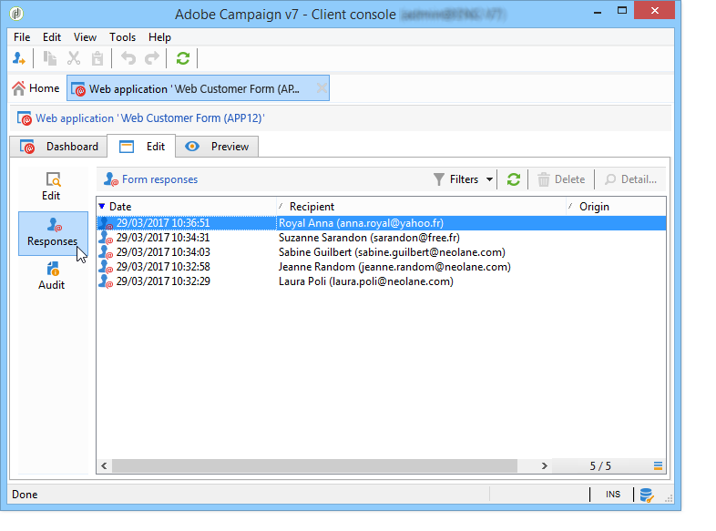

# Pubblicazione di un modulo web{#publishing-a-web-form}


## Precaricamento dei dati del modulo {#pre-loading-the-form-data}

Se si desidera aggiornare i profili memorizzati nel database tramite un modulo Web, è possibile utilizzare una casella di precaricamento. La casella di precaricamento consente di indicare come trovare il record da aggiornare nel database.

Sono possibili i seguenti metodi di identificazione:

* **[!UICONTROL Adobe Campaign Encryption]**

   Questo metodo di crittografia utilizza l’identificatore Adobe Campaign crittografato (ID). Questo metodo è applicabile solo su un oggetto Adobe Campaign e l’ID crittografato può essere generato solo dalla piattaforma Adobe Campaign.

   Quando utilizzi questo metodo, devi adattare l’URL del modulo da consegnare all’indirizzo e-mail aggiungendo il parametro **`<%=escapeUrl(recipient.cryptedId) %>`** . Per ulteriori informazioni, consulta [Consegna di un modulo tramite e-mail](#delivering-a-form-via-email).

* **[!UICONTROL DES encryption]**

   

   Questo metodo di crittografia utilizza un identificatore (ID) fornito esternamente, collegato a una chiave condivisa da Adobe Campaign e dal provider esterno. Il campo **[!UICONTROL Des key]** ti consente di immettere questa chiave di crittografia.

* **[!UICONTROL List of fields]**

   Questa opzione consente di scegliere tra i campi del contesto corrente del modulo, quelli che verranno utilizzati per trovare il profilo corrispondente nel database.

   

   I campi possono essere aggiunti alle proprietà del modulo tramite la scheda **[!UICONTROL Parameters]** (consulta [Aggiunta di parametri](defining-web-forms-properties.md#adding-parameters)). Vengono inseriti nell’URL del modulo o nelle aree di input.

   >[!CAUTION]
   >
   >I dati nei campi selezionati non sono crittografati. Non deve essere fornito in un modulo crittografato perché Adobe Campaign non sarà in grado di decifrarlo se l’opzione **[!UICONTROL Field list]** è selezionata.

   Nell’esempio seguente, il precaricamento del profilo si basa sull’indirizzo e-mail.

   L’URL può includere l’indirizzo e-mail non crittografato, nel qual caso gli utenti hanno accesso diretto alle pagine che li riguardano.

   

   In caso contrario, verrà loro richiesto di specificare la password.

   

   >[!CAUTION]
   >
   >Se nell&#39;elenco sono specificati più campi, i dati di **ALL FIELDS** devono corrispondere ai dati memorizzati nel database per poter aggiornare il profilo. In caso contrario, viene creato un nuovo profilo.
   > 
   >Questa funzione è particolarmente utile per le applicazioni web, ma non è consigliata per i moduli pubblici. L&#39;opzione selezionata per il controllo accessi deve essere &quot;Abilita controllo accessi&quot;.

Se non desideri aggiornare i profili, devi selezionare l’opzione **[!UICONTROL Skip preloading if no ID]** . In questo caso, ogni profilo immesso verrà aggiunto al database dopo l’approvazione del modulo. Questa opzione viene utilizzata, ad esempio, quando il modulo viene pubblicato su un sito web.

L’opzione **[!UICONTROL Auto-load data referenced in the form]** consente di precaricare automaticamente i dati corrispondenti ai campi di input e di unione del modulo. Tuttavia, i dati a cui si fa riferimento nelle attività **[!UICONTROL Script]** e **[!UICONTROL Test]** non sono interessati. Se questa opzione non è selezionata, è necessario definire i campi utilizzando l’opzione **[!UICONTROL Load additional data]**.

L’opzione **[!UICONTROL Load additional data]** consente di aggiungere informazioni non utilizzate nelle pagine del modulo, ma che verranno comunque precaricate.

Ad esempio, puoi precaricare il genere del destinatario e indirizzarlo automaticamente alla pagina appropriata tramite una casella di test.


## Gestione della consegna e del tracciamento dei moduli web {#managing-web-forms-delivery-and-tracking}

Una volta creato, configurato e pubblicato il modulo, è possibile consegnarlo e tenere traccia delle risposte dell’utente.

### Ciclo di vita di un modulo {#life-cycle-of-a-form}

Il ciclo di vita di un modulo prevede tre fasi:

1. **Modulo in corso di modifica**

   Questa è la fase di progettazione iniziale. Quando viene creato un nuovo modulo, questo si trova nella fase di modifica. L’accesso al modulo, solo a scopo di test, richiede l’utilizzo del parametro **[!UICONTROL __uuid]** nel relativo URL. Questo URL è accessibile nella sottoscheda **[!UICONTROL Preview]** . Consulta [Parametri URL del modulo](defining-web-forms-properties.md#form-url-parameters).

   >[!CAUTION]
   >
   >Durante la modifica del modulo, l’URL di accesso è un URL speciale.

1. **Modulo online**

   Una volta completata la fase di progettazione, il modulo può essere consegnato. In primo luogo, deve essere pubblicato. Per ulteriori informazioni, consulta [Pubblicazione di un modulo](#publishing-a-form).

   Il modulo sarà **[!UICONTROL Live]** fino alla scadenza.

   >[!CAUTION]
   >
   >Per essere consegnato, l’URL del sondaggio non deve contenere il parametro **[!UICONTROL __uuid]** .

1. **Modulo non disponibile**

   Una volta chiuso il modulo, la fase di consegna è terminata e il modulo diventa non disponibile: non è più accessibile agli utenti.

   La data di scadenza può essere definita nella finestra delle proprietà del modulo. Per ulteriori informazioni, consulta [Rendere disponibile un modulo online](#making-a-form-available-online)

Lo stato di pubblicazione di un modulo viene visualizzato nell’elenco dei moduli.


### Pubblicazione di un modulo {#publishing-a-form}

Per modificare lo stato di un modulo, è necessario pubblicarlo. A questo scopo, fare clic sul pulsante **[!UICONTROL Publication]** sopra l’elenco dei moduli web e selezionare lo stato nella casella a discesa.


### Rendere disponibile un modulo online {#making-a-form-available-online}

Per essere accessibile agli utenti, il modulo deve essere in produzione e deve essere avviato, cioè entro il periodo di validità. Le date di validità vengono inserite tramite il collegamento **[!UICONTROL Properties]** del modulo.

* Utilizzare i campi della sezione **[!UICONTROL Project]** per immettere le date di inizio e di fine del modulo.

   

* Fai clic sul collegamento **[!UICONTROL Personalize the message displayed if the form is closed...]** per definire il messaggio di errore da visualizzare se l’utente tenta di accedere al modulo quando non è valido.

   Vedere [Accessibilità del modulo](defining-web-forms-properties.md#accessibility-of-the-form).

### Distribuzione di un modulo tramite e-mail {#delivering-a-form-via-email}

Quando invii un invito tramite e-mail, puoi utilizzare l’opzione **[!UICONTROL Adobe Campaign Encryption]** per la riconciliazione dei dati. A questo scopo, passa alla procedura guidata di consegna e adatta il collegamento al modulo aggiungendo il seguente parametro:

```
<a href="https://server/webApp/APP264?&id=<%=escapeUrl(recipient.cryptedId) %>">
```

In questo caso, la chiave di riconciliazione per l’archiviazione dei dati deve essere l’identificatore crittografato del destinatario. Per ulteriori informazioni, consulta [Precaricamento dei dati del modulo](#pre-loading-the-form-data).

In questo caso, devi selezionare l’opzione **[!UICONTROL Update the preloaded record]** nella casella di record. Per ulteriori informazioni, consulta [Salvataggio delle risposte ai moduli web](web-forms-answers.md#saving-web-forms-answers).


### Risposte al registro {#log-responses}

Il tracciamento della risposta può essere attivato in una scheda dedicata per monitorare l’impatto del modulo web. A questo scopo, fai clic sul collegamento **[!UICONTROL Advanced parameters...]** nella finestra delle proprietà del modulo e seleziona l’opzione **[!UICONTROL Log responses]**.


Viene visualizzata la scheda **[!UICONTROL Responses]** che consente di visualizzare l’identità dei rispondenti.



Seleziona un destinatario e fai clic sul pulsante **[!UICONTROL Detail...]** per visualizzare le risposte fornite.


È possibile elaborare i registri di risposta forniti nelle query, ad esempio per eseguire il targeting solo per i non rispondenti durante l’invio di promemoria o per offrire comunicazioni specifiche solo ai rispondenti.
