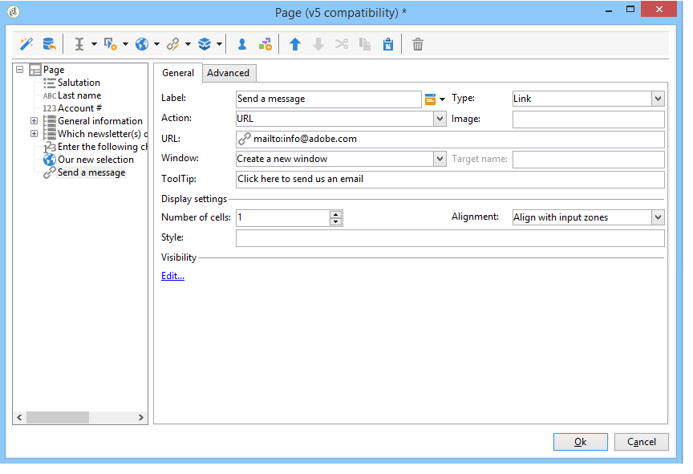

# Elementi statici in un modulo web{#static-elements-in-a-web-form}

È possibile includere nelle pagine del modulo elementi con i quali l&#39;utente non interagisce; si tratta di elementi statici quali immagini, contenuto HTML, barra orizzontale o collegamento ipertestuale. Questi elementi vengono creati mediante il primo pulsante nella barra degli strumenti, selezionando **[!UICONTROL Static elements]**.


Sono disponibili i seguenti tipi di campo:

* Valore basato su risposte fornite in precedenza (nel contesto del modulo) o sul database.
* Collegamento ipertestuale, HTML, barra orizzontale. Consultate [Inserimento di contenuto HTML](#inserting-html-content).
* Immagine salvata nella libreria delle risorse o su un server accessibile dagli utenti. Vedere [Inserimento di immagini](#inserting-images).
* Script eseguito sul lato client e/o sul lato server. Deve essere scritto in JavaScript ed essere compatibile con la maggior parte dei browser per garantire la corretta esecuzione sul lato client.

   >[!NOTE]
   >
   >Sul lato server, lo script può utilizzare le funzioni definite nella [documentazione JSAPI della campagna](https://docs.adobe.com/content/help/en/campaign-classic/technicalresources/api/index.html).

## Inserimento di contenuto HTML {#inserting-html-content}

È possibile includere il contenuto HTML in una pagina del modulo: collegamenti ipertestuali, immagini, paragrafi formattati, oggetti video o Flash, ecc.

L&#39;editor HTML consente di inserire il contenuto da inserire nella pagina del modulo. Per aprire l&#39;editor, fare clic su **[!UICONTROL Static elements]** > **[!UICONTROL HTML]** .

Potete immettere e formattare il contenuto direttamente oppure visualizzare la finestra del codice sorgente da incollare in alcuni contenuti esterni. Per passare alla modalità &quot;codice sorgente&quot;, fate clic sulla prima icona nella barra degli strumenti:


Per inserire un campo di database, utilizzate il pulsante di personalizzazione.


>[!NOTE]
>
>Le stringhe immesse nell&#39;editor HTML vengono convertite solo se definite nella sottoscheda **[!UICONTROL Texts]**. In caso contrario, non verranno raccolti. Per ulteriori informazioni, vedere [Traduzione di un modulo Web](../../web/using/translating-a-web-form.md).

### Inserimento di un collegamento {#inserting-a-link}

Compila i campi nella finestra di modifica come illustrato nell’esempio seguente:

Per aggiungere un collegamento ipertestuale, passare a **[!UICONTROL Static elements]** > **[!UICONTROL Link]**.



* Il **[!UICONTROL Label]** è il contenuto del collegamento ipertestuale così come verrà visualizzato nella pagina del modulo.
* L&#39; **[!UICONTROL URL]** è l&#39;indirizzo desiderato, ad esempio: [https://www.adobe.com](https://www.adobe.com) per un sito Web oppure [info@adobe.com](mailto:info@adobe.com) per inviare un messaggio.
* Il campo **[!UICONTROL Window]** consente di selezionare la modalità di visualizzazione del collegamento nel caso di un sito. È possibile aprire il collegamento in una nuova finestra, nella finestra corrente o in un&#39;altra.
* È possibile aggiungere una descrizione comandi, come illustrato di seguito:

   

* Potete scegliere di visualizzare il collegamento come pulsante o immagine. A tal fine, selezionare il tipo di visualizzazione nel campo **[!UICONTROL Type]**.

### Tipi di collegamenti {#types-of-links}

Per impostazione predefinita, i collegamenti sono associati a un’azione di tipo URL, in modo che sia possibile inserire un indirizzo di destinazione di collegamento nel campo URL.


Puoi definire altre azioni per il collegamento, in modo che l’utente possa fare clic sul collegamento per effettuare le seguenti operazioni:

* Aggiornare la pagina

   A tal fine, selezionare l&#39;opzione **[!UICONTROL Refresh page]** nella casella a discesa del campo **[!UICONTROL Action]**.

   

* Visualizzare la pagina precedente o successiva

   A tal fine, selezionare l&#39;opzione **[!UICONTROL Next page]** o **[!UICONTROL Previous page]** nella casella a discesa del campo **[!UICONTROL Action]**.

   

   È possibile nascondere i pulsanti **[!UICONTROL Next]** e/o **[!UICONTROL Back]** se devono essere sostituiti da un collegamento. Fare riferimento a questa [pagina](../../web/using/defining-web-forms-page-sequencing.md).

   Il collegamento sostituirà il pulsante **[!UICONTROL Next]** utilizzato per impostazione predefinita.

   

* Visualizzare un&#39;altra pagina

   L&#39;opzione **[!UICONTROL Enable a transition]** consente di visualizzare una pagina specifica associata alla transizione in uscita selezionata nel campo **[!UICONTROL Transition]**.

   

   Per impostazione predefinita, una pagina dispone di una sola transizione di output. Per creare nuove transizioni, selezionate la pagina e fate clic sul pulsante **[!UICONTROL Add]** nella sezione **[!UICONTROL Output transitions]**, come illustrato di seguito:

   

   Nel diagramma, l&#39;aggiunta avrà l&#39;aspetto seguente:

   

   >[!NOTE]
   >
   >Per ulteriori informazioni sulla sequenza delle pagine in un modulo Web, vedere [Definizione della sequenza delle pagine dei moduli Web](../../web/using/defining-web-forms-page-sequencing.md).

* Precaricare i campi del modulo con i dati prelevati dal profilo Facebook

   >[!CAUTION]
   >
   >Questa funzione è disponibile solo se è stata installata l&#39;applicazione **[!UICONTROL Social Marketing]**. Per utilizzare questa opzione, è necessario creare un&#39;applicazione Facebook con un account esterno di tipo **[!UICONTROL Facebook Connect]**. Per ulteriori informazioni, consulta [questa pagina](../../social/using/creating-a-facebook-application.md#configuring-external-accounts).

   L&#39;opzione **[!UICONTROL Preload with Facebook]** consente di inserire un pulsante in un modulo per precaricare i campi utilizzando le informazioni del profilo di Facebook.

   

   Quando un utente fa clic sul pulsante **[!UICONTROL Fill in automatically]**, si apre la finestra della richiesta di autorizzazione di Facebook.

   

   >[!NOTE]
   >
   >È possibile modificare l&#39;elenco dei diritti estesi durante la configurazione dell&#39;account esterno. Se non immettete alcun diritto esteso, per impostazione predefinita Facebook inoltra le informazioni di base del profilo.\
   >Per visualizzare l&#39;elenco dei diritti estesi e la relativa sintassi, fai clic qui: [https://developers.facebook.com/docs/reference/api/permissions/](https://developers.facebook.com/docs/reference/api/permissions/)

   Se l&#39;utente accetta di condividere le proprie informazioni, i campi del modulo vengono precaricati.

   

Per questo caso di utilizzo, è stata creata un&#39;applicazione Web composta dai seguenti elementi:

* una pagina contenente il modulo
* un’attività **[!UICONTROL Record]**
* un&#39;attività **[!UICONTROL End]**


Per aggiungere un pulsante di precaricamento, effettuate le seguenti operazioni:

1. Creare un modulo.

   

1. Passare allo stesso livello dei campi del modulo e aggiungere un collegamento.

   

1. Immettere l&#39;etichetta e selezionare il tipo **[!UICONTROL Button]**.

   

1. Andate al campo **[!UICONTROL Action]** e selezionate **[!UICONTROL Preload with Facebook]**.

   

1. Andate al campo **[!UICONTROL Application]** e selezionate il tipo di account esterno **[!UICONTROL Facebook Connect]** creato in precedenza. Per ulteriori informazioni, consulta [questa pagina](../../social/using/creating-a-facebook-application.md#configuring-external-accounts).

   

### Personalizzazione del contenuto HTML {#personalizing-html-content}

È possibile personalizzare il contenuto HTML di una pagina di modulo con i dati registrati in una pagina precedente. Ad esempio, è possibile creare un modulo Web di assicurazione auto la cui prima pagina consente di fornire informazioni di contatto e il marchio dell&#39;auto.


Utilizzate i campi di personalizzazione per reinserire il nome utente e il marchio selezionato nella pagina successiva. La sintassi da utilizzare dipende dalla modalità di memorizzazione delle informazioni. Per ulteriori informazioni, fare riferimento a [Utilizzo delle informazioni raccolte](../../web/using/web-forms-answers.md#using-collected-information).

>[!NOTE]
>
>Per motivi di sicurezza, il valore immesso nella formula **`<%=`** viene sostituito con caratteri di escape.

Nel nostro esempio, il nome e il cognome del destinatario sono memorizzati in un campo del database, mentre il marchio della loro auto è memorizzato in una variabile. La sintassi del messaggio personalizzato a pagina 2 sarà la seguente:


```
<P>Welcome <%= ctx.recipient.@firstName %> <%= ctx.recipient.@lastName %>,</P>
<P>To start your customized study, please select your car <%=ctx.vars.marque%> and its year of purchase.</P>
```

Questo produce il seguente risultato:


### Uso delle variabili di testo {#using-text-variables}

La scheda **[!UICONTROL Text]** consente di creare campi variabili che possono essere utilizzati nell&#39;HTML tra i caratteri &lt;%= e %> con la sintassi seguente: **$(IDENTIFIER)**.

Utilizzare questo metodo per localizzare facilmente le stringhe. Vedere [Traduzione di un modulo Web](../../web/using/translating-a-web-form.md)

Ad esempio, è possibile creare un campo **Contact** che consente di visualizzare la stringa &quot;Data dell&#39;ultimo contatto:&quot; nel contenuto HTML. Per farlo, segui la procedura indicata di seguito:

1. Fare clic sulla scheda **[!UICONTROL Text]** del testo HTML.
1. Fate clic sull&#39;icona **[!UICONTROL Add]**.
1. Nella colonna **[!UICONTROL Identifier]**, immettere il nome della variabile
1. Nella colonna **[!UICONTROL Text]**, immettere il valore predefinito.

   

1. Nel contenuto HTML, inserite questa variabile di testo tramite la sintassi **&lt;%= $(Contact) %>**.

   

   >[!CAUTION]
   >
   >Se immettete questi caratteri nell&#39;editor HTML, i campi **&lt;** e **** verranno sostituiti con i relativi caratteri di escape. In questo caso, è necessario correggere il codice sorgente facendo clic sull&#39;icona **[!UICONTROL Display source code]** dell&#39;editor di testo HTML.

1. Aprire l&#39;etichetta **[!UICONTROL Preview]** del modulo per visualizzare il valore immesso nel codice HTML:

   

Questa modalità operativa consente di definire il testo dei moduli Web una sola volta e di gestire le traduzioni utilizzando lo strumento di traduzione integrato. Per ulteriori informazioni, vedere [Traduzione di un modulo Web](../../web/using/translating-a-web-form.md).

## Inserimento di immagini {#inserting-images}

Per poter essere incluse nei moduli, le immagini devono essere salvate in un server accessibile dall&#39;esterno.

Selezionare il menu **[!UICONTROL Static elements]** > **[!UICONTROL Image]**.

Selezionate la sorgente dell’immagine da inserire: può provenire dalla libreria delle risorse pubbliche o essere memorizzato in un server esterno accessibile dall&#39;esterno.


Se si tratta di un&#39;immagine dalla libreria, selezionarla nella casella combinata del campo; se si trova in un file esterno, immettete il percorso di accesso. L&#39;etichetta viene visualizzata passando il cursore sull&#39;immagine (coincide con un campo ALT in HTML), oppure quando l&#39;immagine non viene visualizzata.

L’immagine può essere visualizzata nella sezione centrale dell’editor.
