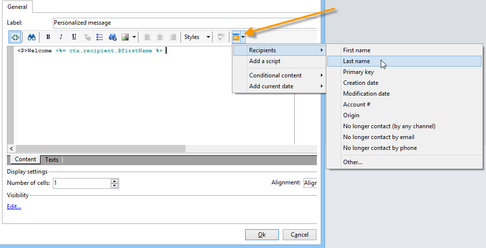

# Elementi statici in un modulo web{#static-elements-in-a-web-form}


È possibile includere nelle pagine del modulo elementi con i quali l&#39;utente non ha alcuna interazione, ovvero elementi statici quali immagini, contenuto HTML, una barra orizzontale o un collegamento ipertestuale. Questi elementi vengono creati tramite il primo pulsante nella barra degli strumenti, selezionando **[!UICONTROL Static elements]**.


Sono disponibili i seguenti tipi di campo:

* Valore basato sulle risposte fornite in precedenza (nel contesto del modulo) o sul database.
* Collegamento ipertestuale, HTML, barra orizzontale. Consulta [Inserimento di contenuto HTML](#inserting-html-content).
* Immagine salvata nella libreria delle risorse o in un server accessibile agli utenti. Consulta [Inserimento di immagini](#inserting-images).
* Script eseguito lato client e/o lato server. Deve essere scritto in JavaScript ed essere compatibile con la maggior parte dei browser per garantire la corretta esecuzione sul lato client.

  >[!NOTE]
  >
  >Sul lato server, lo script può utilizzare le funzioni definite in [Documentazione JSAPI per Campaign](https://experienceleague.adobe.com/developer/campaign-api/api/index.html?lang=it).

## Inserisci contenuto HTML {#inserting-html-content}

È possibile includere contenuto HTML in una pagina del modulo: collegamenti ipertestuali, immagini, paragrafi formattati, video e così via.

L’editor di HTML consente di inserire il contenuto da inserire nella pagina del modulo. Per aprire l’editor, fai clic su **[!UICONTROL Static elements]** > **[!UICONTROL HTML]** .

Puoi inserire e formattare il contenuto direttamente o visualizzare la finestra del codice sorgente per incollare del contenuto esterno. Per passare alla modalità &quot;codice sorgente&quot;, fai clic sulla prima icona nella barra degli strumenti:


Per inserire un campo di database, utilizza il pulsante di personalizzazione.



>[!NOTE]
>
>Le stringhe immesse nell’editor di HTML vengono tradotte solo se sono definite nel **[!UICONTROL Texts]** scheda secondaria. In caso contrario, non verranno raccolti. Per ulteriori informazioni, consulta [Traduzione di un modulo web](translating-a-web-form.md).

### Inserire un collegamento {#inserting-a-link}

Compila i campi nella finestra di modifica come mostrato nell’esempio seguente:

Per aggiungere un collegamento ipertestuale, vai a **[!UICONTROL Static elements]** > **[!UICONTROL Link]**.


* Il **[!UICONTROL Label]** è il contenuto del collegamento ipertestuale che verrà visualizzato nella pagina del modulo.
* Il **[!UICONTROL URL]** è l’indirizzo desiderato, ad esempio: [https://www.adobe.com](https://www.adobe.com) per un sito web, oppure [info@adobe.com](mailto:info@adobe.com) per inviare un messaggio.
* Il **[!UICONTROL Window]** consente di selezionare la modalità di visualizzazione del collegamento nel caso di un sito. È possibile decidere di aprire il collegamento in una nuova finestra, nella finestra corrente o in un&#39;altra finestra.
* È possibile aggiungere una descrizione comandi, come illustrato di seguito:

  

* Puoi scegliere di visualizzare il collegamento come pulsante o immagine. A questo scopo, seleziona il tipo di visualizzazione nell’ **[!UICONTROL Type]** campo.

### Tipi di collegamenti {#types-of-links}

Per impostazione predefinita, i collegamenti sono associati a un’azione di tipo URL, in modo che un indirizzo di destinazione del collegamento possa essere inserito nel campo URL.


Puoi definire altre azioni per il collegamento, in modo che l’utente possa fare clic sul collegamento per effettuare le seguenti operazioni:

* Aggiorna la pagina

  A questo scopo, seleziona la **[!UICONTROL Refresh page]** nella casella a discesa del **[!UICONTROL Action]** campo.

  

* Visualizza la pagina precedente/successiva

  A questo scopo, seleziona la **[!UICONTROL Next page]** o **[!UICONTROL Previous page]** nella casella a discesa del **[!UICONTROL Action]** campo.

  

  È possibile nascondere **[!UICONTROL Next]** e/o **[!UICONTROL Back]** se devono essere sostituiti da un collegamento. Fai riferimento a questo [pagina](defining-web-forms-page-sequencing.md).

  Il collegamento sostituirà il **[!UICONTROL Next]** utilizzato per impostazione predefinita.

  

* Visualizza un&#39;altra pagina

  Il **[!UICONTROL Enable a transition]** consente di visualizzare una pagina specifica associata alla transizione in uscita selezionata nel **[!UICONTROL Transition]** campo.

  

  Per impostazione predefinita, una pagina ha una sola transizione di output. Per creare nuove transizioni, seleziona la pagina e fai clic su **[!UICONTROL Add]** pulsante in **[!UICONTROL Output transitions]** come mostrato di seguito:

  

  Nel diagramma, l’aggiunta avrà un aspetto simile al seguente:

  

  >[!NOTE]
  >
  >Per ulteriori informazioni sulla sequenza delle pagine in un modulo web, consulta [Definizione della sequenza di pagine dei moduli web](defining-web-forms-page-sequencing.md).

### Personalizzare il contenuto di HTML {#personalizing-html-content}

È possibile personalizzare il contenuto HTML di una pagina del modulo con i dati registrati in una pagina precedente. Ad esempio, è possibile creare un modulo Web di assicurazione auto la cui prima pagina consente di fornire informazioni di contatto e il marchio dell&#39;auto.


Utilizza i campi di personalizzazione per inserire nuovamente il nome utente e il marchio selezionati nella pagina successiva. La sintassi da utilizzare dipende dalla modalità di archiviazione delle informazioni. Per ulteriori informazioni, consulta [Utilizzo delle informazioni raccolte](web-forms-answers.md#using-collected-information).

>[!NOTE]
>
>Per motivi di sicurezza, il valore immesso in **`<%=`** la formula viene sostituita con caratteri di escape.

Nel nostro esempio, il nome e il cognome del destinatario sono memorizzati in un campo del database, mentre il marchio della sua auto è memorizzato in una variabile. La sintassi del messaggio personalizzato a pagina 2 sarà la seguente:


```
<P>Welcome <%= ctx.recipient.@firstName %> <%= ctx.recipient.@lastName %>,</P>
<P>To start your customized study, please select your car <%=ctx.vars.marque%> and its year of purchase.</P>
```

Questo produce il seguente risultato:


### Usa variabili di testo {#using-text-variables}

Il **[!UICONTROL Text]** La scheda consente di creare campi variabili che possono essere utilizzati nel HTML tra i caratteri &lt;%= e %> con la seguente sintassi: **$(IDENTIFIER)**.

Utilizzare questo metodo per localizzare facilmente le stringhe. Consulta [Traduzione di un modulo web](translating-a-web-form.md)

Ad esempio, puoi creare un’ **Contatto** che ti consentirà di visualizzare la stringa &quot;Date of last contact:&quot; (Data dell’ultimo contatto) nel contenuto del HTML. A questo scopo, segui la procedura indicata di seguito:

1. Fai clic sul pulsante **[!UICONTROL Text]** del testo del HTML.
1. Fai clic su **[!UICONTROL Add]** icona.
1. In **[!UICONTROL Identifier]** , immettere il nome della variabile
1. In **[!UICONTROL Text]** , immettere il valore predefinito.

   

1. Nel contenuto di HTML, inserisci questa variabile di testo tramite il **&lt;%= $(Contact) %>** sintassi.

   

   >[!CAUTION]
   >
   >Se inserisci questi caratteri nell’editor di HTML, il **&lt;** e **>** I campi verranno sostituiti con i relativi caratteri di escape. In questo caso, è necessario correggere il codice sorgente facendo clic sul pulsante **[!UICONTROL Display source code]** dell’editor di testo di HTML.

1. Apri **[!UICONTROL Preview]** etichetta del modulo per visualizzare il valore immesso nel HTML:

   

Questa modalità operativa consente di definire il testo dei moduli web una sola volta e di gestire le traduzioni utilizzando lo strumento di traduzione integrato. Per ulteriori informazioni, consulta [Traduzione di un modulo web](translating-a-web-form.md).

## Inserisci immagini {#inserting-images}

Le immagini da includere nei moduli devono essere salvate in un server accessibile dall&#39;esterno.

Seleziona la **[!UICONTROL Static elements]** > **[!UICONTROL Image]** menu.

Seleziona l’origine dell’immagine da inserire: può provenire dalla libreria delle risorse pubbliche o essere memorizzata su un server esterno accessibile dall’esterno.


Se si tratta di un’immagine della libreria, selezionala nella casella combinata del campo; se si trova in un file esterno, immetti il percorso di accesso. L’etichetta viene visualizzata passando il cursore sull’immagine (coincide con un campo ALT in HTML) o quando l’immagine non viene visualizzata.

L&#39;immagine può essere visualizzata nella sezione centrale dell&#39;editor.
