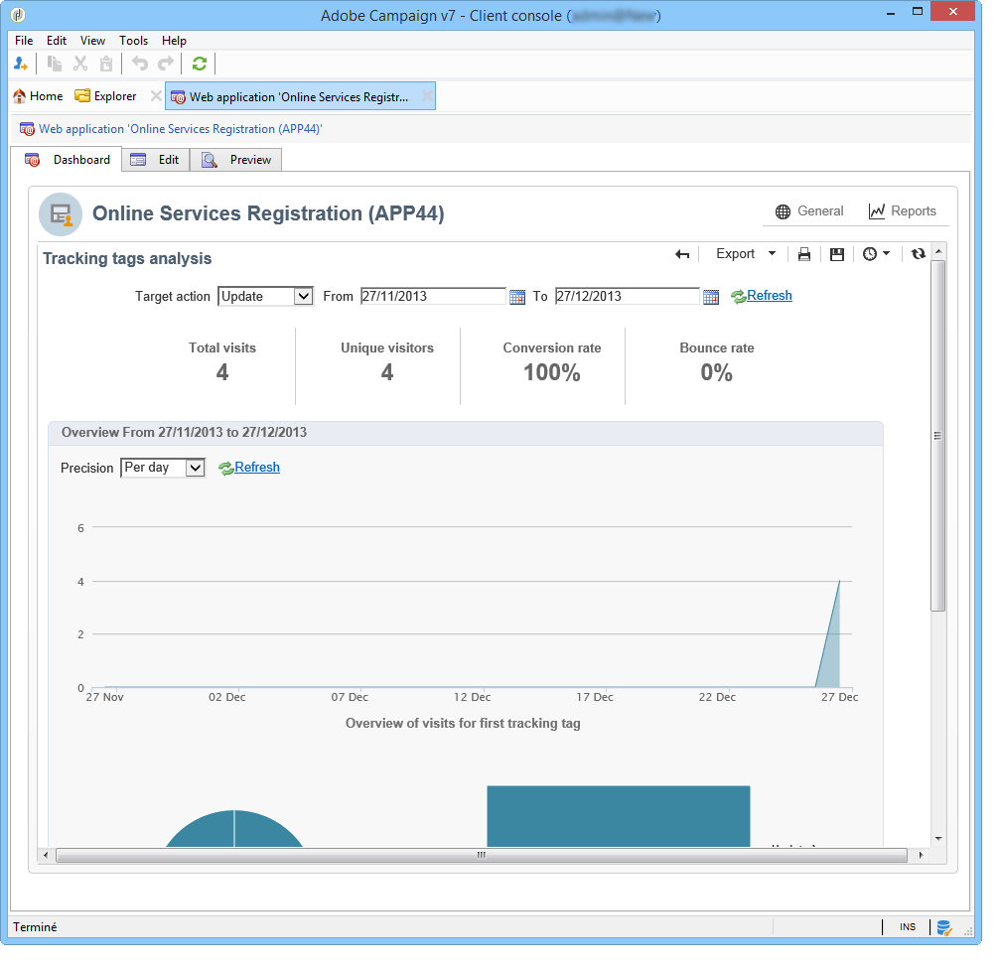

# Tracciare le visite in un’applicazione web{#tracking-a-web-application}

Adobe Campaign consente di tenere traccia e misurare le visite sulle pagine delle applicazioni web inserendo tag di tracciamento. Questa funzionalità può essere utilizzata per tutti i tipi di applicazioni Web (moduli, pagine Web e così via).

In questo modo, puoi definire diversi percorsi di navigazione e valutarne il successo. I dati recuperati sono quindi disponibili nei rapporti di ciascuna applicazione.

I principali miglioramenti presenti in questa versione sono i seguenti:

* Possibilità di inserire diversi tag di tracciamento nella stessa pagina per semplificare la definizione dei percorsi di navigazione (ad esempio acquisto, abbonamento, restituzione, ecc.).
* Visualizzazione dei percorsi di navigazione e dei tag di tracciamento delle diverse pagine nel dashboard dell’applicazione Web.

  

* Generazione di un rapporto di tracciamento completo.

  

  I principali indicatori sono i seguenti:

   * **Tasso di conversione**: numero di persone che hanno visualizzato tutti i passaggi di un percorso di navigazione.
   * **Percentuale non recapitate**: numero di persone che hanno visualizzato solo il primo passaggio
   * **Funnel di conversione**: tasso di perdita tra ciascun passaggio.

  Inoltre, un **Settore** grafico tipo mostra la popolazione in base alla sua origine.

## Identificazione dell’origine del traffico {#identifying-the-traffic-source}

Per identificare l’origine del visitatore durante l’accesso a un’applicazione web è possibile utilizzare due diverse modalità:

1. Invio di una consegna specifica per concedere l’accesso alle pagine dell’applicazione web: in questo caso, l’origine del traffico è la consegna,
1. Associazione dell’applicazione web a un’origine del traffico dedicata: in questo caso, deve essere una consegna esterna di tipo &quot;origine del traffico&quot;. Può essere selezionato dalle proprietà dell’applicazione web o dalla mappatura di destinazione.

   

Per identificare l’origine del traffico in un’applicazione web, Adobe Campaign cerca successivamente le seguenti informazioni:

1. l’identificatore della consegna sorgente, se esistente (cookie nlId),
1. l’identificatore della consegna esterna definito nelle proprietà dell’applicazione web, se presente,
1. l’identificatore della consegna esterna definito nella mappatura di destinazione, se presente.

>[!NOTE]
>
>Il tracciamento anonimo è disponibile solo se l’opzione è stata attivata nella procedura guidata di distribuzione durante l’installazione di Campaign.

## Applicazioni Web progettate con Digital Content Editor (DCE) {#web-applications-designed-with-digital-content-editor--dce-}

Quando un’applicazione web viene creata utilizzando l’editor di contenuti HTML - **Editor di contenuti digitali (DCE)** - i tag di tracciamento vengono inseriti dal **[!UICONTROL Properties]** dell’editor. Per ulteriori informazioni su Digital Content Editor (DCE), consultare [questa sezione](about-campaign-html-editor.md).

Quando si utilizza l’interfaccia web, i tag di tracciamento devono essere inseriti dalle proprietà della pagina.

Il **[!UICONTROL Display blocks]** consente di visualizzare il numero di tag di tracciamento definiti per la pagina.

