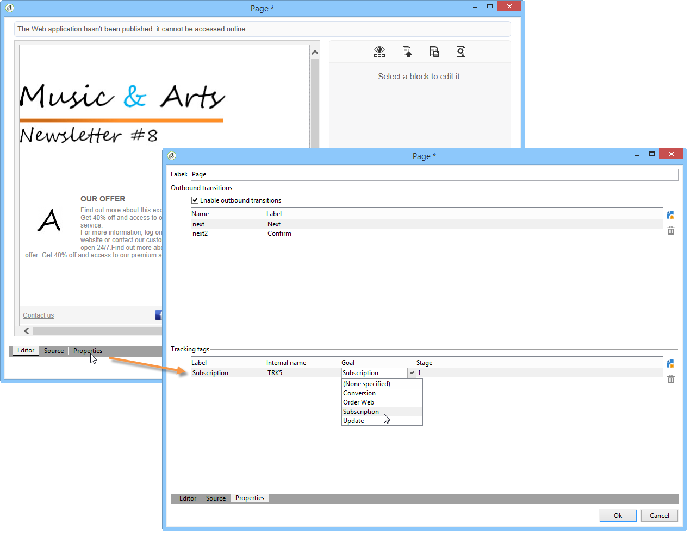

# Tracciare le visite in un&#39;applicazione web{#tracking-a-web-application}

Adobe Campaign ti consente di monitorare e misurare le visite sulle pagine delle applicazioni web inserendo tag di tracciamento. Questa funzionalità può essere utilizzata per tutti i tipi di applicazioni web (moduli, sondaggi online, pagine web create utilizzando DCE, ecc.).

È quindi possibile definire diversi percorsi di navigazione e valutarne il successo. I dati recuperati sono quindi disponibili nei rapporti di ogni applicazione.

I principali miglioramenti descritti in questa versione sono i seguenti:

* Possibilità di inserire diversi tag di tracciamento sulla stessa pagina per facilitare la definizione dei percorsi di navigazione (ad esempio acquisto, abbonamento, ritorno, ecc.).
* Visualizzazione dei percorsi di navigazione e dei tag di tracciamento delle diverse pagine nel dashboard dell&#39;applicazione Web.

   

* Generazione di un rapporto di tracciamento completo.

   

   I principali indicatori sono i seguenti:

   * **Tasso** di conversione: numero di persone che hanno visualizzato tutti i passaggi di un percorso di navigazione.
   * **Frequenza** di rimbalzo: numero di persone che hanno visualizzato solo il primo passaggio
   * **Funnel** di conversione: tasso di perdita tra ciascun passo.

   Inoltre, un grafico di tipo **Settore** mostra la popolazione in base alla relativa origine.

## Identificazione dell&#39;origine del traffico {#identifying-the-traffic-source}

È possibile utilizzare due modalità diverse per identificare la provenienza del visitatore all’accesso a un’applicazione Web:

1. Invio di una consegna specifica per concedere l’accesso alle pagine dell’applicazione Web: in questo caso, l’origine del traffico è questa consegna,
1. Associazione dell&#39;applicazione Web a un&#39;origine traffico dedicata: in questo caso, deve essere una consegna esterna di tipo &quot;origine traffico&quot;. Può essere selezionato dalle proprietà dell&#39;applicazione Web o dalla mappatura di destinazione.

   

Per identificare l’origine del traffico in un’applicazione Web, Adobe Campaign cerca in seguito le seguenti informazioni:

1. l’identificatore di consegna di origine, se esiste (cookie nlId),
1. l&#39;identificatore della consegna esterna definito nelle proprietà dell&#39;applicazione Web, se esiste,
1. l’identificatore della consegna esterna definita nel mapping di destinazione, se presente.

>[!NOTE]
>
>Il tracciamento anonimo è possibile solo se l’opzione corrispondente è stata attivata nella procedura guidata di distribuzione.
>
>Per ulteriori informazioni, consulta la [Guida all’installazione](../../installation/using/deploying-an-instance.md).

## Applicazioni web progettate con Digital Content Editor (DCE) {#web-applications-designed-with-digital-content-editor--dce-}

Quando un&#39;applicazione Web viene creata utilizzando l&#39;editor di contenuti HTML - **Digital Content Editor (DCE)** - i tag di tracciamento vengono inseriti dalla scheda **[!UICONTROL Properties]** dell&#39;editor. Per ulteriori informazioni sull&#39;editor di contenuti digitali (DCE), consulta [questa sezione](../../web/using/about-campaign-html-editor.md).

Quando si utilizza l’interfaccia Web, i tag di tracciamento devono essere inseriti dalle proprietà della pagina.

L’icona **[!UICONTROL Display blocks]** ti consente di visualizzare il numero di tag di tracciamento definiti per la pagina.

