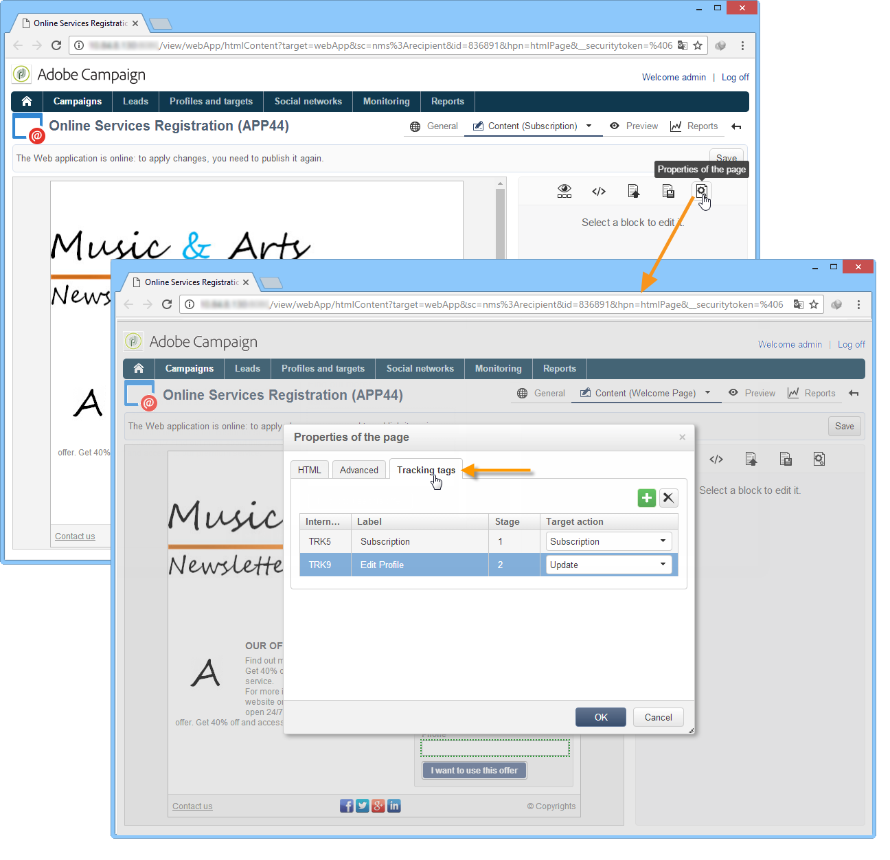

# Tracking di un’applicazione web{#tracking-a-web-application}

 Adobe Campaign consente di monitorare e misurare le visite sulle pagine dell&#39;applicazione Web inserendo tag di tracciamento. Questa funzionalità può essere utilizzata per tutti i tipi di applicazioni Web (moduli, sondaggi online, pagine Web create con DCE, ecc.).

Potete quindi definire diversi percorsi di navigazione e valutarne il successo. I dati recuperati sono quindi disponibili nei rapporti di ogni applicazione.

I principali miglioramenti introdotti in questa versione sono i seguenti:

* Possibilità di inserire diversi tag di tracciamento sulla stessa pagina per semplificare la definizione dei percorsi di navigazione (ad esempio acquisto, abbonamento, restituzione ecc.).
* Visualizzare i percorsi di navigazione e i tag di tracciamento delle diverse pagine nel dashboard dell&#39;applicazione Web.

   

* Generazione di un rapporto di tracciamento completo.

   

   I principali indicatori sono i seguenti:

   * **Tasso** di conversione: numero di persone che hanno visualizzato tutti i passaggi di un percorso di navigazione.
   * **Frequenza** rimbalzo: numero di persone che hanno visualizzato solo il primo passo
   * **Tunnel** di conversione: tasso di perdita tra ciascun passaggio.

   Inoltre, un grafico di tipo **Settore** mostra la popolazione in base all&#39;origine.

## Identificazione dell’origine del traffico {#identifying-the-traffic-source}

Per identificare da dove proviene il visitatore quando accede a un&#39;applicazione Web è possibile utilizzare due modalità diverse:

1. Invio di una consegna specifica per consentire l&#39;accesso alle pagine dell&#39;applicazione Web: in questo caso, l&#39;origine del traffico è questa consegna,
1. Associazione dell&#39;applicazione Web a un&#39;origine traffico dedicata: in questo caso, deve essere una consegna di tipo &quot;origine del traffico&quot; esterna. Può essere selezionato dalle proprietà dell&#39;applicazione Web o dalla mappatura di destinazione.

   

Per identificare l&#39;origine del traffico in un&#39;applicazione Web,  Adobe Campaign cerca in successione le informazioni seguenti:

1. l&#39;identificatore di consegna di origine, se esiste (cookie nlId),
1. l&#39;identificatore della consegna esterna definito nelle proprietà dell&#39;applicazione Web, se esiste,
1. identificatore della consegna esterna definita nella mappatura di destinazione, se esistente.

>[!NOTE]
>
>Il tracciamento anonimo è possibile solo se l’opzione corrispondente è stata attivata nella procedura guidata di distribuzione.
>
>For more on this, refer to the [Installation guide](../../installation/using/deploying-an-instance.md).

## Applicazioni Web progettate con Digital Content Editor (DCE) {#web-applications-designed-with-digital-content-editor--dce-}

Quando si crea un&#39;applicazione Web utilizzando l&#39;editor di contenuti HTML - **Digital Content Editor (DCE)** - i tag di tracciamento vengono inseriti dalla **[!UICONTROL Properties]** scheda dell&#39;editor. Per ulteriori informazioni su Digital Content Editor (DCE), consulta [questa sezione](../../web/using/about-campaign-html-editor.md).

Quando si utilizza l&#39;interfaccia Web, i tag di tracciamento devono essere inseriti dalle proprietà della pagina.

L’ **[!UICONTROL Display blocks]** icona consente di visualizzare il numero di tag di tracciamento definiti per la pagina.

