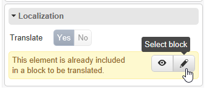

# Progettare un’applicazione web{#translating-a-web-application}

Puoi tradurre le pagine di applicazioni web create con l’editor di contenuti digitali (DCE) di Adobe Campaign.

Se selezioni almeno una lingua aggiuntiva tramite il **[!UICONTROL Localization]** nella scheda **[!UICONTROL Properties]** di un’applicazione Web, diventa disponibile una nuova opzione quando si aggiunge un blocco di contenuto HTML in una pagina modificata con DCE.

Questa opzione ti consente di indicare se il contenuto del blocco deve essere tradotto o meno.

Le stringhe da tradurre vengono raccolte nello stesso modo delle altre stringhe dell&#39;applicazione Web, tramite **[!UICONTROL Translations]** scheda dell&#39;applicazione. Per ulteriori informazioni, consulta [questa pagina](translating-a-web-form.md).

Per contrassegnare le stringhe da tradurre:

1. Aprire una pagina di contenuto modificata con DCE in un&#39;applicazione Web.

   

1. Selezionare un blocco HTML.
1. Nel blocco dei parametri a destra, la **[!UICONTROL Localization]** consente di contrassegnare il contenuto del blocco selezionato. Per impostazione predefinita, solo il titolo della pagina deve essere tradotto.

   

   >[!NOTE]
   >
   >Le stringhe non devono superare i 1023 caratteri.

   Esistono tre casi specifici:

   * Quando il blocco selezionato contiene più stringhe/blocchi, viene contrassegnato come una singola stringa da tradurre. La stringa contiene quindi il codice HTML degli elementi all’interno di questo blocco.
   * Quando si desidera contrassegnare un blocco contenente più stringhe e se almeno una di queste stringhe è già segnalata, viene visualizzato un avviso. È quindi possibile rimuovere il flag dalla stringa isolata e aggiungere l’intero blocco.

      

   * Quando si desidera rimuovere il flag da una stringa contenuta in un blocco già contrassegnato, non è possibile modificare direttamente l&#39;opzione di traduzione della stringa. Tuttavia, puoi accedere al blocco contenente la stringa per modificarla.

      

1. Una volta completate le operazioni di contrassegno delle stringhe, torna all&#39;applicazione Web e seleziona la **[!UICONTROL Translations]** scheda .
1. Seleziona **[!UICONTROL Collect the strings to translate]**. Le stringhe contrassegnate in DCE vengono aggiunte alle stringhe dell&#39;applicazione Web.

   >[!NOTE]
   >
   >Una volta raccolte le stringhe, queste non verranno rimosse dall’elenco se rimuovi il flag di traduzione in DCE. Questo consente di mantenerli nella memoria di traduzione.

1. Traduci e approvi le stringhe.

   Puoi quindi visualizzare in anteprima le traduzioni selezionando la lingua desiderata dal **[!UICONTROL Preview]** nell&#39;applicazione Web.
