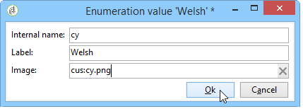

# Traduzione di un modulo web{#translating-a-web-form}


È possibile localizzare un&#39;applicazione Web in diverse lingue.

Puoi eseguire le traduzioni direttamente nella console Adobe Campaign (consulta [Gestione delle traduzioni nell&#39;editor](#managing-translations-in-the-editor)) oppure esportare e importare le stringhe per esternalizzare la traduzione (consulta [Esternalizzazione della traduzione](#externalizing-translation)).

L’elenco delle lingue di traduzione disponibili per impostazione predefinita è dettagliato in [Modifica della lingua di visualizzazione dei moduli](#changing-forms-display-language).

L&#39;applicazione Web è progettata in un linguaggio di modifica: questa è la lingua di riferimento utilizzata per immettere etichette e altri contenuti da tradurre.

La lingua predefinita è la lingua in cui verrà visualizzata l&#39;applicazione Web se non viene aggiunta alcuna impostazione della lingua al relativo URL di accesso.

>[!NOTE]
>
>Per impostazione predefinita, la lingua di modifica e quella predefinita sono uguali alla lingua della console.

## Scelta delle lingue {#choosing-languages}

Per definire una o più lingue di traduzione, fare clic sul pulsante **[!UICONTROL Properties]** dell&#39;applicazione Web, quindi sulla scheda **[!UICONTROL Localization]**. Fare clic sul pulsante **[!UICONTROL Add]** per definire una nuova lingua di traduzione per l&#39;applicazione Web.

>[!NOTE]
>
>Questa finestra consente inoltre di modificare la lingua predefinita e la lingua di modifica.


Quando si aggiungono lingue di traduzione per un&#39;applicazione Web (o quando la lingua predefinita e la lingua di modifica sono diverse), alla scheda **[!UICONTROL Edit]** viene aggiunta una sottoscheda **[!UICONTROL Translation]** per gestire le traduzioni.

Adobe Campaign include uno strumento per la traduzione e la gestione delle traduzioni multilingue. Questo editor ti consente di visualizzare le stringhe da tradurre o approvare, di immettere le traduzioni direttamente nell’interfaccia o di importare/esportare le stringhe di caratteri per esternalizzare le traduzioni.

## Gestione delle traduzioni nell’editor {#managing-translations-in-the-editor}

### Raccolta di stringhe {#collecting-strings}

La scheda **[!UICONTROL Translations]** consente di immettere le traduzioni per le stringhe di caratteri che compongono l&#39;applicazione Web.

La prima volta che apri questa scheda non conterrà alcun dato. Fare clic sul collegamento **[!UICONTROL Collect the strings to translate]** per aggiornare le stringhe nell&#39;applicazione Web.

Adobe Campaign raccoglie le etichette dei campi e delle stringhe definiti nelle schede **[!UICONTROL Texts]** di tutti gli elementi statici: Blocchi HTML, JavaScript e così via Gli elementi statici sono descritti in [Elementi statici in un modulo web](static-elements-in-a-web-form.md).


>[!CAUTION]
>
>Questo processo può richiedere alcuni minuti a seconda del volume di dati da elaborare.
> 
>Se sembra che nel dizionario di sistema manchino alcune traduzioni, fare riferimento a [Traduzione delle stringhe di sistema](#translating-the-system-strings).

Ogni volta che una stringa viene tradotta, la relativa traduzione viene aggiunta al dizionario di traduzione.

Quando il processo di raccolta rileva che una traduzione esiste già, questa traduzione viene visualizzata nella colonna **[!UICONTROL Text]** della stringa. Lo stato della stringa viene impostato su **[!UICONTROL Translated]**.

Per le stringhe di caratteri che non sono mai state tradotte, il campo **[!UICONTROL Text]** è vuoto e lo stato è **[!UICONTROL To translate]**.

### Filtrare le stringhe {#filtering-strings}

Per impostazione predefinita, viene visualizzata ogni lingua di traduzione dell&#39;applicazione Web. Sono disponibili due filtri predefiniti: lingua e stato. Fai clic sul pulsante **[!UICONTROL Filters]** , quindi fai clic su **[!UICONTROL By language or status]** per visualizzare le caselle a discesa corrispondenti. Puoi anche creare un filtro avanzato. Per ulteriori informazioni, consulta [questa pagina](../../platform/using/creating-filters.md#creating-an-advanced-filter).


Vai alla casella a discesa **[!UICONTROL Language]** per selezionare la lingua di traduzione.

Per visualizzare solo le stringhe non tradotte, selezionare **[!UICONTROL To translate]** nella casella a discesa **[!UICONTROL Status]**. È inoltre possibile visualizzare solo le stringhe tradotte o approvate.

### Traduzione di stringhe {#translating-strings}

1. Per tradurre una parola, fare doppio clic sulla sua riga nell’elenco delle stringhe.

   

   La stringa di origine viene visualizzata nella sezione superiore della finestra.

1. Inserite la traduzione nella sezione inferiore. Per approvarlo, seleziona l’opzione **[!UICONTROL Translation approved]** .

   >[!NOTE]
   >
   >L’approvazione della traduzione è facoltativa e non bloccherà il processo.

   Le traduzioni non approvate vengono visualizzate come **[!UICONTROL Translated]**. Le traduzioni approvate vengono visualizzate come **[!UICONTROL Approved]**.

## Esternazione della traduzione {#externalizing-translation}

È possibile esportare e importare le stringhe di caratteri per tradurle utilizzando uno strumento diverso da Adobe Campaign.

>[!CAUTION]
>
>Una volta esportate le stringhe, non eseguire traduzioni utilizzando lo strumento integrato. Ciò porterebbe a un conflitto quando reimporti le traduzioni e queste andranno perse.

### Esportazione di file {#exporting-files}

1. Selezionare le applicazioni Web di cui si desidera esportare le stringhe, fare clic con il pulsante destro del mouse, quindi selezionare **[!UICONTROL Actions > Export strings for translation...]**

   

1. Seleziona un **[!UICONTROL Export strategy]** :

   * **[!UICONTROL One file per language]**: l’esportazione genera un file per lingua di traduzione. Ogni file sarà comune a tutte le applicazioni Web selezionate.
   * **[!UICONTROL One file per Web application]**: l&#39;esportazione genererà un file per applicazione Web selezionata. Ogni file conterrà tutte le lingue di traduzione.

      >[!NOTE]
      >
      >Questo tipo di esportazione non è disponibile per le esportazioni XLIFF.

   * **[!UICONTROL One file per language and per Web application]**: l’esportazione genererà diversi file. Ogni file conterrà una lingua di traduzione per applicazione Web.
   * **[!UICONTROL One file for all]**: l’esportazione genererà un singolo file multilingue per tutte le applicazioni Web. Conterrà tutte le lingue di traduzione per tutte le applicazioni Web selezionate.

      >[!NOTE]
      >
      >Questo tipo di esportazione non è disponibile per le esportazioni XLIFF.

1. Quindi scegli il **[!UICONTROL Target folder]** dove verranno registrati i file.
1. Seleziona il formato del file ( **[!UICONTROL CSV]** o **[!UICONTROL XLIFF]** ) e fai clic su **[!UICONTROL Start]**.


>[!NOTE]
>
>I nomi dei file di esportazione vengono generati automaticamente. Se esegui più volte la stessa esportazione, sostituirai i file esistenti con quelli nuovi. Se devi conservare i file precedenti, modifica **[!UICONTROL Target folder]** , quindi fai di nuovo clic su **[!UICONTROL Start]** per eseguire l’esportazione.

Quando si esportano file in **formato CSV**, ogni lingua è collegata a uno stato di stato e di approvazione. Approva **** consente di approvare una traduzione. Questa colonna può contenere i valori **Sì** o **No**. Per quanto riguarda l&#39;editor integrato (consulta [Gestione delle traduzioni nell&#39;editor](#managing-translations-in-the-editor)), l&#39;approvazione delle traduzioni è facoltativa e non blocca il processo.

### Importazione di file {#importing-files}

Una volta completata la traduzione esterna, puoi importare i file tradotti.

1. Vai all&#39;elenco delle applicazioni Web, fai clic con il pulsante destro del mouse, quindi seleziona **[!UICONTROL Actions > Import translated strings...]**

   >[!NOTE]
   >
   >Non è necessario selezionare le applicazioni web interessate dalla traduzione. Posizionare il cursore in un punto qualsiasi dell&#39;elenco delle applicazioni Web.

   

1. Seleziona il file da importare, quindi fai clic su **[!UICONTROL Upload]**.

   

>[!NOTE]
>
>Le traduzioni esterne hanno sempre la priorità sulle traduzioni interne. In caso di conflitti, la traduzione interna sarà sovrascritta con la traduzione esterna.

## Modifica della lingua di visualizzazione dei moduli {#changing-forms-display-language}

I moduli Web vengono visualizzati nella lingua predefinita specificata nella scheda **[!UICONTROL Localization]** delle proprietà dell&#39;applicazione Web. Per modificare le lingue, è necessario aggiungere i seguenti caratteri alla fine dell’URL (dove **xx** è il simbolo della lingua):

```
?lang=xx
```

se la lingua è il primo o l’unico parametro dell’URL. Ad esempio: **https://myserver/webApp/APP34?lang=en**

```
&lang=xx
```

se nell’URL sono presenti altri parametri prima della lingua. Ad esempio: **https://myserver/webApp/APP34?status=1&amp;lang=en**

Di seguito sono elencati i dizionari e le lingue di traduzione disponibili per impostazione predefinita.

**Dizionario** di sistema predefinito: alcune lingue includono un dizionario predefinito che contiene la traduzione delle stringhe di sistema. Per ulteriori informazioni, consulta [Traduzione delle stringhe di sistema](#translating-the-system-strings).

**Gestione** calendario: le pagine di un&#39;applicazione Web possono includere un calendario per l&#39;immissione di date. Per impostazione predefinita, questo calendario è disponibile in diverse lingue (traduzione di giorni, formato data).

<table> 
 <tbody> 
  <tr> 
   <td> <strong>Lingua (simboli)</strong><br /> </td> 
   <td> <strong>Dizionario di sistema predefinito</strong><br /> </td> 
   <td> <strong>Gestione dei calendari</strong><br /> </td> 
  </tr> 
  <tr> 
   <td> Tedesco (de)<br /> </td> 
   <td> yes<br /> </td> 
   <td> yes<br /> </td> 
  </tr> 
  <tr> 
   <td> Inglese (en)<br /> </td> 
   <td> yes<br /> </td> 
   <td> yes<br /> </td> 
  </tr> 
  <tr> 
   <td> Inglese (Stati Uniti) (en_US)<br /> </td> 
   <td> </td> 
   <td> </td> 
  </tr> 
  <tr> 
   <td> Inglese (Regno Unito) (en_GB)<br /> </td> 
   <td> </td> 
   <td> </td> 
  </tr> 
  <tr> 
   <td> Arabo (ar)<br /> </td> 
   <td> </td> 
   <td> </td> 
  </tr> 
  <tr> 
   <td> Cinese (zh)<br /> </td> 
   <td> </td> 
   <td> </td> 
  </tr> 
  <tr> 
   <td> Coreano (ko)<br /> </td> 
   <td> </td> 
   <td> </td> 
  </tr> 
  <tr> 
   <td> Danese (da)<br /> </td> 
   <td> yes<br /> </td> 
   <td> yes<br /> </td> 
  </tr> 
  <tr> 
   <td> Spagnolo (es)<br /> </td> 
   <td> yes<br /> </td> 
   <td> yes<br /> </td> 
  </tr> 
  <tr> 
   <td> Estone (et)<br /> </td> 
   <td> </td> 
   <td> </td> 
  </tr> 
  <tr> 
   <td> Finlandese (fi)<br /> </td> 
   <td> </td> 
   <td> yes<br /> </td> 
  </tr> 
  <tr> 
   <td> Francese (fr)<br /> </td> 
   <td> yes<br /> </td> 
   <td> yes<br /> </td> 
  </tr> 
  <tr> 
   <td> Francese (Belgio) (fr_BE)<br /> </td> 
   <td> </td> 
   <td> </td> 
  </tr> 
  <tr> 
   <td> Francese (Francia) (fr_FR)<br /> </td> 
   <td> </td> 
   <td> </td> 
  </tr> 
  <tr> 
   <td> Greco (el)<br /> </td> 
   <td> </td> 
   <td> yes<br /> </td> 
  </tr> 
  <tr> 
   <td> Ebraico (he)<br /> </td> 
   <td> </td> 
   <td> </td> 
  </tr> 
  <tr> 
   <td> Ungherese (hu)<br /> </td> 
   <td> </td> 
   <td> yes<br /> </td> 
  </tr> 
  <tr> 
   <td> Indonesiano (id)<br /> </td> 
   <td> </td> 
   <td> </td> 
  </tr> 
  <tr> 
   <td> Irlandese (ga)<br /> </td> 
   <td> </td> 
   <td> </td> 
  </tr> 
  <tr> 
   <td> Italiano (it)<br /> </td> 
   <td> yes<br /> </td> 
   <td> yes<br /> </td> 
  </tr> 
  <tr> 
   <td> Italiano (Italia) (it_IT)<br /> </td> 
   <td> </td> 
   <td> </td> 
  </tr> 
  <tr> 
   <td> Italiano (svizzero) (it_CH)<br /> </td> 
   <td> </td> 
   <td> </td> 
  </tr> 
  <tr> 
   <td> Giapponese (ja)<br /> </td> 
   <td> </td> 
   <td> </td> 
  </tr> 
  <tr> 
   <td> Lettone (lv)<br /> </td> 
   <td> </td> 
   <td> yes<br /> </td> 
  </tr> 
  <tr> 
   <td> Lituano (lt)<br /> </td> 
   <td> </td> 
   <td> </td> 
  </tr> 
  <tr> 
   <td> Maltese (mt)<br /> </td> 
   <td> </td> 
   <td> </td> 
  </tr> 
  <tr> 
   <td> Olandese (nl)<br /> </td> 
   <td> </td> 
   <td> yes<br /> </td> 
  </tr> 
  <tr> 
   <td> Olandese (Belgio) (nl_BE)<br /> </td> 
   <td> </td> 
   <td> </td> 
  </tr> 
  <tr> 
   <td> Olandese (Olanda) (nl_NL)<br /> </td> 
   <td> </td> 
   <td> </td> 
  </tr> 
  <tr> 
   <td> Norvegese (Norvegia) (no_NO)<br /> </td> 
   <td> </td> 
   <td> yes<br /> </td> 
  </tr> 
  <tr> 
   <td> Polacco (pl)<br /> </td> 
   <td> </td> 
   <td> yes<br /> </td> 
  </tr> 
  <tr> 
   <td> Portoghese (pt)<br /> </td> 
   <td> </td> 
   <td> yes<br /> </td> 
  </tr> 
  <tr> 
   <td> Portoghese (Brasile) (pt_BR)<br /> </td> 
   <td> </td> 
   <td> </td> 
  </tr> 
  <tr> 
   <td> Portoghese (Portogallo) (pt_PT)<br /> </td> 
   <td> </td> 
   <td> </td> 
  </tr> 
  <tr> 
   <td> Russo (ru)<br /> </td> 
   <td> </td> 
   <td> yes<br /> </td> 
  </tr> 
  <tr> 
   <td> sloveno (sl)<br /> </td> 
   <td> </td> 
   <td> </td> 
  </tr> 
  <tr> 
   <td> Slovacco (sk)<br /> </td> 
   <td> </td> 
   <td> </td> 
  </tr> 
  <tr> 
   <td> Svedese (sv)<br /> </td> 
   <td> yes<br /> </td> 
   <td> yes<br /> </td> 
  </tr> 
  <tr> 
   <td> Svedese (Finlandia) (sv_FI)<br /> </td> 
   <td> </td> 
   <td> </td> 
  </tr> 
  <tr> 
   <td> Svedese (Svezia) (sv_SE)<br /> </td> 
   <td> </td> 
   <td> </td> 
  </tr> 
  <tr> 
   <td> Ceco (cs)<br /> </td> 
   <td> </td> 
   <td> </td> 
  </tr> 
  <tr> 
   <td> Thai (th)<br /> </td> 
   <td> </td> 
   <td> </td> 
  </tr> 
  <tr> 
   <td> Vietnamita (vi)<br /> </td> 
   <td> </td> 
   <td> </td> 
  </tr> 
  <tr> 
   <td> Luna (wa)<br /> </td> 
   <td> </td> 
   <td> </td> 
  </tr> 
 </tbody> 
</table>

>[!NOTE]
>
>Per aggiungere lingue diverse da quelle offerte per impostazione predefinita, fai riferimento a [Aggiunta di una lingua di traduzione](#adding-a-translation-language)

## Esempio: visualizzazione di un&#39;applicazione Web in diverse lingue {#example--displaying-a-web-application-in-several-languages}

Il seguente modulo Web è disponibile in quattro lingue: Inglese, francese, tedesco e spagnolo. Le stringhe di caratteri sono state tutte tradotte tramite la scheda **[!UICONTROL Translation]** del modulo Web. Poiché la lingua predefinita è l’inglese, quando il sondaggio viene pubblicato utilizza l’URL standard per visualizzarlo in inglese.


Aggiungi **?lang=fr** alla fine dell&#39;URL per visualizzarlo in francese:

>[!NOTE]
>
>L&#39;elenco dei simboli per ogni lingua è dettagliato in [Modifica della lingua di visualizzazione dei moduli](#changing-forms-display-language).


È possibile aggiungere **?lang=es** o **?lang=de** per visualizzarlo in spagnolo o tedesco.

>[!NOTE]
>
>Se per questa applicazione Web sono già utilizzati altri parametri, aggiungere **&amp;lang=**.\
>Ad esempio: **https://myserver/webApp/APP34?status=1&amp;lang=en**

## Configurazione avanzata della traduzione {#advanced-translation-configuration}

>[!CAUTION]
>
>Questa sezione è riservata agli utenti esperti.

### Traduzione delle stringhe di sistema {#translating-the-system-strings}

Le stringhe di sistema sono stringhe di caratteri predefinite utilizzate da tutte le applicazioni Web. Ad esempio: Pulsanti **[!UICONTROL Next]** , **[!UICONTROL Previous]**, **[!UICONTROL Approve]**, messaggi **[!UICONTROL Loading]** e così via Per impostazione predefinita, alcune lingue contengono un dizionario con traduzioni per queste stringhe. L’elenco delle lingue è dettagliato in [Modifica della lingua di visualizzazione dei moduli](#changing-forms-display-language).

Se si traduce l&#39;applicazione Web in una lingua per la quale il dizionario di sistema non è tradotto, verrà visualizzato un messaggio di avviso per informarti che mancano alcune traduzioni.


Per aggiungere una lingua, effettua le seguenti operazioni:

1. Vai alla struttura Adobe Campaign e fai clic su **[!UICONTROL Administration > Configuration > Global dictionary > System dictionary]** .
1. Nella sezione superiore della finestra, seleziona la stringa di sistema da tradurre, quindi fai clic su **[!UICONTROL Add]** nella sezione inferiore.

   

1. Selezionare la lingua di traduzione e immettere una traduzione per la stringa. Puoi approvare la traduzione selezionando l’opzione **[!UICONTROL Translation approved]** .

   

   >[!NOTE]
   >
   >L’approvazione della traduzione è facoltativa e non bloccherà il processo.

>[!CAUTION]
>
>Non eliminare le stringhe di sistema predefinite.

### Aggiunta di una lingua di traduzione {#adding-a-translation-language}

Per tradurre le applicazioni Web in lingue diverse da quelle predefinite (fare riferimento a [Modifica della lingua di visualizzazione dei moduli](#changing-forms-display-language)), sarà necessario aggiungere una nuova lingua di traduzione.

1. Fai clic sul nodo **[!UICONTROL Administration > Platform > Enumerations]** della struttura Adobe Campaign e seleziona **[!UICONTROL Languages available for translation]** dall’elenco. L&#39;elenco delle traduzioni disponibili viene visualizzato nella sezione inferiore della finestra.

   

1. Fai clic sul pulsante **[!UICONTROL Add]** , quindi immetti i valori **[!UICONTROL Internal name]**, **[!UICONTROL Label]** e l’identificatore dell’immagine (flag). Per aggiungere una nuova immagine, contatta l’amministratore.

   
