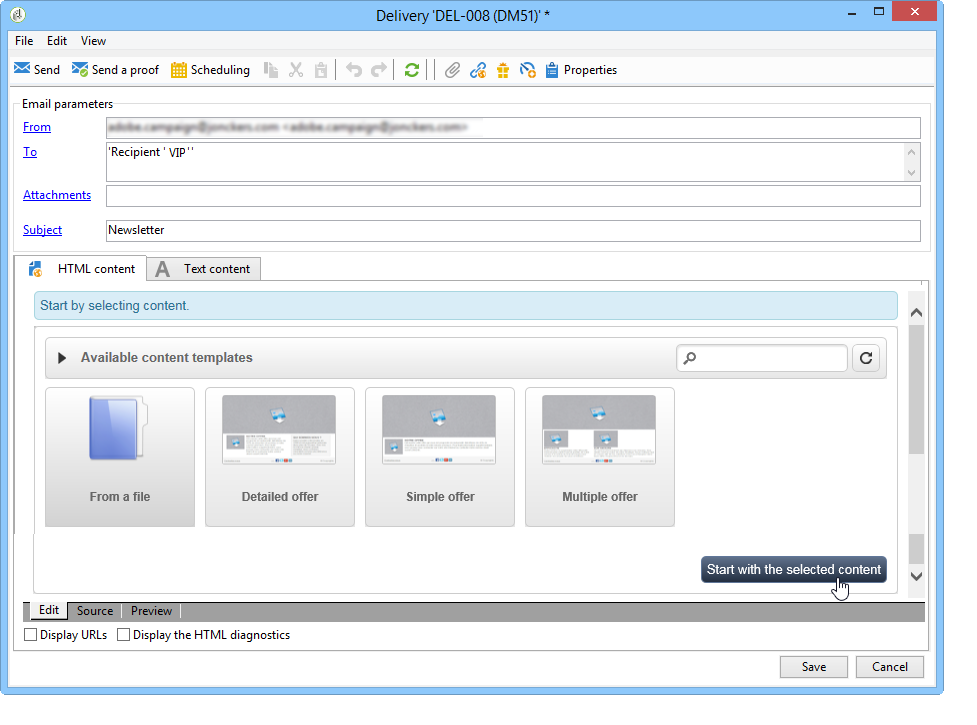
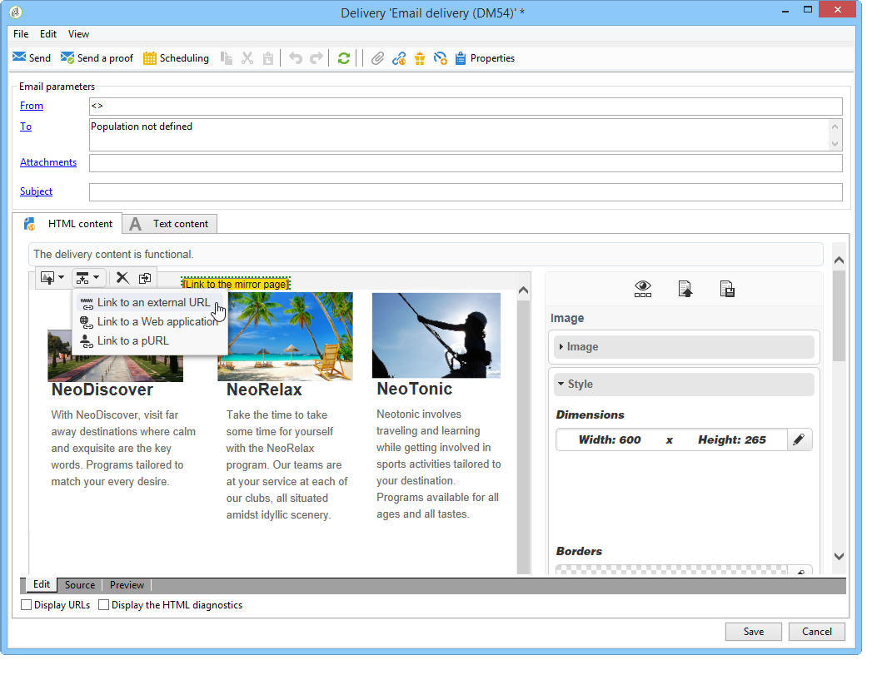

# Caso d’uso: creazione di una consegna e-mail{#use-case-creating-an-email-delivery}

In questo caso di utilizzo, verranno illustrati i passaggi necessari per progettare una distribuzione di e-mail utilizzando  Adobe Campaign Digital Content Editor (DCE).

Il nostro obiettivo finale è quello di creare una consegna con un modello personalizzato che contenga:

* Un indirizzo diretto per un destinatario (utilizzando i nomi e i secondi)
* Due tipi di collegamenti a un URL esterno
* Una pagina mirror
* Collegamento a un&#39;applicazione Web

>[!NOTE]
>
>Prima di iniziare, è necessario disporre di almeno un **modello HTML** configurato per ospitare il contenuto delle consegne future.
>
>Nella consegna **[!UICONTROL Properties]**, assicurarsi che la **[!UICONTROL Content editing mode]** (nella scheda **[!UICONTROL Advanced]**) sia impostata su **[!UICONTROL DCE]**. Per garantire il funzionamento ottimale dell&#39;editor, fare riferimento alle [Best practice di modifica dei contenuti](../../web/using/content-editing-best-practices.md).

## Passaggio 1 - Creazione di una consegna {#step-1---creating-a-delivery}

Per creare una nuova consegna, posizionate il cursore nella scheda **Campagne** e fate clic su **Consegne**. Fare clic sul pulsante **Crea** sopra l&#39;elenco delle consegne esistenti. Per ulteriori informazioni sulla creazione di consegne, vedere [questa pagina](../../delivery/using/about-email-channel.md).

## Passaggio 2 - Selezione di un modello {#step-2---selecting-a-template}

Selezionate un modello di consegna, quindi assegnate un nome alla consegna. Questo nome sarà visibile solo agli utenti della console  Adobe Campaign e non ai destinatari, ma questa intestazione verrà visualizzata nell’elenco delle consegne. Fai clic su **[!UICONTROL Continue]**.

## Passaggio 3 - Selezione di un contenuto {#step-3---selecting-a-content}

Digital Content Editor viene fornito con diversi modelli out-of-the-box con strutture variabili (colonne, aree di testo, ecc.).

Selezionate il modello di contenuto da utilizzare, quindi fate clic sul pulsante **[!UICONTROL Start with the selected content]** per visualizzare il modello nella consegna creata.

Potete anche importare un contenuto HTML creato all&#39;esterno di  Adobe Campaign selezionando **[!UICONTROL From a file]**.

Potete salvare questo contenuto come modello da utilizzare in futuro. Una volta creato un modello di contenuto personalizzato, potete visualizzarlo in anteprima dall&#39;elenco dei modelli. Per ulteriori informazioni, consultare [Gestione dei modelli](../../web/using/template-management.md).

>[!CAUTION]
>
>Se si utilizza l&#39; **interfaccia Web Adobe Campaign**, è necessario importare un file .zip contenente il contenuto HTML e le immagini correlate.

## Passaggio 4 - Progettazione del messaggio {#step-4---designing-the-message}

* Visualizza il nome e il secondo dei destinatari

   Per inserire il primo e il secondo nome dei destinatari in un campo di testo nella consegna, fare clic sul campo di testo selezionato, quindi posizionare il cursore nel punto in cui si desidera visualizzarli. Fate clic sulla prima icona nella barra degli strumenti a comparsa, quindi fate clic su **[!UICONTROL Personalization block]**. Selezionare **[!UICONTROL Greetings]**, quindi fare clic su **[!UICONTROL OK]**.

   

* Inserire un collegamento in un’immagine

   Per indirizzare i destinatari della consegna a un indirizzo esterno tramite un&#39;immagine, fai clic sull&#39;immagine desiderata per visualizzare la barra degli strumenti a comparsa, posiziona il cursore sulla prima icona e fai clic su **[!UICONTROL Link to an external URL]**. Per ulteriori informazioni, vedere [Aggiunta di un collegamento](../../web/using/editing-content.md#adding-a-link).

   

   Immettere l&#39;URL del collegamento nel campo **URL** utilizzando il formato seguente **https://www.myURL.com**, quindi confermare.

   Il collegamento può essere modificato in qualsiasi momento utilizzando la sezione a destra della finestra.

* Inserire un collegamento nel testo

   Per integrare un collegamento esterno nel testo, selezionate del testo o un blocco di testo, quindi fate clic sulla prima icona nella barra degli strumenti a comparsa. Fare clic su **[!UICONTROL Link to an external URL]**, inserire l&#39;indirizzo del collegamento nel campo **[!UICONTROL URL]**. Per ulteriori informazioni, vedere [Aggiunta di un collegamento](../../web/using/editing-content.md#adding-a-link).

   Il collegamento può essere modificato in qualsiasi momento utilizzando la sezione a destra della finestra.

   >[!CAUTION]
   >
   >Il testo immesso nel campo **[!UICONTROL Label]** sostituisce il testo originale.

* Aggiungere una pagina mirror

   Per consentire ai destinatari di visualizzare il contenuto della distribuzione in un browser Web, potete integrare nella distribuzione un collegamento a una pagina mirror.

   Fare clic sul campo di testo in cui si desidera visualizzare il collegamento pubblicato. Fare clic sulla prima icona nella barra degli strumenti a comparsa, selezionare **[!UICONTROL Personalization block]**, quindi **[!UICONTROL Link to Mirror Page (MirrorPage)]**. Fare clic su **[!UICONTROL Save]** per confermare.

   

   >[!CAUTION]
   >
   >L’etichetta del blocco di personalizzazione sostituisce automaticamente il testo originale nella distribuzione.

* Integrazione di un collegamento a un&#39;applicazione Web

   Digital Content Editor consente di integrare i collegamenti alle applicazioni Web dalla console  Adobe Campaign, ad esempio una pagina di destinazione o una pagina di modulo. Per ulteriori informazioni, vedere [Collegamento a un&#39;applicazione Web](../../web/using/editing-content.md#link-to-a-web-application).

   Selezionare un campo di testo per il collegamento a un&#39;applicazione Web, quindi fare clic sulla prima icona. Scegliere **[!UICONTROL Link to a Web application]**, quindi selezionare l&#39;applicazione desiderata facendo clic sull&#39;icona alla fine del campo **Applicazione Web**.

   

   Fare clic su **Salva** per confermare.

   >[!NOTE]
   >
   >Questo passaggio richiede di salvare almeno un&#39;applicazione Web prima. che si trovano nella scheda **[!UICONTROL Campaigns > Web applications]** della console.

## Passaggio 5 - Salvataggio della consegna {#step-5---saving-the-delivery}

Una volta integrato il contenuto, salvate la distribuzione facendo clic su **Salva**. Ora verrà visualizzato nell&#39;elenco delle consegne, disponibile nella scheda **[!UICONTROL Campaigns > Deliveries]**.
