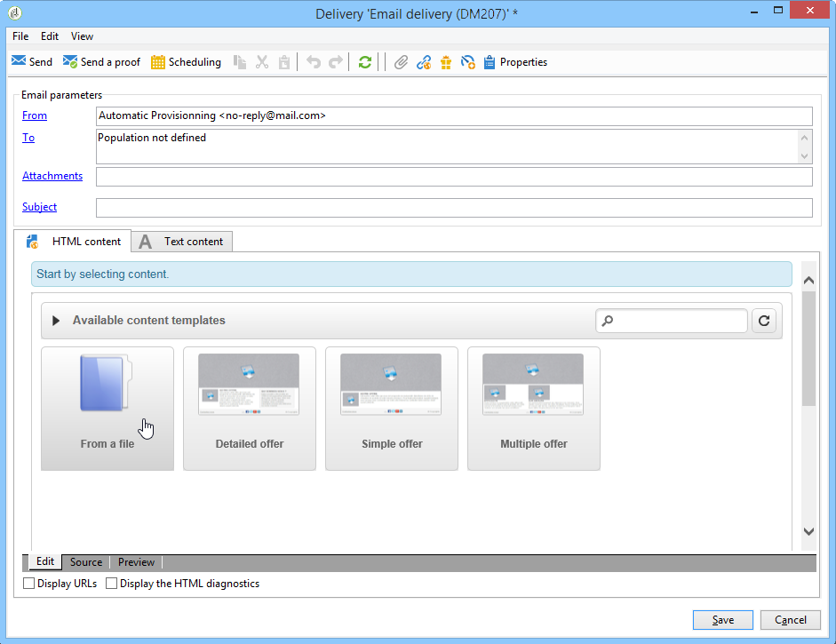

# Caso d’uso: creare una consegna e-mail{#use-case-creating-an-email-delivery}

In questo caso d’uso, imparerai a progettare una consegna e-mail utilizzando Adobe Campaign Digital Content Editor (DCE).

Il nostro obiettivo finale è quello di creare una consegna con un modello personalizzato contenente:

* Un indirizzo diretto per un destinatario (utilizzando nomi e nomi)
* Due tipi di collegamenti a un URL esterno
* Una pagina mirror
* Collegamento a un&#39;applicazione Web

>[!NOTE]
>
>Prima di iniziare, devi averne almeno uno **Modello HTML** configurato per ospitare il contenuto delle consegne future.
>
>Nella consegna **[!UICONTROL Properties]**, assicurati che il **[!UICONTROL Content editing mode]** (nella **[!UICONTROL Advanced]** ) è impostato su **[!UICONTROL DCE]**. Per garantire il funzionamento ottimale dell’editor, consulta [Best practice per la modifica dei contenuti](content-editing-best-practices.md).

## Passaggio 1: creazione di una consegna {#step-1---creating-a-delivery}

Per creare una nuova consegna, posiziona il cursore nel **Campagne** e fai clic su **Consegne**. Fai clic su **Crea** sopra l’elenco delle consegne esistenti. Per ulteriori informazioni sulla creazione di consegne, consulta [questa pagina](../../delivery/using/about-email-channel.md).

## Passaggio 2: selezione di un modello {#step-2---selecting-a-template}

Seleziona un modello di consegna, quindi assegna un nome alla consegna. Questo nome sarà visibile solo agli utenti della console Adobe Campaign e non ai destinatari, tuttavia questa intestazione verrà visualizzata nell’elenco delle consegne. Fai clic su **[!UICONTROL Continue]**.

## Passaggio 3: selezione di un contenuto {#step-3---selecting-a-content}

Digital Content Editor viene fornito con vari modelli pronti all’uso con strutture diverse (colonne, aree di testo, ecc.).

Seleziona il modello di contenuto da utilizzare, quindi fai clic su **[!UICONTROL Start with the selected content]** per visualizzare il modello nella consegna creata.

Puoi anche importare un contenuto HTML creato al di fuori di Adobe Campaign selezionando **[!UICONTROL From a file]**.

Puoi salvare questo contenuto come modello da utilizzare in futuro. Una volta creato un modello di contenuto personalizzato, puoi visualizzarne l’anteprima dall’elenco dei modelli. Per ulteriori informazioni, consulta [Gestione dei modelli](template-management.md).

>[!CAUTION]
>
>Se utilizzi il **Interfaccia web di Adobe Campaign**, è necessario importare un file .zip contenente il contenuto HTML e le immagini correlate.

## Passaggio 4: Progettazione del messaggio {#step-4---designing-the-message}

* Visualizza il primo e il secondo nome dei destinatari

  Per inserire il primo e il secondo nome dei destinatari in un campo di testo della consegna, fai clic sul campo di testo scelto, quindi posiziona il cursore nel punto in cui desideri visualizzarli. Fai clic sulla prima icona nella barra degli strumenti pop-up, quindi fai clic su **[!UICONTROL Personalization block]**. Seleziona **[!UICONTROL Greetings]**, quindi fai clic su **[!UICONTROL OK]**.

  

* Inserire un collegamento in un&#39;immagine

  Per indirizzare i destinatari della consegna a un indirizzo esterno tramite un’immagine, fai clic sull’immagine appropriata per visualizzare la barra degli strumenti a comparsa, posiziona il cursore sulla prima icona, quindi fai clic su **[!UICONTROL Link to an external URL]**. Per ulteriori informazioni, consulta [Aggiunta di un collegamento](editing-content.md#adding-a-link).

  

  Immetti l’URL del collegamento in **URL** utilizzando il seguente formato **https://www.myURL.com**, quindi conferma.

  Il collegamento può essere modificato in qualsiasi momento utilizzando la sezione a destra della finestra.

* Inserire un collegamento nel testo

  Per integrare un collegamento esterno nel testo della consegna, seleziona un testo o un blocco di testo e fai clic sulla prima icona nella barra degli strumenti a comparsa. Clic **[!UICONTROL Link to an external URL]**, inserisci l’indirizzo del collegamento in **[!UICONTROL URL]** campo. Per ulteriori informazioni, consulta [Aggiunta di un collegamento](editing-content.md#adding-a-link).

  Il collegamento può essere modificato in qualsiasi momento utilizzando la sezione a destra della finestra.

  >[!CAUTION]
  >
  >Il testo immesso nel **[!UICONTROL Label]** sostituisce il testo originale.

* Aggiungere una pagina mirror

  Per consentire ai destinatari di visualizzare il contenuto della consegna in un browser web, puoi integrare nella consegna un collegamento a una pagina speculare.

  Fai clic sul campo di testo in cui desideri visualizzare il collegamento pubblicato. Fai clic sulla prima icona nella barra degli strumenti pop-up, seleziona **[!UICONTROL Personalization block]**, quindi **[!UICONTROL Link to Mirror Page (MirrorPage)]**. Fai clic su **[!UICONTROL Save]** per confermare.

  

  >[!CAUTION]
  >
  >L’etichetta del blocco di personalizzazione sostituisce automaticamente il testo originale nella consegna.

* Integrare un collegamento a un’applicazione web

  L’Editor di contenuti digitali consente di integrare i collegamenti alle applicazioni web dalla console Adobe Campaign, ad esempio una pagina di destinazione o una pagina di modulo. Per ulteriori informazioni, consulta [Collegamento a un’applicazione web](editing-content.md#link-to-a-web-application).

  Selezionare un campo di testo per il collegamento a un&#39;applicazione Web, quindi fare clic sulla prima icona. Scegli **[!UICONTROL Link to a Web application]**, quindi seleziona l’applicazione desiderata facendo clic sull’icona alla fine del **Applicazione web** campo.

  

  Fai clic su **Salva** per confermare.

  >[!NOTE]
  >
  >Questo passaggio richiede il salvataggio anticipato di almeno un&#39;applicazione Web. Questi sono reperibili nella sezione **[!UICONTROL Campaigns > Web applications]** della console.

## Passaggio 5: salvataggio della consegna {#step-5---saving-the-delivery}

Una volta integrato il contenuto, salva la consegna facendo clic su **Salva**. Ora verrà visualizzato nell’elenco delle consegne, disponibile nella sezione **[!UICONTROL Campaigns > Deliveries]** scheda.
