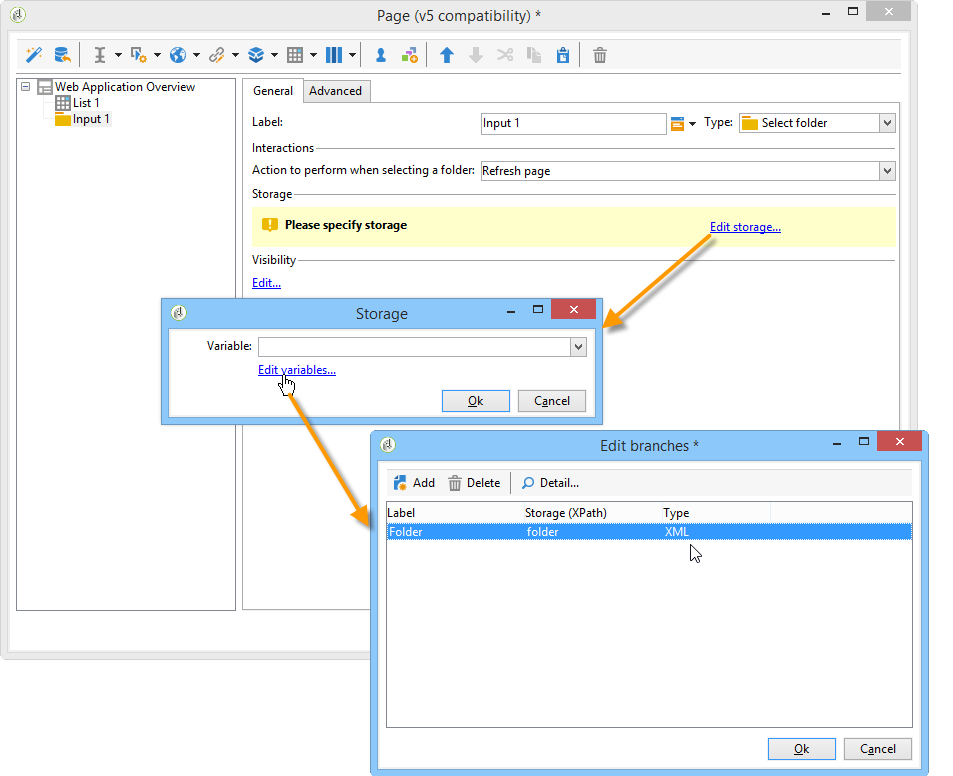

# Casi di utilizzo: creare pagine di panoramica{#use-cases-creating-overviews}


Nell&#39;esempio seguente verranno create applicazioni Web di tipo panoramica per visualizzare tutte le applicazioni Web nel database. Configura i seguenti elementi:

* un filtro sulla cartella (consulta [Aggiunta di un filtro a una cartella](#adding-a-filter-on-a-folder)),
* un pulsante per la creazione di una nuova applicazione Web (fare riferimento a [Aggiunta di un pulsante per configurare una nuova applicazione Web](#adding-a-button-to-configure-a-new-web-application)),
* visualizzazione dettagliata di ciascuna voce dell&#39;elenco (fare riferimento a [Aggiunta di dettagli a un elenco](#adding-detail-to-a-list)),
* un filtro per strumento di modifica dei collegamenti (consulta [Creazione di un filtro tramite un editor di collegamenti](#creating-a-filter-using-a-link-editor)),
* un collegamento di aggiornamento (fare riferimento a [Creazione di un collegamento di aggiornamento](#creating-a-refresh-link)).


## Creazione di un&#39;applicazione Web a pagina singola {#creating-a-single-page-web-application}

1. Crea una singola applicazione Web **[!UICONTROL Page]** e disabilita le transizioni e le transizioni in uscita alla pagina successiva.

   

1. Modifica del titolo della pagina.

   Questo titolo verrà visualizzato nell&#39;intestazione della panoramica e nella panoramica dell&#39;applicazione Web.

1. Nelle proprietà dell&#39;applicazione Web, modificare il rendering dell&#39;applicazione selezionando il modello **[!UICONTROL Single-page Web application]**.

   

1. Apri l&#39;attività **[!UICONTROL Page]** dell&#39;applicazione Web e apri un elenco (**[!UICONTROL Static element > List]**).
1. Nella scheda **[!UICONTROL Data]** dell’elenco, selezionare il tipo di documento **[!UICONTROL Web applications]** e le colonne di output **[!UICONTROL Label]** , **[!UICONTROL Creation date]** e **[!UICONTROL Type of application]**.
1. Nella sottoscheda **[!UICONTROL Filter]** , crea il seguente filtro come mostrato di seguito per visualizzare solo le applicazioni Web ed escludere i modelli dalla visualizzazione.

   

1. Chiudi la finestra di configurazione della pagina e fai clic su **[!UICONTROL Preview]**.

   Viene visualizzato l&#39;elenco delle applicazioni Web disponibili nel database.

   

## Aggiunta di un filtro a una cartella {#adding-a-filter-on-a-folder}

In una panoramica, puoi scegliere di accedere ai dati a seconda della posizione nella struttura di Adobe Campaign. Questo è un filtro su una cartella. Applica il seguente processo per aggiungerlo alla panoramica.

1. Posizionare il cursore sul nodo **[!UICONTROL Page]** dell&#39;applicazione Web e aggiungere un elemento **[!UICONTROL Select folder]** (**[!UICONTROL Advanced controls > Select folder]**).
1. Nella finestra **[!UICONTROL Storage]** che viene visualizzata, fai clic sul collegamento **[!UICONTROL Edit variables]** .
1. Modifica l’etichetta della variabile in base alle tue esigenze.
1. Modifica il nome della variabile con il valore **folder** .

   >[!NOTE]
   >
   >Il nome della variabile deve corrispondere al nome dell’elemento collegato alla cartella (definito nello schema), ovvero **cartella** in questo caso. È necessario riutilizzare questo nome quando si fa riferimento alla tabella.

1. Applica il tipo **[!UICONTROL XML]** alla variabile.

   

1. Seleziona l’interazione **[!UICONTROL Refresh page]** .

   

1. Posiziona il cursore sull’elenco e nella scheda **[!UICONTROL Advanced]** fai riferimento alla variabile creata in precedenza nella scheda **[!UICONTROL Folder filter XPath]** dell’elenco. È necessario utilizzare il nome dell’elemento interessato dal collegamento alla cartella, ovvero **cartella**.

   

   >[!NOTE]
   >
   >In questa fase, l&#39;applicazione Web non è nel relativo contesto applicativo, pertanto il filtro non può essere testato sulla cartella.

## Aggiunta di un pulsante per configurare una nuova applicazione Web {#adding-a-button-to-configure-a-new-web-application}

1. Posiziona il cursore sull’elemento **[!UICONTROL Page]** e aggiungi un collegamento (**[!UICONTROL Static elements > Link]**).
1. Modifica l’etichetta del collegamento in quanto verrà visualizzata sul pulsante nella panoramica.

   Nel nostro esempio, l&#39;etichetta è **New**.

1. Inserisci il seguente URL nel campo URL: **xtk://open/?schema=nms:webApp&amp;form=nms:newWebApp**.

   >[!NOTE]
   >
   >**nms:** webAppcoincidente con lo schema dell&#39;applicazione Web.
   >
   >**nms:** newWebAppcoincidente con la nuova procedura guidata di creazione dell&#39;applicazione Web.

1. Scegli di visualizzare l’URL nella stessa finestra.
1. Aggiungi l&#39;icona dell&#39;applicazione Web nel campo immagine: **/nms/img/webApp.png**.

   Questa icona verrà visualizzata sul pulsante **[!UICONTROL New]** .

1. Immetti **button** nel campo **[!UICONTROL Style]** .

   Questo stile è indicato nel modello **[!UICONTROL Single-page Web application]** selezionato in precedenza.

   

## Aggiunta di dettagli a un elenco {#adding-detail-to-a-list}

Quando configuri un elenco nella panoramica, puoi scegliere di visualizzare ulteriori dettagli per ogni voce nell’elenco.

1. Posiziona il cursore sull’elemento elenco creato in precedenza.
1. Nella scheda **[!UICONTROL General]** , seleziona la modalità di visualizzazione **[!UICONTROL Columns and additional detail]** nell’elenco a discesa.

   

1. Nella scheda **[!UICONTROL Data]** , aggiungi la colonna **[!UICONTROL Primary key]** , **[!UICONTROL Internal name]** e **[!UICONTROL Description]** e seleziona l’opzione **[!UICONTROL Hidden field]** per ciascuna di esse.

   

   In questo modo, queste informazioni saranno visibili solo nei dettagli di ogni voce.

1. Nella scheda **[!UICONTROL Additional detail]** , aggiungi il seguente codice:

   ```
   <div class="detailBox">
     <div class="actionBox">
       <span class="action"><a title="Open" class="linkAction" href="xtk://open/?schema=nms:webApp&form=nms:webApp&pk=
       <%=webApp.id%>">Open...</a></span>
       <% 
       if( webApp.@appType == 1 ) { //survey
       %>
       <span class="action"><a target="_blank" title="Reports" class="linkAction" href="/xtk/report.jssp?_context=selection&
         _schema=nms:webApp&_selection=<%=webApp.@id%>
         &__sessiontoken=<%=document.controller.getSessionToken()%>">Reports</a></span>
       <% 
       } 
       %>
     </div>
     <div>
       Internal name: <%= webApp.@internalName %>
     </div>
     <%
     if( webApp.desc != "" )
     {
     %>
     <div>
       Description: <%= webApp.desc %>
     </div>
     <% 
     } 
     %>
   </div>
   ```

>[!NOTE]
>
>L&#39;aggiornamento delle librerie JavaScript richiede cinque minuti sul server. È possibile riavviare il server per evitare di attendere questo ritardo.

## Filtrare e aggiornare l’elenco {#filtering-and-updating-the-list}

In questa sezione verrà creato un filtro per la visualizzazione della panoramica delle applicazioni Web create da un operatore specifico. Questo filtro viene creato con un editor di collegamenti. Dopo aver selezionato un operatore, aggiorna l’elenco per applicare il filtro; questo richiede la creazione di un collegamento di aggiornamento.

Questi due elementi verranno raggruppati nello stesso contenitore per essere raggruppati graficamente nella panoramica.

1. Posiziona il cursore sull’elemento **[!UICONTROL Page]** e seleziona **[!UICONTROL Container > Standard]**.
1. Imposta il numero di colonne su **2**, in modo che l&#39;editor dei collegamenti e il collegamento siano gli uni accanto agli altri.

   

   Per informazioni sul layout degli elementi, consulta [questa sezione](about-web-forms.md).

1. Applica **dottedFilter**.

   Questo stile è indicato nel modello **[!UICONTROL Single-page Web applicatio]** n selezionato in precedenza.

   

### Creazione di un filtro tramite un editor di collegamenti {#creating-a-filter-using-a-link-editor}

1. Posiziona il cursore sul contenitore creato durante lo stadio precedente e inserisci un editor di collegamenti tramite il menu **[!UICONTROL Advanced controls]** .
1. Nella finestra di archiviazione che si apre automaticamente, selezionare l&#39;opzione **[!UICONTROL Variables]**, quindi fare clic sul collegamento **[!UICONTROL Edit variables]** e creare una variabile XML per filtrare i dati.

   

1. Modifica l’etichetta.

   Nella panoramica verrà visualizzato accanto al campo **[!UICONTROL Filter]** .

1. Scegliere la tabella Operatore come schema di applicazione.

   

1. Posiziona il cursore sull’elemento elenco e crea un filtro tramite la scheda **[!UICONTROL Data > Filter]** :

   * **Espressione:** chiave esterna del collegamento &quot;Creato da&quot;
   * **Operatore:** è uguale a
   * **Valore:** Variabili (variabili)
   * **Se:** &#39;$(var2/@id)&#39;!=&#39;&#39;

   

>[!CAUTION]
>
>L&#39;utente dell&#39;applicazione Web deve essere un operatore identificato con i diritti Adobe Campaign appropriati per accedere alle informazioni. Questo tipo di configurazione non funzionerà per le applicazioni Web anonime.

### Creazione di un collegamento di aggiornamento {#creating-a-refresh-link}

1. Posiziona il cursore sul contenitore e inserisci un **[!UICONTROL Link]** tramite il menu **[!UICONTROL Static elements]**.
1. Modifica l’etichetta.
1. Seleziona **[!UICONTROL Refresh data in a list]**.
1. Aggiungi l’elenco creato in precedenza.

   

1. Aggiungi l’icona di aggiornamento sul campo **[!UICONTROL Image]** : **/xtk/img/refresh.png**.
1. Utilizzando le frecce di ordinamento, riorganizzare i vari elementi dell&#39;applicazione Web come mostrato di seguito.

   

L&#39;applicazione Web è ora configurata. Puoi fare clic sulla scheda **[!UICONTROL Preview]** per visualizzarla in anteprima.


