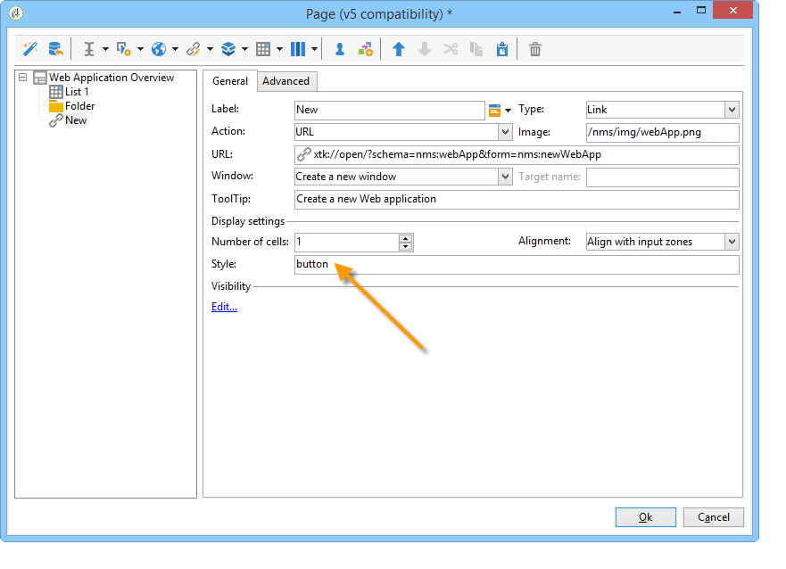
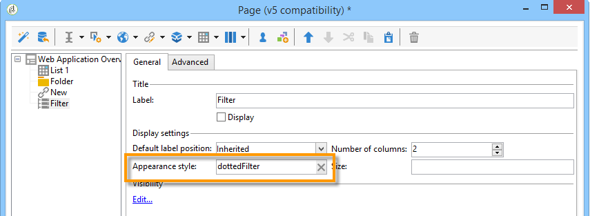

# Casi di utilizzo: creazione di panoramiche{#use-cases-creating-overviews}

Nell&#39;esempio seguente verranno create applicazioni Web di tipo panoramica per visualizzare tutte le applicazioni Web nel database. Configurate i seguenti elementi:

* un filtro nella cartella (consultate [Aggiunta di un filtro in una cartella](#adding-a-filter-on-a-folder)),
* un pulsante per la creazione di una nuova applicazione Web (vedere [Aggiunta di un pulsante per configurare una nuova applicazione](#adding-a-button-to-configure-a-new-web-application)Web),
* visualizzazione dettagliata di ciascuna voce dell&#39;elenco (fare riferimento a [Aggiunta di dettagli a un elenco](#adding-detail-to-a-list)),
* un filtro per strumento di modifica del collegamento (consulta [Creazione di un filtro tramite un editor](#creating-a-filter-using-a-link-editor)di collegamenti),
* un collegamento di aggiornamento (vedere [Creazione di un collegamento](#creating-a-refresh-link)di aggiornamento).


## Creating a single-page Web application {#creating-a-single-page-web-application}

1. Creare una singola applicazione **[!UICONTROL Page]** Web e disabilitare transizioni e transizioni in uscita per la pagina successiva.

   

1. Modifica del titolo della pagina.

   Questo titolo verrà visualizzato nell’intestazione della panoramica e nella panoramica dell’applicazione Web.

1. Nelle proprietà dell&#39;applicazione Web, modificare il rendering dell&#39;applicazione selezionando il **[!UICONTROL Single-page Web application]** modello.

   

1. Aprire l&#39; **[!UICONTROL Page]** attività dell&#39;applicazione Web e aprire un elenco (**[!UICONTROL Static element > List]**).
1. Nella **[!UICONTROL Data]** scheda dell&#39;elenco, selezionare il tipo di **[!UICONTROL Web applications]** documento e le colonne **[!UICONTROL Label]** , **[!UICONTROL Creation date]** e **[!UICONTROL Type of application]** di output.
1. Nella **[!UICONTROL Filter]** sottoscheda, creare il filtro seguente come illustrato di seguito per visualizzare solo le applicazioni Web ed escludere i modelli dalla visualizzazione.

   

1. Chiudete la finestra di configurazione della pagina e fate clic su **[!UICONTROL Preview]**.

   Viene visualizzato l&#39;elenco delle applicazioni Web disponibili nel database.

   

## Aggiunta di un filtro a una cartella {#adding-a-filter-on-a-folder}

In una panoramica, potete scegliere di accedere ai dati a seconda della posizione nella struttura  Adobe Campaign. Questo è un filtro in una cartella. Per aggiungere la panoramica, effettuate le seguenti operazioni.

1. Posizionare il cursore sul **[!UICONTROL Page]** nodo dell&#39;applicazione Web e aggiungere un **[!UICONTROL Select folder]** elemento (**[!UICONTROL Advanced controls > Select folder]**).
1. Nella **[!UICONTROL Storage]** finestra visualizzata, fate clic sul **[!UICONTROL Edit variables]** collegamento.
1. Modificate l’etichetta della variabile in base alle vostre esigenze.
1. Modificate il nome della variabile con il valore della **cartella** .

   >[!NOTE]
   >
   >Il nome della variabile deve corrispondere al nome dell&#39;elemento collegato alla cartella (definito nello schema), ovvero alla **cartella** in questo caso. È necessario riutilizzare questo nome quando si fa riferimento alla tabella.

1. Applicare il **[!UICONTROL XML]** tipo alla variabile.

   

1. Selezionare l&#39; **[!UICONTROL Refresh page]** interazione.

   

1. Posizionare il cursore sull’elenco e fare riferimento alla variabile creata in precedenza nella **[!UICONTROL Advanced]** scheda dell’ **[!UICONTROL Folder filter XPath]** elenco nella scheda. Dovete usare il nome dell’elemento interessato dal collegamento alla cartella, ovvero la **cartella**.

   

   >[!NOTE]
   >
   >In questa fase, l&#39;applicazione Web non è nel relativo contesto dell&#39;applicazione, pertanto il filtro non può essere testato sulla cartella.

## Aggiunta di un pulsante per configurare una nuova applicazione Web {#adding-a-button-to-configure-a-new-web-application}

1. Posiziona il cursore sull’ **[!UICONTROL Page]** elemento e aggiungi un collegamento (**[!UICONTROL Static elements > Link]**).
1. Modificate l&#39;etichetta del collegamento in quanto apparirà sul pulsante nella panoramica.

   Nel nostro esempio, l&#39;etichetta è **Nuova**.

1. Inserite il seguente URL nel campo URL: **xtk://open/?schema=nms:webApp&amp;form=nms:newWebApp**.

   >[!NOTE]
   >
   >**nms:webApp** coincide con lo schema dell&#39;applicazione Web.
   >
   >**nms:newWebApp** coincide con la nuova procedura guidata di creazione dell&#39;applicazione Web.

1. Scegliete di visualizzare l’URL nella stessa finestra.
1. Aggiungere l&#39;icona dell&#39;applicazione Web nel campo immagine: **/nms/img/webApp.png**.

   Questa icona viene visualizzata sul **[!UICONTROL New]** pulsante.

1. Immettere **il pulsante** nel **[!UICONTROL Style]** campo.

   Questo stile è indicato nel **[!UICONTROL Single-page Web application]** modello selezionato in precedenza.

   

## Aggiunta di dettagli a un elenco {#adding-detail-to-a-list}

Quando configurate un elenco nella panoramica, potete scegliere di visualizzare ulteriori dettagli per ogni voce dell’elenco.

1. Posizionare il cursore sull’elemento elenco creato in precedenza.
1. Nella **[!UICONTROL General]** scheda, selezionare la modalità di **[!UICONTROL Columns and additional detail]** visualizzazione nell&#39;elenco a discesa.

   

1. Nella **[!UICONTROL Data]** scheda, aggiungete la **[!UICONTROL Primary key]** , **[!UICONTROL Internal name]** e **[!UICONTROL Description]** la colonna e selezionate l&#39; **[!UICONTROL Hidden field]** opzione per ciascuna di esse.

   

   In questo modo, queste informazioni saranno visibili solo nei dettagli di ogni voce.

1. Nella **[!UICONTROL Additional detail]** scheda, aggiungete il seguente codice:

   ```
   <div class="detailBox">
     <div class="actionBox">
       <span class="action"><a title="Open" class="linkAction" href="xtk://open/?schema=nms:webApp&form=nms:webApp&pk=
       <%=webApp.id%>">Open...</a></span>
       <% 
       if( webApp.@appType == 1 ) { //survey
       %>
       <span class="action"><a target="_blank" title="Reports" class="linkAction" href="/xtk/report.jssp?_context=selection&
         _schema=nms:webApp&_selection=<%=webApp.@id%>
         &__sessiontoken=<%=document.controller.getSessionToken()%>">Reports</a></span>
       <% 
       } 
       %>
     </div>
     <div>
       Internal name: <%= webApp.@internalName %>
     </div>
     <%
     if( webApp.desc != "" )
     {
     %>
     <div>
       Description: <%= webApp.desc %>
     </div>
     <% 
     } 
     %>
   </div>
   ```

>[!NOTE]
>
>L&#39;aggiornamento delle librerie JavaScript richiede cinque minuti. È possibile riavviare il server per evitare di attendere questo ritardo.

## Filtro e aggiornamento dell’elenco {#filtering-and-updating-the-list}

In questa sezione verrà creato un filtro per visualizzare la panoramica delle applicazioni Web create da un operatore specifico. Questo filtro viene creato con un editor di collegamenti. Dopo aver selezionato un operatore, aggiornare l&#39;elenco per applicare il filtro; questo richiede la creazione di un collegamento di aggiornamento.

Questi due elementi saranno raggruppati nello stesso contenitore per essere raggruppati graficamente nella panoramica.

1. Posizionare il cursore sull&#39; **[!UICONTROL Page]** elemento e selezionare **[!UICONTROL Container > Standard]**.
1. Imposta il numero di colonne su **2**, in modo che l’editor dei collegamenti e il collegamento si trovino l’uno accanto all’altro.

   

   Per informazioni sul layout degli elementi, consultate [questa sezione](../../web/using/about-web-forms.md).

1. Applica **dottedFilter**.

   Questo stile è indicato nel **[!UICONTROL Single-page Web applicatio]** n modello selezionato in precedenza.

   

### Creazione di un filtro tramite un editor di collegamenti {#creating-a-filter-using-a-link-editor}

1. Posizionare il cursore sul contenitore creato durante la fase precedente e inserire un editor di collegamenti tramite il **[!UICONTROL Advanced controls]** menu.
1. Nella finestra di memorizzazione che si apre automaticamente, selezionare l&#39; **[!UICONTROL Variables]** opzione, quindi fare clic sul **[!UICONTROL Edit variables]** collegamento e creare una variabile XML per filtrare i dati.

   

1. Modificare l&#39;etichetta.

   Nella panoramica viene visualizzata accanto al **[!UICONTROL Filter]** campo.

1. Scegliere la tabella Operatore come schema di applicazione.

   

1. Posizionate il cursore sull’elemento elenco e create un filtro tramite la **[!UICONTROL Data > Filter]** scheda:

   * **Espressione:** Chiave esterna del collegamento &#39;Creato da&#39;
   * **Operatore:** è uguale a
   * **Valore:** Variabili (variabili)
   * **Se:** &#39;$(var2/@id)&#39;!=&#39;

   

>[!CAUTION]
>
>L&#39;utente dell&#39;applicazione Web deve essere un operatore identificato con i diritti  Adobe Campaign appropriati per accedere alle informazioni. Questo tipo di configurazione non funzionerà per le applicazioni Web anonime.

### Creazione di un collegamento di aggiornamento {#creating-a-refresh-link}

1. Posizionare il cursore sul contenitore e inserire un **[!UICONTROL Link]** tramite il **[!UICONTROL Static elements]** menu.
1. Modificare l&#39;etichetta.
1. Seleziona **[!UICONTROL Refresh data in a list]**.
1. Aggiungete l’elenco creato in precedenza.

   

1. Aggiungete l&#39;icona di aggiornamento nel **[!UICONTROL Image]** campo: **/xtk/img/refresh.png**.
1. Utilizzando le frecce di ordinamento, riorganizzare i vari elementi dell&#39;applicazione Web come mostrato di seguito.

   

L&#39;applicazione Web è ora configurata. Potete fare clic sulla **[!UICONTROL Preview]** scheda per visualizzarne l&#39;anteprima.


