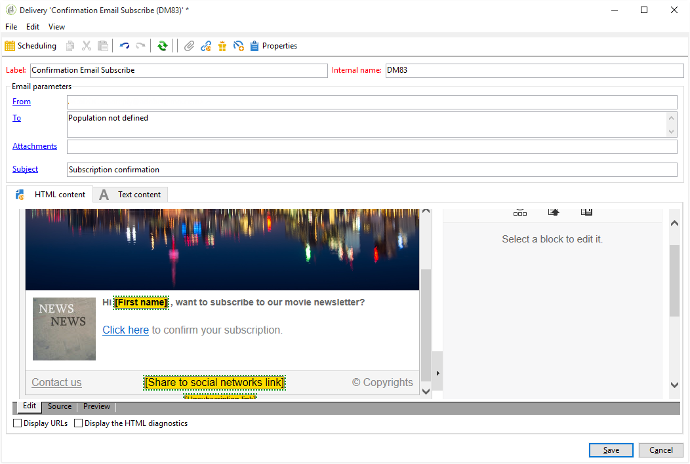
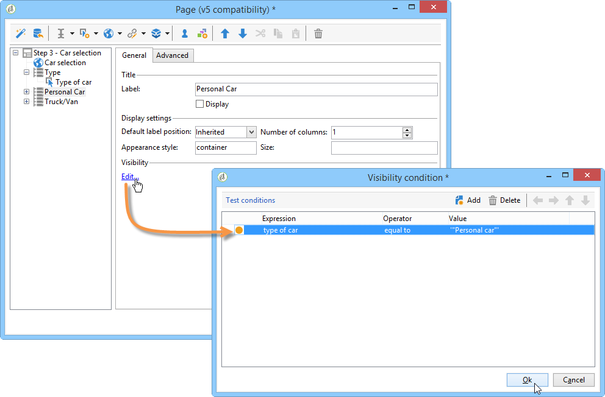

# Casi di utilizzo: moduli web{#use-cases-web-forms}

## Creare un modulo di iscrizione con doppio consenso {#create-a-subscription--form-with-double-opt-in}

Quando offrite servizi di informazione, i destinatari devono abbonarsi per ricevere tutte le comunicazioni collegate. Per evitare comunicazioni improprie e assicurarsi che il destinatario si sia iscritto intenzionalmente, si consiglia di inviare una richiesta di conferma dell&#39;iscrizione per creare un doppio consenso. L&#39;iscrizione sarà effettiva solo dopo che l&#39;utente farà clic sul collegamento incluso nel messaggio di conferma.

Questo esempio si basa sullo scenario seguente:

1. Creazione di un modulo di iscrizione a una newsletter su un sito Web contenente una casella di controllo per l’iscrizione a un servizio temporaneo. Questo servizio consente di inviare messaggi di conferma dell’iscrizione.
1. Creazione della consegna di conferma dell&#39;iscrizione con un modello di consegna collegato al modulo Web. Contiene il collegamento di conferma che richiama il modulo per l’iscrizione alla newsletter e visualizza un messaggio di approvazione dell’iscrizione.

### Passaggio 1 - Creazione di servizi di informazione {#step-1---creating-information-services}

1. Create il servizio di iscrizione per la newsletter da offrire ai destinatari. Per ulteriori informazioni sulla creazione di una newsletter, consultate [questa sezione](../../delivery/using/about-services-and-subscriptions.md).

   

1. Create un secondo servizio informazioni, un servizio temporaneo collegato a un modello di consegna per l&#39;invio di messaggi di conferma dell&#39;iscrizione.

   

### Passaggio 2 - Creazione di messaggi di conferma {#step-2---creating-confirmation-messages}

I messaggi di conferma vengono inviati tramite un modello di consegna dedicato a cui viene fatto riferimento a livello di servizio temporaneo.

1. In the **[!UICONTROL Explorer]** , select **[!UICONTROL Resources > Templates > Delivery templates]**.
1. Create un modello di consegna per l&#39;invio dei messaggi di conferma dell&#39;iscrizione.
1. Fate clic sul **[!UICONTROL To]** pulsante in **[!UICONTROL Email parameters]** per associare il modello di consegna alla mappatura di destinazione Iscrizioni anziché ai destinatari.

   

1. Poiché i destinatari della consegna non hanno confermato la loro approvazione, si trovano ancora nel elenco Bloccati del database. Affinché ricevano questa comunicazione, è necessario autorizzare le consegne basate su questo modello per i destinatari a elenco Bloccati.

   A tale scopo, fare clic sulla **[!UICONTROL Exclusions]** scheda.

1. Fate clic sul **[!UICONTROL Edit...]** collegamento e deselezionate l’ **[!UICONTROL Exclude recipients who no longer want to be contacted (blacklist)]** opzione.

   <!-- -->

   >[!IMPORTANT]
   >
   >Questa opzione può essere disabilitata solo in questo tipo di contesto.

1. Personalizza la consegna e inserisci il collegamento di conferma nel contenuto del messaggio. Questo collegamento consente di accedere al modulo Web per registrare la conferma dell&#39;iscrizione.

   

1. Con DCE, collegare l’URL al modulo Web. Poiché il modulo Web non è ancora stato creato, sostituire il valore non appena lo si crea.

   

1. Infine, collegate questo modello al servizio temporaneo creato in precedenza.

   

### Passaggio 3 - Creazione del modulo di iscrizione {#step-3---creating-the-subscription-form}

Il modulo Web abilita sia l&#39;iscrizione del destinatario che la conferma dell&#39;iscrizione.

Il flusso di lavoro del modulo Web includerà le seguenti attività:


Per farlo, segui la procedura indicata di seguito:

1. Creare un modulo Web e scegliere il modello **[!UICONTROL Newsletter subscription (subNewsletter)]**.

   

1. Nella **[!UICONTROL Edit]** scheda, è necessario configurare il flusso di lavoro esistente perché si desidera aggiungere un messaggio di conferma ai destinatari che desiderano iscriversi.

   A tale scopo, fate doppio clic sulla **[!UICONTROL Preloading]** casella e configuratela come segue.

   

   Ciò significa che se l&#39;utente accede a questo modulo tramite il collegamento contenuto nel messaggio di conferma, le relative informazioni di profilo verranno caricate. Se accedono al modulo Web tramite una pagina del sito Web, non verrà caricata alcuna informazione.

1. Aggiungete un&#39; **[!UICONTROL Test]** attività al flusso di lavoro.

   

   L&#39; **[!UICONTROL Test]** attività può riguardare l&#39;e-mail del destinatario. In questo caso, configuratelo come segue:

   

1. Aggiungi due **[!UICONTROL Script]** attività al flusso di lavoro.

   

   La prima **[!UICONTROL Script]** attività aggiungerà i destinatari al elenco Bloccati fino a quando non avranno confermato la loro iscrizione alla newsletter. Il contenuto deve essere il seguente:

   ```
   ctx.recipient.@blackList=1
   ```

   

   La seconda **[!UICONTROL Script]** attività autorizza l&#39;invio agli utenti e la sottoscrizione alla newsletter. Le ultime due righe dello script consentiranno di trasferire i destinatari dalla cartella temp a un&#39;altra cartella e di riconciliarsi con i profili esistenti non appena avranno confermato l&#39;iscrizione.

   ```
   ctx.recipient.@blackList=0
   nms.subscription.Subscribe("INTERNAL_NAME_OF_THE_NEWSLETTER", ctx.recipient, false)
   ctx.recipient.folder = <folder name="nmsRootRecipient"/>
   nms.subscription.Unsubscribe("TEMP", ctx.recipient)
   ```

   >[!NOTE]
   >
   >La **[!UICONTROL Temp]** partizione può anche essere eliminata regolarmente utilizzando un flusso di lavoro.

   

1. Fate doppio clic sull&#39; **[!UICONTROL Subscription]** attività per personalizzare il modulo di iscrizione e collegate una casella di controllo con il servizio temporaneo creato in precedenza.

   

1. Configurare l&#39; **[!UICONTROL Storage]** attività per salvare le informazioni immesse nella pagina del modulo.

   Questa attività consente di creare i profili dei destinatari in un temporaneo dedicato per impostarli separatamente dai profili nel database a cui possono essere inviate le comunicazioni.

   

   >[!NOTE]
   >
   >Non è necessario definire opzioni di riconciliazione.

1. Aggiungete due **[!UICONTROL End]** attività per visualizzare un messaggio per l&#39;utente.

   La seconda **[!UICONTROL End]** casella visualizza il messaggio di conferma al termine dell&#39;iscrizione.

   

1. Una volta creato e configurato il modulo Web, è ora possibile farvi riferimento nel modello di consegna per inviare messaggi di conferma.

   

### Passaggio 4 - Pubblicazione e verifica del modulo {#step-4---publishing-and-testing-the-form}

È ora possibile pubblicare il modulo per renderlo accessibile agli utenti.


L’iscrizione alla newsletter prevede i seguenti passaggi:

1. L’utente del sito Web accede alla pagina di iscrizione e approva il modulo.

   

   Gli viene comunicato tramite un messaggio nel loro browser che la loro richiesta è stata presa in considerazione.

   

   L’utente viene aggiunto al database Adobe Campaign  nella **[!UICONTROL Temp]** cartella e il suo profilo è elenco Bloccati fino a quando non conferma la propria iscrizione tramite e-mail.

   

1. Viene loro inviato un messaggio di conferma contenente un collegamento per l’approvazione della sottoscrizione.

   

1. Quando fanno clic su questo collegamento, la pagina di approvazione viene visualizzata nel browser.

   

   In  Adobe Campaign, il profilo utente viene aggiornato:

   * non sono più elenco Bloccati,
   * sono iscritti al servizio informazioni.

      

## Visualizzazione di opzioni diverse a seconda dei valori selezionati {#displaying-different-options-depending-on-the-selected-values}

Nell&#39;esempio seguente, all&#39;utente viene chiesto di selezionare un tipo di veicolo. È possibile visualizzare le categorie di veicoli disponibili in base al tipo selezionato. Ciò significa che gli elementi visualizzati nella colonna di destra dipendono dalla selezione dell&#39;utente:


* Quando l&#39;utente seleziona &quot;veicolo privato&quot;, viene offerta la scelta tra &quot;compatto&quot; e &quot;Minivan&quot;.

   

* Quando l&#39;utente seleziona &quot;veicolo commerciale&quot;, una selezione viene visualizzata in un elenco a discesa:

   

In questo esempio, il tipo di veicolo non è memorizzato nel database. L&#39;elenco a discesa è configurato come segue:


Queste informazioni vengono memorizzate in una variabile locale.

La visualizzazione condizionale della colonna di destra è configurata nei contenitori:


* Visibilità condizionale dei campi per un veicolo privato:

   

* Visibilità condizionata dei campi per un veicolo commerciale:

   

