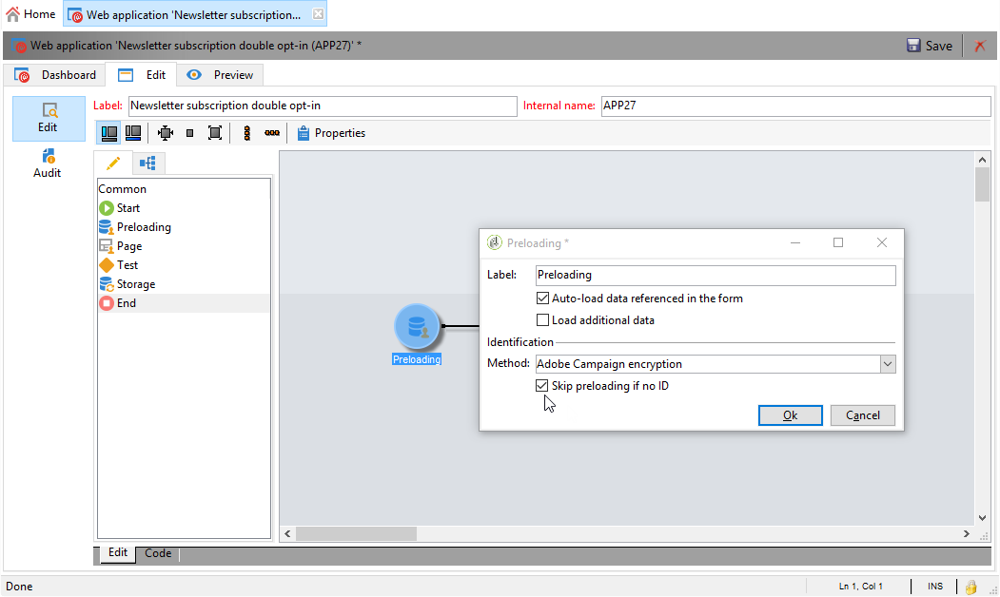
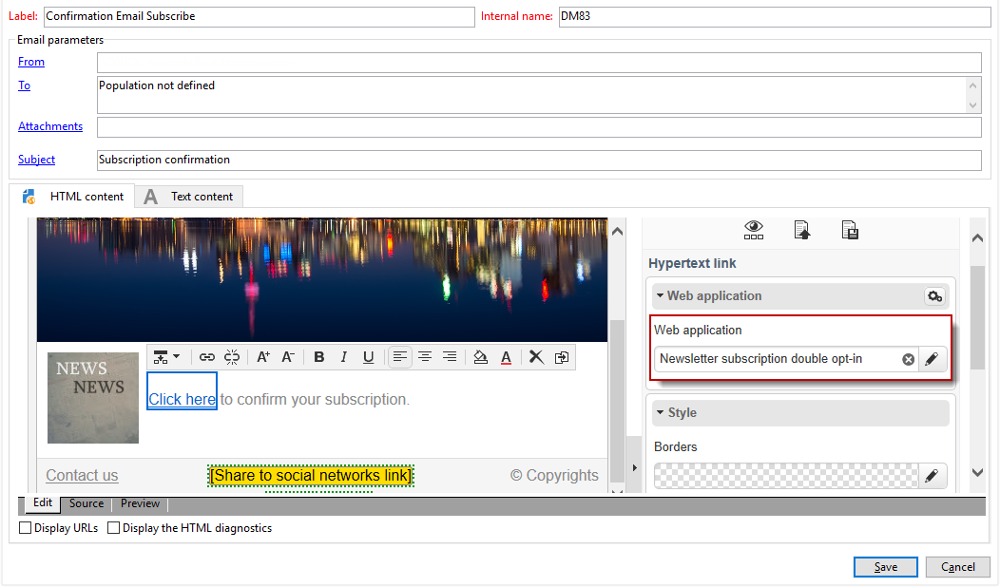
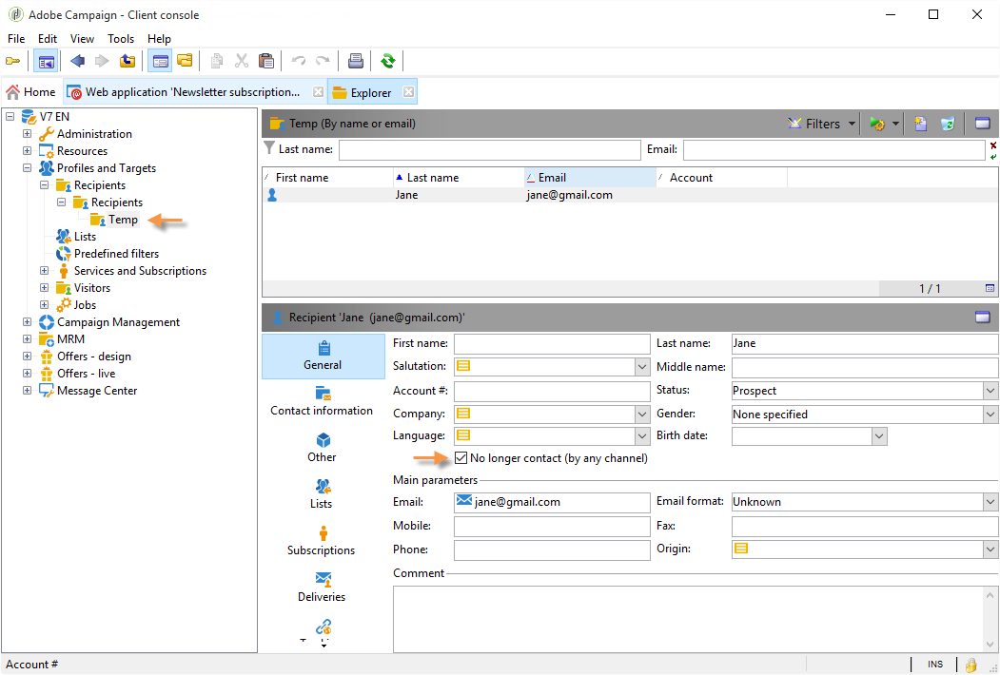
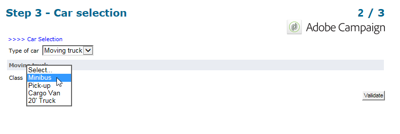

# Casi d’uso: moduli web{#use-cases-web-forms}


## Creare un modulo di abbonamento con doppio consenso {#create-a-subscription--form-with-double-opt-in}

Quando offri servizi informativi, i destinatari devono abbonarsi per ricevere tutte le comunicazioni collegate. Per evitare comunicazioni non corrette e assicurarsi che il destinatario si sia iscritto intenzionalmente, si consiglia di inviare una richiesta di conferma dell’abbonamento per creare un doppio consenso. L’abbonamento avrà effetto solo dopo che l’utente farà clic sul collegamento incluso nel messaggio di conferma.

Questo esempio si basa sul seguente scenario:

1. Creazione di un modulo di iscrizione a una newsletter su un sito web contenente una casella di controllo per l’iscrizione a un servizio temporaneo. Questo servizio ti consentirà di inviare messaggi di conferma dell’abbonamento.
1. Creazione della consegna di conferma dell’abbonamento con un modello di consegna collegato al modulo Web. Contiene il collegamento di conferma che richiama il modulo per l’abbonamento a una newsletter e visualizza un messaggio di approvazione dell’abbonamento.

### Passaggio 1 - Creazione di servizi di informazione {#step-1---creating-information-services}

1. Crea il servizio di iscrizione alla newsletter da offrire ai destinatari. Per ulteriori informazioni su come creare una newsletter, consulta [questa sezione](../../delivery/using/about-services-and-subscriptions.md).

   

1. Crea un secondo servizio informazioni, un servizio temporaneo collegato a un modello di consegna per l’invio di messaggi di conferma dell’abbonamento.

   

### Passaggio 2: creare messaggi di conferma {#step-2---creating-confirmation-messages}

I messaggi di conferma vengono inviati tramite un modello di consegna dedicato a cui si fa riferimento a livello di servizio temporaneo.

1. In **[!UICONTROL Explorer]** , seleziona **[!UICONTROL Resources > Templates > Delivery templates]**.
1. Crea un modello di consegna per l’invio dei messaggi di conferma dell’abbonamento.
1. Fai clic sul pulsante **[!UICONTROL To]** in **[!UICONTROL Email parameters]** per associare il modello di consegna alla mappatura di destinazione Sottoscrizioni anziché ai destinatari.

   

1. Poiché i destinatari di questa consegna non hanno confermato la loro approvazione, si trovano ancora nel elenco Bloccati di database. Affinché ricevano questa comunicazione, devi autorizzare le consegne basate su questo modello a indirizzare i destinatari al elenco Bloccati.

   A questo scopo, fai clic sulla scheda **[!UICONTROL Exclusions]** .

1. Fai clic sul collegamento **[!UICONTROL Edit...]** e deseleziona l’opzione **[!UICONTROL Exclude recipients who no longer want to be contacted]** .

   <!-- -->

   >[!IMPORTANT]
   >
   >Questa opzione può essere disabilitata solo in questo tipo di contesto.

1. Personalizza la consegna e inserisci il collegamento di conferma nel contenuto del messaggio. Questo collegamento consente di accedere al modulo Web per registrare la conferma dell’abbonamento.

   

1. Con il DCE, collega l’URL al modulo web. Poiché il modulo Web non è ancora stato creato, sostituire il valore non appena lo si crea.

   

1. Infine, collega questo modello al servizio temporaneo creato in precedenza.

   

### Passaggio 3 - Creazione del modulo di abbonamento {#step-3---creating-the-subscription-form}

Il modulo Web abilita sia la conferma dell’abbonamento al destinatario che la conferma dell’abbonamento.

Il flusso di lavoro del modulo web includerà le seguenti attività:


Per farlo, segui la procedura indicata di seguito:

1. Creare un modulo web e scegliere il modello **[!UICONTROL Newsletter subscription (subNewsletter)]**.

   

1. Nella scheda **[!UICONTROL Edit]** , è necessario configurare il flusso di lavoro esistente perché si desidera aggiungere un messaggio di conferma ai destinatari che desiderano effettuare l’abbonamento.

   A tale scopo, fai doppio clic sulla casella **[!UICONTROL Preloading]** e configurala come segue.

   

   Ciò significa che se l’utente accede a questo modulo tramite il collegamento nel messaggio di conferma, le relative informazioni di profilo verranno caricate. Se accedono al modulo web tramite una pagina del sito web, non verranno caricate informazioni.

1. Aggiungi un’attività **[!UICONTROL Test]** al flusso di lavoro.

   

   L’attività **[!UICONTROL Test]** può riguardare l’e-mail del destinatario. In questo caso, configuralo come segue:

   

1. Aggiungi due attività **[!UICONTROL Script]** al flusso di lavoro.

   

   La prima **[!UICONTROL Script]** attività aggiungerà i destinatari al elenco Bloccati fino a quando non avranno confermato il loro abbonamento alla newsletter. Il contenuto deve essere il seguente:

   ```
   ctx.recipient.@blackList=1
   ```

   

   La seconda attività **[!UICONTROL Script]** autorizza l’invio di consegne agli utenti e la loro sottoscrizione alla newsletter. Le ultime due righe dello script ti consentono di trasferire i destinatari dalla cartella temporanea a un’altra cartella e di riconciliarli con i profili esistenti non appena hanno confermato l’abbonamento.

   ```
   ctx.recipient.@blackList=0
   nms.subscription.Subscribe("INTERNAL_NAME_OF_THE_NEWSLETTER", ctx.recipient, false)
   ctx.recipient.folder = <folder name="nmsRootRecipient"/>
   nms.subscription.Unsubscribe("TEMP", ctx.recipient)
   ```

   >[!NOTE]
   >
   >È inoltre possibile eliminare regolarmente la partizione **[!UICONTROL Temp]** utilizzando un flusso di lavoro.

   

1. Fai doppio clic sull’attività **[!UICONTROL Subscription]** per personalizzare il modulo di abbonamento e collega una casella di controllo al servizio temporaneo creato in precedenza.

   

1. Configura l’attività **[!UICONTROL Storage]** per salvare le informazioni immesse nella pagina del modulo.

   Questa attività ti consente di creare profili dei destinatari in una cartella temporanea dedicata per impostarli diversi dai profili nel database a cui possono essere inviate le comunicazioni.

   

   >[!NOTE]
   >
   >Non è necessario definire opzioni di riconciliazione.

1. Aggiungi due attività **[!UICONTROL End]** per visualizzare un messaggio per l’utente.

   La seconda **[!UICONTROL End]** casella visualizza il messaggio di conferma al termine dell’abbonamento.

   

1. Una volta creato e configurato il modulo Web, è ora possibile farvi riferimento nel modello di consegna per inviare messaggi di conferma.

   

### Passaggio 4: pubblicazione e verifica del modulo {#step-4---publishing-and-testing-the-form}

È ora possibile pubblicare il modulo per renderlo accessibile agli utenti.


L’abbonamento alla newsletter prevede i seguenti passaggi:

1. L’utente del sito web accede alla pagina di abbonamento e approva il modulo.

   

   Essi vengono informati tramite un messaggio nel loro browser che la loro richiesta è stata presa in considerazione.

   

   L’utente viene aggiunto al database Adobe Campaign nella cartella **[!UICONTROL Temp]** e il suo profilo è elenco Bloccati fino a quando non conferma il proprio abbonamento tramite e-mail.

   

1. Viene loro inviato un messaggio di conferma contenente un collegamento per l’approvazione della sottoscrizione.

   

1. Quando fanno clic su questo collegamento, la pagina di approvazione viene visualizzata nel proprio browser.

   

   In Adobe Campaign, il profilo utente viene aggiornato:

   * non sono più a elenco Bloccati,
   * sono abbonati al servizio informazioni.

      

## Visualizzazione di opzioni diverse a seconda dei valori selezionati {#displaying-different-options-depending-on-the-selected-values}

Nell’esempio seguente, all’utente viene chiesto di selezionare un tipo di veicolo. È possibile visualizzare le categorie di veicoli disponibili in base al tipo selezionato. Ciò significa che gli elementi visualizzati nella colonna di destra dipendono dalla selezione dell’utente:


* Quando l&#39;utente seleziona &quot;veicolo privato&quot;, viene offerta la scelta tra &quot;Compatto&quot; e &quot;Minivan&quot;.

   

* Quando l&#39;utente seleziona &quot;veicolo commerciale&quot;, una selezione viene visualizzata in un elenco a discesa:

   

In questo esempio, il tipo di veicolo non è memorizzato nel database. L’elenco a discesa è configurato come segue:


Queste informazioni vengono memorizzate in una variabile locale.

La visualizzazione condizionale della colonna di destra è configurata nei contenitori :


* Visibilità condizionata dei campi di un veicolo privato:

   

* Visibilità condizionata dei campi di un veicolo commerciale:

   
